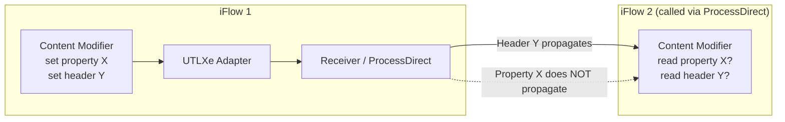
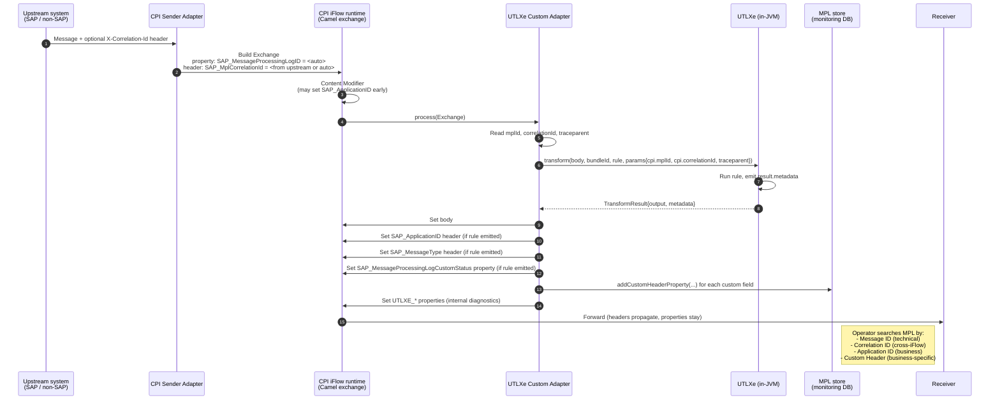
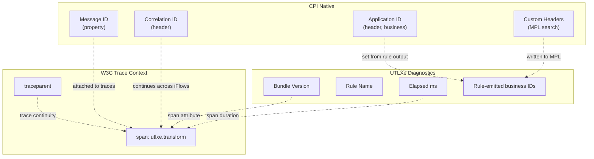

# UTLXe Message Correlation in SAP CPI

**Document purpose:** Reason through how SAP Cloud Integration (CPI)
correlates messages — Message ID, Correlation ID, Application ID, Custom
Headers, MPL — and decide what UTLXe must do to participate cleanly. The
short answer up front: **UTLXe needs no engine changes**, but the CPI
custom adapter (Option A in `utlxe-sap-cpi-embedding.md`) must be
deliberate about which exchange fields it reads, writes, and forwards.

**Companion documents:**
- `utlxe-sap-cpi-embedding.md` — the four CPI embedding options
- `utlxe-biztalk-replacement.md` — the .NET embedding story
- `dapr-abstract.md` — the Azure / multi-cloud sidecar story

---

## 1. CPI's correlation model — four ID layers

CPI's Message Processing Log (MPL) tracks every message through every iFlow
step. There are **four distinct identifier layers**, each with a specific
purpose. Mixing them up is the most common monitoring mistake teams make.

| Layer | Header / property | Generated by | Purpose | UTLXe relevance |
|---|---|---|---|---|
| **Message ID** | `SAP_MessageProcessingLogID` (property) | CPI runtime, automatic | Unique per iFlow execution, primary MPL key | Read-only — UTLXe attaches it to its own logs/traces |
| **Correlation ID** | `SAP_MplCorrelationId` (header) | CPI runtime or upstream | Links related messages across iFlows / hops | UTLXe must propagate, must not generate |
| **Application Message ID** | `SAP_ApplicationID` (header) | iFlow developer (Content Modifier or script) | Business-meaningful ID (PO number, IDoc number, sales order) | UTLXe can populate from transformed payload via output metadata |
| **Custom Header Properties** | Any name, written via `messageLog.addCustomHeaderProperty` | iFlow developer | Additional searchable IDs (delivery number, customer number, …) | UTLXe can populate via output metadata; adapter writes to MPL |

A fifth identifier exists outside CPI's monitor but matters for end-to-end
observability:

| Layer | Header | Source | UTLXe relevance |
|---|---|---|---|
| **W3C Trace Context** | `traceparent`, `tracestate` | OpenTelemetry / external system | UTLXe must propagate; does not generate |

### 1.1 The single most important runtime detail

**Message ID lives as a property; Correlation ID lives as a header.** This
is not arbitrary — it reflects scope.

- `SAP_MessageProcessingLogID` is a **property** because it identifies *this exchange* and never propagates to a receiver. It's the local-execution ID.
- `SAP_MplCorrelationId` is a **header** because it must propagate across iFlow boundaries and to receiver systems. Anyone downstream needs to be able to correlate.

Reading the wrong one — `${header.SAP_MessageProcessingLogID}` doesn't
return what you expect, `${property.SAP_MplCorrelationId}` doesn't either —
is the most-asked CPI Q&A question on community forums.

### 1.2 Headers vs. Properties — the scoping rule that matters for the adapter



The rule, from SAP's own documentation:

- **Headers** are part of the message and **propagate to receivers and across iFlow hops**. Treat them like HTTP headers.
- **Properties** live for the duration of the Camel exchange only. They **do not propagate to receivers** and **do not survive iFlow boundaries** (with one exception: the XI sender adapter's default JMS queues).

Standard advice from SAP integration architects: **default to properties.
Use headers only when something needs to leave the iFlow.** Forgotten
headers leak into receiver systems and cause hard-to-debug failures.

This rule is what every correlation decision in the UTLXe adapter must
respect.

---

## 2. Standard MPL headers UTLXe interacts with

CPI defines a set of `SAP_*` headers / properties that the MPL infrastructure
recognizes. The adapter and any UTLXe-side hooks must know about these:

| Name | Type | Set by | What UTLXe should do |
|---|---|---|---|
| `SAP_MessageProcessingLogID` | Property | CPI runtime | **Read** for log/trace attribution. Never write. |
| `SAP_MplCorrelationId` | Header | Upstream system or CPI | **Read** for trace linkage. **Propagate** as `traceparent` if no W3C context exists. Adapter sets it from upstream if needed. |
| `SAP_ApplicationID` | Header | iFlow developer | **Optionally write** from UTLXe output metadata (see §4). |
| `SAP_MessageType` | Header | iFlow developer | UTLXe rule output can populate this (e.g., the canonical message type after transformation). |
| `SAP_Sender` | Header | iFlow developer | Adapter does not touch. |
| `SAP_Receiver` | Header | iFlow developer | Adapter does not touch. |
| `SAP_MessageProcessingLogCustomStatus` | Property | iFlow developer | UTLXe rule can signal status (e.g., `"WARNING_FALLBACK_RULE"`) via output metadata. |

For custom headers (business-friendly IDs like `DeliveryNumber`,
`CustomerNumber`, `IDOCNUM`), the adapter uses the
`MessageLogFactory.addCustomHeaderProperty` API. This is the same API
Groovy scripts call:

```java
def messageLog = messageLogFactory.getMessageLog(message);
if (messageLog != null) {
    messageLog.addCustomHeaderProperty("DeliveryNumber", deliveryNumber);
}
```

Custom header properties are searchable in the CPI message monitor (under
"Use More Fields → Custom Header") and via the MPL OData API
(`/itspaces/odata/api/v1/MessageProcessingLogCustomHeaderProperties`).

---

## 3. Does UTLXe (the engine) need changes? No — but its bundles do

The engine itself doesn't need any CPI-aware code. **What it does need is a
clean way for `.utlx` rules to expose extracted business identifiers as
output metadata that the adapter can read.**

This is already a generic transformation requirement, not a CPI-specific
one. A typical UTLX rule for an inbound IDoc → canonical order
transformation extracts the IDoc number, the business partner ID, and the
order number anyway. The question is just: does the engine return these as
**typed output metadata** alongside the transformed payload, or are they
buried inside the output body?

If UTLXe's `TransformResult` already exposes a `metadata` map (which the
existing protobuf and HTTP API responses both have, per the parity rule
in `utlxe-biztalk-replacement.md` §5.1), then the engine is done. The
adapter reads `result.metadata` and copies the right fields to the right
CPI scopes.

If it doesn't, the addition is small:

```utlx
// Bundle rule "to-canonical"
%output {
  body: transformed,
  meta: {
    "applicationId": $idoc.E1EDK01.BELNR,        // PO number
    "messageType":   "CanonicalOrder.v3",
    "custom": {
      "IDOCNUM":        $idoc._control.DOCNUM,
      "DeliveryNumber": $delivery.id,
      "BusinessPartner": $idoc.E1EDKA1[PARVW='AG'].PARTN
    }
  }
}
```

The adapter then knows: `meta.applicationId` → `SAP_ApplicationID`,
`meta.messageType` → `SAP_MessageType`, and every entry in `meta.custom` →
`addCustomHeaderProperty`.

**This is the only UTLXe-side change implied by CPI integration**, and
it's not really a CPI change — it's a generic "let rules emit
business-meaningful identifiers" feature that benefits every host (Dapr,
BizTalk, Logic Apps, and CPI alike).

---

## 4. The adapter's contract — what it reads and writes

The custom adapter from Option A in `utlxe-sap-cpi-embedding.md` is the
piece that does the actual mapping between Camel exchange fields and
UTLXe's request/response. Here's its full correlation contract.

### 4.1 Inbound: adapter reads from the exchange

When a message hits the UTLXe adapter step, the adapter pulls the
following from the Camel `Exchange` and passes them into UTLXe as
transformation parameters:

| Source | Pass to UTLXe as | Why |
|---|---|---|
| `exchange.getMessage().getBody()` | `input` | The payload to transform |
| `${property.SAP_MessageProcessingLogID}` | `params.cpi.mplId` | For UTLXe-side log correlation |
| `${header.SAP_MplCorrelationId}` | `params.cpi.correlationId` | Links UTLXe's trace span to CPI's correlation chain |
| `${header.traceparent}` (if present) | propagated as W3C trace context | OpenTelemetry continuity |
| `${header.SAP_ApplicationID}` (if already set upstream) | `params.cpi.applicationId` | Lets rules see the business ID even if they don't extract it |
| Any custom params configured on the adapter step | `params.<name>` | iFlow-developer-supplied transformation parameters |

The adapter does **not** pass arbitrary headers / properties into UTLXe by
default. This is deliberate — passing the entire exchange would be a
debugging nightmare and a security risk (some headers contain credentials
or sensitive routing data). The contract is explicit and small.

### 4.2 Outbound: adapter writes to the exchange and the MPL

When UTLXe returns its `TransformResult`:

```java
public void process(Exchange exchange) throws Exception {
    Message in = exchange.getMessage();
    byte[] inputBytes = in.getBody(byte[].class);

    TransformResult result = engine.transform(
        inputBytes, bundleId, ruleName,
        buildParams(in.getHeaders(), in.getExchange().getProperties(), endpoint));

    // 1. The transformed body
    in.setBody(result.output());

    // 2. Standard MPL fields, only if the rule emitted them
    Map<String, Object> meta = result.metadata();
    if (meta.containsKey("applicationId")) {
        in.setHeader("SAP_ApplicationID", meta.get("applicationId"));
    }
    if (meta.containsKey("messageType")) {
        in.setHeader("SAP_MessageType", meta.get("messageType"));
    }
    if (meta.containsKey("customStatus")) {
        // CustomStatus is an exchange property, not a header
        exchange.setProperty("SAP_MessageProcessingLogCustomStatus",
                             meta.get("customStatus"));
    }

    // 3. Custom MPL header properties for monitor search
    Map<String, Object> custom = (Map<String, Object>) meta.getOrDefault("custom", Map.of());
    MessageLog mpl = messageLogFactory.getMessageLog(in);
    if (mpl != null) {
        for (Map.Entry<String, Object> e : custom.entrySet()) {
            mpl.addCustomHeaderProperty(e.getKey(), String.valueOf(e.getValue()));
        }
    }

    // 4. UTLXe-internal metadata as exchange PROPERTIES (not headers — do not leak)
    exchange.setProperty("UTLXE_BundleVersion", result.bundleVersion());
    exchange.setProperty("UTLXE_RuleName", ruleName);
    exchange.setProperty("UTLXE_ElapsedMs", result.elapsedMs());
}
```

Three principles encoded in that code:

1. **The rule decides what's business-meaningful.** The adapter doesn't infer; it copies what the rule chose to emit.
2. **The right scope for each field.** `SAP_ApplicationID` and `SAP_MessageType` are headers (propagate to receivers). `SAP_MessageProcessingLogCustomStatus` is a property (local). UTLXe-internal diagnostics are properties (do not leak).
3. **No silent overwrites.** If `SAP_ApplicationID` was already set upstream and the rule didn't emit one, the adapter leaves it alone. Optional config flag `overwriteApplicationId: false` is the safe default.

### 4.3 Sequence diagram — full correlation flow



---

## 5. The async / Process Direct case — what changes

CPI integration patterns often span multiple iFlows linked by the
**Process Direct** adapter or by JMS queues. Correlation behavior differs:

| Hop type | Headers propagate? | Properties propagate? | UTLXe adapter implication |
|---|---|---|---|
| **Same iFlow, sequential steps** | ✅ Yes | ✅ Yes (within exchange lifetime) | Nothing special |
| **Process Direct (sync, iFlow → iFlow)** | ✅ Yes | ❌ No (new exchange) | Headers carry `SAP_MplCorrelationId`; property-based diagnostics like `UTLXE_BundleVersion` are lost — promote to header **only if needed downstream** |
| **JMS queue (async)** | ✅ Yes (some adapters) | ❌ No (with exception: XI sender's default JMS queues retain properties) | Same as Process Direct, plus JMS retry counters (`SAPJMSRetries`) become relevant |
| **HTTP receiver to external system** | ✅ Headers go out as HTTP headers | ❌ No | Be careful: do you want UTLXe-internal IDs leaving CPI? Default: no — keep them as properties |

**Operator-friendly rule for the adapter**: anything UTLXe-internal stays
as a property and never leaks. Anything that should help downstream
correlation (the `SAP_*` standard headers) is in headers. This
matches CPI's own conventions.

For long-running, multi-iFlow scenarios where Process Direct connects two
iFlows and you want UTLXe's bundle version visible in the second iFlow's
MPL too: emit the bundle version as a **custom header property** in the
first iFlow (not as a regular header — that would leak to receivers), and
re-emit in the second iFlow. The MPL custom-header API is the right tool
because each iFlow has its own MPL entry but they're already linked by
`SAP_MplCorrelationId`.

---

## 6. End-to-end observability — three correlation chains in one

When everything is wired correctly, a single message produces three
overlapping correlation chains, all visible from the same MPL entry:

1. **CPI native chain** — Message ID, Correlation ID, Application ID, Custom Headers. Searchable in the CPI Message Monitor and via the MPL OData API.
2. **UTLXe-internal chain** — Bundle version, rule name, transform timing, rule-emitted business identifiers. Available as exchange properties for diagnostics during processing, and as MPL custom header properties for search after the fact.
3. **W3C trace context** — `traceparent` propagated end-to-end, exported via OpenTelemetry to whatever observability backend the customer uses (Cloud ALM, Jaeger, Honeycomb, App Insights). Each UTLXe transformation is a span.



The three chains do not duplicate each other; they answer different
questions:

- "Find me this PO number" → CPI MPL search (Application ID / custom header).
- "Why did this transformation take so long" → OpenTelemetry span (UTLXe diagnostics).
- "Show me everything related to this incident" → trace context, joins all three.

---

## 7. Validation checklist

When the UTLXe adapter is wired into a CPI iFlow, walk this list:

1. **Standard MPL fields populated.** Run a message through; in the CPI Message Monitor, confirm Application ID, Message Type, and Sender/Receiver fields show the expected values.
2. **Correlation ID propagation.** Set `SAP_MplCorrelationId` from the upstream system (e.g., a SOAP X-header or HTTP header). Confirm the same ID is visible in the MPL entry and is propagated to the next iFlow when calling via Process Direct.
3. **Custom header search.** Confirm rule-emitted custom fields (delivery number, customer number, IDoc number) appear in MPL custom header search ("Use More Fields → Custom Header") and are queryable via the MPL OData API.
4. **Property scoping.** Confirm UTLXe-internal properties (`UTLXE_BundleVersion`, `UTLXE_ElapsedMs`) are visible during iFlow execution but **do not leak** to receiver HTTP/SOAP/IDoc calls. Inspect the outbound message in a network capture or monitor an HTTP receiver request log.
5. **No header leakage.** Confirm the adapter does not silently set extra `X-UTLXE-*` headers on the message. Header pollution into receiver systems is one of the top three causes of integration regressions.
6. **OpenTelemetry continuity.** Send a message with a known `traceparent`; confirm UTLXe's span is a child of the upstream span, and the receiver-side span (if instrumented) is a child of UTLXe's.
7. **MPL retention.** Be aware that CPI keeps MPL entries for 30 days by default. For long-term retention, configure MPL archiving to BTP DMS (Document Management Service) — the adapter doesn't control this; the customer does at the tenant level.
8. **Custom Status surfacing.** Trigger a rule path that emits a custom status (e.g., `"FALLBACK_RULE_USED"`); confirm the MPL entry shows it in the Custom Status column.

---

## 8. Recommendation summary

**Engine changes required: zero.** UTLXe's existing `TransformResult` shape
already supports output metadata (per the wire-protocol parity rule in
`utlxe-biztalk-replacement.md` §5.1).

**Bundle authoring guidance to publish:**

- Rules should emit `meta.applicationId`, `meta.messageType`, and `meta.custom.*` whenever the input contains business-meaningful identifiers. This is generic good practice, not CPI-specific.
- Rules should not emit raw header names — they emit logical metadata, the adapter maps logical metadata to host-specific scopes.

**Adapter responsibilities:**

1. Read CPI standard fields (`SAP_MessageProcessingLogID`, `SAP_MplCorrelationId`, `traceparent`) and pass them as transformation parameters scoped under `params.cpi.*`.
2. Map rule-emitted output metadata to CPI's standard MPL headers and properties using the right scopes (header vs property as documented).
3. Write rule-emitted custom identifiers via `MessageLogFactory.addCustomHeaderProperty` for MPL searchability.
4. Keep UTLXe-internal diagnostics as exchange properties — never headers — so they don't leak to receivers.
5. Never overwrite upstream-set values silently. Provide explicit overwrite flags as adapter configuration.

**Documentation owed:**

- A "CPI integration cookbook" page covering: which `SAP_*` fields to emit from rules, common patterns (IDoc inbound, OData receiver, Process Direct hop), and the property-vs-header decision table.
- A reference iFlow template demonstrating the adapter wired into a typical IDoc → S/4HANA flow with all four correlation chains visible in MPL.

---

## 9. References

**SAP standard MPL headers:**
- About Headers and Exchange Properties — https://help.sap.com/docs/cloud-integration/sap-cloud-integration/about-headers-and-exchange-properties
- Headers and Exchange Properties Provided by the Integration Framework — https://help.sap.com/docs/cloud-integration/sap-cloud-integration/headers-and-exchange-properties-provided-by-integration-framework
- Use Custom Header Properties to Search for MPLs (SAP docs) — https://github.com/SAP-docs/btp-integration-suite/blob/main/docs/ci/Development/use-custom-header-properties-to-search-for-message-processing-logs-d4b5839.md

**Community references:**
- Message Filtering with Standard & Custom Headers — https://sapintegrationhub.com/cpi/message-filtering-standard-custom-headers-sap-integration-suite-monitor/
- A Guide to MPL Search — https://community.sap.com/t5/technology-blog-posts-by-members/sap-cpi-a-guide-to-mpl-search/ba-p/13469487
- Headers and Exchange Properties — https://blogs.sap.com/2018/03/27/sap-cpi-accessing-header-and-property/
- Header / Property transfer behavior across iFlow hops — https://blogs.sap.com/2022/09/08/message-headers-and-properties-transfer-behavior/
- Runtime Variables Overview — https://www.integration-excellence.com/runtime-variables-cpi/

**MPL retention and archiving:**
- Archive MPLs to BTP DMS — https://www.sprintegrate.com/cpi/sap-cpi-archive-mpls-to-sap-btp-dms/

**Companion documents:**
- `utlxe-sap-cpi-embedding.md`
- `utlxe-biztalk-replacement.md`
- `dapr-abstract.md`

---

*Document maintainer: UTLX platform team. Revisit when SAP changes the
MPL schema, when the W3C Trace Context support in CPI evolves, or when
EIC's correlation behavior diverges from cloud CPI's.*
