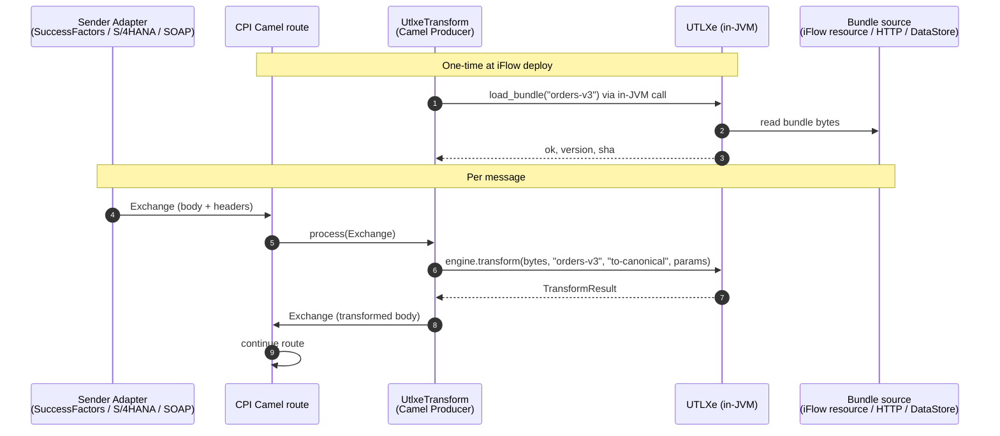
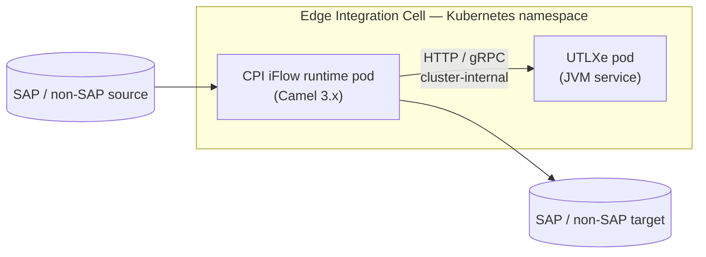

# UTLXe inside SAP Integration Suite (CPI) — Embedding Strategy

**Document purpose:** Reason through whether and how UTLXe can be embedded
into SAP Integration Suite Cloud Integration (CPI / iFlow runtime), what
SDK paths exist on the SAP side, and which standards-based integration
patterns apply.

**Companion documents:**
- `dapr-abstract.md` — sidecar pattern, Azure broker bindings
- `utlx-bundle-bootstrap.md` — bundle distribution and lifecycle
- `utlxe-biztalk-replacement.md` — .NET embedding via the existing C# SDK

**Existing UTLXe surface (recap):**

| Channel | Protocol | JVM-friendly? |
|---|---|---|
| **JVM-native engine (`utlxe`)** | In-process Java/Kotlin API | ✅ Yes — this is the key for SAP |
| **HTTP API** | REST | ✅ Yes — for out-of-process calls |
| **gRPC (planned)** | proto definitions exist | ✅ Yes |
| **SDK wrappers** | stdin/stdout protobuf | C# / Go / Python (less relevant to SAP) |

**The headline:** SAP CPI runs Apache Camel inside a JVM. UTLXe runs inside
a JVM. **This is the most natural integration target of any host UTLXe will
ever face** — more natural than BizTalk (.NET), more natural than Logic
Apps Standard (Functions runtime), more natural even than the Dapr sidecar
(network hop). The work is figuring out *which* of CPI's embedding seams
fits, not whether UTLXe technically can embed.

---

## 1. What SAP Integration Suite / CPI actually is

A few things matter for this decision:

- **Cloud Integration (CI), historically called CPI / HCI**, is the iFlow runtime inside SAP Integration Suite. It runs on SAP BTP (Cloud Foundry today, Kyma/Kubernetes for Edge Integration Cell).
- **The runtime is Apache Camel** — for years on Camel 2.24, currently on Camel 3.14 (the upgrade was rolling out across tenants in 2024–2025).
- **Code runs inside an OSGi container.** Custom artifacts deploy as OSGi bundles (`.esa` Composite type, "self-contained" — all dependencies must be inside the bundle).
- **The JVM version matters.** Java 11 was the long-running baseline; Edge Integration Cell brings Java 17+ and decoupled Camel/Java versioning.
- **Edge Integration Cell (EIC)** is SAP's hybrid offering — the same iFlow runtime in a Kubernetes-deployable form on customer premises or in a customer cloud. This is the most promising target for UTLXe because the customer controls what runs in the cluster.

This means UTLXe's options are constrained by what SAP allows to run inside
its sandboxed iFlow runtime — but also unlocked by the fact that everything
inside is on the JVM.

---

## 2. The four embedding seams CPI exposes

CPI gives integration developers four distinct extension points, each with
different power-vs-restriction trade-offs. UTLXe can use any of them; the
right choice depends on the customer scenario.

| Seam | Power | Constraints | UTLXe fit |
|---|---|---|---|
| **Groovy Script step** | Modest — full JVM access at script level | Sandboxed; SAP `script-api` is the official surface; classpath restricted | **Great** for a thin wrapper that calls UTLXe over HTTP or via embedded JAR |
| **Custom Adapter (ADK)** | High — full Camel component | OSGi self-contained `.esa`; SAP signs off on tenant deployment; Camel-version-locked | **Best** for a productized "UTLXe Transformation Adapter" |
| **HTTP receiver adapter → UTLXe** | Modest — out-of-process | Adds a network hop and a UTLXe service the customer must run | **Good** for customers who already run UTLXe as a sidecar/service |
| **Edge Integration Cell co-deployment** | Highest — full pod-level control | Requires EIC; not all CPI customers have it | **Strategic** for high-throughput / on-prem scenarios |

The remainder of this document treats each as a real option with concrete
deliverables.

---

## 3. Option A — UTLXe as a CPI Custom Adapter (the productized path)

This is the **flagship deliverable**. SAP provides the **Adapter Development
Kit (ADK)** — a Maven archetype-based framework that produces an OSGi
`.esa` deployable to a CPI tenant. The adapter shows up in the iFlow
designer's adapter palette like any built-in adapter, with its own
configuration UI.

### 3.1 What it looks like for the customer

In the CPI iFlow designer the customer sees a new adapter named "UTLXe
Transform" with configuration fields for:

- Bundle ID (e.g., `orders-v3`)
- Rule name (e.g., `to-canonical`)
- Optional: input format hint (XML / JSON / CSV / EDI / …)
- Optional: parameter map

They drag a `Process Call` or `Request-Reply` step, point it at the UTLXe
adapter, fill in the fields, and the iFlow now performs UTLXe
transformations as a native step. **No Groovy, no custom JARs, no external
service.**

### 3.2 What it looks like for UTLXe engineering

The adapter is built using SAP's ADK Maven archetype:

```bash
mvn archetype:generate -B \
  -DarchetypeGroupId=com.sap.cloud.adk \
  -DarchetypeArtifactId=com.sap.cloud.adk.archetype-adapter \
  -DarchetypeVersion=<current> \
  -DcomponentName=UtlxeTransform \
  -DadapterName=UtlxeTransform \
  -DadapterId=UtlxeTransform \
  -DadapterVendor=<your-company> \
  -DadapterVersion=1.0.0 \
  -Dscheme=utlxe \
  -DgroupId=com.yourco.cpi \
  -DartifactId=utlxe-cpi-adapter \
  -Dversion=1.0.0-SNAPSHOT
```

The archetype produces an OSGi project. Inside it you write a Camel
`Producer` (and optionally a `Consumer`) that takes the Camel `Exchange`,
extracts the body and headers, calls **the UTLXe JVM library directly**
(no subprocess, no network), writes the result back to the exchange, and
returns.

Sketch of the producer:

```java
public class UtlxeTransformProducer extends DefaultProducer {

    private final UtlxEngine engine;     // ← in-JVM UTLXe handle, singleton

    public UtlxeTransformProducer(UtlxeTransformEndpoint endpoint) {
        super(endpoint);
        this.engine = UtlxEngineHost.shared();
    }

    @Override
    public void process(Exchange exchange) throws Exception {
        Message in = exchange.getMessage();
        byte[] inputBytes = in.getBody(byte[].class);

        UtlxeTransformEndpoint ep = (UtlxeTransformEndpoint) getEndpoint();
        TransformResult result = engine.transform(
            inputBytes,
            ep.getBundleId(),
            ep.getRuleName(),
            buildParams(in.getHeaders(), ep.getParameters()));

        in.setBody(result.output());
        applyResultMetadata(in, result);
    }
}
```

This is **one method**. The heavy lifting — parsing, rule resolution,
serialization — happens inside `engine.transform`, which is the same UTLXe
engine code the CLI and HTTP server use.

### 3.3 Hard constraints to plan around

These are the gotchas that have eaten previous adapter projects:

1. **OSGi self-contained ESA.** Every dependency UTLXe brings must be inside the bundle, except `camel-core` and `slf4j-api` which CPI provides. If UTLXe pulls in incompatible versions of Jackson, ANTLR, etc., expect classloader hell. The Maven build needs to embed and OSGi-ify all transitive dependencies. Plan for a 1–2 week shake-out on this alone.

2. **Camel version lock.** CPI is on Camel 3.14 (mid-2024 onward, finishing roll-out into 2025). Adapters must target the *exact* Camel major version of the tenant. SAP issues a "Camel 3 test tenant" for migration testing. UTLXe's adapter must declare `<camel.version>3.14.x</camel.version>` and use Camel 3 imports (`org.apache.camel.support.DefaultProducer`, not the Camel 2 `org.apache.camel.impl.*` paths).

3. **Java version lock.** Until EIC, the CPI tenant runtime defines the Java version. UTLXe must be compiled to that bytecode level. If UTLXe uses Java 17+ features and CPI is on Java 11, the adapter won't load.

4. **Tenant deployment process.** SAP signs off on adapters at the tenant level — they don't auto-deploy. The customer follows SAP's documented procedure (Eclipse tooling or the new IDE-agnostic Maven process introduced in January 2022). UTLXe ships the `.esa`; the customer (or partner) deploys it.

5. **No multiple runtime versions side-by-side.** "CPI runtime does not support multiple runtime of a component" — meaning you can't have v1.0 and v1.1 of the UTLXe adapter live simultaneously on one tenant. Versioning is by upgrade-in-place. This affects rollout strategy.

6. **Bundle storage.** Where do the UTLX bundles (transformation rules) live? Three viable answers:
   - **Inline in iFlow:** the bundle is uploaded as a CPI iFlow resource (an `.utlx` file or a packaged bundle) and the adapter reads it by name. Cleanest CPI-native experience.
   - **External via HTTP:** the adapter fetches bundles from a URL the customer provides. Hybrid sensible for shared bundles across many iFlows.
   - **CPI Data Store:** SAP exposes a Data Store API; the adapter could read bundles from there. Operationally heavier.
   
   The adapter probably supports all three with an "address" config field. The default should be inline — most CPI customers want everything in their iFlow package.

### 3.4 Sequence diagram — adapter path



No subprocess. No network. No serialization beyond what UTLXe needs
internally. **This is the lowest-latency path UTLXe will ever have on any
host platform.**

---

## 4. Option B — Groovy Script step calling UTLXe (the quick path)

Every CPI tenant supports Groovy Script steps natively, and SAP exposes the
`com.sap.cloud.script:script-api` SDK as the official surface. A Groovy
script gets a `Message` object with body and headers; it returns a
modified `Message`. This is the path most CPI consultants reach for first.

### 4.1 Two ways to do it

**B.1 — Groovy script calls UTLXe over HTTP.**
The customer runs UTLXe somewhere reachable (a BTP service instance, a
sidecar in EIC, a public endpoint guarded by mTLS). The Groovy script
performs an HTTP POST. CPI's recommended pattern is to use the
**ProcessDirect adapter** or the HTTP receiver adapter rather than raw
sockets in Groovy, but Groovy can also do it directly:

```groovy
import com.sap.gateway.ip.core.customdev.util.Message
import groovyx.net.http.HTTPBuilder
import groovy.json.JsonSlurper
import groovyx.net.http.ContentType
import static groovyx.net.http.Method.POST

Message processData(Message message) {
    def body = message.getBody(String)
    def utlxeUrl = message.getProperty("utlxe_url")  // configured externally
    def bundleId = message.getProperty("bundle_id")
    def rule     = message.getProperty("rule")

    def http = new HTTPBuilder(utlxeUrl)
    http.request(POST, ContentType.JSON) { req ->
        uri.path = "/v1/transform"
        body = [
            bundleId: bundleId,
            rule: rule,
            input: body
        ]
        response.success = { resp, json ->
            message.setBody(json.output)
        }
        response.failure = { resp ->
            throw new RuntimeException("UTLXe error: ${resp.status}")
        }
    }
    return message
}
```

This works. It is also the same shape Groovy scripts already use for
calling external services in CPI today.

**B.2 — Groovy script calls UTLXe in-JVM via an embedded JAR.**
This is more elegant but blocked by OSGi: a Groovy script's classpath is
sandboxed by the SAP `script-api` and you cannot just import UTLXe classes.
The workable variant is to pair a Groovy script with the **Custom Adapter**
from Option A — the adapter's OSGi bundle exports a service, the Groovy
script consumes it. This is a real pattern (the SAP API is exposed via
`com.sap.it.api.ITApiFactory` exactly this way), but it means you've
already done Option A and Groovy is just sugar on top.

### 4.2 When B is the right answer

- **PoC and one-off use:** B.1 over HTTP, with UTLXe running anywhere — even a free-tier BTP container — is up in an afternoon.
- **Bridging to Option A:** customers can start with B.1 to validate the transformation logic, then migrate to Option A once the adapter ships.
- **Customer can't deploy custom adapters:** some CPI tenants have governance restrictions or the customer doesn't want to carry an `.esa` lifecycle. Groovy + HTTP is the fallback.

### 4.3 What this is *not* good for

- High-throughput hot paths — the HTTP hop dominates latency.
- Customers without a place to run UTLXe — "bring your own UTLXe service" is a non-starter for fully-cloud SAP shops.
- Sandboxed CPI tenants where outbound HTTP is restricted to specific destinations whitelisted in the **Cloud Connector**.

---

## 5. Option C — UTLXe as an external service via the HTTP receiver adapter

This is essentially Option B.1 but using CPI's built-in HTTP adapter
instead of Groovy. The customer:

1. Defines an HTTP receiver adapter pointing at the UTLXe service URL.
2. Configures authentication (Basic, OAuth 2, mTLS, SAP Cloud Connector destination).
3. Drops a Request-Reply step into the iFlow targeting that adapter.

This is the **least-effort path for the UTLXe team** — you ship nothing
SAP-specific. You just need a UTLXe HTTP endpoint, which already exists.

The deliverable from UTLXe's side is:

- A documented OpenAPI spec for the `/v1/transform` endpoint matching what the SDK and Dapr-fronted HTTP API already speak.
- A reference deployment guide for "running UTLXe behind an SAP Cloud Connector destination" — basically a recipe for a BTP-Kyma or customer-cloud deployment with the right TLS and IP allow-listing.
- Optionally, a CPI iFlow template the customer imports and parameterizes (CPI supports importing iFlow packages from partners).

This option is strategically weak as a productization story — the customer
is operating UTLXe themselves — but it's a **perfect first-step migration
target** for customers who have UTLXe running for non-CPI reasons (BizTalk
replacement, generic message bus transformation) and now want to use the
same UTLXe service from CPI iFlows. Reuse-the-investment narrative.

---

## 6. Option D — Edge Integration Cell co-deployment (the strategic path)

**Edge Integration Cell (EIC)** is SAP's "CPI in a Kubernetes pod" offering.
It runs the same iFlow runtime as the cloud tenant, but in a customer-
managed cluster (BTP Kyma or customer-owned Kubernetes). It's positioned
for hybrid and air-gapped scenarios, and it's where the Camel/Java version
constraints loosen because the customer owns the cluster.

In EIC, UTLXe is just another pod. The integration shape becomes:



The custom adapter from Option A still works in EIC (and works *better*
because Java/Camel version constraints relax). The HTTP path from Option C
also works and is operationally simpler because it's cluster-internal
networking, not internet-traversing.

EIC also opens the door to running **UTLXe alongside Dapr** — both deployed
into the same Kubernetes namespace as sidecars to the iFlow runtime — so
the iFlow can talk to Azure Service Bus / Event Hubs / Kafka via Dapr while
also calling UTLXe locally for transformations. The iFlow runtime stays
SAP-managed; the surrounding plumbing is yours.

This is the **most powerful option strategically** because it lets UTLXe
compose with all the infrastructure described in `dapr-abstract.md` while
still living inside an SAP-supported integration runtime.

---

## 7. Standards that work — and what UTLXe must speak

The standards picture for a CPI integration is well-defined:

### 7.1 Wire and message formats UTLXe will see

CPI iFlows handle these payload formats routinely. UTLXe already covers
all of them via UDM:

| Format | UTLXe schema | CPI native? |
|---|---|---|
| **XML** | XSD | ✅ Heavy use — SAP IDocs, SOAP, sFTP file drops |
| **JSON** | JSCH | ✅ Modern APIs, SuccessFactors, AI services |
| **EDIFACT / X12** | (UTLXe EDI support) | ✅ Big in B2B/Trading Partner Management |
| **CSV / fixed-width** | TSCH | ✅ File-based integrations |
| **OData (V2/V4)** | OSCH | ✅ Native to SAP — S/4HANA, SuccessFactors, Dynamics |
| **IDoc** | XSD-flavored | ✅ ECC, S/4HANA on-prem |
| **Avro / Protobuf** | AVSC / PROTO | ✅ Event-mesh integrations |

The UTLX language being **format-agnostic with a unified data model** is the
key unlock here. A CPI customer mapping IDoc → JSON → OData currently does
this in three different mapping technologies (IDoc XML, message mapping,
OData $batch). UTLXe collapses that to one bundle.

### 7.2 Protocols UTLXe must speak to integrate cleanly

| Protocol | Direction | Notes |
|---|---|---|
| **HTTP/1.1, HTTP/2** | Both | Required for Option C; should be HTTP/2 to keep latency reasonable |
| **OAuth 2.0 (client-credentials, JWT)** | Inbound | CPI's standard outbound auth model |
| **mTLS** | Inbound | For high-security tenants and Cloud Connector destinations |
| **SAP Cloud Connector destination protocol** | Inbound | Required for CPI cloud → on-prem UTLXe |
| **gRPC** | Both | Future, when UTLXe ships gRPC; relevant for EIC |

### 7.3 Identity and configuration standards

- **OAuth 2.0** with client-credentials grant for service-to-service auth from CPI to UTLXe.
- **SAML 2.0** is theoretically possible but rarely used for CPI outbound; ignore it.
- **SAP Destination Service** is how CPI customers configure URLs and credentials for outbound systems. UTLXe should be installable as a Destination, which means supporting standard headers like `Authorization`, `X-CSRF-Token` (for SAP-style POSTs), and tolerating the destination service's connection pooling.

### 7.4 Observability standards

- **OpenTelemetry traces** propagated via `traceparent` — SAP supports OTel ingestion in Cloud ALM, and CPI's monitoring will eventually unify on it. UTLXe should propagate inbound trace context and emit a span per transform.
- **CPI's own MPL (Message Processing Log)** — CPI assigns each message an `SAP_MessageProcessingLogID`. UTLXe should log this as an attribute when it's present, so SAP-side log correlation works.

---

## 8. Recommendation summary

**The four options ranked by strategic value:**

1. **Option A — Custom Adapter (ADK).** The flagship deliverable. Productizes UTLXe inside CPI as a first-class adapter. Highest engineering cost (1–3 months, dominated by OSGi packaging shake-out) but the only option that gives the customer a turn-key experience.

2. **Option D — EIC co-deployment.** The strategic play for high-throughput and hybrid scenarios. Compounds with the Dapr work. Requires Option A or C as the actual integration mechanism — D is a deployment topology, not a separate integration mechanism.

3. **Option C — HTTP receiver adapter.** Zero SAP-specific work for the UTLXe team. Best as a "first contact" option for customers and as a fallback for tenants where custom adapters aren't allowed.

4. **Option B — Groovy script.** PoC and quick-start. Not a productization path on its own, but valuable as a customer-side recipe to validate before committing to Option A.

**Concrete deliverables to plan:**

| Priority | Deliverable | Owner | Effort |
|---|---|---|---|
| **P0** | OpenAPI spec for `/v1/transform` matching SDK protobuf shapes (parity with `utlxe-biztalk-replacement.md` §5.1) | UTLXe core | Days |
| **P0** | Reference deployment guide: UTLXe behind SAP Cloud Connector destination (Option C) | UTLXe + docs | 1 week |
| **P0** | Sample Groovy script + iFlow template for Option B.1 — quickest customer-facing artifact | UTLXe + SAP partner | 1 week |
| **P1** | Custom Adapter (`.esa`) for Option A, Camel 3.14, Java 11 baseline | UTLXe + Java engineer with CPI experience | 1–3 months |
| **P1** | Inline bundle support in the adapter (read `.utlx` bundle from iFlow resources) | Same | Within Option A |
| **P2** | EIC reference architecture: UTLXe + iFlow runtime + Dapr in one Kyma namespace | UTLXe + customer engineering | 2–4 weeks |
| **P2** | Native gRPC server in `utlxe` (also benefits Dapr — see `utlxe-biztalk-replacement.md` §5.2) | UTLXe core | 2–3 weeks |

**The single biggest decision** is whether to commit to the Custom Adapter
(Option A) now or stay external (Option C/B) and let customers operate
UTLXe themselves. The right call depends on:

- How many CPI customers are in the target market.
- Whether SAP partner channels are part of the GTM.
- Whether the OSGi/Camel-version maintenance burden is acceptable long-term (Camel upgrades happen, and they break adapters).

If the CPI market is strategic, Option A is mandatory and should start now
— the Camel 3 work is largely settled but the next major Camel upgrade
will hit again, and being on the adapter treadmill from day one is easier
than catching up later.

---

## 9. The interface design implications — small but real

Three things the CPI question reinforces about UTLXe's overall design:

**1. The JVM-native API is a first-class citizen, not an internal detail.**
For SAP CPI (and for any future Apache Camel, Apache NiFi, MuleSoft, or
JBoss Fuse integration), the native Java/Kotlin entry point is the
integration surface. It must be documented, versioned, and stable —
treated with the same care as the HTTP API and the protobuf SDK. The C#
SDK speaking stdin/stdout protobuf is the right choice for .NET; the
JVM-native API is the right choice for the JVM ecosystem.

**2. Wire-protocol parity now extends to four transports, not three.**
The principle from the BizTalk doc — same proto definitions, same field
names, same error codes across all transports — applies even more strongly
here. The four transports are: in-JVM Java API, stdin/stdout protobuf SDK,
HTTP REST, gRPC. All four must feel like the same engine.

**3. The bundle-source abstraction is universal.**
Bundles need to load from: iFlow resources (CPI), Azure Blob via Dapr,
local filesystem (CLI), embedded NuGet package (.NET). The `IBundleStore`
abstraction sketched in the BizTalk doc is the same abstraction needed for
CPI's iFlow-resource case. Build it once, reuse across hosts.

---

## 10. References

**SAP Cloud Integration runtime and Camel:**
- How to Use the Apache Camel Framework for Message Processing in SAP — https://blog.sap-press.com/how-to-use-the-apache-camel-framework-for-message-processing-in-sap
- Cloud Integration Camel 3.14 upgrade — https://figaf.com/cloud-integration-will-be-upgraded-to-camel-3-14/
- SAP Help: Cloud Integration developer documentation — https://help.sap.com/docs/cloud-integration

**Adapter Development Kit:**
- Developing Custom Adapters with IDE of Your Choice (Maven archetype intro) — https://blogs.sap.com/2022/02/08/integration-suite-developing-custom-adapters-with-ide-of-your-choice/
- Custom Adapter Camel 3 Upgrade Process — https://blogs.sap.com/2023/08/08/custom-adapter-camel-3-upgrade-process-sap-cloud-integration/
- Apache Camel Community adapters in CPI — https://blogs.sap.com/2020/07/16/apache-camel-community-adapters-usage-in-sap-cloud-platform-integration/
- SAP recipes GitHub — https://github.com/sap/apibusinesshub-integration-recipes

**Groovy script SDK:**
- `com.sap.cloud.script:script-api` on Maven Central — https://repo1.maven.org/maven2/com/sap/cloud/script/script.api/
- Groovy IDE for CPI testing — https://groovyide.com/cpi
- Community Groovy examples — https://github.com/pizug/cpi-groovy-examples

**Edge Integration Cell:**
- SAP Help: Edge Integration Cell — https://help.sap.com/docs/integration-suite/sap-integration-suite/edge-integration-cell

**Companion documents:**
- `dapr-abstract.md`
- `utlx-bundle-bootstrap.md`
- `utlxe-biztalk-replacement.md`

---

*Document maintainer: UTLX platform team. Revisit when the UTLXe Custom
Adapter ships, when CPI announces its next Camel upgrade, or when EIC GA
shifts the on-prem integration story.*
