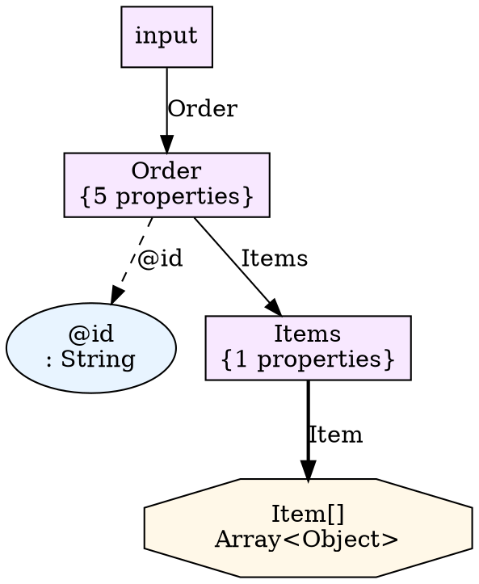

# Design-Time Schema Analysis and Type System (Enhanced)

**Version**: 2.0 - Enhanced with Daemon Mode & Graph Capabilities
**Date**: 2025-10-30
**Status**: Design Proposal - Extended
**Author**: UTL-X Architecture Team

---

## Document Overview

This enhanced version extends the original design-time schema analysis specification with:

1. **Daemon Mode** - UTL-X as a background service for IDE integration
2. **Autocomplete Service** - Type-aware path completion for developer experience
3. **UDM Graph Model** - Graph-based representation and traversal
4. **Visualization Capabilities** - Schema and transformation visualization

For the foundational design-time analysis concepts, see the [original design document](design-time-schema-analysis.md).

---

## Table of Contents

### Part I: Foundation (Summary from Original)
1. [Core Design-Time Analysis](#core-design-time-analysis)
2. [UDMType System](#udmtype-system-summary)
3. [Type Inference](#type-inference-summary)

### Part II: Daemon Mode & IDE Integration (New)
4. [Daemon Mode Architecture](#daemon-mode-architecture)
5. [Autocomplete Service](#autocomplete-service)
6. [UDM Graph Representation](#udm-graph-representation)
7. [Graph Visualization](#graph-visualization)
8. [Advanced IDE Features](#advanced-ide-features)
9. [Implementation Guide](#implementation-guide)
10. [API Specifications](#api-specifications)

---

# Part I: Foundation

## Core Design-Time Analysis

**Key Concept**: Analyze UTLX transformations at design-time using schema metadata.

```
Design-Time: XSD + UTLX → JSON Schema (metadata)
Runtime: XML + UTLX → JSON (data)
```

**Value Proposition**:
- Type errors caught before deployment
- API contract validation
- IDE autocomplete and error highlighting
- Integration with API design tools (ec-api-design)

**Reference**: See [design-time-schema-analysis.md](design-time-schema-analysis.md) for complete foundation details.

## UDMType System Summary

**Type Hierarchy**:
```kotlin
sealed class UDMType {
    object StringType : UDMType()
    object NumberType : UDMType()
    object IntegerType : UDMType()
    object BooleanType : UDMType()
    data class ArrayType(val elementType: UDMType) : UDMType()
    data class ObjectType(
        val properties: Map<String, PropertyInfo>,
        val additionalProperties: Boolean = true
    ) : UDMType()
    data class UnionType(val types: Set<UDMType>) : UDMType()
}

data class PropertyInfo(
    val type: UDMType,
    val required: Boolean,
    val minOccurs: Int = 1,
    val maxOccurs: Int = 1  // -1 for unbounded
)
```

**Type Environment**: Maps paths to types for lookup during inference.

## Type Inference Summary

**Process**:
1. Parse input schema → Build type environment
2. Parse UTLX script → Generate AST
3. Infer expression types using environment + function signatures
4. Generate output schema from inferred types

**Example**:
```utlx
sum(input.Order.Items.Item |> map(item => parseNumber(item.@price)))
```

**Type Inference**:
- `input.Order.Items.Item` → `ArrayType(ObjectType)`
- `item.@price` → `StringType` (from XSD)
- `parseNumber(StringType)` → `NumberType`
- `map` → `ArrayType(NumberType)`
- `sum(ArrayType(NumberType))` → `NumberType`

---

# Part II: Daemon Mode & IDE Integration

## Daemon Mode Architecture

### Overview

Running UTL-X as a **daemon service** enables:
- **Real-time type checking** as developer types
- **Autocomplete** for input paths based on schema
- **Error highlighting** without manual compilation
- **Multi-file project support**
- **Performance optimization** through caching

### Architecture Diagram

```
┌────────────────────────────────────────────────────────────────┐
│                         IDE / Editor                            │
│  ┌──────────────────────────────────────────────────────────┐  │
│  │  UTL-X Editor Plugin                                     │  │
│  │  - Syntax highlighting                                   │  │
│  │  - Autocomplete triggers ($input.)                       │  │
│  │  - Error display                                         │  │
│  └────────────┬───────────────────────────────┬─────────────┘  │
│               │ JSON-RPC/LSP                  │                │
└───────────────┼───────────────────────────────┼────────────────┘
                │                               │
                ▼                               ▼
┌────────────────────────────────────────────────────────────────┐
│              UTL-X Daemon Service (Background)                 │
│  ┌──────────────────────────────────────────────────────────┐  │
│  │  Request Handler                                         │  │
│  │  - textDocument/didOpen                                  │  │
│  │  - textDocument/didChange                                │  │
│  │  - textDocument/completion (autocomplete)                │  │
│  │  - textDocument/hover (type hints)                       │  │
│  │  - textDocument/publishDiagnostics (errors)              │  │
│  └──────────────────┬───────────────────────────────────────┘  │
│                     │                                           │
│  ┌──────────────────▼───────────────────────────────────────┐  │
│  │  State Manager                                           │  │
│  │  - Open files cache                                      │  │
│  │  - Type environments per file                            │  │
│  │  - AST cache                                             │  │
│  │  - Schema registry                                       │  │
│  └──────────────────┬───────────────────────────────────────┘  │
│                     │                                           │
│  ┌──────────────────▼───────────────────────────────────────┐  │
│  │  Analysis Engine                                         │  │
│  │  ┌────────────────┐  ┌────────────────┐  ┌────────────┐ │  │
│  │  │ Schema Parser  │  │Type Inference  │  │ Graph API  │ │  │
│  │  └────────────────┘  └────────────────┘  └────────────┘ │  │
│  └──────────────────────────────────────────────────────────┘  │
└────────────────────────────────────────────────────────────────┘
```

### Daemon Lifecycle

```kotlin
// modules/daemon/src/main/kotlin/org/apache/utlx/daemon/DaemonServer.kt

class UTLXDaemon(
    private val port: Int = 7777,
    private val transport: Transport = Transport.STDIO
) {
    private val stateManager = StateManager()
    private val analysisEngine = AnalysisEngine()

    fun start() {
        when (transport) {
            Transport.STDIO -> startStdioServer()
            Transport.SOCKET -> startSocketServer(port)
        }
    }

    private fun handleRequest(request: JsonRpcRequest): JsonRpcResponse {
        return when (request.method) {
            "initialize" -> handleInitialize(request)
            "textDocument/didOpen" -> handleDidOpen(request)
            "textDocument/didChange" -> handleDidChange(request)
            "textDocument/completion" -> handleCompletion(request)
            "textDocument/hover" -> handleHover(request)
            "utlx/complete" -> handlePathCompletion(request)
            "utlx/graph" -> handleGraphQuery(request)
            "utlx/visualize" -> handleVisualize(request)
            else -> JsonRpcResponse.methodNotFound(request.id)
        }
    }
}

enum class Transport { STDIO, SOCKET }
```

### State Management

```kotlin
class StateManager {
    private val openDocuments = ConcurrentHashMap<String, DocumentState>()
    private val typeEnvironments = ConcurrentHashMap<String, TypeEnvironment>()
    private val schemaCache = ConcurrentHashMap<String, Schema>()

    data class DocumentState(
        val uri: String,
        val content: String,
        val version: Int,
        val ast: UTLXNode?,
        val diagnostics: List<Diagnostic>,
        val lastAnalyzed: Instant
    )

    fun updateDocument(uri: String, content: String, version: Int) {
        val ast = try {
            UTLXParser.parse(content)
        } catch (e: ParseException) {
            null
        }

        val diagnostics = if (ast != null) {
            runTypeCheck(uri, ast)
        } else {
            listOf(Diagnostic.parseError(e))
        }

        openDocuments[uri] = DocumentState(
            uri, content, version, ast, diagnostics, Instant.now()
        )
    }

    fun getTypeEnvironment(uri: String): TypeEnvironment? {
        return typeEnvironments[uri]
    }

    fun setTypeEnvironment(uri: String, env: TypeEnvironment) {
        typeEnvironments[uri] = env
    }
}
```

### Communication Protocol

**Standard JSON-RPC 2.0** for LSP compatibility:

```json
// Request: Open document
{
  "jsonrpc": "2.0",
  "id": 1,
  "method": "textDocument/didOpen",
  "params": {
    "textDocument": {
      "uri": "file:///path/to/transform.utlx",
      "languageId": "utlx",
      "version": 1,
      "text": "..."
    }
  }
}

// Notification: Diagnostics (errors)
{
  "jsonrpc": "2.0",
  "method": "textDocument/publishDiagnostics",
  "params": {
    "uri": "file:///path/to/transform.utlx",
    "diagnostics": [
      {
        "range": {
          "start": {"line": 10, "character": 15},
          "end": {"line": 10, "character": 25}
        },
        "severity": 1,  // Error
        "message": "Type mismatch: expected Number, got String",
        "source": "utlx-type-checker"
      }
    ]
  }
}
```

---

## Autocomplete Service

### Use Case: Developer Experience

**Scenario**: Developer writing transformation with multiple inputs.

**Input Schema Configuration**:
```utlx
%utlx 1.0
input: orders xml, customers json, products json
output json
```

**Developer Types**: `$orders.`

**IDE Shows Dropdown**:
```
┌─────────────────────────────────┐
│ ○ Order                         │ Object
│ ○ @xmlns                        │ String
│ ○ @version                      │ String
└─────────────────────────────────┘
```

**Developer Selects** `Order`, types `$orders.Order.`

**IDE Shows Next Level**:
```
┌─────────────────────────────────┐
│ ○ @id                           │ String (required)
│ ○ Customer                      │ Object
│ ○ Items                         │ Object
│ ○ Date                          │ String
│ ○ Status                        │ String
└─────────────────────────────────┘
```

**Developer Selects** `Items`, types `$orders.Order.Items.`

**IDE Shows**:
```
┌─────────────────────────────────┐
│ ○ Item                          │ Array<Object>
└─────────────────────────────────┘
```

**Developer Selects** `Item`, types `$orders.Order.Items.Item.`

**IDE Shows Array Element Properties**:
```
┌─────────────────────────────────┐
│ ○ @sku                          │ String
│ ○ @quantity                     │ Integer
│ ○ @price                        │ Decimal
│ ○ ProductName                   │ String
└─────────────────────────────────┘
```

### Implementation

#### Path Completion Algorithm

```kotlin
// modules/daemon/src/main/kotlin/org/apache/utlx/daemon/completion/PathCompleter.kt

class PathCompleter(
    private val typeEnvironment: TypeEnvironment
) {

    fun complete(path: String): List<CompletionItem> {
        // Parse partial path
        val parts = path.split(".")
        val prefix = parts.dropLast(1).joinToString(".")
        val partial = parts.last()

        // Lookup type at prefix
        val type = typeEnvironment.lookupNested(prefix) ?: return emptyList()

        // Get completions based on type
        return when (type) {
            is UDMType.ObjectType -> completeObjectProperties(type, partial)
            is UDMType.ArrayType -> completeArrayAccess(type, partial)
            is UDMType.UnionType -> completeUnion(type, partial)
            else -> emptyList()
        }
    }

    private fun completeObjectProperties(
        type: UDMType.ObjectType,
        partial: String
    ): List<CompletionItem> {
        return type.properties
            .filter { (name, _) -> name.startsWith(partial, ignoreCase = true) }
            .map { (name, propInfo) ->
                CompletionItem(
                    label = name,
                    kind = if (propInfo.type is UDMType.ObjectType)
                        CompletionItemKind.Class
                    else if (propInfo.type is UDMType.ArrayType)
                        CompletionItemKind.Array
                    else
                        CompletionItemKind.Property,
                    detail = propInfo.type.toString(),
                    documentation = buildDocumentation(name, propInfo),
                    insertText = name,
                    sortText = rankCompletion(name, propInfo)
                )
            }
            .sortedBy { it.sortText }
    }

    private fun completeArrayAccess(
        type: UDMType.ArrayType,
        partial: String
    ): List<CompletionItem> {
        // For arrays, suggest element access patterns
        return listOf(
            CompletionItem(
                label = "[]",
                kind = CompletionItemKind.Operator,
                detail = "Array element access",
                insertText = "[]"
            ),
            CompletionItem(
                label = "[0]",
                kind = CompletionItemKind.Operator,
                detail = "First element",
                insertText = "[0]"
            )
        ) + when (type.elementType) {
            is UDMType.ObjectType -> {
                // If array of objects, show available properties
                completeObjectProperties(type.elementType, partial)
            }
            else -> emptyList()
        }
    }

    private fun rankCompletion(name: String, propInfo: PropertyInfo): String {
        // Ranking strategy:
        // 1. Required fields first
        // 2. Alphabetical
        val requiredPrefix = if (propInfo.required) "0" else "1"
        return "$requiredPrefix-$name"
    }

    private fun buildDocumentation(
        name: String,
        propInfo: PropertyInfo
    ): String {
        return buildString {
            append("**Type**: `${propInfo.type}`\n\n")
            if (propInfo.required) {
                append("**Required**: Yes\n\n")
            }
            if (propInfo.minOccurs != 1 || propInfo.maxOccurs != 1) {
                append("**Cardinality**: ")
                append("minOccurs=${propInfo.minOccurs}, ")
                append("maxOccurs=${if (propInfo.maxOccurs == -1) "unbounded" else propInfo.maxOccurs}")
                append("\n\n")
            }
        }
    }
}

data class CompletionItem(
    val label: String,
    val kind: CompletionItemKind,
    val detail: String,
    val documentation: String? = null,
    val insertText: String = label,
    val sortText: String = label
)

enum class CompletionItemKind {
    Class, Property, Array, Operator, Function, Keyword
}
```

#### Multi-Input Support

```kotlin
class MultiInputCompleter(
    private val typeEnvironments: Map<String, TypeEnvironment>
) {

    fun complete(inputName: String, path: String): List<CompletionItem> {
        // Extract input variable name (e.g., "$orders" from "$orders.Order.Items")
        val env = typeEnvironments[inputName] ?: return emptyList()

        val completer = PathCompleter(env)
        return completer.complete(path)
    }

    fun completeInputs(): List<CompletionItem> {
        // When user types just "$", show all available inputs
        return typeEnvironments.keys.map { inputName ->
            val rootType = typeEnvironments[inputName]?.lookup("input")
            CompletionItem(
                label = inputName,
                kind = CompletionItemKind.Class,
                detail = rootType?.toString() ?: "Input source",
                documentation = "Input source: $inputName",
                insertText = inputName
            )
        }
    }
}
```

### API Specification

#### Autocomplete Request

```typescript
// Request
interface CompletionRequest {
  jsonrpc: "2.0";
  id: number;
  method: "textDocument/completion";
  params: {
    textDocument: { uri: string };
    position: { line: number; character: number };
    context?: {
      triggerKind: 1 | 2 | 3;  // Invoked | TriggerCharacter | TriggerForIncompleteCompletions
      triggerCharacter?: ".";
    };
  };
}

// Response
interface CompletionResponse {
  jsonrpc: "2.0";
  id: number;
  result: {
    isIncomplete: boolean;
    items: CompletionItem[];
  };
}

interface CompletionItem {
  label: string;
  kind: CompletionItemKind;
  detail?: string;
  documentation?: string | { kind: "markdown"; value: string };
  insertText?: string;
  sortText?: string;
  filterText?: string;
}

enum CompletionItemKind {
  Text = 1,
  Method = 2,
  Function = 3,
  Constructor = 4,
  Field = 5,
  Variable = 6,
  Class = 7,
  // ... etc
}
```

#### Example Request/Response

```json
// Request: Complete path "$input.Order."
{
  "jsonrpc": "2.0",
  "id": 42,
  "method": "textDocument/completion",
  "params": {
    "textDocument": {
      "uri": "file:///workspace/transform.utlx"
    },
    "position": { "line": 15, "character": 20 },
    "context": {
      "triggerKind": 2,
      "triggerCharacter": "."
    }
  }
}

// Response
{
  "jsonrpc": "2.0",
  "id": 42,
  "result": {
    "isIncomplete": false,
    "items": [
      {
        "label": "@id",
        "kind": 5,  // Field
        "detail": "String (required)",
        "documentation": {
          "kind": "markdown",
          "value": "**Type**: `String`\n\n**Required**: Yes\n\nOrder identifier attribute"
        },
        "insertText": "@id",
        "sortText": "0-@id"
      },
      {
        "label": "Customer",
        "kind": 7,  // Class
        "detail": "Object",
        "documentation": {
          "kind": "markdown",
          "value": "**Type**: `{Name: String, Email: String, Address: Object}`\n\nCustomer information"
        },
        "insertText": "Customer",
        "sortText": "0-Customer"
      },
      {
        "label": "Items",
        "kind": 7,  // Class
        "detail": "Object",
        "documentation": {
          "kind": "markdown",
          "value": "**Type**: `{Item: Array<Object>}`\n\nOrder line items"
        },
        "insertText": "Items",
        "sortText": "0-Items"
      }
    ]
  }
}
```

---

## UDM Graph Representation

### Conceptual Model

**UDM as a Graph**: Type environment can be represented as a directed graph where:
- **Nodes** = Types (Object, Array, Scalar)
- **Edges** = Property access, array elements, attributes
- **Paths** = Sequences of edges from root to any node
- **Metadata** = Type information, cardinality, requirements

### Graph Structure

```kotlin
// modules/analysis/src/main/kotlin/org/apache/utlx/analysis/graph/UDMGraph.kt

data class UDMGraph(
    val nodes: Map<String, GraphNode>,
    val edges: List<GraphEdge>,
    val root: String,
    val metadata: GraphMetadata
) {
    fun getNode(path: String): GraphNode? = nodes[path]

    fun getChildren(path: String): List<GraphNode> {
        return edges
            .filter { it.from == path }
            .mapNotNull { nodes[it.to] }
    }

    fun getParent(path: String): GraphNode? {
        val parentEdge = edges.find { it.to == path }
        return parentEdge?.let { nodes[it.from] }
    }

    fun getAllPaths(): List<String> = nodes.keys.toList()

    fun getPathsMatchingPattern(pattern: Regex): List<String> {
        return nodes.keys.filter { it.matches(pattern) }
    }

    fun shortestPath(from: String, to: String): List<String>? {
        // BFS to find shortest path
        val queue = ArrayDeque<List<String>>()
        val visited = mutableSetOf<String>()

        queue.add(listOf(from))
        visited.add(from)

        while (queue.isNotEmpty()) {
            val path = queue.removeFirst()
            val current = path.last()

            if (current == to) return path

            getChildren(current).forEach { child ->
                val childPath = child.path
                if (childPath !in visited) {
                    visited.add(childPath)
                    queue.add(path + childPath)
                }
            }
        }

        return null  // No path found
    }

    fun subgraph(rootPath: String, maxDepth: Int = Int.MAX_VALUE): UDMGraph {
        // Extract subgraph starting from rootPath
        val subNodes = mutableMapOf<String, GraphNode>()
        val subEdges = mutableListOf<GraphEdge>()

        fun traverse(path: String, depth: Int) {
            if (depth > maxDepth) return

            val node = nodes[path] ?: return
            subNodes[path] = node

            edges.filter { it.from == path }.forEach { edge ->
                subEdges.add(edge)
                traverse(edge.to, depth + 1)
            }
        }

        traverse(rootPath, 0)

        return UDMGraph(subNodes, subEdges, rootPath, metadata)
    }
}

sealed class GraphNode {
    abstract val path: String
    abstract val type: UDMType

    data class ObjectNode(
        override val path: String,
        override val type: UDMType.ObjectType,
        val properties: Map<String, String>  // property name -> child path
    ) : GraphNode()

    data class ArrayNode(
        override val path: String,
        override val type: UDMType.ArrayType,
        val elementPath: String
    ) : GraphNode()

    data class ScalarNode(
        override val path: String,
        override val type: UDMType
    ) : GraphNode()
}

data class GraphEdge(
    val from: String,
    val to: String,
    val label: String,
    val edgeType: EdgeType,
    val metadata: EdgeMetadata = EdgeMetadata()
) {
    override fun toString() = "$from --[$label]--> $to"
}

enum class EdgeType {
    PROPERTY,       // Object property access
    ATTRIBUTE,      // XML attribute (starts with @)
    ARRAY_ELEMENT,  // Array element
    UNION_BRANCH    // Union type alternative
}

data class EdgeMetadata(
    val required: Boolean = true,
    val minOccurs: Int = 1,
    val maxOccurs: Int = 1
)

data class GraphMetadata(
    val schemaType: String,  // "XSD", "JSON Schema", "Avro"
    val schemaVersion: String? = null,
    val namespace: String? = null
)
```

### Graph Builder

```kotlin
class GraphBuilder {

    fun buildFromTypeEnvironment(env: TypeEnvironment): UDMGraph {
        val nodes = mutableMapOf<String, GraphNode>()
        val edges = mutableListOf<GraphEdge>()

        // Start from root
        val rootPath = "input"
        val rootType = env.lookup(rootPath) ?: return UDMGraph(emptyMap(), emptyList(), rootPath, GraphMetadata("Unknown"))

        buildNode(rootPath, rootType, nodes, edges)

        return UDMGraph(nodes, edges, rootPath, GraphMetadata("Dynamic"))
    }

    private fun buildNode(
        path: String,
        type: UDMType,
        nodes: MutableMap<String, GraphNode>,
        edges: MutableList<GraphEdge>
    ) {
        // Prevent infinite recursion
        if (path in nodes) return

        when (type) {
            is UDMType.ObjectType -> {
                val properties = mutableMapOf<String, String>()

                type.properties.forEach { (name, propInfo) ->
                    val childPath = "$path.$name"
                    properties[name] = childPath

                    edges.add(GraphEdge(
                        from = path,
                        to = childPath,
                        label = name,
                        edgeType = if (name.startsWith("@")) EdgeType.ATTRIBUTE else EdgeType.PROPERTY,
                        metadata = EdgeMetadata(
                            required = propInfo.required,
                            minOccurs = propInfo.minOccurs,
                            maxOccurs = propInfo.maxOccurs
                        )
                    ))

                    buildNode(childPath, propInfo.type, nodes, edges)
                }

                nodes[path] = GraphNode.ObjectNode(path, type, properties)
            }

            is UDMType.ArrayType -> {
                val elementPath = "$path[]"

                edges.add(GraphEdge(
                    from = path,
                    to = elementPath,
                    label = "[]",
                    edgeType = EdgeType.ARRAY_ELEMENT
                ))

                buildNode(elementPath, type.elementType, nodes, edges)
                nodes[path] = GraphNode.ArrayNode(path, type, elementPath)
            }

            is UDMType.UnionType -> {
                // Create branches for each union member
                type.types.forEachIndexed { index, memberType ->
                    val branchPath = "$path[union:$index]"

                    edges.add(GraphEdge(
                        from = path,
                        to = branchPath,
                        label = "variant $index",
                        edgeType = EdgeType.UNION_BRANCH
                    ))

                    buildNode(branchPath, memberType, nodes, edges)
                }

                nodes[path] = GraphNode.ScalarNode(path, type)
            }

            else -> {
                nodes[path] = GraphNode.ScalarNode(path, type)
            }
        }
    }
}
```

### Graph Traversal API

```kotlin
class GraphTraverser(private val graph: UDMGraph) {

    /**
     * Depth-first traversal
     */
    fun dfs(startPath: String, visitor: (GraphNode) -> Unit) {
        val visited = mutableSetOf<String>()

        fun visit(path: String) {
            if (path in visited) return
            visited.add(path)

            graph.getNode(path)?.let { node ->
                visitor(node)
                graph.getChildren(path).forEach { child ->
                    visit(child.path)
                }
            }
        }

        visit(startPath)
    }

    /**
     * Breadth-first traversal
     */
    fun bfs(startPath: String, visitor: (GraphNode, Int) -> Unit) {
        val queue = ArrayDeque<Pair<String, Int>>()
        val visited = mutableSetOf<String>()

        queue.add(startPath to 0)
        visited.add(startPath)

        while (queue.isNotEmpty()) {
            val (path, depth) = queue.removeFirst()

            graph.getNode(path)?.let { node ->
                visitor(node, depth)

                graph.getChildren(path).forEach { child ->
                    if (child.path !in visited) {
                        visited.add(child.path)
                        queue.add(child.path to depth + 1)
                    }
                }
            }
        }
    }

    /**
     * Find all leaf nodes (scalars)
     */
    fun findLeaves(): List<GraphNode.ScalarNode> {
        return graph.nodes.values
            .filterIsInstance<GraphNode.ScalarNode>()
            .filter { node ->
                graph.getChildren(node.path).isEmpty()
            }
    }

    /**
     * Get depth of path from root
     */
    fun getDepth(path: String): Int {
        val pathParts = graph.shortestPath(graph.root, path)
        return pathParts?.size?.minus(1) ?: -1
    }
}
```

---

## Graph Visualization

### Overview

Transform type environment graphs into visual representations for:
- **Schema documentation**
- **Interactive exploration**
- **Transformation debugging**
- **API contract visualization**

### Visualization Formats

#### 1. Graphviz DOT Format

```kotlin
// modules/analysis/src/main/kotlin/org/apache/utlx/analysis/visualization/DotGenerator.kt

class DotGenerator {

    fun generate(graph: UDMGraph, options: DotOptions = DotOptions()): String {
        return buildString {
            appendLine("digraph UDM {")
            appendLine("  rankdir=${options.direction};")
            appendLine("  node [shape=box, style=rounded];")
            appendLine()

            // Generate nodes
            graph.nodes.forEach { (path, node) ->
                val nodeId = sanitizeId(path)
                val label = buildNodeLabel(node, options)
                val shape = getNodeShape(node)
                val color = getNodeColor(node)

                appendLine("""  $nodeId [label="$label", shape=$shape, fillcolor="$color", style=filled];""")
            }

            appendLine()

            // Generate edges
            graph.edges.forEach { edge ->
                val fromId = sanitizeId(edge.from)
                val toId = sanitizeId(edge.to)
                val label = edge.label
                val style = getEdgeStyle(edge)
                val color = getEdgeColor(edge)

                appendLine("""  $fromId -> $toId [label="$label", style=$style, color="$color"];""")
            }

            appendLine("}")
        }
    }

    private fun buildNodeLabel(node: GraphNode, options: DotOptions): String {
        return when (node) {
            is GraphNode.ObjectNode -> {
                if (options.showTypes) {
                    "${node.path}\\n{${node.properties.size} properties}"
                } else {
                    node.path.split(".").last()
                }
            }
            is GraphNode.ArrayNode -> {
                if (options.showTypes) {
                    "${node.path}\\nArray<${node.type.elementType}>"
                } else {
                    "${node.path.split(".").last()}[]"
                }
            }
            is GraphNode.ScalarNode -> {
                if (options.showTypes) {
                    "${node.path}\\n: ${node.type}"
                } else {
                    node.path.split(".").last()
                }
            }
        }
    }

    private fun getNodeShape(node: GraphNode): String = when (node) {
        is GraphNode.ObjectNode -> "box"
        is GraphNode.ArrayNode -> "octagon"
        is GraphNode.ScalarNode -> "ellipse"
    }

    private fun getNodeColor(node: GraphNode): String = when (node.type) {
        is UDMType.StringType -> "#E8F4FF"
        is UDMType.NumberType, is UDMType.IntegerType -> "#FFE8E8"
        is UDMType.BooleanType -> "#E8FFE8"
        is UDMType.ArrayType -> "#FFF8E8"
        is UDMType.ObjectType -> "#F8E8FF"
        else -> "#F0F0F0"
    }

    private fun getEdgeStyle(edge: GraphEdge): String = when (edge.edgeType) {
        EdgeType.PROPERTY -> "solid"
        EdgeType.ATTRIBUTE -> "dashed"
        EdgeType.ARRAY_ELEMENT -> "bold"
        EdgeType.UNION_BRANCH -> "dotted"
    }

    private fun getEdgeColor(edge: GraphEdge): String {
        return if (edge.metadata.required) "#000000" else "#808080"
    }

    private fun sanitizeId(path: String): String {
        return path.replace(".", "_").replace("[]", "_array").replace("@", "attr_")
    }
}

data class DotOptions(
    val direction: Direction = Direction.TB,
    val showTypes: Boolean = true,
    val maxDepth: Int = Int.MAX_VALUE
)

enum class Direction { TB, BT, LR, RL }
```

**Example Output**:


#### 2. Mermaid Diagram Format

```kotlin
class MermaidGenerator {

    fun generate(graph: UDMGraph): String {
        return buildString {
            appendLine("graph TD")

            graph.nodes.forEach { (path, node) ->
                val nodeId = sanitizeId(path)
                val label = getNodeLabel(node)
                val shape = getMermaidShape(node)

                appendLine("    $nodeId$shape")
            }

            graph.edges.forEach { edge ->
                val fromId = sanitizeId(edge.from)
                val toId = sanitizeId(edge.to)
                val label = edge.label
                val style = getMermaidEdgeStyle(edge)

                appendLine("    $fromId $style $toId")
            }
        }
    }

    private fun getNodeLabel(node: GraphNode): String {
        val name = node.path.split(".").last()
        val typeStr = when (node) {
            is GraphNode.ObjectNode -> "Object"
            is GraphNode.ArrayNode -> "Array"
            is GraphNode.ScalarNode -> node.type.toString()
        }
        return "$name: $typeStr"
    }

    private fun getMermaidShape(node: GraphNode): String {
        val label = getNodeLabel(node)
        return when (node) {
            is GraphNode.ObjectNode -> "[\"$label\"]"
            is GraphNode.ArrayNode -> "{{\"$label\"}}"
            is GraphNode.ScalarNode -> "(\"$label\")"
        }
    }

    private fun getMermaidEdgeStyle(edge: GraphEdge): String {
        return when (edge.edgeType) {
            EdgeType.PROPERTY -> "-->|${edge.label}|"
            EdgeType.ATTRIBUTE -> "-.->|${edge.label}|"
            EdgeType.ARRAY_ELEMENT -> "==>|${edge.label}|"
            EdgeType.UNION_BRANCH -> "-..->|${edge.label}|"
        }
    }

    private fun sanitizeId(path: String) =
        path.replace(".", "_").replace("[]", "Array").replace("@", "attr_")
}
```

**Example Output**:
```mermaid
graph TD
    input["input: Object"]
    input_Order["Order: Object"]
    input_Order_attr_id("@id: String")
    input_Order_Customer["Customer: Object"]
    input_Order_Items["Items: Object"]
    input_Order_Items_Item{{"Item: Array"}}

    input -->|Order| input_Order
    input_Order -.->|@id| input_Order_attr_id
    input_Order -->|Customer| input_Order_Customer
    input_Order -->|Items| input_Order_Items
    input_Order_Items ==>|Item| input_Order_Items_Item
```

#### 3. D3.js JSON Format

```kotlin
class D3JsonGenerator {

    fun generate(graph: UDMGraph): String {
        val d3Data = D3GraphData(
            nodes = graph.nodes.map { (path, node) ->
                D3Node(
                    id = path,
                    label = node.path.split(".").last(),
                    type = getNodeType(node),
                    fullPath = path,
                    typeInfo = node.type.toString()
                )
            },
            links = graph.edges.map { edge ->
                D3Link(
                    source = edge.from,
                    target = edge.to,
                    label = edge.label,
                    type = edge.edgeType.name.lowercase()
                )
            }
        )

        return Json.encodeToString(d3Data)
    }

    private fun getNodeType(node: GraphNode): String = when (node) {
        is GraphNode.ObjectNode -> "object"
        is GraphNode.ArrayNode -> "array"
        is GraphNode.ScalarNode -> "scalar"
    }
}

@Serializable
data class D3GraphData(
    val nodes: List<D3Node>,
    val links: List<D3Link>
)

@Serializable
data class D3Node(
    val id: String,
    val label: String,
    val type: String,
    val fullPath: String,
    val typeInfo: String
)

@Serializable
data class D3Link(
    val source: String,
    val target: String,
    val label: String,
    val type: String
)
```

**Example Output**:
```json
{
  "nodes": [
    {"id": "input", "label": "input", "type": "object", "fullPath": "input", "typeInfo": "{...}"},
    {"id": "input.Order", "label": "Order", "type": "object", "fullPath": "input.Order", "typeInfo": "{...}"},
    {"id": "input.Order.@id", "label": "@id", "type": "scalar", "fullPath": "input.Order.@id", "typeInfo": "String"}
  ],
  "links": [
    {"source": "input", "target": "input.Order", "label": "Order", "type": "property"},
    {"source": "input.Order", "target": "input.Order.@id", "label": "@id", "type": "attribute"}
  ]
}
```

### Visualization API

```kotlin
// Daemon API endpoint for visualization
fun handleVisualize(request: JsonRpcRequest): JsonRpcResponse {
    val params = request.params as VisualizeParams

    // Get graph from type environment
    val env = stateManager.getTypeEnvironment(params.uri)
        ?: return JsonRpcResponse.error(request.id, "No type environment found")

    val graphBuilder = GraphBuilder()
    val graph = graphBuilder.buildFromTypeEnvironment(env)

    // Apply filters
    val filteredGraph = if (params.rootPath != null) {
        graph.subgraph(params.rootPath, params.maxDepth)
    } else {
        graph
    }

    // Generate visualization
    val output = when (params.format) {
        "dot" -> DotGenerator().generate(filteredGraph, params.dotOptions ?: DotOptions())
        "mermaid" -> MermaidGenerator().generate(filteredGraph)
        "d3" -> D3JsonGenerator().generate(filteredGraph)
        else -> return JsonRpcResponse.error(request.id, "Unknown format: ${params.format}")
    }

    return JsonRpcResponse.success(request.id, mapOf("visualization" to output))
}

data class VisualizeParams(
    val uri: String,
    val format: String,  // "dot", "mermaid", "d3"
    val rootPath: String? = null,
    val maxDepth: Int = Int.MAX_VALUE,
    val dotOptions: DotOptions? = null
)
```

---

## Advanced IDE Features

### Type Hints on Hover

```kotlin
fun handleHover(request: JsonRpcRequest): JsonRpcResponse {
    val params = request.params as HoverParams

    // Get document and AST
    val doc = stateManager.getDocument(params.textDocument.uri)
        ?: return JsonRpcResponse.success(request.id, null)

    val ast = doc.ast ?: return JsonRpcResponse.success(request.id, null)

    // Find expression at position
    val expr = findExpressionAtPosition(ast, params.position)
        ?: return JsonRpcResponse.success(request.id, null)

    // Infer type
    val env = stateManager.getTypeEnvironment(params.textDocument.uri)
    val inferenceEngine = TypeInferenceEngine(env, FunctionRegistry())
    val type = inferenceEngine.inferExpressionType(expr)

    // Build hover content
    val hoverContent = buildString {
        appendLine("**Type**: `$type`")
        appendLine()

        if (expr is PathExpression) {
            appendLine("**Path**: `${expr.path}`")
            appendLine()

            // Show property info if available
            val propInfo = getPropertyInfo(env, expr.path)
            if (propInfo != null) {
                appendLine("**Required**: ${if (propInfo.required) "Yes" else "No"}")
                if (propInfo.isArray) {
                    appendLine("**Cardinality**: ${propInfo.minOccurs}..${if (propInfo.maxOccurs == -1) "∞" else propInfo.maxOccurs}")
                }
            }
        }
    }

    return JsonRpcResponse.success(request.id, mapOf(
        "contents" to mapOf(
            "kind" to "markdown",
            "value" to hoverContent
        ),
        "range" to getExpressionRange(expr)
    ))
}
```

### Quick Fixes

```kotlin
fun handleCodeAction(request: JsonRpcRequest): JsonRpcResponse {
    val params = request.params as CodeActionParams

    // Get diagnostics in range
    val diagnostics = params.context.diagnostics

    val actions = diagnostics.flatMap { diagnostic ->
        generateQuickFixes(diagnostic, params.textDocument.uri)
    }

    return JsonRpcResponse.success(request.id, actions)
}

fun generateQuickFixes(diagnostic: Diagnostic, uri: String): List<CodeAction> {
    return when {
        diagnostic.message.contains("expected Number, got String") -> {
            listOf(
                CodeAction(
                    title = "Wrap with parseNumber()",
                    kind = "quickfix",
                    diagnostics = listOf(diagnostic),
                    edit = WorkspaceEdit(
                        changes = mapOf(
                            uri to listOf(
                                TextEdit(
                                    range = diagnostic.range,
                                    newText = "parseNumber(${getTextInRange(uri, diagnostic.range)})"
                                )
                            )
                        )
                    )
                )
            )
        }

        diagnostic.message.contains("Unknown path") -> {
            // Suggest similar paths
            val suggestions = findSimilarPaths(diagnostic.message)
            suggestions.map { suggestion ->
                CodeAction(
                    title = "Did you mean '$suggestion'?",
                    kind = "quickfix",
                    diagnostics = listOf(diagnostic),
                    edit = WorkspaceEdit(
                        changes = mapOf(
                            uri to listOf(
                                TextEdit(
                                    range = diagnostic.range,
                                    newText = suggestion
                                )
                            )
                        )
                    )
                )
            }
        }

        else -> emptyList()
    }
}
```

---

## Implementation Guide

### Phase 1: Daemon Infrastructure (2-3 weeks)

**Week 1: Core Daemon**
- [ ] JSON-RPC server implementation
- [ ] STDIO transport
- [ ] Socket transport
- [ ] Request routing
- [ ] Basic LSP protocol support

**Week 2: State Management**
- [ ] Document cache
- [ ] Type environment cache
- [ ] AST cache
- [ ] Schema registry
- [ ] Incremental updates

**Week 3: Integration Testing**
- [ ] Protocol conformance tests
- [ ] Performance benchmarks
- [ ] Memory profiling
- [ ] Multi-document scenarios

### Phase 2: Autocomplete Service (2 weeks)

**Week 1: Path Completion**
- [ ] PathCompleter implementation
- [ ] Multi-input support
- [ ] Ranking algorithm
- [ ] Documentation generation

**Week 2: IDE Integration**
- [ ] LSP completion endpoint
- [ ] VS Code extension prototype
- [ ] IntelliJ plugin prototype
- [ ] User testing

### Phase 3: Graph Representation (2 weeks)

**Week 1: Graph Core**
- [ ] UDMGraph data structure
- [ ] GraphBuilder from TypeEnvironment
- [ ] Traversal algorithms
- [ ] Query API

**Week 2: Visualization**
- [ ] DOT generator
- [ ] Mermaid generator
- [ ] D3 JSON generator
- [ ] Visualization API endpoint

### Phase 4: Advanced Features (2-3 weeks)

**Week 1: Type Hints**
- [ ] Hover provider
- [ ] Signature help
- [ ] Go to definition

**Week 2: Quick Fixes**
- [ ] Code action provider
- [ ] Common fix templates
- [ ] Smart suggestions

**Week 3: Polish & Documentation**
- [ ] User documentation
- [ ] API documentation
- [ ] Tutorial videos
- [ ] Release

**Total Timeline**: ~8-10 weeks

---

## API Specifications

### Complete Daemon API

```typescript
// Initialize daemon
interface InitializeRequest {
  jsonrpc: "2.0";
  id: number;
  method: "initialize";
  params: {
    processId: number | null;
    rootUri: string | null;
    capabilities: ClientCapabilities;
  };
}

// Document lifecycle
interface DidOpenTextDocumentParams {
  textDocument: {
    uri: string;
    languageId: "utlx";
    version: number;
    text: string;
  };
}

interface DidChangeTextDocumentParams {
  textDocument: {
    uri: string;
    version: number;
  };
  contentChanges: TextDocumentContentChangeEvent[];
}

// Autocomplete
interface CompletionParams {
  textDocument: { uri: string };
  position: Position;
  context?: CompletionContext;
}

// Hover
interface HoverParams {
  textDocument: { uri: string };
  position: Position;
}

// Custom UTLX endpoints
interface GraphQueryParams {
  uri: string;
  query: {
    type: "all-paths" | "shortest-path" | "subgraph" | "pattern";
    from?: string;
    to?: string;
    pattern?: string;
    maxDepth?: number;
  };
}

interface VisualizeParams {
  uri: string;
  format: "dot" | "mermaid" | "d3";
  rootPath?: string;
  maxDepth?: number;
}
```

---

## Conclusion

This enhanced design adds powerful developer experience features to UTL-X:

1. **Daemon Mode**: Background service for real-time analysis
2. **Autocomplete**: Type-aware path completion at every `.`
3. **Graph Model**: UDM as navigable, queryable graph
4. **Visualization**: Multiple formats for schema exploration

These capabilities transform UTL-X from a command-line tool into a **full-featured IDE-integrated transformation language** with world-class developer experience.

**Combined with the original design-time analysis**, UTL-X offers:
- ✅ Static type checking
- ✅ Contract validation
- ✅ Real-time autocomplete
- ✅ Interactive schema exploration
- ✅ Visual debugging
- ✅ API design tool integration

This positions UTL-X as a **modern, developer-friendly transformation platform** ready for enterprise adoption.

---

**Document Version**: 2.0 (Enhanced)
**Last Updated**: 2025-10-30
**Review Date**: 2025-11-15
**Status**: Awaiting Approval
**Supersedes**: design-time-schema-analysis.md v1.0
