# UTLXe Connection Sequence Diagrams

**All supported connection scenarios with Mermaid sequence diagrams**  
*Version 1.1 — May 2026*  
*Added: Diagram 2b — Bundle Management API (EF03)*

---

## 1. HTTP REST API (Direct)

The simplest scenario — a client sends a transformation request via HTTP and receives the result synchronously.

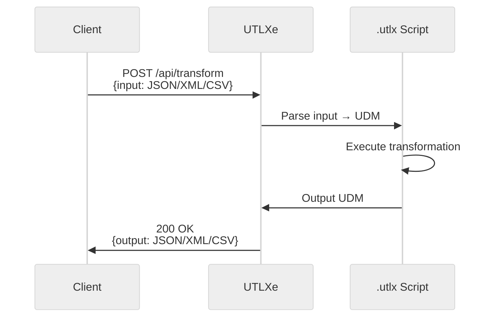

---

## 2. HTTP with Pre-loaded Bundle (--bundle flag)

Self-managed mode — transformations are baked into the image or mounted from a volume. The `--bundle` flag points to a local directory.

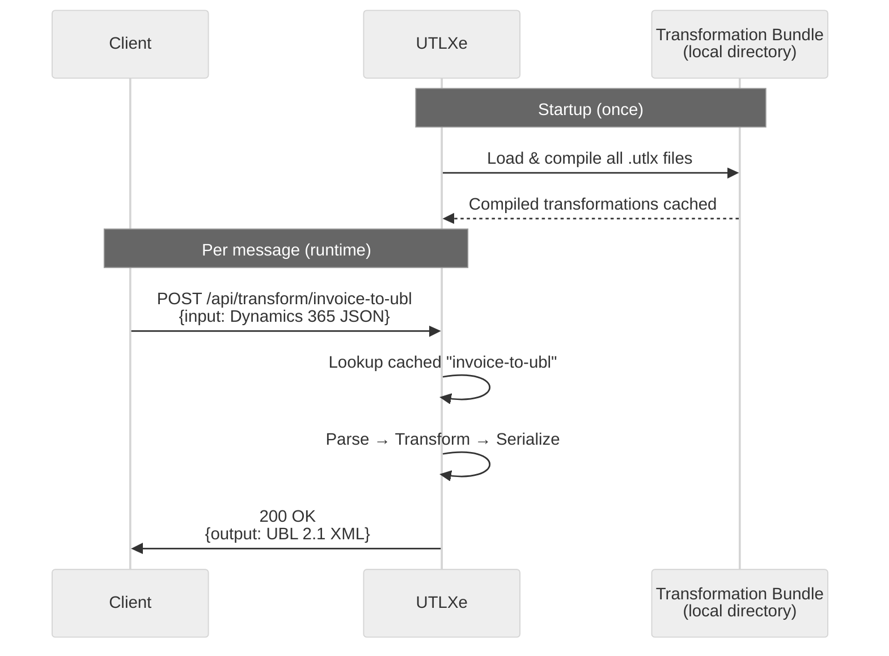

---

## 2b. Bundle Upload via Management API (EF03)

Azure Marketplace mode — the customer uploads transformation bundles via the admin API on port 8081. No custom image or volume mount required.

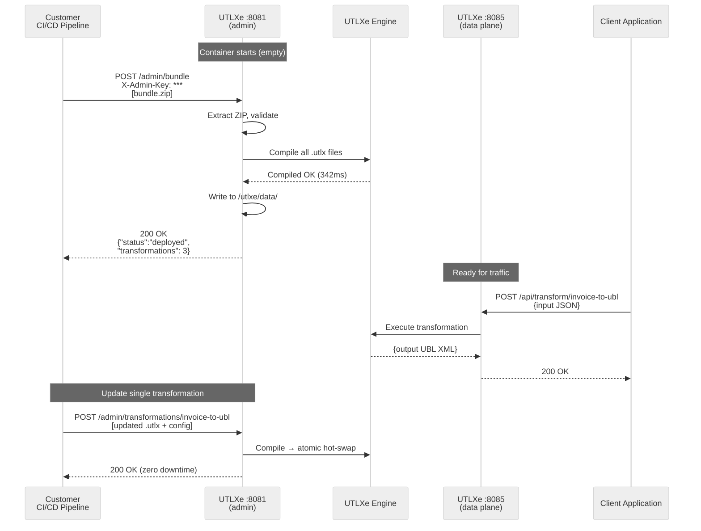

---

## 3. Azure Service Bus via Dapr Sidecar

Event-driven — messages arrive from Service Bus, are transformed, and forwarded to an output topic/queue.

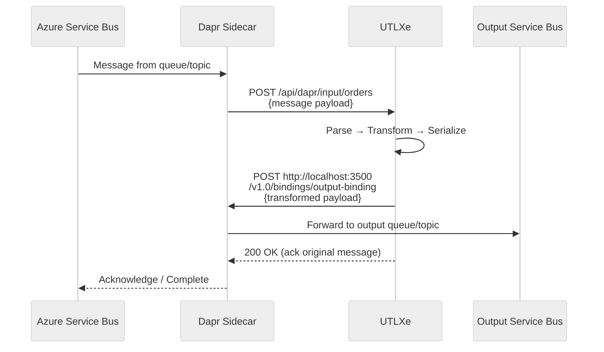

---

## 4. Azure Event Hub via Dapr Sidecar

High-throughput streaming — messages from Event Hub partitions are processed and forwarded.

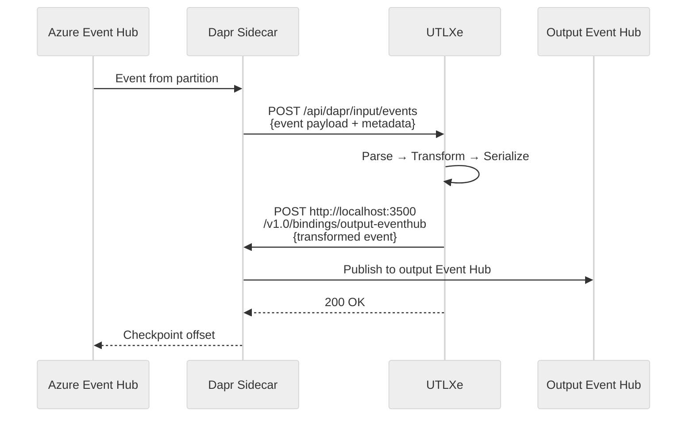

---

## 5. Kafka Consumer/Producer

Direct Kafka integration (without Dapr) for on-premise or multi-cloud deployments.

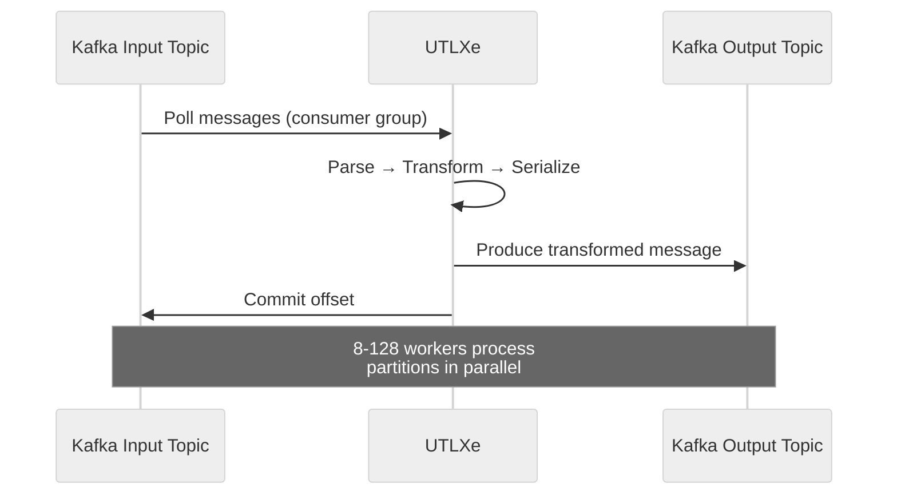

---

## 6. Stdio / Unix Pipeline

CLI-style integration — UTLXe reads from stdin, writes to stdout. Used for scripting, CI/CD, and process piping.

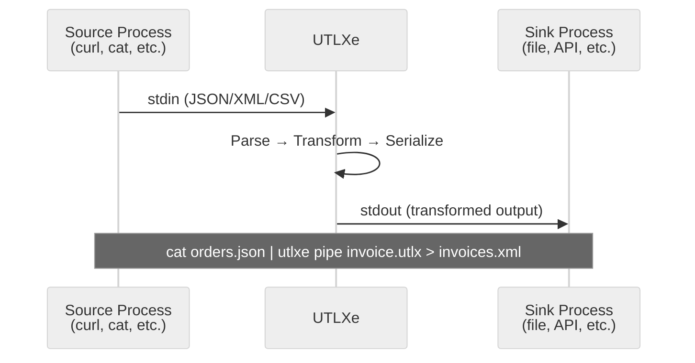

---

## 7. Proto/gRPC (Native Binary Wrapper)

For .NET, Go, and Python wrappers — communication via Protocol Buffers over stdio or gRPC.

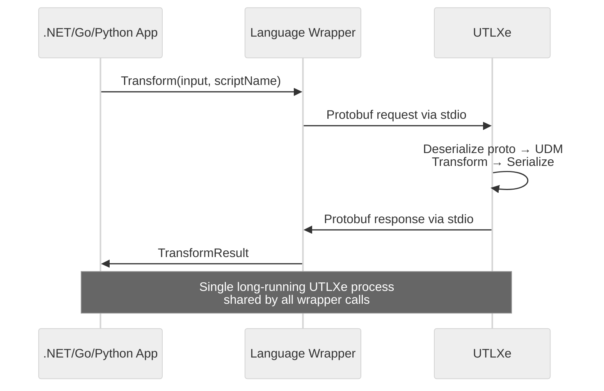

---

## 8. Pipeline Chaining (Multi-Stage)

Multiple transformations chained — output of one feeds input of next via in-process queues.

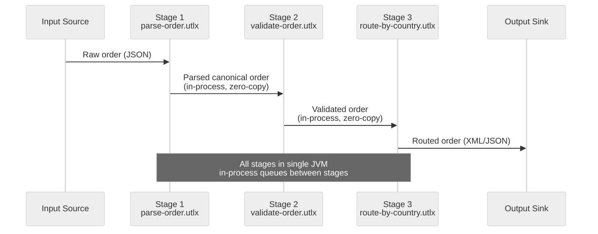

---

## 9. Multi-Input Transformation

Single transformation consuming from multiple sources simultaneously.

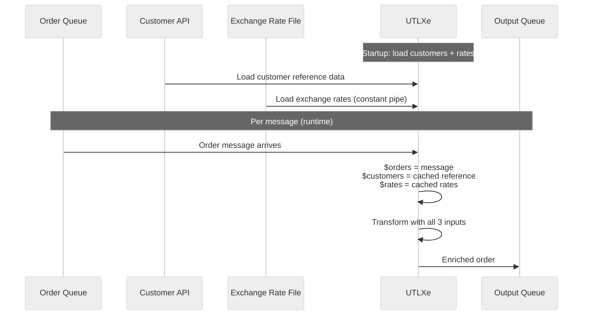

---

## 10. Health Check and Monitoring

Prometheus metrics scraping and Kubernetes liveness/readiness probes.

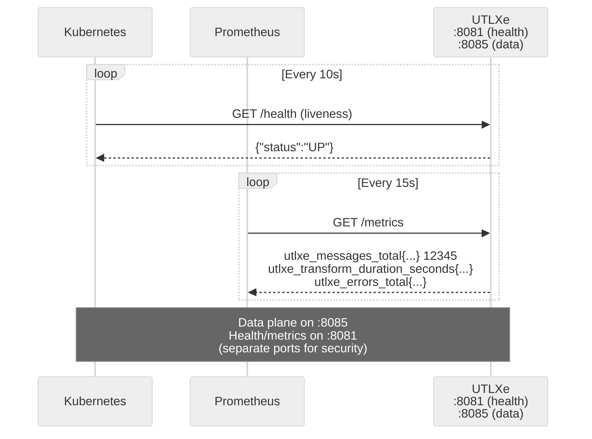

---

## 11. Dapr with Dead-Letter and Retry

Error handling flow — failed transformations are routed to dead-letter queue.

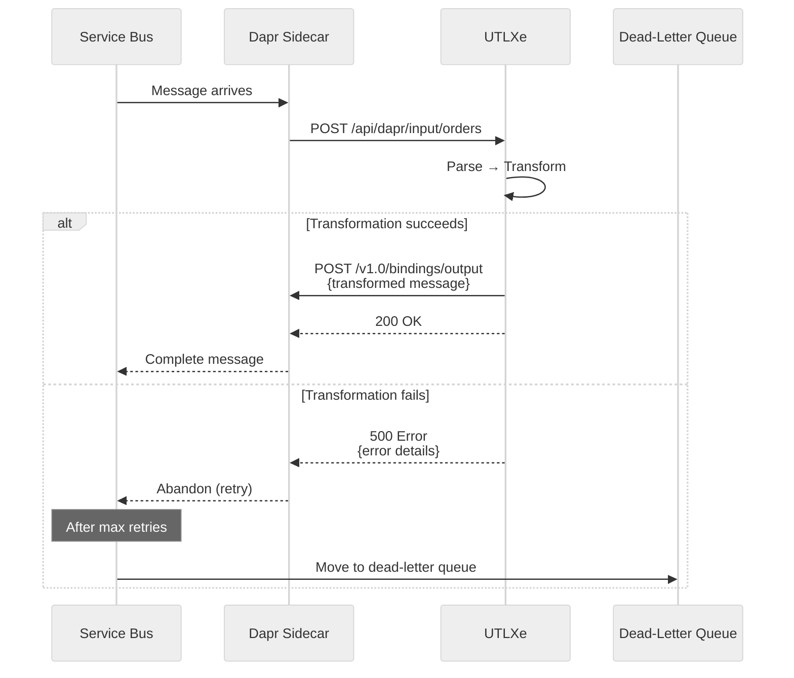

---

## 12. Full Azure Deployment (Case Study 1 — Peppol)

End-to-end flow for the European e-invoicing case study.

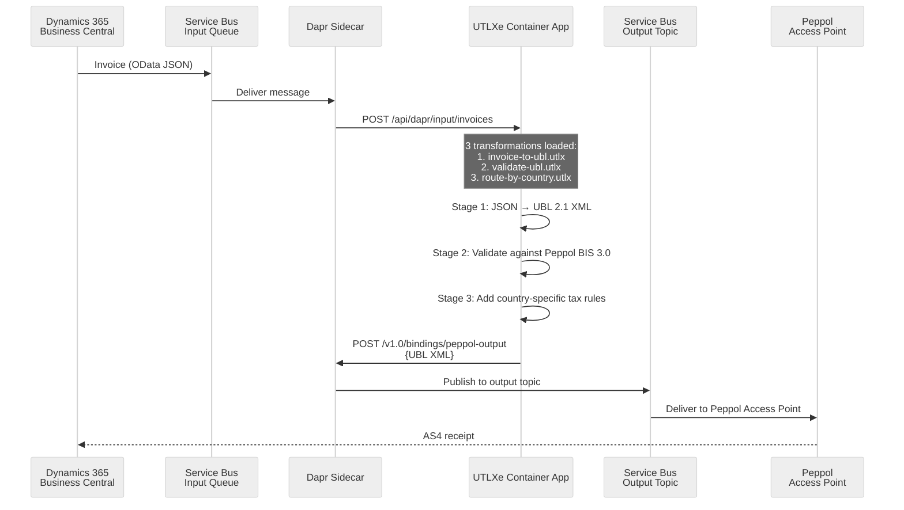

---

*All diagrams use Mermaid syntax — renderable in GitHub, VS Code, and most Markdown viewers.*
