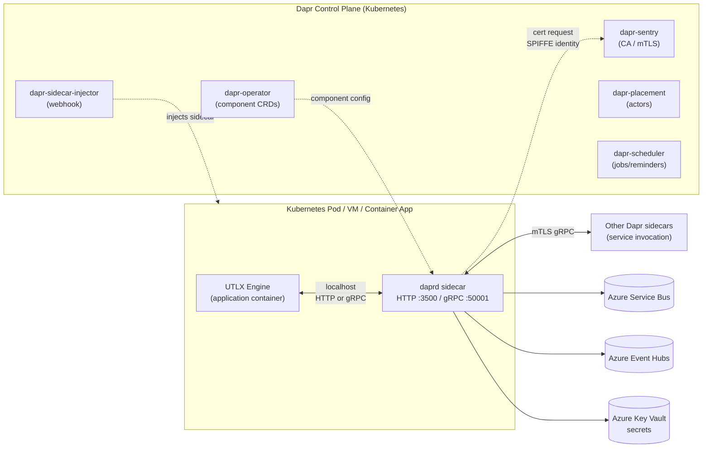
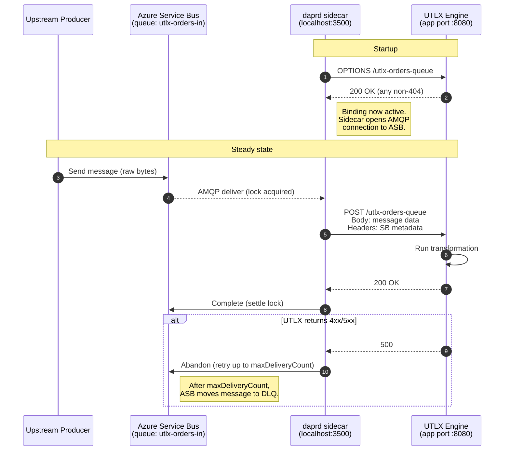
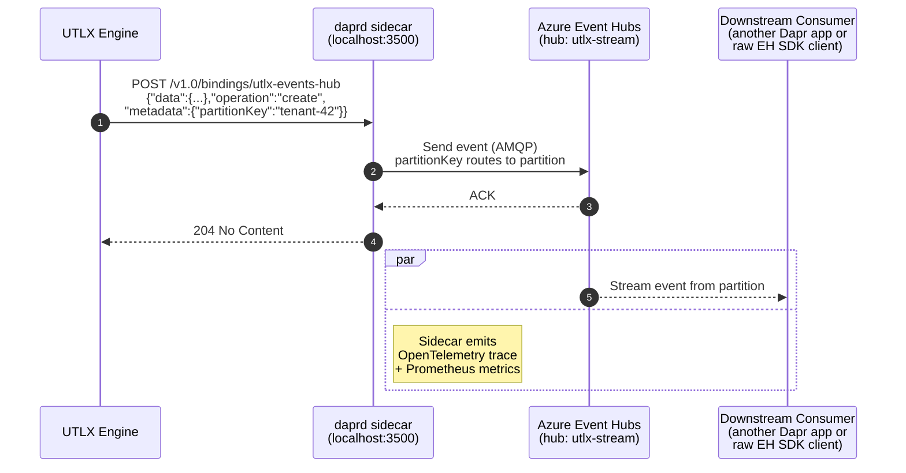
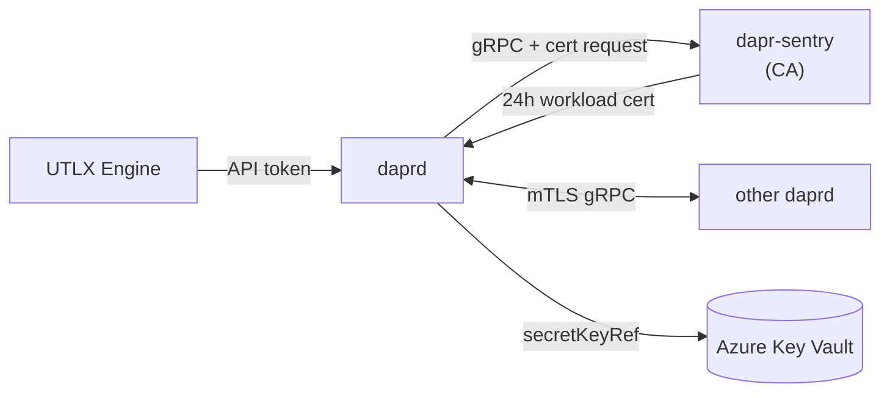

# Dapr Abstract — Wrapping the UTLX Engine in a Sidecar

**Document purpose:** A reference abstract that engineering can use to validate
UTLX engine connections through a Dapr sidecar, with a focus on Azure Service
Bus and Azure Event Hubs bindings and the multi-hyperscaler portability story.

**Target Dapr version:** 1.17 (April 2026 release line). All component specs and
behaviors are aligned to this version unless otherwise noted.

---

## 1. What Dapr is, and why a sidecar

Dapr (Distributed Application Runtime) is a portable, event-driven runtime for
building distributed applications. It is implemented in Go and follows a strict
**sidecar architecture**: a process called `daprd` runs alongside each
application instance, and the application talks to it over **HTTP or gRPC on
localhost**. The application never imports a cloud SDK and never opens a
connection to a broker directly — every infrastructure concern is delegated to
the sidecar.

For UTLX, this is the central design point. The UTLX engine itself stays
language-agnostic and infrastructure-agnostic; the sidecar handles:

- Connection management to brokers (Azure Service Bus, Event Hubs, Kafka, SNS/SQS, GCP Pub/Sub, RabbitMQ, etc.)
- Authentication to those brokers (connection strings, Microsoft Entra ID, IAM, service accounts)
- Retries, dead-lettering, checkpointing, and back-pressure
- mTLS between sidecars
- Observability (OpenTelemetry traces, Prometheus metrics)
- Secret resolution from Key Vault, AWS Secrets Manager, GCP Secret Manager, Kubernetes Secrets, etc.

The UTLX engine only needs to speak HTTP/gRPC to `localhost:3500` (HTTP) or
`localhost:50001` (gRPC). That is the entire integration contract.

### Hosting modes

Dapr supports three deployment modes that matter for UTLX:

| Mode | How `daprd` is launched | When to use |
|---|---|---|
| **Self-hosted (CLI)** | `dapr run` launches the engine and `daprd` as sibling processes; components live in `~/.dapr/components` | Local dev, CI, single-VM deployments |
| **Kubernetes** | The `dapr-sidecar-injector` admission webhook injects the `daprd` container into any pod annotated `dapr.io/enabled: "true"` | Production on AKS, EKS, GKE, OpenShift, on-prem k8s |
| **Managed (e.g., Azure Container Apps)** | The platform runs Dapr for you; you only ship the engine container and component YAML | When you want zero control-plane operational burden on Azure |

The UTLX engine container image is **identical across all three modes**. Only
the deployment manifest and component YAML change.

---

## 2. High-level architecture



**Key facts to validate against:**

- The sidecar exposes its API on **port 3500 (HTTP)** and **50001 (gRPC)** by default; both can be remapped.
- The sidecar reaches **readiness only when the application port is responsive**, and components are not available to the app during its startup window — UTLX must tolerate a small initialization gap or implement a readiness probe that waits for the sidecar.
- **All sidecar-to-sidecar traffic is gRPC** for performance; only app-to-sidecar may be HTTP or gRPC.
- mTLS is **on by default** in Kubernetes mode; certificates are issued by the `dapr-sentry` service with a default workload TTL of 24 hours, rotated automatically.

---

## 3. Building blocks UTLX will actually use

Dapr exposes around a dozen building blocks. For wrapping the UTLX engine the
relevant ones are:

| Building block | API path | UTLX use case |
|---|---|---|
| **Bindings (input/output)** | `/v1.0/bindings/{name}` | Trigger UTLX transformations from a queue; emit transformed payloads to another queue or HTTP endpoint |
| **Pub/Sub** | `/v1.0/publish/{pubsub}/{topic}` and declarative subscriptions | Fan-out of transformation events to multiple consumers; CloudEvents envelope |
| **Service invocation** | `/v1.0/invoke/{app-id}/method/{method}` | Synchronous request/response between UTLX and other Dapr-ized services with mTLS and retries |
| **Secrets** | `/v1.0/secrets/{store}/{key}` | UTLX reads broker credentials at runtime instead of having them mounted |
| **Configuration** | `/v1.0/configuration/{store}` | Hot-reload of UTLX transformation rules from Azure App Configuration |

The two primary integration shapes for UTLX are **bindings** and **pub/sub**.
The next section explains which one to pick — this is the single most common
source of confusion for teams adopting Dapr.

---

## 4. Bindings vs. pub/sub — choose deliberately

Both are event-driven. They are not interchangeable.

| Dimension | Bindings | Pub/Sub |
|---|---|---|
| **Topology** | Point-to-point: one component = one source/sink | Many-to-many: one topic, many subscribers |
| **Direction per component** | A single component declares `direction: input`, `output`, or `input,output` | Always bi-directional by design (publish + subscribe) |
| **Message envelope** | Raw payload (your bytes, your schema) | Wrapped in **CloudEvents 1.0** by default |
| **App-side contract for input** | Dapr `POST`s to `http://app:appPort/{component-name}` | Dapr `POST`s to the route declared in the `Subscription` CRD |
| **Output API** | `POST /v1.0/bindings/{name}` with `{"data": ..., "operation": "create", "metadata": {...}}` | `POST /v1.0/publish/{pubsub-name}/{topic}` with raw payload |
| **Multiple destinations** | Each destination needs its own binding component | One pub/sub component, many topics |
| **Best fit** | Triggering UTLX from a single queue, or fanning a transformed result to a specific sink | Broadcasting transformation events to several downstream services |

**Recommendation for UTLX wrapping:** Use **input bindings** to receive raw
messages that need transformation (one binding per source queue/hub), and use
**output bindings** to deliver transformed results to specific sinks. Use
**pub/sub** only when transformed events legitimately need to fan out to
multiple unrelated consumers via topics. Mixing the two in one app is allowed
and common.

> Note on the input-binding contract: Dapr discovers input bindings by sending
> an `OPTIONS` request to `http://<app>:<appPort>/<component-name>` at startup.
> The app must respond with **anything other than 404** for Dapr to start
> delivering messages to that route. Once Dapr starts delivering, messages
> arrive as `POST` requests to the same path. UTLX must therefore expose an
> HTTP route whose path matches the binding's `metadata.name`.

---

## 5. The Component model — how the same UTLX runs on any cloud

A **component** is a YAML file (`apiVersion: dapr.io/v1alpha1`, `kind: Component`)
that binds a building block to a concrete backend. Components are loaded from a
local directory in self-hosted mode or applied as Kubernetes CRDs in
Kubernetes mode.

The UTLX engine never sees the component YAML. It calls `localhost:3500/v1.0/bindings/orders-in`
and Dapr looks up `orders-in` in its component registry. Swapping Azure Service
Bus for Kafka means **changing one YAML file, not the engine code**.

This is the multi-hyperscaler story Dapr exists for. The same engine binary
runs against:

| Concern | Azure | AWS | GCP | Self-hosted |
|---|---|---|---|---|
| Pub/sub | `pubsub.azure.servicebus.topics`, `pubsub.azure.eventhubs` | `pubsub.aws.snssqs` | `pubsub.gcp.pubsub` | `pubsub.kafka`, `pubsub.rabbitmq`, `pubsub.redis` |
| Output binding to queue | `bindings.azure.servicebusqueues` | `bindings.aws.sqs` | `bindings.gcp.pubsub` | `bindings.kafka`, `bindings.rabbitmq` |
| Streaming/event ingest | `bindings.azure.eventhubs` | `bindings.aws.kinesis` | `bindings.gcp.pubsub` | `bindings.kafka` |
| Secret store | `secretstores.azure.keyvault` | `secretstores.aws.secretmanager` | `secretstores.gcp.secretmanager` | `secretstores.kubernetes`, `secretstores.local.file` |
| State (if needed) | `state.azure.cosmosdb` | `state.aws.dynamodb` | `state.gcp.firestore` | `state.redis`, `state.postgresql` |

> Azure Container Apps runs a Microsoft-built Dapr distribution with
> versioning like `1.13.6-msft.<n>`. Component support is restricted to a
> Tier 1 / Tier 2 subset, and a few features (notably Jobs and some alpha
> APIs) are not available. Validate any component spec against the
> Container-Apps-supported list before targeting that platform.

---

## 6. Azure Service Bus — bindings spec for UTLX

Component type: `bindings.azure.servicebusqueues`. Supports both `input` and
`output`. The output operation is `create` (publishes a message to the queue).

### 6.1 Reference YAML — input + output

```yaml
apiVersion: dapr.io/v1alpha1
kind: Component
metadata:
  name: utlx-orders-queue
  namespace: utlx
spec:
  type: bindings.azure.servicebusqueues
  version: v1
  metadata:
    # Either connectionString or use Azure AD (namespace + identity)
    - name: connectionString
      secretKeyRef:
        name: utlx-secrets
        key: serviceBusConnection
    - name: queueName
      value: "utlx-orders-in"
    # Concurrency and reliability
    - name: maxConcurrentHandlers
      value: "10"
    - name: maxDeliveryCount
      value: "5"
    - name: lockDurationInSec
      value: "60"
    - name: lockRenewalInSec
      value: "20"
    - name: timeoutInSec
      value: "60"
    # Direction — restrict to one if the component is single-purpose
    - name: direction
      value: "input,output"
auth:
  secretStore: utlx-keyvault
```

**Validation checklist for the UTLX sidecar:**

1. The connection string **must begin with `Endpoint=sb://`**. A bare `sb://` value will throw an index-out-of-range exception in the component — this is a known footgun.
2. The HTTP route the engine exposes for the input binding must exactly match `metadata.name` (here, `/utlx-orders-queue`). It must also handle an `OPTIONS` probe at startup and return a non-404.
3. `maxDeliveryCount` triggers Service Bus's native dead-letter queue behavior — Dapr does not implement DLQ for queue bindings; the broker does.
4. `ttlInSeconds` can be set per-message via the binding metadata to override the queue-level TTL.
5. For Microsoft Entra ID instead of connection strings, drop `connectionString` and add `azureClientId`, `azureTenantId`, plus either a client secret or workload identity. The Dapr "Authenticating to Azure" doc lists every supported credential source.

### 6.2 Output binding invocation from the engine

```http
POST http://localhost:3500/v1.0/bindings/utlx-orders-queue
Content-Type: application/json

{
  "data": { "transformedOrder": "..." },
  "operation": "create",
  "metadata": {
    "ttlInSeconds": "60",
    "ScheduledEnqueueTimeUtc": "2026-05-06T14:00:00Z"
  }
}
```

A `204 No Content` indicates success.

---

## 7. Azure Event Hubs — bindings spec for UTLX

Component type: `bindings.azure.eventhubs`. Like Service Bus, supports input
and output. Event Hubs is partitioned and stream-oriented, so there are extra
moving parts: a **consumer group** and a **checkpoint store** (Azure Storage).

### 7.1 Reference YAML

```yaml
apiVersion: dapr.io/v1alpha1
kind: Component
metadata:
  name: utlx-events-hub
  namespace: utlx
spec:
  type: bindings.azure.eventhubs
  version: v1
  metadata:
    # Either connectionString OR eventHubNamespace (with Entra ID)
    - name: connectionString
      secretKeyRef:
        name: utlx-secrets
        key: eventHubConnection
    - name: eventHub
      value: "utlx-stream"
    - name: consumerGroup
      value: "utlx"               # must exist in the hub
    - name: enableInOrderMessageDelivery
      value: "false"
    # Required checkpoint store (Azure Storage)
    - name: storageAccountName
      value: "utlxcheckpoints"
    - name: storageAccountKey
      secretKeyRef:
        name: utlx-secrets
        key: storageAccountKey
    - name: storageContainerName
      value: "utlx-checkpoints"
    - name: direction
      value: "input,output"
```

**Validation checklist:**

1. **Consumer group must exist** before Dapr starts. By Dapr convention the consumer group name often matches `dapr.io/app-id`, but here we override to `utlx` explicitly. For the **pub/sub** Event Hubs component (not the binding) Dapr passes the app-id automatically and the consumer group is not in the YAML.
2. A **checkpoint store is mandatory** for input bindings — without it, Event Hubs delivery cannot resume after restarts. This is an Azure Storage account; create the container ahead of time.
3. `enableInOrderMessageDelivery: true` serializes processing per-partition. Enable only if UTLX transformations have ordering requirements; throughput drops measurably.
4. Azure IoT Hub exposes an Event Hubs-compatible endpoint, so the same component type works for IoT telemetry — useful if UTLX is downstream of device data.
5. For Microsoft Entra ID, replace `connectionString` with `eventHubNamespace` plus identity metadata, and grant the workload identity **Azure Event Hubs Data Receiver/Sender** plus **Storage Blob Data Contributor** on the checkpoint container.

### 7.2 Pub/sub variant for the same hub

If you prefer pub/sub semantics (CloudEvents envelope, declarative
subscriptions, multiple topics per namespace) the type changes:

```yaml
spec:
  type: pubsub.azure.eventhubs
  version: v1
```

The metadata fields are nearly identical. The trade-off:

- **Binding**: simpler app contract (`POST /utlx-events-hub`), raw payload, one component per hub.
- **Pub/sub**: CloudEvents wrapping, declarative `Subscription` CRD, one component covers the whole namespace and you reference hubs as topics.

---

## 8. Sequence diagram — input binding (Azure Service Bus → UTLX)

This is the canonical "trigger UTLX from a queue" flow.



**Notes for validation:**

- The Service Bus message lock is renewed by the sidecar (`lockRenewalInSec`) for as long as UTLX has the message — the engine does not need to manage AMQP locks itself.
- A non-2xx response causes Dapr to abandon the message; abandonment is what Service Bus uses to count delivery attempts toward `maxDeliveryCount`.
- Application properties from the original Service Bus message arrive as `metadata.<property-name>` headers on the HTTP `POST` to the engine.

---

## 9. Sequence diagram — output binding (UTLX → Azure Event Hubs)



`partitionKey` in `metadata` is the standard way to control Event Hubs
partition assignment from the binding. Without it, partitioning is
round-robin.

---

## 10. Security model — what the sidecar does for free

The four pillars matter for a UTLX deployment:

1. **mTLS between sidecars (Sentry)**
   When UTLX-via-Dapr calls another Dapr service (or vice versa) the traffic
   is mutual-TLS by default in Kubernetes. The `dapr-sentry` service is a
   SPIFFE-based CA that issues short-lived (24h default) ECDSA workload
   certificates. Root certs are persisted in a Kubernetes secret in the
   `dapr-system` namespace; in self-hosted mode they live on disk under
   `~/.dapr/certs`. Rotation is automatic and zero-downtime when bringing
   your own root CA. Toggle with `spec.mtls.enabled` in the Dapr
   `Configuration` CRD.

2. **App-to-sidecar token authentication**
   UTLX can be configured to require a Dapr API token on every request to
   `localhost:3500`. Set `dapr.io/api-token-secret` and `dapr.io/app-token-secret`
   annotations to bind both directions to a shared secret.

3. **Component scoping**
   Components can be restricted to specific app-ids using `scopes:` — only
   the listed apps can use that component. This prevents an unrelated
   workload sharing the cluster from publishing to UTLX queues.

4. **Secret references**
   Component metadata never has to contain plaintext secrets. `secretKeyRef`
   resolves at sidecar startup against a configured secret store
   (Key Vault, AWS Secrets Manager, GCP Secret Manager, Kubernetes Secrets).



---

## 11. Resiliency — what to validate

Dapr 1.10+ ships a `Resiliency` CRD that lets you declare retry, timeout, and
circuit-breaker policies per target (component, app, route). For UTLX the
defaults to validate are:

- **Retries on input binding ack failures**: controlled by the broker (Service Bus `maxDeliveryCount`, Event Hubs checkpoint behavior). Dapr does not retry the call to UTLX itself unless a `Resiliency` policy says so.
- **Retries on output binding publish failures**: sidecar retries with exponential backoff; `publishMaxRetries` and `publishInitialRetryInterval` for Service Bus, equivalents for other brokers.
- **Service-invocation retries**: bypassed automatically for HTTP streaming requests (chunked / unknown `Content-Length`) because the body cannot be replayed. UTLX-to-UTLX streaming therefore must implement idempotency at the application layer.

### Recommended Resiliency policy for UTLX

This policy handles two scenarios:
1. **Normal failures** (transformation error) — retry with backoff, then dead-letter
2. **Deliberate pause** (operator paused via Admin API) — circuit breaker prevents dead-lettering

```yaml
apiVersion: dapr.io/v1alpha1
kind: Resiliency
metadata:
  name: utlx-resiliency
spec:
  policies:
    timeouts:
      transformTimeout: 30s
    retries:
      brokerRetry:
        policy: exponential
        maxInterval: 30s
        maxRetries: 5
    circuitBreakers:
      # Handles deliberate pause (UTLXe returns 429) and sustained failures
      # Opens after 3 consecutive failures → stops calling for 5 minutes
      # Prevents messages from being dead-lettered during maintenance windows
      pauseBreaker:
        maxRequests: 1
        timeout: 300s              # 5 minutes before half-open retry
        trip: consecutiveFailures > 3
  targets:
    apps:
      utlxe:
        # Circuit breaker on the app itself (covers all bindings)
        circuitBreaker: pauseBreaker
    components:
      utlx-orders-queue:
        outbound:
          retry: brokerRetry
          timeout: transformTimeout
```

### Pause/resume and the circuit breaker

When an operator pauses a transformation via the Admin API (`POST /admin/transformations/{name}/pause`), UTLXe returns HTTP 429 (Too Many Requests) instead of processing the message. The distinction from other errors:

| HTTP code | Meaning | Dapr behavior | Service Bus behavior |
|:---------:|---------|---------------|---------------------|
| **200** | Success | Complete message (remove from queue) | Message consumed |
| **429** | Deliberately paused | Abandon → delivery count++ → circuit breaker trips after 3 | Retries, but circuit breaker stops Dapr from trying |
| **500** | Transformation failed | Abandon → delivery count++ | Retries up to maxDeliveryCount → dead-letter |
| **503** | Not loaded yet | Abandon → delivery count++ | Retries until transformation uploaded |

The circuit breaker is critical for 429 (pause):

```
Pause activated:
  Message 1 → 429 → abandon → delivery count = 1
  Message 2 → 429 → abandon → delivery count = 1 (different message)
  Message 3 → 429 → circuit OPENS (3 consecutive failures on the app)
      ↓
  Dapr stops calling UTLXe for 300 seconds
  Messages stay in Service Bus queue
  Lock expires naturally → messages become visible again
  Delivery count does NOT increment (Dapr isn't trying)
      ↓
  After 300s: Dapr half-opens → tries one message
    If still paused → 429 → circuit opens again
    If resumed → 200 → circuit closes → all queued messages drain
```

**Important:** The Service Bus `maxDeliveryCount` should be set high enough (e.g., 100) to tolerate the initial 3 retries before the circuit breaker opens. The default of 10 is too low for pause scenarios.

### Required configuration for Azure Marketplace

The Resiliency YAML above must be included in the Bicep template as a default Dapr component. Customers should not need to discover this configuration themselves — it should work out of the box with the Marketplace deployment.

```bicep
resource daprResiliency 'Microsoft.App/managedEnvironments/daprComponents@2024-03-01' = {
  parent: env
  name: 'utlxe-resiliency'
  properties: {
    componentType: 'resiliency'
    metadata: []
    // Note: Azure Container Apps may require resiliency policies
    // to be defined differently — validate against ACA docs
  }
}
```

---

## 12. Observability hooks UTLX should rely on, not duplicate

The sidecar already produces:

- **W3C Trace Context** propagation across all bindings, pub/sub, and service-invocation calls. UTLX should propagate the `traceparent` header through transformations rather than starting a new root span.
- **Prometheus metrics** on `:9090` of the sidecar by default — broker latency, message counts, retry counts, certificate expiry.
- **OpenTelemetry traces** exportable to Application Insights, Jaeger, Zipkin, or any OTLP collector via the `tracing` block in the Dapr `Configuration` CRD.
- **Health endpoints** at `/v1.0/healthz` (sidecar) and `/v1.0/healthz/outbound` (component readiness).

UTLX should expose its own `/healthz` and let Kubernetes treat the sidecar's
liveness as a separate probe — they are independent containers.

---

## 13. End-to-end deployment skeleton (Kubernetes / AKS)

```yaml
apiVersion: apps/v1
kind: Deployment
metadata:
  name: utlx-engine
  namespace: utlx
spec:
  replicas: 3
  selector:
    matchLabels: { app: utlx }
  template:
    metadata:
      labels: { app: utlx }
      annotations:
        dapr.io/enabled: "true"
        dapr.io/app-id: "utlx"
        dapr.io/app-port: "8080"
        dapr.io/app-protocol: "http"
        dapr.io/config: "utlx-config"           # tracing, mTLS, features
        dapr.io/log-level: "info"
        dapr.io/sidecar-cpu-request: "100m"
        dapr.io/sidecar-memory-request: "250Mi"
    spec:
      serviceAccountName: utlx-workload         # used for Entra workload identity
      containers:
        - name: utlx
          image: yourregistry.azurecr.io/utlx:1.0.0
          ports:
            - containerPort: 8080
```

The sidecar is **injected automatically** by `dapr-sidecar-injector` because
of the annotations. No second container is declared in the spec.

---

## 14. Validation checklist for the UTLX team

When you wire UTLX to a Dapr component, walk this list:

1. **Sidecar reachable**: `curl http://localhost:3500/v1.0/healthz` returns 204.
2. **Component loaded**: `kubectl get components -n utlx` shows the component, and the sidecar log line `component loaded. name: utlx-orders-queue, type: bindings.azure.servicebusqueues/v1` is present.
3. **Input binding handshake**: sidecar logs an `OPTIONS` to your engine route returning non-404 at startup.
4. **Output binding round-trip**: `curl -X POST http://localhost:3500/v1.0/bindings/utlx-orders-queue -d '{"data":"hello","operation":"create"}'` returns 204 and the message lands in the broker.
5. **mTLS posture**: `dapr status -k` shows `dapr-sentry` healthy; `dapr mtls expiry` shows a workload cert TTL of ~24h and a root cert TTL ≥ 30 days.
6. **Trace propagation**: a single message produces a single trace spanning producer → sidecar-in → UTLX → sidecar-out → broker.
7. **DLQ behavior**: a deliberately failing message is dead-lettered after `maxDeliveryCount` attempts. Confirm by reading the broker's DLQ directly, not via Dapr.
8. **Secret resolution**: rotate the Service Bus connection string in Key Vault and confirm the next sidecar restart picks it up. Components do not hot-reload secrets in 1.17 — a sidecar restart is required.
9. **Multi-cloud equivalence**: swap the Azure Service Bus component for `bindings.kafka` or `bindings.aws.sqs` with no engine code changes. This is the test that proves the abstraction holds.

---

## 15. References

Primary sources used to compile this document. All URLs current as of May 2026.

**Dapr core docs:**
- Dapr overview — https://docs.dapr.io/concepts/overview/
- Sidecar (daprd) overview — https://docs.dapr.io/concepts/dapr-services/sidecar/
- Sentry (CA) overview — https://docs.dapr.io/concepts/dapr-services/sentry/
- Security concepts — https://docs.dapr.io/concepts/security-concept/
- mTLS setup — https://docs.dapr.io/operations/security/mtls/
- Kubernetes overview — https://docs.dapr.io/operations/hosting/kubernetes/kubernetes-overview/
- Service invocation overview — https://docs.dapr.io/developing-applications/building-blocks/service-invocation/service-invocation-overview/
- Pub/sub overview — https://docs.dapr.io/developing-applications/building-blocks/pubsub/pubsub-overview/
- Bindings API reference — https://docs.dapr.io/reference/api/bindings_api/

**Component specs (Azure):**
- Azure Service Bus Queues binding — https://docs.dapr.io/reference/components-reference/supported-bindings/servicebusqueues/
- Azure Event Hubs binding — https://docs.dapr.io/reference/components-reference/supported-bindings/eventhubs/
- Azure Event Hubs pub/sub — https://docs.dapr.io/reference/components-reference/supported-pubsub/setup-azure-eventhubs/
- Azure Event Grid binding — https://docs.dapr.io/reference/components-reference/supported-bindings/eventgrid/

**Component specs (other hyperscalers):**
- Apache Kafka pub/sub — https://docs.dapr.io/reference/components-reference/supported-pubsub/setup-apache-kafka/
- Kafka binding — https://docs.dapr.io/reference/components-reference/supported-bindings/kafka/
- GCP Storage Bucket binding — https://docs.dapr.io/reference/components-reference/supported-bindings/gcpbucket/
- GCP Pub/Sub binding — https://docs.dapr.io/reference/components-reference/supported-bindings/gcppubsub/
- Full bindings catalogue — https://docs.dapr.io/reference/components-reference/supported-bindings

**Microsoft / Azure-managed Dapr:**
- Dapr in Azure Container Apps — https://learn.microsoft.com/en-us/azure/container-apps/dapr-overview
- Dapr Extension for AKS — https://learn.microsoft.com/en-us/azure/aks/dapr-settings

**Source / architecture deep dives:**
- Dapr GitHub — https://github.com/dapr/dapr
- DeepWiki Dapr architecture — https://deepwiki.com/dapr/dapr
- Diagrid: Dapr Deployment Models — https://www.diagrid.io/blog/dapr-deployment-models

---

*Document maintainer: UTLX platform team. Bump the "Target Dapr version"
header and re-validate the component specs against the docs above when
upgrading the sidecar version.*
