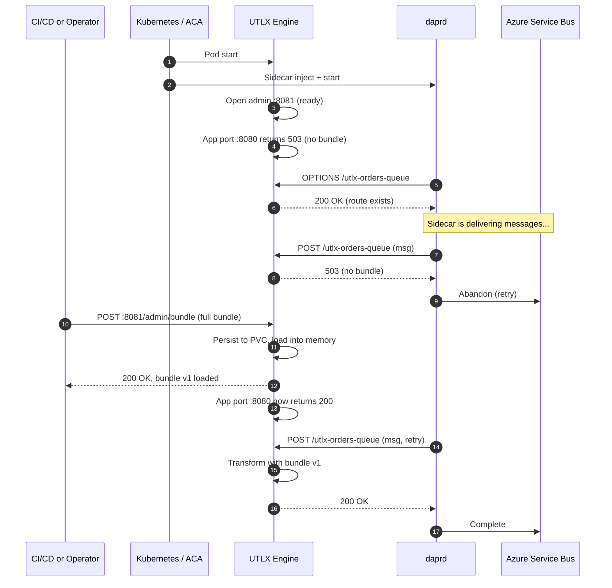
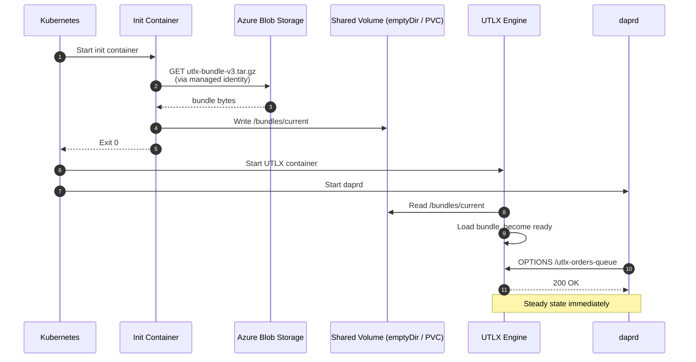
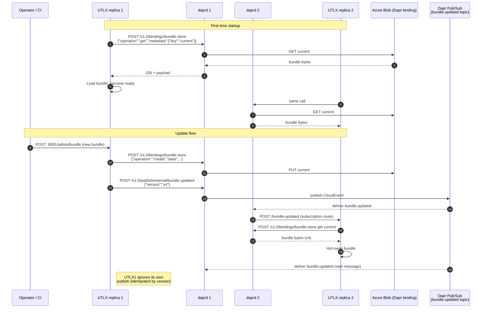
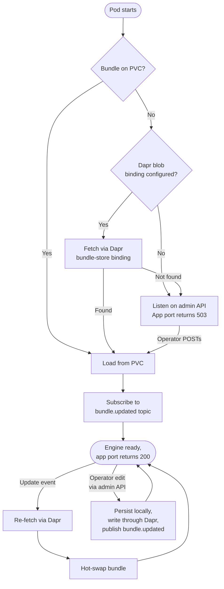

# UTLX Bundle Bootstrap and Lifecycle

**Document purpose:** Define how a UTLX engine instance receives its initial
configuration bundle on first start, and how subsequent bundle additions,
deletions, and full replacements propagate across replicas. This document is
deliberately separate from `dapr-abstract.md` because **Dapr configuration and
UTLX bundle configuration are two different concerns**, and conflating them
causes lasting design pain.

**Companion document:** `dapr-abstract.md`
**Target Dapr version:** 1.17 (April 2026 release line)

---

## 1. The two-configuration problem

When a UTLX engine starts up wrapped in a Dapr sidecar, there are two
distinct things that need to be "configured" — and they live on different
rails, change at different rates, and are owned by different roles.

| Concern | Owner | Examples | Lifecycle |
|---|---|---|---|
| **Dapr component config** | Platform / DevOps | Service Bus connection, queue name, mTLS settings, retry policies | Set once per environment, rarely changes, mutates only on sidecar restart |
| **UTLX bundle** | Application / Integration team | Transformation rules, schemas, mappings, lookup tables — the actual product payload | Changes constantly, edited part-by-part, versioned, rolled forward and back |

These must not share a transport. Dapr components are not designed to carry
arbitrary application payloads, and the Dapr configuration building block is
explicitly read-only key/value data — not blobs and not bundles.

The rest of this document assumes:

- The UTLX engine exposes **two HTTP surfaces**:
  - The Dapr-facing application port (e.g. `:8080`) that handles binding callbacks and transformations.
  - A separate **admin API** (e.g. `:8081`) that handles bundle add/delete/list/upload/download. This port is **not** annotated as the `dapr.io/app-port` and is not exposed to the sidecar.
- Bundles are stored on a **persistent volume** the engine owns (PVC on AKS, mounted volume on ACA, local disk self-hosted).

---

## 2. Does Azure provide a Dapr configurator?

Yes — for the **Dapr side** of the configuration. There are three layers, all
official Microsoft offerings.

### 2.1 Azure Container Apps — Dapr Components blade (closest to a GUI)

Inside an ACA environment under **Settings → Dapr components**, the portal
provides a wizard:

1. **+ Add → Azure component**
2. Pick the API (pub/sub, state, bindings, secrets).
3. Pick the Azure backing service (Service Bus, Event Hubs, Cosmos DB, Key Vault, …).
4. Service Connector wires up a managed identity and grants the necessary roles.
5. The portal generates the component YAML/Bicep, applies it to the environment, and lets you copy the artifact for source control.

**Constraint:** ACA runs a Microsoft-customized Dapr build (versioned
`1.x.y-msft.<n>`) that is restricted to Tier 1 / Tier 2 components. The Dapr
`Configuration` CRD is intentionally not exposed through this UI — anything
that needs a custom `Configuration` resource forces you to AKS.

CLI equivalent:

```bash
az containerapp env dapr-component set \
  --name <env-name> \
  --resource-group <rg> \
  --dapr-component-name utlx-orders-queue \
  --yaml ./utlx-orders-queue.yaml
```

### 2.2 AKS — Dapr cluster extension

Dapr installs as an Azure Kubernetes extension
(`Microsoft.KubernetesConfiguration/extensions`):

```bash
az k8s-extension create \
  --cluster-type managedClusters \
  --cluster-name <aks-name> \
  --resource-group <rg> \
  --name dapr \
  --extension-type Microsoft.Dapr \
  --auto-upgrade-minor-version true
```

After install, components are vanilla Kubernetes CRDs you `kubectl apply`. No
portal wizard at the component level — the workflow is GitOps / IaC.

### 2.3 Bicep / ARM / Terraform

Production path for both ACA and AKS. ACA expresses components as a child
resource of the environment:

```bicep
resource daprComponent 'Microsoft.App/managedEnvironments/daprComponents@2024-03-01' = {
  parent: env
  name: 'utlx-orders-queue'
  properties: {
    componentType: 'bindings.azure.servicebusqueues'
    version: 'v1'
    secretStoreComponent: 'utlx-keyvault'
    metadata: [
      { name: 'queueName', value: 'utlx-orders-in' }
      { name: 'connectionString', secretRef: 'sb-conn' }
    ]
    scopes: [ 'utlx' ]
  }
}
```

### 2.4 What none of these solve

**None of the above transports a UTLX bundle.** They configure the sidecar's
view of brokers, secrets, and policies. The bundle is a separate problem
addressed by sections 3–6 below.

---

## 3. Three patterns for bundle bootstrap

Three patterns are viable. They differ in where the source-of-truth lives,
how updates propagate, and what fails first when something goes wrong.

### 3.1 Pattern A — Empty-start with admin API (recommended baseline)

The engine starts with no bundle. The admin API accepts the initial upload.
Until a bundle is loaded, the Dapr-facing port returns 503 to binding
callbacks; Dapr abandons messages, the broker retries, and as soon as the
bundle lands the queue drains naturally.



**Strengths:** No race condition. Operator-friendly. Survives hyperscaler
boundaries unchanged. Same code path for first-time bootstrap, day-2 edits,
and disaster recovery.

**Weaknesses:** Replicas don't auto-discover bundles — each replica needs
to be seeded, or you need an external mechanism to push to all of them. See
Pattern C for that mechanism.

**When to pick this:** Always. This is the canonical bootstrap path. Other
patterns are layered on top of it.

### 3.2 Pattern B — Init container pre-seeds the bundle

A Kubernetes init container fetches the bundle from a known location (Azure
Blob, OCI artifact, Git, Azure Files) and writes it to a shared volume
before the UTLX container starts. UTLX boots already-configured.



**Strengths:** Pod is fully self-contained at startup. No external admin
call required. Fits immutable-infrastructure / GitOps philosophies cleanly.

**Weaknesses:** Bundle updates require a pod restart (or you have to fall
back to Pattern A's admin API anyway). On ACA, init containers exist but
have constraints — validate against the current ACA spec before committing.

**When to pick this:** Production deployments where bundles change at the
same cadence as the engine binary (i.e., quarterly releases, not daily
edits), and where you want strong reproducibility from manifest alone.

### 3.3 Pattern C — Bundle pulled via Dapr at startup, push-updated via pub/sub

UTLX uses Dapr itself to fetch the bundle. The bundle lives in a Dapr-backed
store (Azure Blob via output binding, state store, or secret store for
small bundles). On startup, UTLX calls `localhost:3500` to retrieve it. A
`bundle.updated` topic notifies all replicas to re-fetch when the canonical
bundle changes.



**Strengths:** Truly portable across hyperscalers — swap the Azure Blob
component for `bindings.aws.s3` or `bindings.gcp.bucket` and nothing in the
engine changes. Push-based updates propagate to all replicas in seconds.
The Dapr pub/sub topic gives you an audit trail of every bundle change.

**Weaknesses:** The engine's bootstrap now depends on the sidecar being up
*and* the blob store being reachable *and* a bundle existing in the store.
First-ever deploy still needs someone to seed the blob (so you implicitly
need Pattern A for the very first write anyway). Readiness probe logic
becomes more involved.

**When to pick this:** Multi-replica, multi-region, multi-cloud
deployments where bundles change frequently and consistency across
replicas matters.

---

## 4. Recommended composite design for UTLX

Use **Pattern A as the canonical bootstrap path**, layer **Pattern C on top
for steady-state propagation**, and treat **Pattern B as an optimization**
for environments that want zero external dependencies at startup.



This decision tree means:

- **First pod ever, brand-new environment:** falls through to admin API, operator seeds it. The first bundle write also pushes to the blob store, so all subsequent pods skip this branch.
- **Replica scale-out:** picks up the bundle from the blob store via Dapr without operator involvement.
- **Replica restart in place:** loads from PVC, no network needed.
- **Bundle edit at steady state:** admin API → local persist → write-through → fan-out to other replicas via pub/sub.

---

## 5. Admin API surface — what UTLX exposes

The admin API is independent of Dapr. It is the user's promised contract
for managing bundles part-by-part. Suggested surface:

| Method | Path | Purpose |
|---|---|---|
| `GET` | `/admin/bundle` | Download the current bundle (full) |
| `POST` | `/admin/bundle` | Replace the entire bundle |
| `GET` | `/admin/bundle/version` | Return the active bundle version + checksum |
| `GET` | `/admin/bundle/parts` | List bundle parts (rules, schemas, mappings, lookup tables) |
| `GET` | `/admin/bundle/parts/{id}` | Download a single part |
| `PUT` | `/admin/bundle/parts/{id}` | Add or replace a single part |
| `DELETE` | `/admin/bundle/parts/{id}` | Remove a single part |
| `POST` | `/admin/bundle/validate` | Dry-run validate without persisting |
| `GET` | `/admin/healthz` | Admin-side health (independent of app port) |

**Critical separation:**

- This API listens on a **different port** from the Dapr-facing app port. Dapr never sees it, and the sidecar's component scopes never grant access to it.
- It is protected by its own auth (mTLS client cert, OIDC, or an API key from Key Vault). Dapr's API token is irrelevant here.
- It writes through to the local PVC **first**, then optionally to the shared blob via the Dapr bundle-store binding. The local write is the durability boundary; the blob write is the propagation boundary.

---

## 6. Validation checklist

When the bundle bootstrap path is wired up, walk this list:

1. **Empty-start sanity:** delete the PVC contents, restart the pod, confirm the app port returns 503 and the admin port returns 200.
2. **Admin upload happy path:** `POST /admin/bundle` with a known-good bundle, confirm the app port flips to 200 within seconds and a queued Service Bus message is processed.
3. **Part-level edit:** `PUT /admin/bundle/parts/{id}` updates a single rule, confirm only that rule is hot-swapped (no full reload of the engine).
4. **Bundle download:** `GET /admin/bundle` returns a binary identical to the last upload (checksum match).
5. **Replica fan-out (Pattern C):** with two replicas running, edit on replica A, confirm replica B picks up the new bundle within the pub/sub propagation window without an admin call to B.
6. **Disaster recovery:** delete the PVC and the pod, recreate the pod, confirm it auto-fetches the latest bundle from the blob store via the Dapr binding without operator intervention.
7. **Auth boundary:** confirm the Dapr sidecar cannot reach the admin port (network policy or distinct port not annotated as `app-port`), and confirm the admin port enforces its own auth even from inside the cluster.
8. **Version pinning:** include the bundle version in the engine's `/healthz` and `/metrics` so observability tooling can alert on replicas drifting.

---

## 7. Anti-patterns — what not to do

- **Do not** ship the bundle as a Dapr `Configuration` resource. The configuration API is for read-only KV pairs (feature flags, sampling rates), not blobs. Bundles will exceed any sane KV size limit and the API doesn't support partial updates the way your admin API does.
- **Do not** ship the bundle as a Dapr component metadata field. Components reload only on sidecar restart, secrets aren't designed for hundreds of KB of payload, and you lose the part-by-part API entirely.
- **Do not** mount the bundle as a Kubernetes ConfigMap if it can grow beyond ~1 MB (ConfigMap hard limit) or contain binary artifacts. Use a PVC + admin API, or a blob store + Dapr binding.
- **Do not** entangle the Dapr-facing app port with the admin API. The moment they share a port, network policy, scoping rules, and auth become tangled and an attacker who finds a binding misconfiguration can also edit the bundle.
- **Do not** treat the bundle as part of the container image. That re-introduces the every-edit-needs-a-rebuild problem the bundle API exists to avoid.

---

## 8. References

**Azure Dapr configuration tooling:**
- Dapr Components in Azure Container Apps — https://learn.microsoft.com/en-us/azure/container-apps/dapr-components
- Connect to Azure services via Dapr Components in the portal — https://learn.microsoft.com/en-us/azure/container-apps/dapr-component-connection
- Configure Dapr on an existing Container App — https://learn.microsoft.com/en-us/azure/container-apps/enable-dapr
- Dapr Extension for AKS — https://learn.microsoft.com/en-us/azure/aks/dapr-settings
- Microservice APIs powered by Dapr (overview) — https://learn.microsoft.com/en-us/azure/container-apps/dapr-overview

**Dapr building blocks referenced by Pattern C:**
- Configuration API overview — https://docs.dapr.io/developing-applications/building-blocks/configuration/configuration-api-overview/
- Azure App Configuration component — https://docs.dapr.io/reference/components-reference/supported-configuration-stores/azure-appconfig-configuration-store/
- How-to: Manage configuration from a store — https://docs.dapr.io/developing-applications/building-blocks/configuration/howto-manage-configuration/
- Application and control plane configuration — https://docs.dapr.io/concepts/configuration-concept/

**Companion document:**
- `dapr-abstract.md` — sidecar architecture, bindings, pub/sub, mTLS, multi-cloud component portability.

---

*Document maintainer: UTLX platform team. Revisit when the engine's
bundle-management API surface changes or when ACA gains init-container
support equivalent to AKS.*
