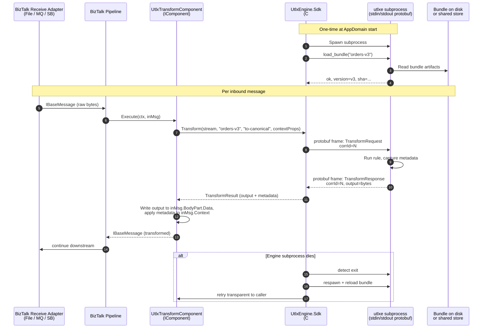
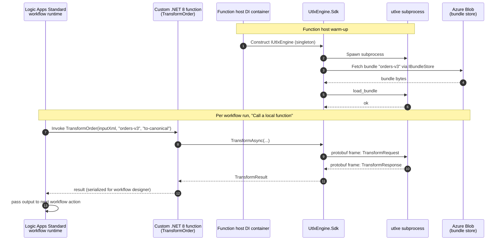

# UTLXe as a BizTalk Replacement — .NET Embedding Strategy

**Document purpose:** Reason through whether UTLXe can act as a drop-in
replacement for BizTalk's transformation role in .NET-centric environments,
given that the SDK wrapper architecture (stdin/stdout protobuf for C# / Go /
Python, plus the HTTP API for any-language REST clients) **already exists**.
Identify what changes would be additive, what is already covered, and what
the BizTalk question reveals about the current UTLXe interface design.

**Companion documents:**
- `dapr-abstract.md` — sidecar pattern, bindings, multi-cloud portability
- `utlx-bundle-bootstrap.md` — bundle distribution and lifecycle

**Existing UTLXe surface (recap, so we don't reinvent it):**

| Channel | Protocol | Target consumers |
|---|---|---|
| **SDK wrappers** | stdin/stdout, protobuf-framed | C# / Go / Python apps embedding UTLXe in-process |
| **HTTP API** | REST | Any-language client, including Dapr sidecar |
| **CLI (`utlx`)** | argv + stdin/stdout | Shell scripts, CI/CD |
| **`utlxe` engine** | The JVM process the SDKs spawn or the HTTP server fronts | All of the above |

The .NET path is therefore already wired: a C# app references the SDK,
which spawns `utlxe` as a child process and speaks framed protobuf over its
stdin/stdout. **The strategic question is not "how do we add a .NET
interface" — it's "what does the BizTalk replacement use case demand on top
of what we already have?"**

---

## 1. Key dates that frame the urgency

- **September 30, 2026** — Azure Service Bus SBMP protocol retires. BizTalk 2020 deployments using the default Service Bus adapter break unless migrated to AMQP or off BizTalk entirely. Hard 18-month deadline.
- **January 11, 2027** — BizTalk 2016 extended support ends.
- **April 11, 2028** — BizTalk 2020 mainstream support ends.
- **April 9, 2030** — BizTalk 2020 extended support ends. Hard wall.

The market is actively shopping for replacements right now. The single
biggest accelerant is the SBMP deadline — that one forces near-term action
from anyone running BizTalk-to-Azure integrations, not just an eventual
modernization plan.

---

## 2. What the BizTalk replacement actually needs

BizTalk is not a transformation engine. It's a messaging engine with
transformation as one of several stages. The piece UTLXe replaces is
specifically the **pipeline component** and **map** — bytes-in, bytes-out,
with side metadata.

A BizTalk custom pipeline component implements
`Microsoft.BizTalk.Component.Interop.IComponent`:

```csharp
public interface IComponent
{
    IBaseMessage Execute(IPipelineContext pContext, IBaseMessage pInMsg);
}
```

`IBaseMessage` exposes a body (`Stream`) and a context (key/value metadata
with namespace-qualified property names). The mapping to UTLXe is almost
mechanical:

| BizTalk concept | UTLXe equivalent |
|---|---|
| `IBaseMessage.BodyPart.Data` (Stream) | UTLX input payload |
| `IBaseMessage.Context` properties | UTLX transformation parameters |
| Custom `IComponent.Execute` body | One UTLXe SDK `Transform()` call |
| Pipeline configuration via `IPersistPropertyBag` | Bundle ID + rule name as design-time properties |
| XSLT map / .NET map | A `.utlx` script in a bundle |

**Replacement scope is narrow and well-defined:** swap the transformation
component, leave adapters, MessageBox, and orchestrations alone until the
customer is ready to migrate the host. That's the wedge.

The modern landing target is **Logic Apps Standard custom code** (.NET
Framework 4.7.2 GA, .NET 8 GA), which Microsoft built explicitly to ease
BizTalk migration. A custom function is a class with `[FunctionName]` and a
`Run` method decorated with `[WorkflowActionTrigger]`, deployed to
`LogicApp/lib/custom/net8/`. With dependency injection in .NET 8, the
function shape we want is:

```csharp
public class TransformOrder
{
    private readonly ILogger<TransformOrder> logger;
    private readonly IUtlxEngine engine;     // ← injected via the existing SDK

    public TransformOrder(ILoggerFactory lf, IUtlxEngine engine)
    {
        this.logger = lf.CreateLogger<TransformOrder>();
        this.engine = engine;
    }

    [FunctionName("TransformOrder")]
    public async Task<TransformResult> Run(
        [WorkflowActionTrigger] string inputXml,
        string bundleName,
        string ruleName)
    {
        return await engine.TransformAsync(inputXml, bundleName, ruleName);
    }
}
```

The C# UTLXe SDK already exists and already speaks stdin/stdout protobuf to
`utlxe`. **The work is not building it. The work is making it fit two new
hosts: BizTalk pipelines and Logic Apps Standard.**

---

## 3. Three integration shapes — and where we already are

| Shape | Status | What's needed |
|---|---|---|
| **In-process .NET via SDK** | ✅ Exists (C# SDK over stdin/stdout protobuf) | Polish for BizTalk + Logic Apps Standard hosts |
| **Out-of-process via Dapr** | ✅ Exists (HTTP API behind sidecar) | Documented in `dapr-abstract.md` |
| **Out-of-process via plain HTTP/gRPC (no Dapr)** | ✅ Exists (HTTP API) | Possibly add native gRPC alongside REST |

The .NET embedding question doesn't open a new architecture — it surfaces
**packaging and host-adapter** gaps in an architecture that already exists.

---

## 4. What the SDK already gives us (and what it doesn't)

### ✅ Already covered by the existing SDK

- Cross-platform stdin/stdout protobuf transport (works on Windows, Linux, macOS — verified pattern from earlier design work).
- Length-prefixed binary frames, idiomatic for .NET, Go, and Python.
- An `IUtlxEngine`-style entry point in C# (or whatever the SDK currently calls it).
- Subprocess lifecycle owned by the SDK so the customer never sees `utlxe.exe`.
- Single source of truth: `utlxe` is the same JVM binary whether driven by the SDK, the HTTP server, or the CLI.

### ❌ Gaps the BizTalk story exposes

These are the deliverables the BizTalk replacement positioning actually
requires. Each is additive — none of them invalidates the existing SDK; they
build on it.

**1. A BizTalk shim assembly (`UtlxEngine.BizTalk`).**
A ready-made `IComponent` implementation that any BizTalk customer drops
into a pipeline stage with three lines of config. This is the single most
important migration unlock. Sketch:

```csharp
[ComponentCategory(CategoryTypes.CATID_PipelineComponent)]
[ComponentCategory(CategoryTypes.CATID_Any)]
[Guid("...")]
public class UtlxTransformComponent
    : IBaseComponent, IComponent, IComponentUI, IPersistPropertyBag
{
    public string BundleId { get; set; }
    public string RuleName { get; set; }

    public IBaseMessage Execute(IPipelineContext ctx, IBaseMessage inMsg)
    {
        var engine = UtlxEngineHost.Shared;     // process-wide singleton
        using var input = inMsg.BodyPart.GetOriginalDataStream();
        var result = engine.Transform(
            input, BundleId, RuleName, ContextToParams(inMsg.Context));
        inMsg.BodyPart.Data = new MemoryStream(result.Output.ToArray());
        ApplyResultToContext(inMsg.Context, result);
        return inMsg;
    }
    // ... boilerplate IBaseComponent / IComponentUI / IPersistPropertyBag
}
```

A BizTalk customer installs the assembly into the GAC, drops the component
into a pipeline stage, sets `BundleId` and `RuleName` as design-time
properties, and they have replaced an XSLT map or a custom .NET map with a
UTLXe transformation — without touching their adapters, MessageBox, or
orchestrations.

**2. A Logic Apps Standard helper package (`UtlxEngine.LogicApps`).**
DI registration, a `[WorkflowActionTrigger]`-friendly result type that
serializes cleanly into the workflow designer, and a small set of sample
functions (`Transform`, `Validate`, `LookupAndTransform`). This is the
forward-looking deliverable — once a customer has lifted off BizTalk to
Logic Apps Standard, they keep using UTLXe with no learning curve.

**3. .NET 4.7.2 *and* .NET 8 target frameworks.**
BizTalk Server runs on .NET Framework. Logic Apps Standard custom code
supports both 4.7.2 (for BizTalk lift-and-shift) and .NET 8 (for net-new).
The SDK and shim assemblies must ship for both, or the migration story
splits into two and the BizTalk customer can't carry their UTLXe knowledge
forward.

**4. NuGet-bundled `utlxe` binary per RID.**
The SDK customer should not have to install Java, set `JAVA_HOME`, or
discover a `utlxe.jar` path. The NuGet package needs `runtimes/win-x64/`,
`runtimes/linux-x64/`, `runtimes/osx-arm64/` containing the engine binary
ready to run. If `utlxe` is JVM-based today, that means either bundling a
JRE, shipping a native-image-compiled binary (GraalVM), or documenting a
prerequisite — but the customer experience should be `dotnet add package
UtlxEngine.Sdk` and it works.

**5. A subprocess pool, not a per-call spawn.**
If the SDK currently spawns `utlxe` per call, that needs to become "spawn
once, multiplex via correlation IDs, restart on death." For a BizTalk
pipeline processing thousands of messages an hour, per-call subprocess
spawn is the difference between viable and unusable. (This may already be
how the SDK works — flagging it because it's the single most important
non-obvious correctness requirement for the BizTalk use case.)

**6. OpenTelemetry integration.**
Logic Apps Standard, BizTalk's own ETW, and Azure Monitor all benefit if
each `TransformAsync` call is a span with bundle/rule/elapsed attributes.
Trace context flows in via the SDK call site; the engine should propagate
it into rule execution if it doesn't already.

**7. The bundle admin path inside .NET hosts.**
In a BizTalk or Logic Apps Standard host, who manages bundles? The
patterns from `utlx-bundle-bootstrap.md` need a .NET-side answer:
- Bundles bundled into the deployment package (BizTalk MSI / Logic Apps zip)?
- Bundles fetched from Azure Blob at first call?
- Bundles managed by a separate UTLXe sidecar that the .NET host calls into via HTTP?

The right answer is probably "all three, the customer picks." But the SDK
needs an `IBundleStore` abstraction with concrete implementations for each.

---

## 5. Does this influence the current UTLXe interface design?

This is the actual interesting question, and the answer is: **probably yes,
in two specific ways that are worth doing now rather than later.**

### 5.1 Wire-protocol parity is non-negotiable

The stdin/stdout protobuf protocol the SDK speaks and the HTTP/JSON API the
Dapr sidecar speaks must have **identical request/response shapes** —
same field names, same error codes, same metadata semantics. If they
diverge, every customer who starts on one and migrates to the other pays.

Concretely:

- The protobuf messages in `proto/` are the source of truth.
- The HTTP/JSON API is generated from the same proto definitions (gRPC-gateway, or hand-written from the same schema).
- Errors carry the same codes (`RULE_NOT_FOUND`, `BUNDLE_NOT_LOADED`, `INPUT_INVALID`) regardless of transport.
- Metadata (bundle version, rule name, elapsed time) flows in the same fields whether it arrived over stdin or HTTP.

If this isn't already true, the BizTalk replacement timeline is the right
forcing function to make it true. A customer running UTLXe in a BizTalk
pipeline today and migrating to Logic Apps Standard tomorrow should see the
same response shape from the same SDK call.

### 5.2 A native gRPC option alongside REST is worth adding

The SDK uses stdin/stdout protobuf in-process. The HTTP API uses REST. The
"middle distance" — out-of-process but on-network, low-latency — is
underserved.

Two scenarios where a **native gRPC server in `utlxe`** would matter:

- **Dapr service invocation calls.** Dapr does sidecar-to-sidecar over gRPC by default. If the wrapped app speaks gRPC, the whole hop is gRPC end-to-end with no JSON serialization in the middle. UTLXe wrapped behind a Dapr sidecar already gets this for free *if* `utlxe` exposes gRPC; today it forces a JSON conversion at the sidecar boundary.
- **Non-Dapr .NET hosts that want network isolation.** A Logic Apps Standard custom function that calls an out-of-process UTLXe (e.g., a sidecar pattern outside Dapr, or a shared UTLXe service for the whole tenant) wants gRPC, not REST, because of latency and streaming.

This is not "build something new" — the proto definitions already exist for
the SDK. Reusing them as a gRPC service definition costs less than building
a new API. It costs roughly:

- One `service` block in the existing `.proto` file.
- A gRPC server adapter in `utlxe` alongside the existing HTTP server.
- Optional: gRPC client modes in the SDKs as an alternative to spawning a subprocess (useful when `utlxe` runs as a long-lived shared service).

### 5.3 What does *not* need to change

- The CLI (`utlx`) — already serves its purpose for shell/CI use.
- The IDE daemon (`utlxd`) — orthogonal to the embedding question.
- The bundle format — same artifact, all hosts.
- The `.utlx` language — same scripts, all hosts.
- The HTTP REST API — keep it, it's the lingua franca for the Dapr path and any-language REST clients.

---

## 6. Sequence diagram — UTLXe inside a BizTalk pipeline



Key properties of this flow:

- The shim is the **only BizTalk-specific code**. Everything below the shim is the existing SDK.
- One subprocess per BizTalk host instance, multiplexed across all pipeline executions in that host.
- Bundle loading happens once at startup. Subsequent transforms are pure stdio round-trips.
- Subprocess death is handled by the SDK; the shim and BizTalk above it never see it.

---

## 7. Sequence diagram — UTLXe inside Logic Apps Standard custom code



Notes:

- The subprocess outlives any individual function invocation — Logic Apps Standard reuses the function host process across runs, so warmup cost is amortized.
- `IBundleStore` is the abstraction covering "bundled with the deployment", "Azure Blob", "Dapr binding", "shared sidecar". The customer picks one at DI registration.
- For .NET 8 custom code with native AOT, the SDK must be trim-safe. This is a real constraint, not a theoretical one.

---

## 8. The migration story for sales / customers

The reason this all matters is that it gives a clean three-step migration
narrative for any BizTalk customer:

1. **Today:** Drop `UtlxTransformComponent` into existing BizTalk pipelines. Replace XSLT maps and custom .NET maps with UTLXe bundles. No change to adapters, MessageBox, orchestrations. Customer keeps running BizTalk, but their transformation logic is now portable.

2. **Migration window (2026–2030):** Migrate adapters and orchestrations to Logic Apps Standard at whatever pace fits the business. The transformation logic — the part that took years to get right — moves unchanged because the same UTLXe bundles that ran in `UtlxTransformComponent` now run in `TransformOrder` Logic Apps Standard custom functions.

3. **Steady state:** Logic Apps Standard for orchestration, UTLXe for transformation, optionally Dapr for cross-cloud portability. The customer's transformation IP is decoupled from their host platform forever.

This is a much better story than "rip and replace your maps in Logic Apps."
The transformation logic stays as the customer's stable asset, and the host
moves underneath it.

---

## 9. Recommendation summary

**Do now (additive, no breaking changes):**

1. Ship `UtlxEngine.BizTalk` — the `IComponent` shim assembly. Both .NET Framework 4.7.2 and .NET 8 targets.
2. Ship `UtlxEngine.LogicApps` — DI helpers, sample functions, workflow-designer-friendly result types.
3. Bundle the `utlxe` runtime in the NuGet package per RID so customers don't need a separate JRE install.
4. Confirm the SDK uses a subprocess pool, not per-call spawn. If not, fix this before any BizTalk go-live.
5. Add OpenTelemetry instrumentation in the SDK for `TransformAsync` and bundle operations.
6. Add an `IBundleStore` abstraction to the SDK with implementations for embedded, Azure Blob, Dapr binding, and shared HTTP sidecar.

**Consider next (small interface evolution):**

7. Verify wire-protocol parity between stdin/stdout protobuf and HTTP/JSON. Make the proto definitions the single source of truth.
8. Add a native gRPC server to `utlxe` alongside the HTTP REST server. Reuse the existing proto definitions. Add a gRPC client mode to the SDKs as an alternative to subprocess spawn.

**Do not:**

- Do not build a "new" .NET interface. The SDK already is one.
- Do not couple the BizTalk shim to Dapr — BizTalk customers running on-prem do not have a sidecar. The shim must work standalone.
- Do not let the .NET 4.7.2 path fall behind .NET 8 in functionality. BizTalk customers stuck on Framework will resent it, and they're the audience the migration story serves.

---

## 10. References

**BizTalk lifecycle and migration:**
- Microsoft BizTalk Server Product Lifecycle Update — https://techcommunity.microsoft.com/blog/integrationsonazureblog/microsoft-biztalk-server-product-lifecycle-update/4478559
- Why Move from BizTalk Server to Azure Logic Apps? — https://learn.microsoft.com/en-us/azure/logic-apps/biztalk-server-migration-overview
- Azure Service Bus SBMP retirement (Sept 2026) — https://techcommunity.microsoft.com/blog/messagingonazureblog/some-azure-service-bus-sdk-libraries-will-be-retired-on-30-september-2026

**BizTalk pipeline component interface:**
- Developing Custom Pipeline Components — https://learn.microsoft.com/en-us/biztalk/core/developing-custom-pipeline-components
- Using Pipeline Interfaces — https://learn.microsoft.com/en-us/biztalk/core/using-pipeline-interfaces

**Logic Apps Standard custom code:**
- Create and Run .NET Code in Standard Workflows — https://learn.microsoft.com/en-us/azure/logic-apps/create-run-custom-code-functions
- .NET 8 Custom Code GA announcement — https://techcommunity.microsoft.com/blog/integrationsonazureblog/announcing-general-availability-azure-logic-apps-standard-custom-code-with-net-8/4421882
- .NET Framework Custom Code GA — https://techcommunity.microsoft.com/blog/integrationsonazureblog/-net-framework-custom-code-for-azure-logic-apps-standard-reaches-general-availab/3954619

**Companion documents:**
- `dapr-abstract.md`
- `utlx-bundle-bootstrap.md`

---

*Document maintainer: UTLX platform team. Revisit when the BizTalk shim
ships, when Logic Apps Standard adds new custom-code features, or when
either deadline (Sept 2026 SBMP, April 2030 BizTalk EOL) approaches.*
