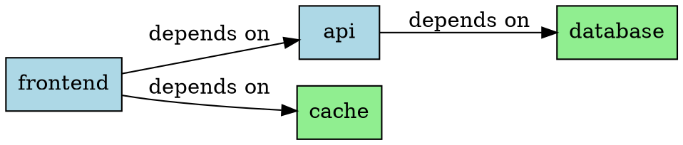
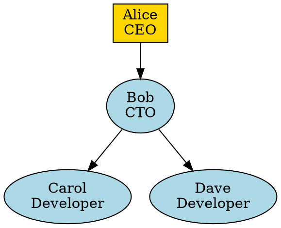
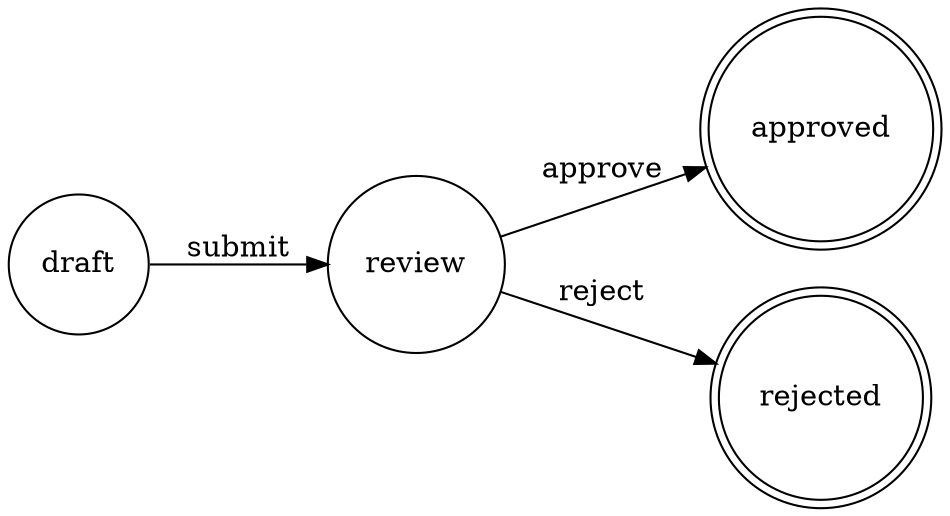

# DOT Format Support - Tier 3 Design Sketch

## Overview

DOT support in UTL-X as a **specialized tier 3 module** for graph visualization output.

**Key Decision:** Output-only (no input parsing) to keep scope focused on the primary use case: generating visualizations from transformed data.

---

## Architecture

### Module Structure

```
formats/
├── dot/
│   ├── src/main/kotlin/org/apache/utlx/formats/dot/
│   │   ├── DotSerializer.kt          # Main serializer
│   │   ├── DotGraphBuilder.kt        # Graph construction DSL
│   │   ├── DotStyleMapper.kt         # Attribute mapping
│   │   └── DotFormatException.kt     # Error handling
│   ├── src/test/kotlin/
│   │   └── DotSerializerTest.kt
│   └── build.gradle.kts
```

### UDM to DOT Mapping

**Challenge:** UDM is tree/table-oriented, DOT is graph-oriented.

**Solution:** Define a conventional UDM structure that maps cleanly to DOT:

```kotlin
// Expected UDM structure for DOT output
{
  graph: {
    type: "digraph" | "graph",        // directed vs undirected
    name: "MyGraph",                   // optional
    attributes: {                      // graph-level attributes
      rankdir: "LR",
      bgcolor: "white"
    }
  },
  nodes: [
    {
      id: "node1",
      label: "Start",
      shape: "box",
      color: "blue"
    },
    {
      id: "node2",
      label: "Process"
    }
  ],
  edges: [
    {
      from: "node1",
      to: "node2",
      label: "depends on",
      style: "dashed"
    }
  ]
}
```

---

## Implementation

### 1. DotSerializer.kt

```kotlin
package org.apache.utlx.formats.dot

import org.apache.utlx.core.udm.*

class DotSerializer {
    
    fun serialize(udm: UDMValue): String {
        require(udm is UDMObject) { 
            "DOT output requires UDM object with 'graph', 'nodes', 'edges' structure" 
        }
        
        val graph = udm.getObject("graph") ?: throw DotFormatException("Missing 'graph' section")
        val nodes = udm.getArray("nodes") ?: emptyList()
        val edges = udm.getArray("edges") ?: emptyList()
        
        return buildDotGraph(graph, nodes, edges)
    }
    
    private fun buildDotGraph(
        graph: UDMObject, 
        nodes: List<UDMValue>, 
        edges: List<UDMValue>
    ): String {
        val graphType = graph.getString("type") ?: "digraph"
        val graphName = graph.getString("name") ?: "G"
        val edgeOp = if (graphType == "digraph") "->" else "--"
        
        return buildString {
            appendLine("$graphType $graphName {")
            
            // Graph attributes
            graph.getObject("attributes")?.let { attrs ->
                appendGraphAttributes(attrs)
            }
            
            // Nodes
            nodes.forEach { node ->
                if (node is UDMObject) {
                    appendNode(node)
                }
            }
            
            // Edges
            edges.forEach { edge ->
                if (edge is UDMObject) {
                    appendEdge(edge, edgeOp)
                }
            }
            
            appendLine("}")
        }
    }
    
    private fun StringBuilder.appendGraphAttributes(attrs: UDMObject) {
        attrs.fields.forEach { (key, value) ->
            val strValue = value.toStringValue()
            appendLine("  $key=\"$strValue\";")
        }
    }
    
    private fun StringBuilder.appendNode(node: UDMObject) {
        val id = node.getString("id") ?: throw DotFormatException("Node missing 'id'")
        val attributes = buildNodeAttributes(node)
        
        if (attributes.isEmpty()) {
            appendLine("  $id;")
        } else {
            appendLine("  $id [$attributes];")
        }
    }
    
    private fun buildNodeAttributes(node: UDMObject): String {
        return node.fields
            .filter { it.key != "id" }
            .joinToString(", ") { (key, value) ->
                val strValue = value.toStringValue()
                "$key=\"$strValue\""
            }
    }
    
    private fun StringBuilder.appendEdge(edge: UDMObject, edgeOp: String) {
        val from = edge.getString("from") ?: throw DotFormatException("Edge missing 'from'")
        val to = edge.getString("to") ?: throw DotFormatException("Edge missing 'to'")
        val attributes = buildEdgeAttributes(edge)
        
        if (attributes.isEmpty()) {
            appendLine("  $from $edgeOp $to;")
        } else {
            appendLine("  $from $edgeOp $to [$attributes];")
        }
    }
    
    private fun buildEdgeAttributes(edge: UDMObject): String {
        return edge.fields
            .filter { it.key !in setOf("from", "to") }
            .joinToString(", ") { (key, value) ->
                val strValue = value.toStringValue()
                "$key=\"$strValue\""
            }
    }
    
    private fun UDMValue.toStringValue(): String = when (this) {
        is UDMString -> value
        is UDMNumber -> value.toString()
        is UDMBoolean -> value.toString()
        else -> toString()
    }
}
```

---

## Example Transformations

### Example 1: Service Dependencies

**Input:** `services.json`
```json
{
  "services": [
    {"name": "frontend", "dependsOn": ["api", "cache"]},
    {"name": "api", "dependsOn": ["database"]},
    {"name": "cache", "dependsOn": []},
    {"name": "database", "dependsOn": []}
  ]
}
```

**Transformation:** `services-to-graph.utlx`
```utlx
%utlx 1.0
input json
output dot
---
{
  graph: {
    type: "digraph",
    name: "ServiceDependencies",
    attributes: {
      rankdir: "LR",
      bgcolor: "white"
    }
  },
  nodes: $input.services |> map(svc => {
    id: svc.name,
    label: svc.name,
    shape: "box",
    style: "filled",
    fillcolor: if (count(svc.dependsOn) == 0) "lightgreen" else "lightblue"
  }),
  edges: $input.services 
    |> flatMap(svc => 
        svc.dependsOn |> map(dep => {
          from: svc.name,
          to: dep,
          label: "depends on"
        })
      )
}
```

**Output:** `dependencies.dot`


---

### Example 2: Organizational Chart

**Input:** `org.xml`
```xml
<Organization>
  <Employee id="ceo" name="Alice" title="CEO"/>
  <Employee id="cto" name="Bob" title="CTO" reportsTo="ceo"/>
  <Employee id="dev1" name="Carol" title="Developer" reportsTo="cto"/>
  <Employee id="dev2" name="Dave" title="Developer" reportsTo="cto"/>
</Organization>
```

**Transformation:** `org-chart.utlx`
```utlx
%utlx 1.0
input xml
output dot
---
{
  graph: {
    type: "digraph",
    name: "OrgChart",
    attributes: {
      rankdir: "TB"
    }
  },
  nodes: $input.Organization.Employee |> map(emp => {
    id: emp.@id,
    label: emp.@name + "\n" + emp.@title,
    shape: if (emp.@title == "CEO") "box" else "ellipse",
    style: "filled",
    fillcolor: if (emp.@title == "CEO") "gold" else "lightblue"
  }),
  edges: $input.Organization.Employee 
    |> filter(emp => emp.@reportsTo != null)
    |> map(emp => {
        from: emp.@reportsTo,
        to: emp.@id
      })
}
```

**Output:** `org-chart.dot`


---

### Example 3: State Machine

**Input:** `workflow.yaml`
```yaml
states:
  - name: draft
    transitions:
      - to: review
        event: submit
  - name: review
    transitions:
      - to: approved
        event: approve
      - to: rejected
        event: reject
  - name: approved
  - name: rejected
```

**Transformation:** `state-machine.utlx`
```utlx
%utlx 1.0
input yaml
output dot
---
{
  graph: {
    type: "digraph",
    name: "WorkflowStateMachine",
    attributes: {
      rankdir: "LR"
    }
  },
  nodes: $input.states |> map(state => {
    id: state.name,
    label: state.name,
    shape: if (state.name in ["approved", "rejected"]) "doublecircle" else "circle"
  }),
  edges: $input.states 
    |> flatMap(state => 
        (state.transitions ?? []) |> map(trans => {
          from: state.name,
          to: trans.to,
          label: trans.event
        })
      )
}
```

**Output:** `workflow.dot`


---

## Integration Points

### 1. Format Registry

```kotlin
// In modules/core/src/main/kotlin/org/apache/utlx/core/formats/FormatRegistry.kt
object FormatRegistry {
    private val serializers = mutableMapOf<String, Serializer>()
    
    init {
        // Tier 1
        register("json", JsonSerializer())
        register("xml", XmlSerializer())
        register("csv", CsvSerializer())
        register("yaml", YamlSerializer())
        
        // Tier 3 - Specialized
        register("dot", DotSerializer())  // <-- Add here
    }
}
```

### 2. CLI Usage

```bash
# Transform JSON to DOT
utlx transform services-to-graph.utlx services.json -o dependencies.dot

# Render with Graphviz
dot -Tpng dependencies.dot -o dependencies.png

# Or pipeline
utlx transform services-to-graph.utlx services.json | dot -Tpng > graph.png
```

---

## Testing Strategy

### Unit Tests

```kotlin
class DotSerializerTest {
    private val serializer = DotSerializer()
    
    @Test
    fun `serializes simple digraph`() {
        val udm = UDMObject(mapOf(
            "graph" to UDMObject(mapOf(
                "type" to UDMString("digraph"),
                "name" to UDMString("Test")
            )),
            "nodes" to UDMArray(listOf(
                UDMObject(mapOf(
                    "id" to UDMString("A"),
                    "label" to UDMString("Node A")
                )),
                UDMObject(mapOf(
                    "id" to UDMString("B"),
                    "label" to UDMString("Node B")
                ))
            )),
            "edges" to UDMArray(listOf(
                UDMObject(mapOf(
                    "from" to UDMString("A"),
                    "to" to UDMString("B")
                ))
            ))
        ))
        
        val result = serializer.serialize(udm)
        
        assertTrue(result.contains("digraph Test {"))
        assertTrue(result.contains("A [label=\"Node A\"];"))
        assertTrue(result.contains("B [label=\"Node B\"];"))
        assertTrue(result.contains("A -> B;"))
    }
    
    @Test
    fun `throws exception when structure is invalid`() {
        val invalidUdm = UDMObject(mapOf(
            "invalid" to UDMString("structure")
        ))
        
        assertThrows<DotFormatException> {
            serializer.serialize(invalidUdm)
        }
    }
}
```

### Conformance Tests

Add to `conformance-suite/utlx/formats/dot/`:
```
dot/
├── basic-digraph.test
├── undirected-graph.test
├── node-styling.test
├── edge-attributes.test
├── subgraphs.test  # Future
└── error-handling.test
```

---

## Documentation

### User Documentation

Add to `docs/formats/tier3/dot.md`:
- When to use DOT output
- UDM structure conventions
- Common patterns (dependencies, org charts, state machines)
- Integration with Graphviz
- Limitations (output-only, no subgraph support initially)

### API Documentation

```kotlin
/**
 * DOT (Graphviz) Format Serializer (Tier 3 - Specialized)
 * 
 * Serializes UDM structures to DOT language for graph visualization.
 * 
 * **Input-only:** This serializer only supports output to DOT format.
 * 
 * ## Expected UDM Structure
 * 
 * ```
 * {
 *   graph: {
 *     type: "digraph" | "graph",
 *     name: String (optional),
 *     attributes: Object (optional)
 *   },
 *   nodes: Array<{
 *     id: String (required),
 *     ...attributes
 *   }>,
 *   edges: Array<{
 *     from: String (required),
 *     to: String (required),
 *     ...attributes
 *   }>
 * }
 * ```
 * 
 * ## Example
 * 
 * ```utlx
 * %utlx 1.0
 * input json
 * output dot
 * ---
 * {
 *   graph: { type: "digraph", name: "MyGraph" },
 *   nodes: [{ id: "A" }, { id: "B" }],
 *   edges: [{ from: "A", to: "B" }]
 * }
 * ```
 * 
 * @see <a href="https://graphviz.org/doc/info/lang.html">DOT Language Specification</a>
 */
class DotSerializer : Serializer { ... }
```

---

## Future Enhancements (Post v1.0)

### Phase 2: Advanced Features
- **Subgraphs/Clusters:** Support for hierarchical grouping
- **HTML-like labels:** Rich node labels with formatting
- **Record shapes:** Structured node layouts

### Phase 3: Input Support (If Demand Exists)
- **DOT parser:** Read existing DOT files into UDM
- **Bidirectional transformation:** DOT ↔ JSON/XML for graph data
- **Use case:** Editing existing graphs programmatically

### Phase 4: Graph Algorithms
- **Standard library extensions:** Graph traversal, cycle detection
- **Example:** `$input |> findCycles() |> highlightInGraph()`

---

## Why This Design Works

1. **Focused Scope:** Output-only, specialized format
2. **Clear Conventions:** Well-defined UDM structure for graphs
3. **Practical Use Cases:** Dependencies, org charts, state machines
4. **Clean Architecture:** No pollution of core UDM with graph concepts
5. **Easy Integration:** Pipes naturally to Graphviz tools
6. **Tier Appropriate:** Clearly a specialized visualization format, not general data

---

## Comparison: Tier 1 vs Tier 3 Approach

| Aspect | If Tier 1 | As Tier 3 |
|--------|-----------|-----------|
| **UDM Changes** | Major refactoring needed | None |
| **Use Case Fit** | Awkward for most transforms | Perfect for visualization |
| **Maintenance** | High complexity | Isolated module |
| **User Expectation** | Confusing (why is DOT next to JSON?) | Clear specialty |
| **Development Cost** | 3-4 weeks | 3-4 days |

---

## Implementation Plan

### Phase 1: MVP (3-4 days)
- [ ] Create `formats/dot` module
- [ ] Implement `DotSerializer.kt`
- [ ] Basic node/edge support
- [ ] Unit tests
- [ ] Documentation

### Phase 2: Polish (1-2 days)
- [ ] Conformance tests
- [ ] Error handling
- [ ] Style guide examples
- [ ] CLI integration

### Phase 3: Documentation (1 day)
- [ ] User guide with real examples
- [ ] Migration from other tools
- [ ] Best practices

**Total Effort:** ~1 week vs 3-4 weeks for tier 1

---

## Conclusion

DOT as tier 3 provides **maximum value with minimum complexity**:
- Solves real visualization needs
- Keeps UTL-X focused on data transformation
- Easy to implement and maintain
- Natural fit for specialized output format

This is the "right tool in the right place" approach.
