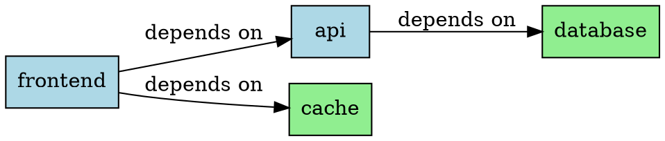
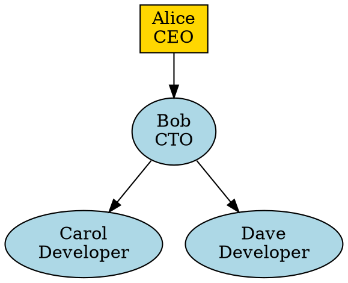
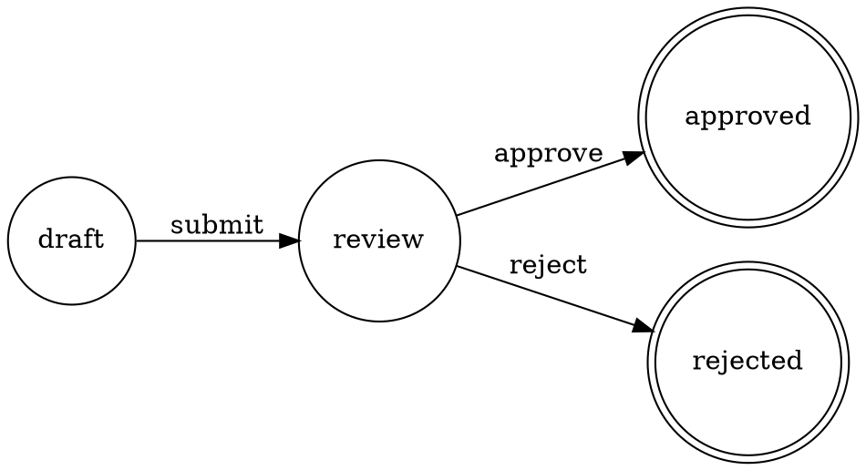

# DOT Format Support - Tier 3 Design Sketch

## Overview

DOT support in UTL-X as a **specialized tier 3 module** for graph visualization output.

**Key Decision:** Output-only (no input parsing) to keep scope focused on the primary use case: generating visualizations from transformed data.

---

## Architecture

### Module Structure

```
formats/
├── dot/
│   ├── src/main/kotlin/org/apache/utlx/formats/dot/
│   │   ├── DotSerializer.kt          # Main serializer
│   │   ├── DotGraphBuilder.kt        # Graph construction DSL
│   │   ├── DotStyleMapper.kt         # Attribute mapping
│   │   └── DotFormatException.kt     # Error handling
│   ├── src/test/kotlin/
│   │   └── DotSerializerTest.kt
│   └── build.gradle.kts
```

### UDM to DOT Mapping

**Challenge:** UDM is tree/table-oriented, DOT is graph-oriented.

**Solution:** Use format directives with `!` prefix to define DOT structure without namespace collision.

#### Why `!` (Bang) for Format Directives?

**UTL-X Symbol System:**
- `$` - Variables/input (`$input`, `$variable`)
- `@` - XML attributes (`@id`, `@name`)
- `^` - Metadata
- `%` - USDL schema language (already taken)
- `#` - Comments (standard convention)
- `!` - **Format directives** (NEW)

**Rationale:**
1. **No collision with user data** - `!graph` vs `graph` are distinct
2. **Semantic clarity** - "!" signals "this is a directive/instruction"
3. **YAML precedent** - Uses `!` for type tags
4. **Visual distinction** - Clear that this is not regular data
5. **Output-specific** - Only valid when `output dot` (or other specialized formats)

#### Format Directive Structure

```utlx
%utlx 1.0
input json
output dot
---
{
  !graph: {
    type: "digraph" | "graph",        // directed vs undirected
    name: "MyGraph",                   // optional
    attributes: {                      // graph-level attributes
      rankdir: "LR",
      bgcolor: "white"
    }
  },
  !nodes: [
    {
      id: "node1",
      label: "Start",
      shape: "box",
      color: "blue"
    },
    {
      id: "node2",
      label: "Process"
    }
  ],
  !edges: [
    {
      from: "node1",
      to: "node2",
      label: "depends on",
      style: "dashed"
    }
  ]
}
```

**Key Points:**
- `!graph`, `!nodes`, `!edges` are **format directives**, not user data
- Regular fields (without `!`) are normal UDM data
- Format directives only valid when output format matches (e.g., `output dot`)

---

## Implementation

### 1. DotSerializer.kt

```kotlin
package org.apache.utlx.formats.dot

import org.apache.utlx.core.udm.*

class DotSerializer {
    
    fun serialize(udm: UDMValue): String {
        require(udm is UDMObject) { 
            "DOT output requires UDM object with !graph, !nodes, !edges directives" 
        }
        
        // Extract format directives (fields prefixed with !)
        val graph = udm.getDirective("graph") 
            ?: throw DotFormatException("Missing !graph directive")
        val nodes = udm.getDirectiveArray("nodes") ?: emptyList()
        val edges = udm.getDirectiveArray("edges") ?: emptyList()
        
        // Note: Regular fields (without !) are ignored in DOT output
        // They can be used for intermediate calculations or templates
        
        return buildDotGraph(graph, nodes, edges)
    }
    
    private fun buildDotGraph(
        graph: UDMObject, 
        nodes: List<UDMValue>, 
        edges: List<UDMValue>
    ): String {
        val graphType = graph.getString("type") ?: "digraph"
        val graphName = graph.getString("name") ?: "G"
        val edgeOp = if (graphType == "digraph") "->" else "--"
        
        return buildString {
            appendLine("$graphType $graphName {")
            
            // Graph attributes
            graph.getObject("attributes")?.let { attrs ->
                appendGraphAttributes(attrs)
            }
            
            // Nodes
            nodes.forEach { node ->
                if (node is UDMObject) {
                    appendNode(node)
                }
            }
            
            // Edges
            edges.forEach { edge ->
                if (edge is UDMObject) {
                    appendEdge(edge, edgeOp)
                }
            }
            
            appendLine("}")
        }
    }
    
    private fun StringBuilder.appendGraphAttributes(attrs: UDMObject) {
        attrs.fields.forEach { (key, value) ->
            val strValue = value.toStringValue()
            appendLine("  $key=\"$strValue\";")
        }
    }
    
    private fun StringBuilder.appendNode(node: UDMObject) {
        val id = node.getString("id") ?: throw DotFormatException("Node missing 'id'")
        val attributes = buildNodeAttributes(node)
        
        if (attributes.isEmpty()) {
            appendLine("  $id;")
        } else {
            appendLine("  $id [$attributes];")
        }
    }
    
    private fun buildNodeAttributes(node: UDMObject): String {
        return node.fields
            .filter { it.key != "id" }
            .joinToString(", ") { (key, value) ->
                val strValue = value.toStringValue()
                "$key=\"$strValue\""
            }
    }
    
    private fun StringBuilder.appendEdge(edge: UDMObject, edgeOp: String) {
        val from = edge.getString("from") ?: throw DotFormatException("Edge missing 'from'")
        val to = edge.getString("to") ?: throw DotFormatException("Edge missing 'to'")
        val attributes = buildEdgeAttributes(edge)
        
        if (attributes.isEmpty()) {
            appendLine("  $from $edgeOp $to;")
        } else {
            appendLine("  $from $edgeOp $to [$attributes];")
        }
    }
    
    private fun buildEdgeAttributes(edge: UDMObject): String {
        return edge.fields
            .filter { it.key !in setOf("from", "to") }
            .joinToString(", ") { (key, value) ->
                val strValue = value.toStringValue()
                "$key=\"$strValue\""
            }
    }
    
    private fun UDMValue.toStringValue(): String = when (this) {
        is UDMString -> value
        is UDMNumber -> value.toString()
        is UDMBoolean -> value.toString()
        else -> toString()
    }
}
```

---

## Parser/Lexer Implementation

### Lexer Changes (Token Recognition)

The lexer needs to recognize `!` as a valid prefix for object keys.

**File:** `modules/core/src/main/kotlin/org/apache/utlx/core/lexer/lexer_impl.kt`

#### New Token Type

```kotlin
enum class TokenType {
    // Existing tokens
    IDENTIFIER,
    NUMBER,
    STRING,
    
    // Special prefixes
    DOLLAR,              // $ for variables
    AT,                  // @ for attributes
    CARET,               // ^ for metadata
    BANG,                // ! for format directives (NEW)
    
    // ... other tokens
}
```

#### Lexer Logic Update

```kotlin
class Lexer(private val input: String) {
    
    private fun nextToken(): Token {
        skipWhitespace()
        
        if (isAtEnd()) return Token(TokenType.EOF, "", position)
        
        val char = peek()
        
        return when (char) {
            '$' -> {
                advance()
                Token(TokenType.DOLLAR, "$", position - 1)
            }
            '@' -> {
                advance()
                Token(TokenType.AT, "@", position - 1)
            }
            '^' -> {
                advance()
                Token(TokenType.CARET, "^", position - 1)
            }
            '!' -> {
                advance()
                // Check if followed by identifier (for !graph, !nodes, etc.)
                if (isIdentifierStart(peek())) {
                    Token(TokenType.BANG, "!", position - 1)
                } else {
                    // Could be logical NOT operator in expressions
                    Token(TokenType.NOT, "!", position - 1)
                }
            }
            // ... other cases
        }
    }
}
```

### Parser Changes (AST Construction)

The parser needs to handle `!` prefixed keys in object literals.

**File:** `modules/core/src/main/kotlin/org/apache/utlx/core/parser/parser_impl.kt`

#### AST Node for Directives

```kotlin
// In ast_nodes.kt
sealed class ASTNode

data class ObjectLiteral(
    val fields: List<ObjectField>
) : ASTNode()

sealed class ObjectField {
    abstract val key: String
    abstract val value: ASTNode
}

// Regular field: name: value
data class RegularField(
    override val key: String,
    override val value: ASTNode
) : ObjectField()

// Format directive: !name: value
data class DirectiveField(
    override val key: String,           // Without the ! prefix
    override val value: ASTNode,
    val directiveType: DirectiveType = DirectiveType.FORMAT
) : ObjectField()

enum class DirectiveType {
    FORMAT      // ! prefix (for output formats like DOT, SVG)
}
```

#### Parser Logic Update

```kotlin
class Parser(private val tokens: List<Token>) {
    
    private fun parseObjectLiteral(): ObjectLiteral {
        expect(TokenType.LEFT_BRACE)
        val fields = mutableListOf<ObjectField>()
        
        while (!check(TokenType.RIGHT_BRACE) && !isAtEnd()) {
            // Check for format directive prefix
            val isDirective = check(TokenType.BANG)
            if (isDirective) {
                advance() // consume !
            }
            
            val key = when {
                check(TokenType.IDENTIFIER) -> advance().lexeme
                check(TokenType.STRING) -> advance().lexeme.trim('"')
                else -> throw ParseError("Expected field name")
            }
            
            expect(TokenType.COLON)
            val value = parseExpression()
            
            val field = if (isDirective) {
                DirectiveField(key, value)
            } else {
                RegularField(key, value)
            }
            
            fields.add(field)
            
            if (!check(TokenType.RIGHT_BRACE)) {
                expect(TokenType.COMMA)
            }
        }
        
        expect(TokenType.RIGHT_BRACE)
        return ObjectLiteral(fields)
    }
}
```

### UDM Extensions (Runtime Support)

**File:** `modules/core/src/main/kotlin/org/apache/utlx/core/udm/udm_core.kt`

#### UDM Object Extensions for Directives

```kotlin
sealed class UDMValue

data class UDMObject(
    val fields: Map<String, UDMValue>,
    val directives: Map<String, UDMValue> = emptyMap()  // Separate storage for !-prefixed fields
) : UDMValue() {
    
    // Existing methods
    fun get(key: String): UDMValue? = fields[key]
    fun getObject(key: String): UDMObject? = fields[key] as? UDMObject
    fun getArray(key: String): List<UDMValue>? = (fields[key] as? UDMArray)?.values
    
    // New directive accessors
    fun getDirective(key: String): UDMValue? = directives[key]
    fun getDirectiveObject(key: String): UDMObject? = directives[key] as? UDMObject
    fun getDirectiveArray(key: String): List<UDMValue>? = (directives[key] as? UDMArray)?.values
    
    fun hasDirective(key: String): Boolean = directives.containsKey(key)
}
```

#### Interpreter Updates

**File:** `modules/core/src/main/kotlin/org/apache/utlx/core/interpreter/interpreter.kt`

```kotlin
class Interpreter(private val outputFormat: String) {
    
    fun evaluateObjectLiteral(node: ObjectLiteral, env: Environment): UDMObject {
        val regularFields = mutableMapOf<String, UDMValue>()
        val directiveFields = mutableMapOf<String, UDMValue>()
        
        for (field in node.fields) {
            val value = evaluate(field.value, env)
            
            when (field) {
                is RegularField -> {
                    regularFields[field.key] = value
                }
                is DirectiveField -> {
                    // Validate directive is appropriate for output format
                    validateDirective(field.key, outputFormat)
                    directiveFields[field.key] = value
                }
            }
        }
        
        return UDMObject(regularFields, directiveFields)
    }
    
    private fun validateDirective(directiveName: String, outputFormat: String) {
        // Format-specific validation
        when (outputFormat) {
            "dot" -> {
                require(directiveName in setOf("graph", "nodes", "edges")) {
                    "Unknown DOT directive: !$directiveName. Valid: !graph, !nodes, !edges"
                }
            }
            "json", "xml", "yaml", "csv" -> {
                throw InterpreterError(
                    "Format directive !$directiveName cannot be used with output format '$outputFormat'. " +
                    "Directives are only valid for specialized formats like DOT, SVG, etc."
                )
            }
            // Future: "svg", "graphml", etc.
        }
    }
}
```

### Validation and Error Handling

#### Compile-Time Validation

```kotlin
// In modules/analysis/src/main/kotlin/org/apache/utlx/analysis/validator.kt
class DirectiveValidator(private val outputFormat: String) {
    
    fun validate(ast: ASTNode): List<ValidationError> {
        val errors = mutableListOf<ValidationError>()
        
        ast.walk { node ->
            if (node is ObjectLiteral) {
                node.fields.forEach { field ->
                    if (field is DirectiveField) {
                        // Check if output format supports directives
                        if (!supportsDirectives(outputFormat)) {
                            errors.add(ValidationError(
                                "Format directive !${field.key} is not supported for output format '$outputFormat'",
                                node.location
                            ))
                        }
                        
                        // Check if directive is valid for this format
                        if (!isValidDirectiveForFormat(field.key, outputFormat)) {
                            errors.add(ValidationError(
                                "Unknown directive !${field.key} for format '$outputFormat'",
                                node.location
                            ))
                        }
                    }
                }
            }
        }
        
        return errors
    }
    
    private fun supportsDirectives(format: String): Boolean {
        return format in setOf("dot", "svg", "graphml" /* future formats */)
    }
    
    private fun isValidDirectiveForFormat(directive: String, format: String): Boolean {
        return when (format) {
            "dot" -> directive in setOf("graph", "nodes", "edges")
            // Future: "svg" -> directive in setOf("width", "height", "elements")
            else -> false
        }
    }
}
```

#### Runtime Error Messages

```kotlin
// Example error messages
"Error: Format directive !graph can only be used with 'output dot'
  Found: output json at line 3"

"Error: Missing required directive !graph for DOT output
  At line 5: output dot"

"Error: Unknown DOT directive !vertices
  Did you mean !nodes?
  At line 8"
```

### Testing the Parser Changes

**File:** `modules/core/src/test/kotlin/org/apache/utlx/core/parser/DirectiveParserTest.kt`

```kotlin
class DirectiveParserTest {
    
    @Test
    fun `parses format directives with bang prefix`() {
        val source = """
            {
              !graph: { type: "digraph" },
              !nodes: [],
              regularField: "data"
            }
        """.trimIndent()
        
        val tokens = Lexer(source).tokenize()
        val ast = Parser(tokens).parse()
        
        val obj = ast as ObjectLiteral
        assertEquals(3, obj.fields.size)
        
        assertTrue(obj.fields[0] is DirectiveField)
        assertEquals("graph", obj.fields[0].key)
        
        assertTrue(obj.fields[1] is DirectiveField)
        assertEquals("nodes", obj.fields[1].key)
        
        assertTrue(obj.fields[2] is RegularField)
        assertEquals("regularField", obj.fields[2].key)
    }
    
    @Test
    fun `rejects directives for non-specialized formats`() {
        val source = """
            %utlx 1.0
            output json
            ---
            {
              !graph: { type: "digraph" }
            }
        """.trimIndent()
        
        val error = assertThrows<ValidationError> {
            validateAndCompile(source)
        }
        
        assertTrue(error.message.contains("Format directive !graph is not supported for output format 'json'"))
    }
    
    @Test
    fun `distinguishes between directive and logical NOT`() {
        val source = """
            {
              !graph: {...},           // Directive: !graph
              isValid: !someCondition  // Logical NOT: !someCondition
            }
        """.trimIndent()
        
        val tokens = Lexer(source).tokenize()
        val ast = Parser(tokens).parse()
        
        val obj = ast as ObjectLiteral
        assertTrue(obj.fields[0] is DirectiveField)  // !graph is directive
        assertTrue(obj.fields[1] is RegularField)     // !someCondition is expression
    }
}
```

---

## Example Transformations

### Example 1: Service Dependencies

**Input:** `services.json`
```json
{
  "services": [
    {"name": "frontend", "dependsOn": ["api", "cache"]},
    {"name": "api", "dependsOn": ["database"]},
    {"name": "cache", "dependsOn": []},
    {"name": "database", "dependsOn": []}
  ]
}
```

**Transformation:** `services-to-graph.utlx`
```utlx
%utlx 1.0
input json
output dot
---
{
  !graph: {
    type: "digraph",
    name: "ServiceDependencies",
    attributes: {
      rankdir: "LR",
      bgcolor: "white"
    }
  },
  !nodes: $input.services |> map(svc => {
    id: svc.name,
    label: svc.name,
    shape: "box",
    style: "filled",
    fillcolor: if (count(svc.dependsOn) == 0) "lightgreen" else "lightblue"
  }),
  !edges: $input.services 
    |> flatMap(svc => 
        svc.dependsOn |> map(dep => {
          from: svc.name,
          to: dep,
          label: "depends on"
        })
      )
}
```

**Output:** `dependencies.dot`


---

### Example 2: Organizational Chart

**Input:** `org.xml`
```xml
<Organization>
  <Employee id="ceo" name="Alice" title="CEO"/>
  <Employee id="cto" name="Bob" title="CTO" reportsTo="ceo"/>
  <Employee id="dev1" name="Carol" title="Developer" reportsTo="cto"/>
  <Employee id="dev2" name="Dave" title="Developer" reportsTo="cto"/>
</Organization>
```

**Transformation:** `org-chart.utlx`
```utlx
%utlx 1.0
input xml
output dot
---
{
  !graph: {
    type: "digraph",
    name: "OrgChart",
    attributes: {
      rankdir: "TB"
    }
  },
  !nodes: $input.Organization.Employee |> map(emp => {
    id: emp.@id,
    label: emp.@name + "\n" + emp.@title,
    shape: if (emp.@title == "CEO") "box" else "ellipse",
    style: "filled",
    fillcolor: if (emp.@title == "CEO") "gold" else "lightblue"
  }),
  !edges: $input.Organization.Employee 
    |> filter(emp => emp.@reportsTo != null)
    |> map(emp => {
        from: emp.@reportsTo,
        to: emp.@id
      })
}
```

**Output:** `org-chart.dot`


---

### Example 3: State Machine

**Input:** `workflow.yaml`
```yaml
states:
  - name: draft
    transitions:
      - to: review
        event: submit
  - name: review
    transitions:
      - to: approved
        event: approve
      - to: rejected
        event: reject
  - name: approved
  - name: rejected
```

**Transformation:** `state-machine.utlx`
```utlx
%utlx 1.0
input yaml
output dot
---
{
  !graph: {
    type: "digraph",
    name: "WorkflowStateMachine",
    attributes: {
      rankdir: "LR"
    }
  },
  !nodes: $input.states |> map(state => {
    id: state.name,
    label: state.name,
    shape: if (state.name in ["approved", "rejected"]) "doublecircle" else "circle"
  }),
  !edges: $input.states 
    |> flatMap(state => 
        (state.transitions ?? []) |> map(trans => {
          from: state.name,
          to: trans.to,
          label: trans.event
        })
      )
}
```

**Output:** `workflow.dot`


---

## Integration Points

### 1. Format Registry

```kotlin
// In modules/core/src/main/kotlin/org/apache/utlx/core/formats/FormatRegistry.kt
object FormatRegistry {
    private val serializers = mutableMapOf<String, Serializer>()
    
    init {
        // Tier 1
        register("json", JsonSerializer())
        register("xml", XmlSerializer())
        register("csv", CsvSerializer())
        register("yaml", YamlSerializer())
        
        // Tier 3 - Specialized
        register("dot", DotSerializer())  // <-- Add here
    }
}
```

### 2. CLI Usage

```bash
# Transform JSON to DOT
utlx transform services-to-graph.utlx services.json -o dependencies.dot

# Render with Graphviz
dot -Tpng dependencies.dot -o dependencies.png

# Or pipeline
utlx transform services-to-graph.utlx services.json | dot -Tpng > graph.png
```

---

## Testing Strategy

### Unit Tests

```kotlin
class DotSerializerTest {
    private val serializer = DotSerializer()
    
    @Test
    fun `serializes simple digraph with directives`() {
        val udm = UDMObject(
            fields = emptyMap(),
            directives = mapOf(
                "graph" to UDMObject(mapOf(
                    "type" to UDMString("digraph"),
                    "name" to UDMString("Test")
                )),
                "nodes" to UDMArray(listOf(
                    UDMObject(mapOf(
                        "id" to UDMString("A"),
                        "label" to UDMString("Node A")
                    )),
                    UDMObject(mapOf(
                        "id" to UDMString("B"),
                        "label" to UDMString("Node B")
                    ))
                )),
                "edges" to UDMArray(listOf(
                    UDMObject(mapOf(
                        "from" to UDMString("A"),
                        "to" to UDMString("B")
                    ))
                ))
            )
        )
        
        val result = serializer.serialize(udm)
        
        assertTrue(result.contains("digraph Test {"))
        assertTrue(result.contains("A [label=\"Node A\"];"))
        assertTrue(result.contains("B [label=\"Node B\"];"))
        assertTrue(result.contains("A -> B;"))
    }
    
    @Test
    fun `throws exception when required directives are missing`() {
        val invalidUdm = UDMObject(
            fields = mapOf("invalid" to UDMString("structure")),
            directives = emptyMap()
        )
        
        assertThrows<DotFormatException> {
            serializer.serialize(invalidUdm)
        }
    }
    
    @Test
    fun `ignores regular fields only uses directives`() {
        val udm = UDMObject(
            fields = mapOf(
                "regularField" to UDMString("this is ignored"),
                "metadata" to UDMObject(mapOf("key" to UDMString("value")))
            ),
            directives = mapOf(
                "graph" to UDMObject(mapOf("type" to UDMString("digraph"))),
                "nodes" to UDMArray(emptyList()),
                "edges" to UDMArray(emptyList())
            )
        )
        
        val result = serializer.serialize(udm)
        
        // Should not contain any regular field data
        assertFalse(result.contains("regularField"))
        assertFalse(result.contains("metadata"))
    }
}
```

### Conformance Tests

Add to `conformance-suite/utlx/formats/dot/`:
```
dot/
├── basic-digraph.test
├── undirected-graph.test
├── node-styling.test
├── edge-attributes.test
├── subgraphs.test  # Future
└── error-handling.test
```

---

## Documentation

### User Documentation

Add to `docs/formats/tier3/dot.md`:
- When to use DOT output
- UDM structure conventions
- Common patterns (dependencies, org charts, state machines)
- Integration with Graphviz
- Limitations (output-only, no subgraph support initially)

### API Documentation

```kotlin
/**
 * DOT (Graphviz) Format Serializer (Tier 3 - Specialized)
 * 
 * Serializes UDM structures to DOT language for graph visualization.
 * 
 * **Output-only:** This serializer only supports output to DOT format.
 * 
 * ## Expected UDM Structure
 * 
 * Uses format directives (! prefix) to define graph structure:
 * 
 * ```
 * {
 *   !graph: {
 *     type: "digraph" | "graph",
 *     name: String (optional),
 *     attributes: Object (optional)
 *   },
 *   !nodes: Array<{
 *     id: String (required),
 *     ...attributes
 *   }>,
 *   !edges: Array<{
 *     from: String (required),
 *     to: String (required),
 *     ...attributes
 *   }>
 * }
 * ```
 * 
 * Regular fields (without !) are ignored - only directives are processed.
 * 
 * ## Example
 * 
 * ```utlx
 * %utlx 1.0
 * input json
 * output dot
 * ---
 * {
 *   !graph: { type: "digraph", name: "MyGraph" },
 *   !nodes: [{ id: "A" }, { id: "B" }],
 *   !edges: [{ from: "A", to: "B" }],
 *   
 *   // Regular fields are ignored in DOT output
 *   metadata: { generated: now() }
 * }
 * ```
 * 
 * ## Format Directives
 * 
 * Format directives (!) are only valid when `output dot` is specified.
 * Using them with other output formats will result in a compile error.
 * 
 * @see <a href="https://graphviz.org/doc/info/lang.html">DOT Language Specification</a>
 */
class DotSerializer : Serializer { ... }
```

---

## Future Enhancements (Post v1.0)

### Phase 2: Advanced Features
- **Subgraphs/Clusters:** Support for hierarchical grouping
- **HTML-like labels:** Rich node labels with formatting
- **Record shapes:** Structured node layouts

### Phase 3: Input Support (If Demand Exists)
- **DOT parser:** Read existing DOT files into UDM
- **Bidirectional transformation:** DOT ↔ JSON/XML for graph data
- **Use case:** Editing existing graphs programmatically

### Phase 4: Graph Algorithms
- **Standard library extensions:** Graph traversal, cycle detection
- **Example:** `$input |> findCycles() |> highlightInGraph()`

---

## Why This Design Works

1. **Focused Scope:** Output-only, specialized format
2. **Clear Conventions:** Well-defined UDM structure for graphs
3. **Practical Use Cases:** Dependencies, org charts, state machines
4. **Clean Architecture:** No pollution of core UDM with graph concepts
5. **Easy Integration:** Pipes naturally to Graphviz tools
6. **Tier Appropriate:** Clearly a specialized visualization format, not general data

---

## Comparison: Tier 1 vs Tier 3 Approach

| Aspect | If Tier 1 | As Tier 3 |
|--------|-----------|-----------|
| **UDM Changes** | Major refactoring needed | None |
| **Use Case Fit** | Awkward for most transforms | Perfect for visualization |
| **Maintenance** | High complexity | Isolated module |
| **User Expectation** | Confusing (why is DOT next to JSON?) | Clear specialty |
| **Development Cost** | 3-4 weeks | 3-4 days |

---

## Implementation Plan

### Phase 1: MVP (3-4 days)
- [ ] Create `formats/dot` module
- [ ] Implement `DotSerializer.kt`
- [ ] Basic node/edge support
- [ ] Unit tests
- [ ] Documentation

### Phase 2: Polish (1-2 days)
- [ ] Conformance tests
- [ ] Error handling
- [ ] Style guide examples
- [ ] CLI integration

### Phase 3: Documentation (1 day)
- [ ] User guide with real examples
- [ ] Migration from other tools
- [ ] Best practices

**Total Effort:** ~1 week vs 3-4 weeks for tier 1

---

## Complete UTL-X Symbol System

After adding DOT support with `!` directives, here's the complete symbol system:

| Symbol | Purpose | Scope | Example |
|--------|---------|-------|---------|
| `$` | Variables & Input | Runtime values | `$input.name`, `$variable` |
| `@` | XML Attributes | Data access | `$input.Order.@id` |
| `^` | Metadata | Additional context | `^type: "service"` |
| `%` | Language Directives | USDL/Schema/Version | `%utlx 1.0`, `%schema` |
| `#` | Comments | Documentation | `# This is a comment` |
| `!` | Format Directives | Specialized output formats | `!graph`, `!nodes`, `!edges` |

### Usage Context

```utlx
%utlx 1.0                    // % = Language directive
input json
output dot

# This is a comment         // # = Comment
---
{
  !graph: {                  // ! = Format directive (DOT-specific)
    type: "digraph"
  },
  !nodes: $input.services |> map(s => {    // $ = Variable
    id: s.@name,                            // @ = XML attribute
    ^type: "service"                        // ^ = Metadata
  }),
  !edges: [...]
}
```

---

## Implementation Summary

### Changes Required

**1. Lexer (`lexer_impl.kt`)**
- Add `TokenType.BANG` for `!` character
- Distinguish between `!` as directive prefix vs logical NOT operator
- Context: directive prefix only valid before identifier in object key position

**2. Parser (`parser_impl.kt`)**
- Add `DirectiveField` AST node type (extends `ObjectField`)
- Parse `!identifier:` as directive field in object literals
- Store directive name without `!` prefix in AST

**3. AST (`ast_nodes.kt`)**
- Add `DirectiveField` sealed class
- Add `DirectiveType` enum (currently only `FORMAT`)

**4. UDM (`udm_core.kt`)**
- Extend `UDMObject` with `directives: Map<String, UDMValue>` 
- Add accessor methods: `getDirective()`, `getDirectiveObject()`, `getDirectiveArray()`
- Keep directives separate from regular fields

**5. Interpreter (`interpreter.kt`)**
- Evaluate `DirectiveField` nodes separately
- Validate directives against `outputFormat`
- Store in `UDMObject.directives` map

**6. Validator (`validator.kt`)**
- Add `DirectiveValidator` class
- Compile-time checks:
  - Directives only allowed for specialized formats (dot, svg, etc.)
  - Unknown directive names flagged
  - Helpful error messages with suggestions

**7. Format Serializers**
- `DotSerializer` reads from `directives` map
- Regular `fields` map ignored for DOT output
- Clear separation of concerns

### Implementation Timeline

**Phase 1: Core Language Support (2-3 days)**
- Lexer changes for `!` token
- Parser changes for `DirectiveField`
- UDM extensions for `directives` map
- Interpreter updates
- Unit tests for parser/lexer

**Phase 2: DOT Serializer (2 days)**
- `DotSerializer` implementation
- Node/edge/graph handling
- Error messages
- Unit tests

**Phase 3: Validation & Testing (1-2 days)**
- `DirectiveValidator` implementation
- Compile-time checks
- Conformance tests
- Integration tests

**Phase 4: Documentation (1 day)**
- User guide with examples
- API documentation
- Migration guide

**Total: ~1 week**

---

## Why This Design is Right

### ✅ **Solves Real Problems**
1. **No namespace collision** - `!nodes` vs `nodes` are distinct
2. **Clear intent** - "!" explicitly says "this is a directive"
3. **Type-safe** - Compile-time validation of directives
4. **Extensible** - Pattern works for future formats (SVG, GraphML)

### ✅ **Fits UTL-X Philosophy**
- **Format-agnostic core** - Directives are format-specific extensions
- **Type-safe** - Validation at compile time
- **Functional** - Directives are declarative, not imperative
- **Clean separation** - Core UDM unchanged, directives are additive

### ✅ **Developer Experience**
```utlx
# Clear error messages
Error: Format directive !graph can only be used with 'output dot'
  Found: output json at line 3

# Helpful suggestions
Error: Unknown DOT directive !vertices
  Did you mean !nodes?
  At line 8

# No confusion with user data
{
  !nodes: [...],        // DOT directive
  nodes: $input.nodes   // Your data - no conflict!
}
```

### ✅ **Future-Proof**
Pattern extends naturally to other specialized formats:

```utlx
# SVG output
output svg
---
{
  !svg: {
    !width: 800,
    !height: 600,
    !elements: [...]
  }
}

# GraphML output
output graphml
---
{
  !graph: {...},
  !nodes: [...],
  !edges: [...]
}
```

---

## Conclusion

DOT as tier 3 provides **maximum value with minimum complexity**:
- Solves real visualization needs
- Keeps UTL-X focused on data transformation
- Easy to implement and maintain
- Natural fit for specialized output format

This is the "right tool in the right place" approach.
