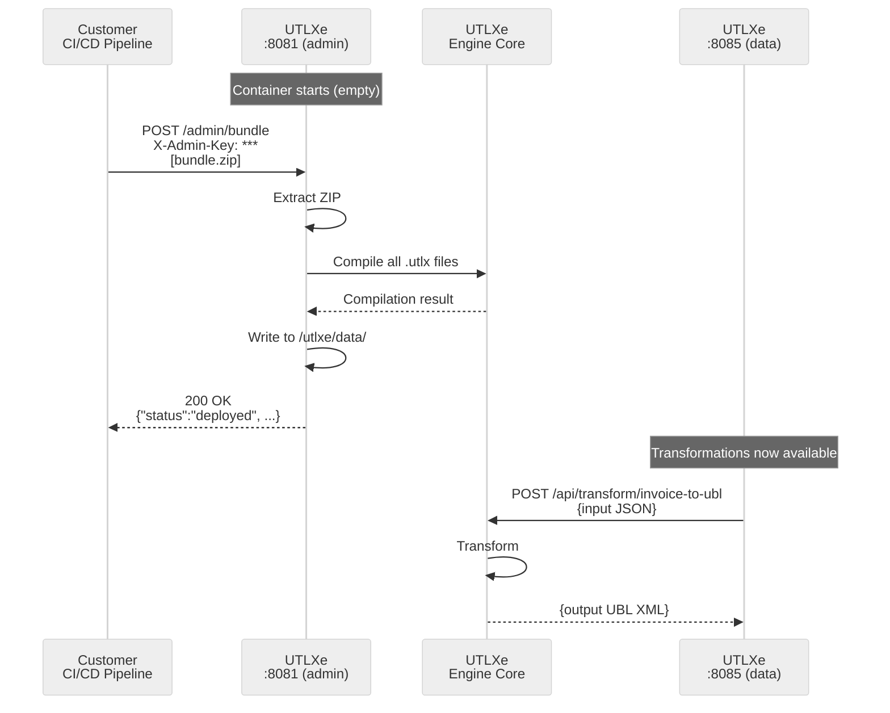

# EF03: Bundle Management API

**Status:** Design  
**Priority:** High (required for Azure Marketplace offering)  
**Created:** May 2026

---

## Summary

The Azure Marketplace delivers UTLXe as a pre-built container. Customers should not need to build custom Docker images or set up Azure Files to deploy their transformations. EF03 adds a REST management API on the health/admin port (8081) that allows customers to upload, list, update, and remove transformation bundles via HTTP.

## Problem

When a customer deploys UTLXe from the Azure Marketplace, they get a running container with zero transformations. Currently there is no supported way to deploy transformations without:

- Building a custom Docker image (defeats the purpose of a managed offering)
- Mounting an Azure File Share (operational burden, requires infrastructure setup)
- Writing custom entrypoint scripts to download from Blob Storage

The engine already supports dynamic loading internally — `stdio-proto` has `LoadTransformation` messages, and the HTTP mode help text says "Transforms loaded dynamically via REST endpoints." But the HTTP management surface does not exist yet.

## Design

### Management API (port 8081)

The management API runs on the existing health/admin port, separate from the data plane (8085). This allows network isolation — the Container App exposes only 8085 via ingress, while 8081 stays internal to the VNet.

#### Bundle endpoints

| Method | Path | Description |
|--------|------|-------------|
| `POST` | `/admin/bundle` | Upload a `.zip` bundle containing `transformations/` directory |
| `GET` | `/admin/bundle` | Current bundle info: names, strategies, compile status |
| `DELETE` | `/admin/bundle` | Remove all transformations (returns to empty state) |
| `POST` | `/admin/bundle/validate` | Upload and validate without deploying (dry run) |

#### Transformation endpoints

| Method | Path | Description |
|--------|------|-------------|
| `GET` | `/admin/transformations` | List all deployed transformations |
| `GET` | `/admin/transformations/{name}` | Get transformation details (config, compile status, metrics) |
| `POST` | `/admin/transformations/{name}` | Deploy or update a single transformation |
| `DELETE` | `/admin/transformations/{name}` | Remove a single transformation |

### Bundle ZIP format

The upload ZIP follows the existing `BundleLoader` directory convention:

```
bundle.zip
  transformations/
    invoice-to-ubl/
      transform.yaml
      invoice-to-ubl.utlx
    validate-ubl/
      transform.yaml
      validate-ubl.utlx
  engine.yaml                (optional — engine config overrides)
```

### Single transformation upload

`POST /admin/transformations/{name}` accepts `multipart/form-data`:

- `source` — the `.utlx` file
- `config` — the `transform.yaml` file (optional, defaults to COMPILED strategy)

Or a small `.zip` containing both files.

### Hot-swap

When a transformation is uploaded:

1. Parse and compile the `.utlx` source
2. If compilation fails → return 400 with error details, existing transformation unchanged
3. If compilation succeeds → atomic replace in the `TransformationRegistry`
4. In-flight messages on the old version drain naturally (they hold a reference to the old compiled transformation)
5. New messages use the new version immediately

Full bundle upload (`POST /admin/bundle`) follows the same pattern but replaces all transformations atomically.

### Response format

```json
// POST /admin/bundle — success
{
  "status": "deployed",
  "transformations": [
    {"name": "invoice-to-ubl", "strategy": "COMPILED", "status": "ready"},
    {"name": "validate-ubl", "strategy": "COMPILED", "status": "ready"}
  ],
  "compiled_in_ms": 342
}

// POST /admin/bundle — compilation error
{
  "status": "rejected",
  "errors": [
    {"transformation": "invoice-to-ubl", "line": 14, "message": "Unknown function: concatX"}
  ]
}

// GET /admin/transformations
{
  "transformations": [
    {
      "name": "invoice-to-ubl",
      "strategy": "COMPILED",
      "status": "ready",
      "deployed_at": "2026-05-05T14:30:00Z",
      "messages_processed": 12345,
      "avg_transform_ms": 2.3
    }
  ]
}
```

## Authentication

The management API is protected by an API key passed as an environment variable:

```yaml
UTLXE_ADMIN_KEY=my-secret-key-here
```

Requests must include the header:
```
X-Admin-Key: my-secret-key-here
```

If `UTLXE_ADMIN_KEY` is not set, the management API returns 403 on all endpoints (locked by default). This prevents accidental exposure.

The health endpoints (`/health`, `/metrics`) remain unauthenticated — they are read-only and needed by Kubernetes probes and Prometheus.

## Persistence

Uploaded transformations are written to a local directory (`/utlxe/data/transformations/`). Three persistence tiers depending on the customer's deployment:

| Tier | Persistence | Configuration |
|------|------------|---------------|
| **Ephemeral** | Lost on container restart | Default — no volume mount. Fine for dev/test or CI/CD re-deploy patterns. |
| **Volume-backed** | Survives restarts | Azure Files mounted at `/utlxe/data/`. Bicep template offers this as an option. |
| **CI/CD re-deploy** | External system of record | Customer's pipeline calls `POST /admin/bundle` after each container start. Readiness probe waits until bundle is loaded. |

### Startup behavior

On startup, UTLXe checks `/utlxe/data/transformations/`:
- If the directory contains transformations (from a previous upload + volume mount) → load them automatically
- If empty → start with zero transformations, wait for API upload
- If `--bundle` flag is also provided → load from `--bundle` path first, then accept API uploads as overrides

### Readiness probe

The existing `/health` endpoint should distinguish between "running but no transformations" and "running with transformations loaded":

```json
// No transformations loaded yet
{"status": "UP", "transformations": 0, "ready": false}

// Transformations loaded and compiled
{"status": "UP", "transformations": 3, "ready": true}
```

Kubernetes readiness probe can check for `ready: true` to avoid routing traffic before transformations are deployed. The liveness probe checks only `status: UP`.

## Azure Marketplace integration

### createUiDefinition.json

Add an optional "Persistent storage" toggle:

```
☐ Enable persistent transformation storage
  When enabled, uploaded transformations survive container restarts.
  Creates an Azure Files share mounted to the container.
```

### Bicep template changes

When persistent storage is enabled:
- Create an Azure Storage Account + File Share
- Mount the File Share at `/utlxe/data/` in the Container App
- Set `UTLXE_ADMIN_KEY` from a generated secret (stored in the Storage Account or passed via Container App secrets)

When disabled:
- No storage account created
- Customer uses CI/CD re-deploy pattern or ephemeral mode

## Sequence diagram



## Implementation notes

### Where it lives

The management API is part of the `HealthEndpoint` (or a new `AdminEndpoint` alongside it) in `modules/engine`. It reuses the existing Javalin HTTP server on port 8081.

### Files to modify

| File | Change |
|------|--------|
| `modules/engine/.../health/HealthEndpoint.kt` | Add `/admin/*` routes or extract to `AdminEndpoint.kt` |
| `modules/engine/.../registry/TransformationRegistry.kt` | Add `replaceAll()` and `remove()` for hot-swap |
| `modules/engine/.../bundle/BundleLoader.kt` | Add `loadFromZip(inputStream)` alongside existing `load(path)` |
| `modules/engine/.../config/EngineConfig.kt` | Add `adminKey`, `dataDir` config fields |
| `modules/engine/.../UtlxEngine.kt` | Wire admin endpoint, startup scan of data dir |
| `deploy/docker/Dockerfile.engine` | Add `VOLUME /utlxe/data` and `UTLXE_ADMIN_KEY` env |

### What already exists

- `BundleLoader` — loads transformations from a directory (reuse for ZIP extraction target)
- `TransformationRegistry` — holds compiled transformations (needs atomic replace)
- `HealthEndpoint` — Javalin HTTP server on 8081 (extend with `/admin` routes)
- Hot compilation — engine already compiles `.utlx` at startup (reuse for dynamic uploads)

## Effort estimate

| Task | Effort |
|------|--------|
| Admin REST endpoints (upload, list, delete) | 2 days |
| ZIP bundle parsing and validation | 1 day |
| Hot-swap in TransformationRegistry (atomic replace) | 1 day |
| Admin key authentication middleware | 0.5 day |
| Startup scan of `/utlxe/data/` directory | 0.5 day |
| Readiness probe enhancement | 0.5 day |
| Bicep template: optional Azure Files mount | 0.5 day |
| Tests | 1 day |
| **Total** | **~7 days** |

## Customer workflow (end to end)

1. Deploy UTLXe from Azure Marketplace → running container, zero transformations
2. Note the admin endpoint (internal IP or via Azure CLI)
3. Set `UTLXE_ADMIN_KEY` in Container App secrets
4. `curl -X POST -H "X-Admin-Key: $KEY" -F "file=@bundle.zip" http://<internal>:8081/admin/bundle`
5. Response confirms deployment: 3 transformations compiled in 342ms
6. Application sends messages to `http://<ingress>:8085/api/transform/invoice-to-ubl`
7. To update: re-upload the bundle or update a single transformation via API

---

*Feature EF03. May 2026. Design document.*
*Key insight: the engine already supports dynamic loading internally — EF03 is the REST surface that exposes it to Azure Marketplace customers.*
