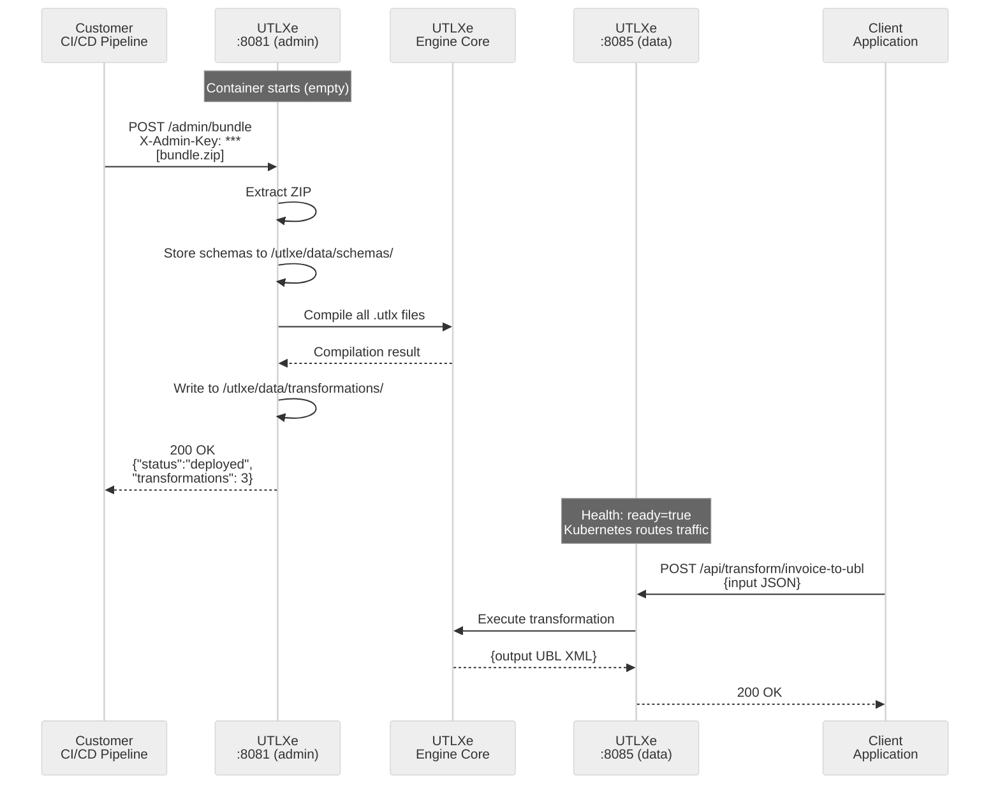
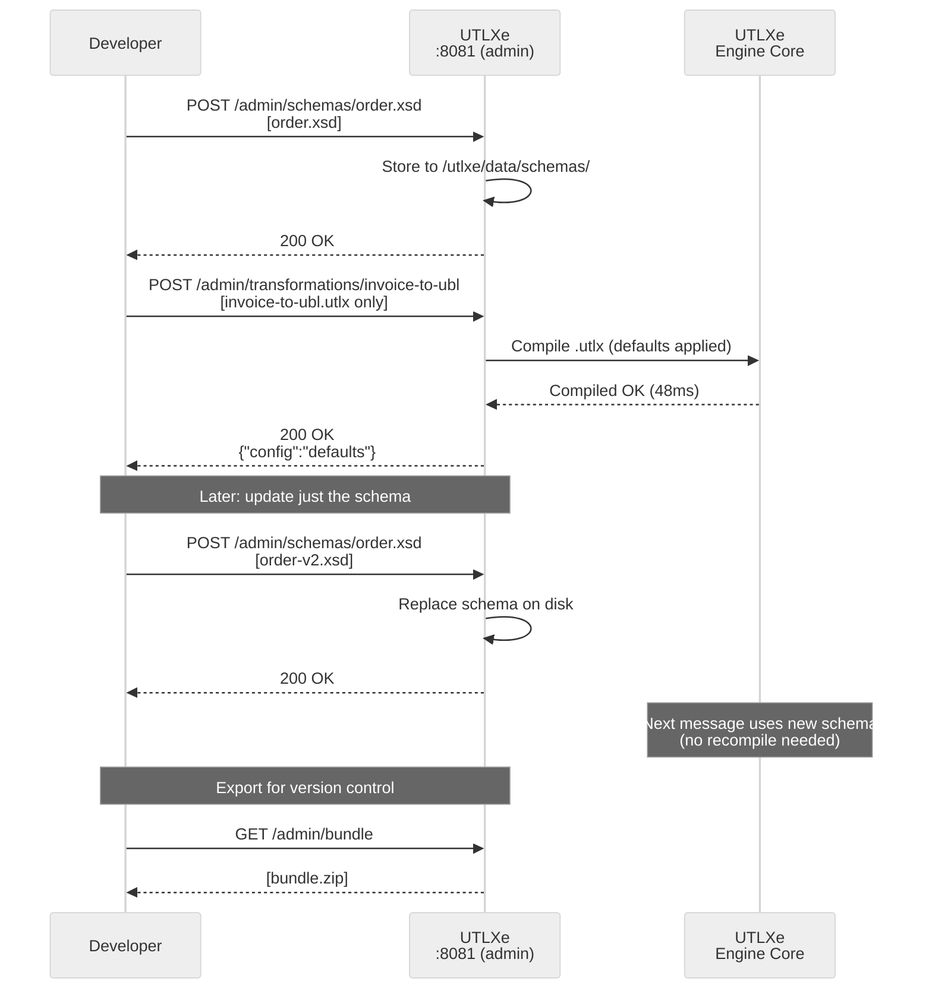
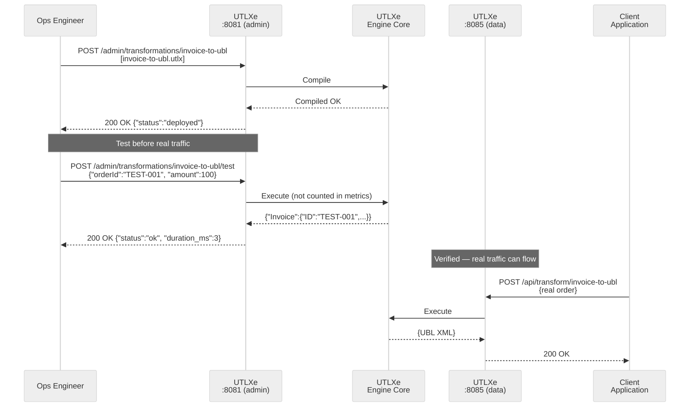
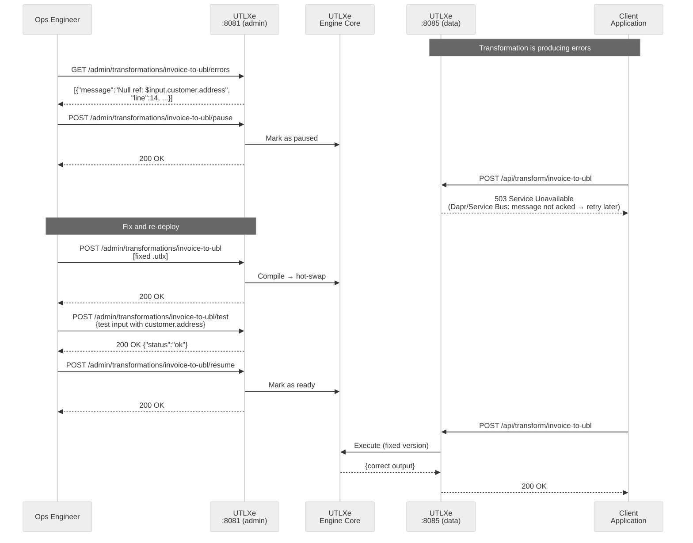
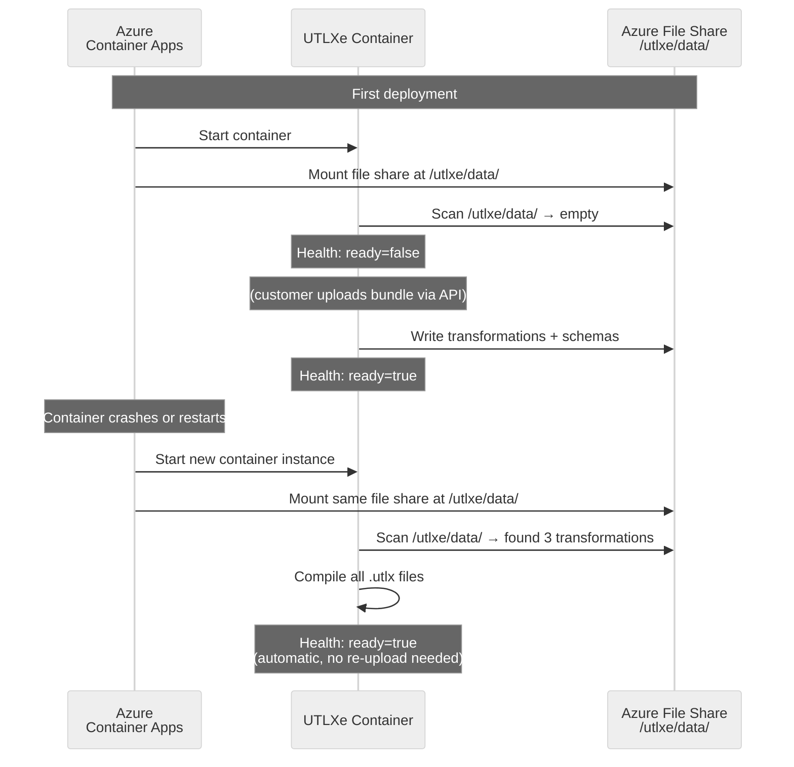
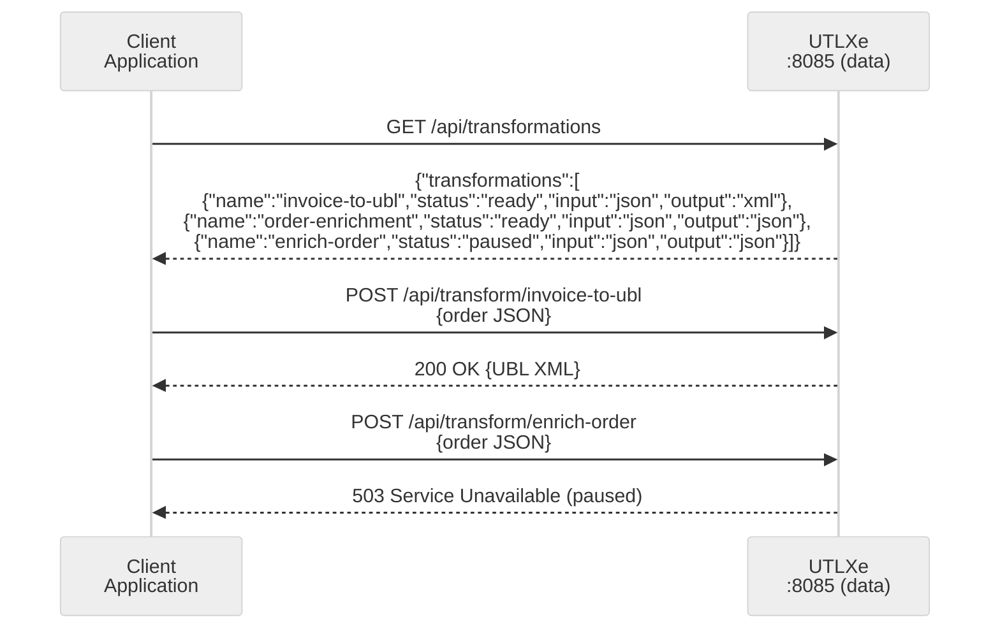

# EF03: Bundle Management API

> **See also:** **[IF19](IF19-shared-bundle-api-and-management-ui.md)** proposes extracting a
> *shared, file-level* bundle layer that this API would be refactored onto, so **utlxd** (the IDE
> daemon) and utlxe stay in lockstep. Today EF03 is engine-coupled (manages the live registry).
>
> **Canonical bundle format:** the on-disk layout, naming rules, and structure are specified in
> **[Bundle Format](../architecture/bundle-format.md)**. This doc owns the **REST management API**
> (upload/list/update transformations, schemas, bundles) and defers to it for the artifact layout.

**Status:** **Implemented** (utlxe / Azure) — *this doc was stale at "Design"; corrected June 2026.*
**Priority:** High (required for Azure Marketplace offering)  
**Created:** May 2026

> **As-built API (source of truth = `engine/admin/AdminEndpoint.kt`; see `book-azure/UTLXe on Azure.pdf`):**
> Authed `/admin/*` routes (admin port), read-only in locked mode except operational endpoints:
> - `GET /admin/transformations` (list + metrics), `GET /admin/transformations/{name}`
> - `POST /admin/transformations/{name}` (deploy/update), `DELETE /admin/transformations/{name}`
> - `POST /admin/transformations/{name}/test`, `POST /admin/transformations/{name}/pause` (+ resume)
> - `POST /admin/bundle` (ingest a whole bundle: `transformations/` + `schemas/`),
>   `GET /admin/bundle` (bundle info), `DELETE /admin/bundle`
> - Consumed by the IDE via **IF05** (Bundle Operations); pairs with EF09 (`.utlar`) for locked mode.

---

## Summary

The Azure Marketplace delivers UTLXe as a pre-built container. Customers should not need to build custom Docker images or set up Azure Files to deploy their transformations. EF03 adds a REST management API on the health/admin port (8081) that allows customers to upload, list, update, and remove transformations, schemas, and full bundles via HTTP.

The API supports two workflows: **batch** (upload a complete ZIP bundle) and **API-first** (build up the bundle incrementally via individual REST calls). Both produce the same result — compiled transformations ready to process messages on the data plane.

## Problem

When a customer deploys UTLXe from the Azure Marketplace, they get a running container with zero transformations. Currently there is no supported way to deploy transformations without:

- Building a custom Docker image (defeats the purpose of a managed offering)
- Mounting an Azure File Share (operational burden, requires infrastructure setup)
- Writing custom entrypoint scripts to download from Blob Storage

The engine already supports dynamic loading internally — `stdio-proto` has `LoadTransformation` messages, and the HTTP mode help text says "Transforms loaded dynamically via REST endpoints." But the HTTP management surface does not exist yet.

## Architecture Decision: Single Bundle per Container

**Decision:** One bundle per container, many transformations per bundle.

| Need | Solution |
|------|----------|
| Multiple transformations | One bundle, multiple entries in `transformations/` |
| Update one transformation | `POST /admin/transformations/{name}` |
| Separate scaling or SLA | Separate Container App instances, each with their own bundle |
| Logical grouping | Naming convention: `inbound-invoice`, `outbound-invoice` |

**Why not multiple bundles?**

A bundle is a deployment unit — a directory of transformations that belong together. The question is whether a customer needs multiple deployment units in one container.

If transformations need different scaling, different configs, or different SLAs, they belong in **separate containers**. That is what containers are for. Putting multiple bundles in one container means conflict resolution (what if two bundles define `invoice-to-ubl`?), merge semantics (replace or append?), and partial failure handling (one bundle fails to compile — do the others stay?). This complexity solves no problem that isn't already handled by either "multiple transformations in one bundle" or "multiple containers."

The single-bundle model keeps the mental model simple: upload replaces everything. The per-transformation endpoints (`POST /admin/transformations/{name}`) handle incremental updates without the overhead of multi-bundle management.

## Architecture Decision: No Modes — Admin and Data Plane Always On

**Decision:** There is no "design mode" or "running mode." The admin API (port 8081) and the data plane (port 8085) are always active simultaneously.

**Why not a mode switch?**

The admin API is **operational management** (deploying, updating, removing transformations), not design time. Design time is what `utlxd` (the IDE daemon) does — schema analysis, live preview, autocompletion. The admin API is closer to `kubectl apply` than to an IDE.

| Activity | Tool | Port | When |
|----------|------|------|------|
| Write and test a transformation | `utlxd` (IDE) | — | Development |
| Deploy a transformation to production | Admin API | 8081 | Operations |
| Process messages | Data plane | 8085 | Runtime |

A mode switch would force a choice:

| Hypothetical mode | Admin API | Data plane | Problem |
|-------------------|-----------|------------|---------|
| "Design" | Enabled | Disabled | Messages queue up or get rejected — SLA violation |
| "Running" | Disabled | Enabled | Can't deploy updates without switching mode — downtime |
| "Both" | Enabled | Enabled | This is just... always on. No mode needed. |

The only combination that makes sense is "both enabled."

**Live updates are safe because of atomic hot-swap:**

1. **Hot-swap a transformation** — new version compiled, atomically replaces old in the registry. In-flight messages drain on the old version (they hold a reference). New messages use the new version. Zero downtime.
2. **Upload a new schema** — schemas are resolved at validation time (per message), not at compile time. Replacing a schema file takes effect on the next message. No recompile, no restart.
3. **Add a new transformation** — appears in the registry, immediately available. Existing transformations unaffected.
4. **Remove a transformation** — removed from registry. New requests get 404. In-flight messages complete normally.
5. **Full bundle replace** — atomic swap of the entire registry.

**The only guard is compilation validation:** a bad upload is rejected with a 400 response and error details. The running system is untouched. The `POST /admin/bundle/validate` endpoint (dry run) exists for CI/CD pipelines that want to validate before deploying.

**Dependency warnings (not blocks):**

| Scenario | Behavior |
|----------|----------|
| Upload transformation referencing a schema not yet uploaded | Compilation succeeds (schema is runtime). Response includes: `"warnings": ["referenced schema 'order.xsd' not found"]` |
| Delete a schema referenced by transformations | Schema removed. Response includes: `"warnings": ["schema 'order.xsd' is referenced by 2 transformations"]` |
| Replace schema with incompatible version | Next messages may fail validation. Customer's responsibility — same as updating an XSD in any system. |

The API warns but does not block on dependency issues. The customer knows their deployment order. Blocking creates rigidity; warnings create awareness.

---

## Architecture Decision: Schemas as Shared Resources

**Decision:** Schemas are top-level resources, not embedded in transformation directories.

A schema like `order.xsd` may be referenced by multiple transformations (`invoice-to-ubl`, `order-enrichment`, `enrich-order`). Embedding schemas inside each transformation directory creates copies that must stay in sync — a maintenance hazard.

Instead, schemas live in a shared `schemas/` directory and are uploaded independently:

```
/utlxe/data/
  schemas/
    order.xsd              ← single source of truth
    invoice.json
  transformations/
    invoice-to-ubl/
      invoice-to-ubl.utlx  (header: input json {schema: "order.xsd"})
    order-enrichment/
      order-enrichment.utlx  (header: input json {schema: "order.xsd"})
```

Updating a schema does **not** recompile transformations — schemas are resolved at validation time, not compile time. This means a schema update takes effect immediately for the next message without any downtime.

## Architecture Decision: .utlx Alone is Enough

**Decision:** A transformation can be deployed with just a `.utlx` file. The `transform.yaml` config is optional.

When no `transform.yaml` is provided, sensible defaults apply:

```yaml
# Implicit defaults
strategy: COMPILED
inputFormat: auto        # detect from .utlx header or message content
outputFormat: auto
```

This lowers the barrier to entry — the simplest possible deployment is one file, one command:

```bash
curl -X POST -H "X-Admin-Key: $KEY" \
  -F "source=@invoice-to-ubl.utlx" \
  http://admin:8081/admin/transformations/invoice-to-ubl
```

The customer can add or update the config later via `POST /admin/transformations/{name}/config` without recompiling the transformation source.

## Architecture Decision: Transformation Names Are Unique

**Decision:** Each transformation name must be unique within a container. Uploading a transformation with an existing name **replaces** it (upsert semantics).

The name is the identity — it maps to a directory under `/utlxe/data/transformations/{name}/` and to the data plane URL `POST /api/transform/{name}`. Duplicate names would create ambiguity: which transformation does the request hit?

**Scenarios that seem to need duplicates, and their solutions:**

| Scenario | Seems like you need... | Better solution |
|----------|----------------------|-----------------|
| Canary / A/B testing | v1 and v2 of same name | Two container instances behind Azure traffic splitting (90/10) |
| Multi-tenant | Same name, different logic per tenant | Separate container per tenant, or naming convention: `tenantA-invoice-to-ubl` |
| Regional variants | EU and US versions | Different names: `invoice-to-ubl-eu`, `invoice-to-ubl-us`. Or separate containers per region. |
| Large org, many teams | Risk of naming collisions | Team-prefixed names: `finance-invoice-to-ubl`, `logistics-invoice-to-ubl` |

Every scenario is better solved by **different names** or **different containers**. The uniqueness constraint pushes toward good architecture — one concern per container, names that reflect purpose.

---

## Architecture Decision: Parallel Transports and Source Tagging

All transports (HTTP, gRPC, stdio-proto) can run simultaneously, sharing the same `TransformationRegistry`. HTTP port 8085 serves both Dapr and direct clients — they share the same bundle. The Admin API on port 8081 is the persistent management path (writes to disk). gRPC/proto `LoadTransformation` is the ephemeral management path (memory only, wrapper re-sends after restart).

Each transformation is tagged with its source (`ADMIN_API`, `GRPC`, `STDIO_PROTO`) to prevent silent conflicts. gRPC cannot overwrite an Admin API-managed transformation — the overwrite is blocked with an explicit error.

See [EF07: Parallel Transports](EF07-parallel-transports.md) for the full design: thread safety, ownership rules, source tagging, port allocation, shutdown coordination, and CLI changes.

---

## Design

### Management API (port 8081)

The management API runs on the existing health/admin port, separate from the data plane (8085). This allows network isolation — the Container App exposes only 8085 via ingress, while 8081 stays internal to the VNet.

#### Bundle endpoints (batch workflow)

| Method | Path | Description |
|--------|------|-------------|
| `POST` | `/admin/bundle` | Upload a `.zip` bundle (replaces everything) |
| `GET` | `/admin/bundle` | Export current state as downloadable `.zip` |
| `DELETE` | `/admin/bundle` | Remove all transformations and schemas (returns to empty state) |
| `POST` | `/admin/bundle/validate` | Upload and validate without deploying (dry run) |

#### Transformation endpoints (incremental workflow)

| Method | Path | Description |
|--------|------|-------------|
| `GET` | `/admin/transformations` | List all deployed transformations |
| `GET` | `/admin/transformations/{name}` | Get transformation details (config, compile status, metrics, source) |
| `POST` | `/admin/transformations/{name}` | Deploy or update a transformation (`.utlx` required, config optional) |
| `POST` | `/admin/transformations/{name}/config` | Update config only (no recompile) |
| `DELETE` | `/admin/transformations/{name}` | Remove a single transformation |

#### Schema endpoints (shared resources)

| Method | Path | Description |
|--------|------|-------------|
| `GET` | `/admin/schemas` | List all uploaded schemas |
| `GET` | `/admin/schemas/{filename}` | Download a schema file |
| `POST` | `/admin/schemas/{filename}` | Upload or replace a schema file |
| `DELETE` | `/admin/schemas/{filename}` | Remove a schema |

#### Testing endpoint

| Method | Path | Description |
|--------|------|-------------|
| `POST` | `/admin/transformations/{name}/test` | Run a transformation with sample input, return output or error |

Send a test message through a deployed transformation without touching the data plane. Essential for verifying a newly uploaded transformation before routing real traffic.

```json
// Request
POST /admin/transformations/invoice-to-ubl/test
Content-Type: application/json

{"orderId": "12345", "amount": 100.00, "customer": {"name": "Acme Corp"}}

// Success response
{
  "status": "ok",
  "output": {"Invoice": {"ID": "12345", "BuyerParty": {"Name": "Acme Corp"}, ...}},
  "duration_ms": 3
}

// Failure response
{
  "status": "error",
  "error": "Null reference: $input.customer.address",
  "line": 14,
  "column": 22
}
```

The test endpoint uses the same compiled transformation as the data plane — the result is exactly what a real message would produce. The difference: test calls are not counted in Prometheus metrics and do not affect `messages_processed` counters.

#### Operational endpoints

| Method | Path | Description |
|--------|------|-------------|
| `GET` | `/admin/info` | Engine version, uptime, config, persistence mode |
| `POST` | `/admin/transformations/{name}/pause` | Stop processing for this transformation (503 on data plane) |
| `POST` | `/admin/transformations/{name}/resume` | Resume processing |
| `GET` | `/admin/transformations/{name}/errors` | Recent errors (ring buffer, last 100) |
| `GET` | `/admin/config` | View current engine configuration |
| `POST` | `/admin/config` | Update engine configuration (partial, runtime-safe fields only) |

#### Validation override endpoints

| Method | Path | Description |
|--------|------|-------------|
| `GET` | `/admin/transformations/{name}/validation` | Get effective validation state (policy, source, config default) |
| `POST` | `/admin/transformations/{name}/validation` | Set a runtime validation override (does not modify config on disk) |
| `DELETE` | `/admin/transformations/{name}/validation` | Remove runtime override (reverts to config/header default) |

Runtime validation overrides are ephemeral — they don't touch the `transform.yaml` on disk. On container restart, the override is gone and the config-file or header policy applies again. This is an incident management tool: disable validation immediately, investigate, fix the schema or data, then remove the override.

```json
// Disable validation during an incident
POST /admin/transformations/invoice-to-ubl/validation
{"policy": "off"}

→ 200 OK
{"policy": "off", "source": "runtime-override", "config_policy": "strict", "header_policy": "strict"}

// Check current effective state
GET /admin/transformations/invoice-to-ubl/validation

→ 200 OK
{
  "effective_policy": "off",
  "source": "runtime-override",
  "config_policy": "strict",
  "header_policy": "strict"
}

// Remove override — back to config/header default
DELETE /admin/transformations/invoice-to-ubl/validation

→ 200 OK
{"effective_policy": "strict", "source": "config"}
```

**Precedence chain (highest wins):**

```
runtime override  →  transform.yaml config  →  .utlx header  →  default (off)
   (ephemeral)         (on disk, EF03)         (in source)      (no validation)
```

This extends the EF02 precedence model with a new top-level override. The runtime override is the only level that is ephemeral — all others persist across restarts.

**Engine info** — basic operational visibility:

```json
GET /admin/info

{
  "version": "1.0.1",
  "uptime_seconds": 86400,
  "mode": "http",
  "workers": 4,
  "heap_max_mb": 1536,
  "data_dir": "/utlxe/data",
  "persistence": "volume-backed",
  "admin_key_set": true,
  "transformations": 3,
  "schemas": 2,
  "ready": true
}
```

**Pause / resume** — stop processing for a specific transformation without removing it. When paused:
- Data plane returns 503 for that transformation (others continue)
- Dapr/Service Bus messages are not acknowledged (they retry or go to DLQ)
- The transformation stays compiled and on disk — resume is instant
- `GET /admin/transformations/{name}` shows `"status": "paused"`

This fills the gap between "everything is fine" and "delete the transformation." During an incident, you pause the problematic transformation, investigate, fix, upload a new version, then resume.

**Recent errors** — ring buffer of the last N errors per transformation:

```json
GET /admin/transformations/invoice-to-ubl/errors?limit=20

{
  "errors": [
    {
      "timestamp": "2026-05-05T14:32:01Z",
      "message": "Null reference: $input.customer.address",
      "line": 14,
      "input_preview": "{\"orderId\":\"12345\",\"customer\":{\"name\":\"Acme\"}}"
    },
    {
      "timestamp": "2026-05-05T14:32:03Z",
      "message": "Schema validation failed: 'amount' is required",
      "input_preview": "{\"orderId\":\"12346\",\"customer\":{...}}"
    }
  ],
  "total_errors": 47,
  "showing": 20
}
```

Prometheus gives error counters but not the actual messages. This endpoint provides quick diagnosis without digging through container logs. The `input_preview` is truncated (first 200 characters) to avoid exposing full message payloads.

**Engine config** — view and update runtime-safe configuration:

```json
GET /admin/config

{
  "maxInputSize": "5MB",
  "workers": 4,
  "healthPort": 8081,
  "dataPort": 8085
}

POST /admin/config
{"maxInputSize": "10MB"}

→ 200 OK {"updated": ["maxInputSize"], "restart_required": []}
```

Only a subset of config fields are safe to change at runtime. Fields that require restart (like port numbers) are accepted but flagged in the response: `"restart_required": ["healthPort"]`.

#### Messaging endpoints (Dapr-aware, with sync)

| Method | Path | Description |
|--------|------|-------------|
| `GET` | `/admin/dapr` | Dapr sidecar status, loaded components, integration mode |
| `GET` | `/admin/transformations/{name}/messaging` | Messaging config for a transformation (input/output queue/topic/eventhub) |
| `POST` | `/admin/transformations/{name}/messaging` | Set or update messaging config (saved to disk, **not** pushed to Dapr yet) |
| `DELETE` | `/admin/transformations/{name}/messaging` | Remove messaging config (marks as draft — sync to remove from Dapr) |
| `POST` | `/admin/transformations/{name}/sync` | Push this transformation's config to Dapr |
| `POST` | `/admin/sync` | Push ALL draft transformations to Dapr |
| `GET` | `/admin/sync` | Show sync status for all transformations |

**Design principle: stage, test, then apply.**

Configuration changes via the Admin API are persisted to `transform.yaml` on disk immediately (crash-safe). But Dapr components are **not** created, updated, or deleted until an explicit **sync**. This has two benefits:

1. **No churn** — building up config over multiple API calls doesn't cause Dapr to initialize/teardown/reinitialize components
2. **Safe testing** — before sync, the transformation is compiled and testable via HTTP (data plane and test endpoint), but not connected to real queues or topics. Sync is the "go live" switch.

**Pre-sync testing (the sandbox):**

A transformation in `draft` state is fully functional via HTTP — it just has no Dapr bindings:

```
Upload .utlx               → compiled, registered in engine
Set messaging config        → draft (saved to disk, Dapr not touched)
                            ↓
Test with sample data:      POST /admin/transformations/orders-in/test
                            → Returns output or error — safe, no queue impact
                            ↓
Test via HTTP data plane:   POST :8085/api/transform/orders-in
                            → Full execution including validation — no messages consumed from queues
                            ↓
Fix if needed:              Re-upload .utlx, adjust config, test again
                            → Still in draft — still no queue impact
                            ↓
Confident?                  POST /admin/transformations/orders-in/sync
                            → Dapr bindings activate → real messages flow
```

This means:
- Develop and test **without Dapr running at all** (HTTP-only mode)
- Verify output correctness before connecting to queues (no dead-lettering of bad transformations)
- Multiple developers can upload and test independently, then one coordinated `POST /admin/sync` brings everything live
- Schema validation, pipeline multi-input, output metadata — all testable before go-live

| Analogy | Stage | Apply |
|---|---|---|
| Git | `git add` | `git commit` |
| Terraform | edit `.tf` files | `terraform apply` |
| Network switch | `configure terminal` | `write memory` |
| **UTLXe Admin API** | `POST .../messaging` | `POST .../sync` |

**Sync status per transformation:**

| Status | Meaning |
|---|---|
| `synced` | Dapr components match the current config on disk |
| `draft` | Config changed since last sync — Dapr not yet updated |
| `error` | Last sync attempt failed (with reason) |
| `no_dapr` | Dapr not available or no messaging configured |

**What creates draft status:**
- `POST /admin/transformations/{name}/messaging` — messaging changed
- `DELETE /admin/transformations/{name}/messaging` — messaging removed (pending removal from Dapr)

**What auto-syncs (no draft state):**
- `POST /admin/bundle` — complete deployment unit, always auto-syncs (the bundle is coherent by definition)
- `DELETE /admin/transformations/{name}` — deletion is immediate (removes Dapr component + transformation in one step)

**What does NOT affect sync status:**
- `POST /admin/transformations/{name}/config` with non-messaging fields (validation policy, strategy) — these don't touch Dapr
- `POST /admin/transformations/{name}/pause` / `resume` — operational, not config
- `POST /admin/transformations/{name}/validation` — ephemeral override, not persisted

**Dapr detection and integration modes:**

The Admin API detects Dapr by probing `localhost:3500/v1.0/metadata` on startup and periodically. The response (or lack thereof) determines the integration mode:

| Dapr present? | `--dapr-components-dir` set? | Mode | Sync behavior |
|---|---|---|---|
| No | No | **HTTP-only** | Sync is a no-op — config stored on disk only |
| Yes | No | **Dapr static** | Sync validates bindings exist in Dapr, warns if missing (no YAML generation) |
| Yes | Yes | **Dapr dynamic** | Sync generates/updates/deletes Dapr component YAML |

```json
GET /admin/dapr

// Dapr dynamic mode
{
  "mode": "dynamic",
  "sidecar_reachable": true,
  "sidecar_version": "1.17.5",
  "components_dir": "/dapr/components",
  "servicebus_namespace": "mycompany.servicebus.windows.net",
  "eventhub_namespace": "mycompany-eventhubs",
  "loaded_components": [
    { "name": "orders-in", "type": "bindings.azure.servicebusqueues", "managed": true },
    { "name": "orders-out", "type": "bindings.azure.servicebusqueues", "managed": true },
    { "name": "utlxe-servicebus", "type": "pubsub.azure.servicebus.topics", "managed": true },
    { "name": "legacy-binding", "type": "bindings.azure.servicebusqueues", "managed": false }
  ],
  "managed_count": 3,
  "external_count": 1
}

// HTTP-only mode (no Dapr)
{
  "mode": "http-only",
  "sidecar_reachable": false,
  "components_dir": null,
  "loaded_components": []
}
```

**Sync status overview:**

```json
GET /admin/sync

{
  "dapr_mode": "dynamic",
  "transformations": [
    {
      "name": "orders-in",
      "sync_status": "synced",
      "last_synced": "2026-05-07T10:05:00Z",
      "messaging": {
        "input": { "queue": "orders-in" },
        "output": { "queue": "orders-out" }
      }
    },
    {
      "name": "invoices-in",
      "sync_status": "draft",
      "pending_changes": ["messaging.input", "messaging.output"],
      "messaging": {
        "input": { "topic": "raw-invoices", "subscription": "utlxe" },
        "output": { "topic": "normalized-invoices" }
      }
    },
    {
      "name": "returns-in",
      "sync_status": "error",
      "error": "Dapr sidecar unreachable at localhost:3500",
      "messaging": {
        "input": { "queue": "returns-in" },
        "output": { "queue": "returns-out" }
      }
    },
    {
      "name": "http-only-transform",
      "sync_status": "no_dapr",
      "messaging": null
    }
  ],
  "draft_count": 1,
  "error_count": 1,
  "synced_count": 1,
  "no_dapr_count": 1
}
```

**Messaging config per transformation:**

```json
GET /admin/transformations/orders-in/messaging

{
  "input": {
    "queue": "orders-in",
    "dapr_status": "active",
    "dapr_component": "orders-in",
    "dapr_component_type": "bindings.azure.servicebusqueues"
  },
  "output": {
    "topic": "processed-orders",
    "dapr_status": "active",
    "dapr_component": "utlxe-servicebus",
    "dapr_component_type": "pubsub.azure.servicebus.topics"
  },
  "sync_status": "synced",
  "last_synced": "2026-05-07T10:05:00Z"
}
```

Dapr status values per binding:
- `active` — Dapr component exists and is loaded
- `pending` — YAML written during sync, waiting for Dapr to pick up (~1s)
- `missing` — Dapr sidecar present but component not loaded (static mode, manual action needed)
- `not_configured` — no messaging declared for this transformation
- `no_dapr` — Dapr sidecar not available (HTTP-only mode)
- `unsynced` — config set but not yet synced (draft state)

**Interactive configuration flow (stage → apply):**

```bash
# 1. Upload transformation (no messaging yet)
curl -X POST -H "X-Admin-Key: $KEY" \
  -F "source=@orders-in.utlx" \
  http://admin:8081/admin/transformations/orders-in
# → sync_status: no_dapr (no messaging configured)

# 2. Set input queue
curl -X POST -H "X-Admin-Key: $KEY" \
  -H "Content-Type: application/json" \
  -d '{"input": {"queue": "orders-in"}}' \
  http://admin:8081/admin/transformations/orders-in/messaging
# → sync_status: draft, input.dapr_status: unsynced

# 3. Set output (can be different service — mix-and-match)
curl -X POST -H "X-Admin-Key: $KEY" \
  -H "Content-Type: application/json" \
  -d '{"input": {"queue": "orders-in"}, "output": {"topic": "processed-orders"}}' \
  http://admin:8081/admin/transformations/orders-in/messaging
# → sync_status: draft, both unsynced

# 4. Set validation policy (doesn't affect sync)
curl -X POST -H "X-Admin-Key: $KEY" \
  -H "Content-Type: application/json" \
  -d '{"validationPolicy": "strict"}' \
  http://admin:8081/admin/transformations/orders-in/config
# → sync_status: still draft (only messaging changes matter)

# 5. Done — push to Dapr
curl -X POST -H "X-Admin-Key: $KEY" \
  http://admin:8081/admin/transformations/orders-in/sync
# → Generates Dapr YAML, sync_status: synced, messages flow
```

**Sync response:**

```json
POST /admin/transformations/orders-in/sync → 200

{
  "sync_status": "synced",
  "synced_at": "2026-05-07T10:05:00Z",
  "actions": [
    { "action": "created", "component": "orders-in", "type": "bindings.azure.servicebusqueues" },
    { "action": "ensured", "component": "utlxe-servicebus", "type": "pubsub.azure.servicebus.topics" }
  ],
  "message": "2 Dapr components synced. Bindings will activate within ~1 second."
}
```

**Bulk sync (multiple transformations at once):**

```bash
# Configure multiple transformations
curl -X POST ... /admin/transformations/orders-in/messaging    # → draft
curl -X POST ... /admin/transformations/invoices-in/messaging   # → draft
curl -X POST ... /admin/transformations/returns-in/messaging    # → draft

# One sync for everything
curl -X POST -H "X-Admin-Key: $KEY" http://admin:8081/admin/sync
```

```json
POST /admin/sync → 200

{
  "synced": [
    { "name": "orders-in", "actions": [{"action": "created", "component": "orders-in"}] },
    { "name": "invoices-in", "actions": [{"action": "created", "component": "invoices-in"}] },
    { "name": "returns-in", "actions": [{"action": "created", "component": "returns-in"}] }
  ],
  "errors": [],
  "skipped": ["http-only-transform"],
  "message": "3 transformations synced, 0 errors, 1 skipped (no messaging config)."
}
```

**Sync in static mode (no `--dapr-components-dir`):**

```json
POST /admin/transformations/orders-in/sync → 200

{
  "sync_status": "synced",
  "dapr_mode": "static",
  "warnings": [
    "Dapr component 'orders-in' not found — create binding YAML manually",
    "Dapr component 'utlxe-servicebus' found and active ✓"
  ],
  "message": "Config validated against Dapr. 1 component missing — manual action required."
}
```

**Remove messaging (stage removal → sync to apply):**

```bash
# Stage removal
curl -X DELETE -H "X-Admin-Key: $KEY" \
  http://admin:8081/admin/transformations/orders-in/messaging
# → sync_status: draft (removal pending)

# Apply removal
curl -X POST -H "X-Admin-Key: $KEY" \
  http://admin:8081/admin/transformations/orders-in/sync
# → Deletes Dapr component YAML, sync_status: no_dapr
```

**Config is persisted to transform.yaml on disk immediately (crash-safe):**

| API call | Disk effect | Dapr effect |
|----------|-------------|-------------|
| `POST .../messaging` | Writes `input:`/`output:` to `transform.yaml` | None (draft) |
| `DELETE .../messaging` | Removes `input:`/`output:` from `transform.yaml` | None (draft) |
| `POST .../sync` | No change (already on disk) | Creates/updates/deletes Dapr YAML |
| `POST /admin/sync` | No change (already on disk) | Syncs all draft transformations |
| `POST /admin/bundle` | Replaces all files | **Auto-syncs** (bundle is coherent) |
| `DELETE /admin/transformations/{name}` | Deletes directory | **Auto-removes** Dapr component |

This means `GET /admin/bundle` (export) includes the messaging config — the exported bundle is complete and deployable to production as-is.

**Field reference:**

| Field | Azure service | Dapr component type |
|---|---|---|
| `queue: name` | Service Bus Queue | `bindings.azure.servicebusqueues` |
| `topic: name` | Service Bus Topic | `pubsub.azure.servicebus.topics` |
| `eventhub: name` | Event Hub | `bindings.azure.eventhubs` or `pubsub.azure.eventhubs` |

Input-only fields: `subscription` (required for topic input), `consumerGroup` (optional for eventhub, triggers pub/sub mode).

Mix-and-match is allowed — input and output can use different services (e.g., queue in → topic out).

#### Data plane discovery (port 8085)

| Method | Path | Description |
|--------|------|-------------|
| `GET` | `/api/transformations` | List available transformations (no admin key required) |

Client applications need to discover what transformations are available. This endpoint is on the data plane (8085) and does not require authentication — it's part of the public API.

```json
GET /api/transformations

{
  "transformations": [
    {"name": "invoice-to-ubl", "status": "ready", "input": "json", "output": "xml",
     "messaging": {"input": {"queue": "orders-in"}, "output": {"topic": "processed-orders"}}},
    {"name": "order-enrichment", "status": "ready", "input": "json", "output": "json",
     "messaging": null},
    {"name": "enrich-order", "status": "paused", "input": "json", "output": "json",
     "messaging": {"input": {"queue": "enrich-in"}, "output": {"queue": "enrich-out"}}}
  ]
}
```

This makes the data plane self-describing. A client connecting for the first time can discover available transformations and their messaging connections without out-of-band knowledge.

### Two deployment workflows

#### Batch workflow: ZIP upload

For CI/CD pipelines that build the complete bundle in a build step and deploy it in one call.

```bash
# Deploy everything at once
curl -X POST -H "X-Admin-Key: $KEY" \
  -F "file=@bundle.zip" \
  http://admin:8081/admin/bundle
```

#### API-first workflow: incremental build

For interactive development, scripting, or pipelines that manage resources individually.

```bash
# Step 1: Upload shared schemas
curl -X POST -H "X-Admin-Key: $KEY" \
  -F "file=@order.xsd" \
  http://admin:8081/admin/schemas/order.xsd

curl -X POST -H "X-Admin-Key: $KEY" \
  -F "file=@invoice.json" \
  http://admin:8081/admin/schemas/invoice.json

# Step 2: Deploy transformations (just the .utlx — config is optional)
curl -X POST -H "X-Admin-Key: $KEY" \
  -F "source=@invoice-to-ubl.utlx" \
  http://admin:8081/admin/transformations/invoice-to-ubl

curl -X POST -H "X-Admin-Key: $KEY" \
  -F "source=@order-enrichment.utlx" \
  -F "config=@transform.yaml" \
  http://admin:8081/admin/transformations/order-enrichment

# Step 3: Export the assembled bundle for version control
curl -H "X-Admin-Key: $KEY" \
  http://admin:8081/admin/bundle -o bundle-backup.zip
```

Both workflows produce the same result. The customer can start with API-first, then switch to batch when they have a CI/CD pipeline. Or mix: deploy a bundle, then update individual transformations or schemas.

### Bundle ZIP format

The upload ZIP follows the existing `BundleLoader` directory convention, extended with a `schemas/` directory:

```
bundle.zip
  schemas/                          (optional — shared schema files)
    order.xsd
    invoice.json
  transformations/
    invoice-to-ubl/
      invoice-to-ubl.utlx          (required)
      transform.yaml               (optional — defaults apply)
    validate-ubl/
      validate-ubl.utlx
      transform.yaml
  engine.yaml                      (optional — engine config overrides)
```

### Single transformation upload

`POST /admin/transformations/{name}` accepts `multipart/form-data`:

- `source` — the `.utlx` file (required)
- `config` — the `transform.yaml` file (optional, defaults to COMPILED strategy)

Or a small `.zip` containing both files.

### Hot-swap

When a transformation is uploaded:

1. Parse and compile the `.utlx` source
2. If compilation fails → return 400 with error details, existing transformation unchanged
3. If compilation succeeds → atomic replace in the `TransformationRegistry`
4. In-flight messages on the old version drain naturally (they hold a reference to the old compiled transformation)
5. New messages use the new version immediately

Full bundle upload (`POST /admin/bundle`) follows the same pattern but replaces all transformations atomically.

### Error codes (wire-protocol parity)

All HTTP error responses include the `error_code` field from the proto `ErrorCode` enum, serialized as a string. This ensures SDK consumers (EF08) see the same error codes regardless of transport.

```json
// HTTP 500 — transformation runtime error
{
  "success": false,
  "error": "Null reference: $input.customer.address",
  "error_code": "TRANSFORMATION_FAILED",
  "error_class": "PERMANENT",
  "error_phase": "TRANSFORMATION"
}

// HTTP 404 — transformation not found
{
  "success": false,
  "error": "Transformation 'orders-in' not found",
  "error_code": "TRANSFORMATION_NOT_FOUND"
}

// HTTP 503 — no bundle loaded (Dapr delivery before upload)
{
  "success": false,
  "error": "No transformation loaded for binding 'orders-in'",
  "error_code": "BUNDLE_NOT_LOADED"
}
```

See `utlxe-engine-architecture.md` "Wire-Protocol Parity" principle and `proto/utlxe/v1/utlxe.proto` `ErrorCode` enum for the full list.

### Response format

```json
// POST /admin/bundle — success
{
  "status": "deployed",
  "transformations": [
    {"name": "invoice-to-ubl", "strategy": "COMPILED", "status": "ready"},
    {"name": "validate-ubl", "strategy": "COMPILED", "status": "ready"}
  ],
  "schemas": ["order.xsd", "invoice.json"],
  "compiled_in_ms": 342
}

// POST /admin/bundle — compilation error
{
  "status": "rejected",
  "errors": [
    {"transformation": "invoice-to-ubl", "line": 14, "message": "Unknown function: concatX"}
  ]
}

// POST /admin/transformations/{name} — success (single .utlx, no config)
{
  "status": "deployed",
  "name": "invoice-to-ubl",
  "strategy": "COMPILED",
  "config": "defaults",
  "compiled_in_ms": 48,
  "messaging": null
}

// POST /admin/transformations/{name} — success (with messaging config)
{
  "status": "deployed",
  "name": "orders-in",
  "strategy": "COMPILED",
  "config": "explicit",
  "compiled_in_ms": 52,
  "messaging": {
    "input": { "queue": "orders-in", "status": "active" },
    "output": { "queue": "orders-out", "status": "active" }
  }
}

// GET /admin/transformations
{
  "transformations": [
    {
      "name": "invoice-to-ubl",
      "strategy": "COMPILED",
      "status": "ready",
      "config": "explicit",
      "deployed_at": "2026-05-05T14:30:00Z",
      "messages_processed": 12345,
      "avg_transform_ms": 2.3,
      "sync_status": "synced",
      "messaging": {
        "input": { "queue": "orders-in", "dapr_status": "active" },
        "output": { "topic": "processed-orders", "dapr_status": "active" }
      }
    },
    {
      "name": "returns-in",
      "strategy": "COMPILED",
      "status": "ready",
      "config": "explicit",
      "deployed_at": "2026-05-05T14:32:00Z",
      "messages_processed": 0,
      "avg_transform_ms": 0,
      "sync_status": "draft",
      "messaging": {
        "input": { "queue": "returns-in", "dapr_status": "unsynced" },
        "output": { "queue": "returns-out", "dapr_status": "unsynced" }
      }
    },
    {
      "name": "order-enrichment",
      "strategy": "COMPILED",
      "status": "ready",
      "config": "defaults",
      "deployed_at": "2026-05-05T14:31:00Z",
      "messages_processed": 12340,
      "avg_transform_ms": 1.1,
      "sync_status": "no_dapr",
      "messaging": null
    }
  ],
  "dapr_mode": "dynamic"
}

// GET /admin/schemas
{
  "schemas": [
    {"filename": "order.xsd", "size_bytes": 4820, "uploaded_at": "2026-05-05T14:29:00Z"},
    {"filename": "invoice.json", "size_bytes": 2340, "uploaded_at": "2026-05-05T14:29:05Z"}
  ]
}

// GET /admin/bundle (export)
// Returns: application/zip with the complete bundle
```

## Authentication

The management API is protected by an API key passed as an environment variable:

```yaml
UTLXE_ADMIN_KEY=my-secret-key-here
```

Requests must include the header:
```
X-Admin-Key: my-secret-key-here
```

If `UTLXE_ADMIN_KEY` is not set, the management API returns 403 on all endpoints (locked by default). This prevents accidental exposure.

The health endpoints (`/health`, `/metrics`) remain unauthenticated — they are read-only and needed by Kubernetes probes and Prometheus.

## On-Disk Layout

There is no "bundle file." The bundle is a **directory structure** — the on-disk state under `/utlxe/data/` IS the bundle. Every API call that modifies the bundle writes to this directory immediately.

```
/utlxe/data/                                    ← this IS "the bundle"
  schemas/                                       ← shared schema files
    order.xsd
    invoice.json
  transformations/                               ← one subdirectory per transformation
    invoice-to-ubl/
      invoice-to-ubl.utlx                       ← the transformation source
      transform.yaml                             ← config (absent = defaults apply)
    order-enrichment/
      order-enrichment.utlx
```

### What each API call writes to disk

| API call | Disk effect |
|----------|-------------|
| `POST /admin/transformations/invoice-to-ubl` (single .utlx) | Creates `transformations/invoice-to-ubl/invoice-to-ubl.utlx` |
| `POST /admin/transformations/invoice-to-ubl` (.utlx + config) | Creates `.utlx` + `transform.yaml` in that directory |
| `POST /admin/transformations/invoice-to-ubl/config` (config only) | Creates or replaces `transform.yaml` in existing directory |
| `POST /admin/transformations/invoice-to-ubl/messaging` | Writes `input:`/`output:` to `transform.yaml` (draft — Dapr not touched yet) |
| `DELETE /admin/transformations/invoice-to-ubl/messaging` | Removes `input:`/`output:` from `transform.yaml` (draft — Dapr not touched yet) |
| `POST /admin/transformations/invoice-to-ubl/sync` | No disk change — pushes current config to Dapr (generates/deletes component YAML) |
| `POST /admin/sync` | No disk change — syncs ALL draft transformations to Dapr |
| `POST /admin/schemas/order.xsd` | Creates `schemas/order.xsd` |
| `POST /admin/bundle` (ZIP upload) | **Replaces** entire `/utlxe/data/` content with ZIP contents |
| `GET /admin/bundle` (export) | Zips up `/utlxe/data/` and returns it — no disk change |
| `DELETE /admin/transformations/invoice-to-ubl` | Removes directory `transformations/invoice-to-ubl/` |
| `DELETE /admin/schemas/order.xsd` | Removes `schemas/order.xsd` |
| `DELETE /admin/bundle` | Empties `/utlxe/data/` — back to zero transformations |

The in-memory `TransformationRegistry` always mirrors the on-disk state. A write to disk and a registry update happen as a single operation — if compilation fails, neither the disk nor the registry change.

## Persistence: Surviving Container Restarts

Docker containers have an **ephemeral filesystem**. When a container restarts (crash, scale-to-zero, redeployment), everything written inside the container is lost. This means `/utlxe/data/` is wiped clean unless external storage is mounted.

### Three persistence tiers

| Tier | How it works | Restart behavior | When to use |
|------|-------------|------------------|-------------|
| **Volume-backed** | Azure Files mounted at `/utlxe/data/` | Transformations survive — loaded automatically on startup | **Recommended for Azure Marketplace** |
| **CI/CD re-deploy** | No volume mount. Pipeline uploads bundle after each start | Pipeline detects `ready: false`, uploads, waits for `ready: true` | Customers with mature CI/CD pipelines |
| **Ephemeral** | No volume, no pipeline. Manual upload | Lost on restart — must re-upload manually | Dev/test only |

### Volume-backed persistence (recommended)

When Azure Files is mounted at `/utlxe/data/`, the directory lives on a network file share, not inside the container:

```
Container filesystem (ephemeral):
  /utlxe/utlxe.jar                   ← from Docker image, rebuilt on restart

Mount point (persistent — Azure File Share):
  /utlxe/data/                        ← survives restarts
    schemas/
      order.xsd
    transformations/
      invoice-to-ubl/
        invoice-to-ubl.utlx
        transform.yaml
```

On restart, UTLXe scans `/utlxe/data/`, finds the transformations from the previous session, compiles them, and becomes ready. Zero manual intervention.

### CI/CD re-deploy persistence

The bundle lives in the CI/CD system (git repo, artifact store). The container is truly stateless — the pipeline is the source of truth:

```
Container starts → /utlxe/data/ is empty → health: ready=false
  ↓
CI/CD detects ready=false → POST /admin/bundle with bundle.zip
  ↓
UTLXe compiles → health: ready=true → Kubernetes routes traffic
```

## Startup Sequence

The startup sequence is the same regardless of persistence tier:

```
Container starts
  │
  ├── 1. Start Javalin HTTP server on :8081
  │     ├── Health endpoint:  GET /health  → {"status":"UP", "transformations":0, "ready":false}
  │     ├── Metrics endpoint: GET /metrics → (Prometheus counters, all zero)
  │     └── Admin API:        POST/GET/DELETE /admin/* → accepting requests
  │
  ├── 2. Scan /utlxe/data/
  │     ├── If transformations found (volume mount from previous session):
  │     │     ├── Compile all .utlx files
  │     │     ├── Register in TransformationRegistry
  │     │     └── Health: {"status":"UP", "transformations":3, "ready":true}
  │     │
  │     └── If empty (first start, or ephemeral, or CI/CD pattern):
  │           └── Health: {"status":"UP", "transformations":0, "ready":false}
  │              (waiting for API upload)
  │
  ├── 3. If --bundle flag provided:
  │     ├── Load from --bundle path (in addition to /utlxe/data/)
  │     └── --bundle transformations are read-only base; API uploads override
  │
  ├── 4. Start data plane on :8085
  │     └── Kubernetes readiness probe checks ready=true before routing traffic
  │
  └── 5. Running — both admin API and data plane active simultaneously
        ├── Admin API accepts uploads/updates/deletes at any time
        └── Data plane processes messages (only when ready=true)
```

### Readiness vs. liveness

| Probe | Endpoint | Checks | Used by |
|-------|----------|--------|---------|
| **Liveness** | `GET /health` | `status == "UP"` (process is alive) | Kubernetes — restart if dead |
| **Readiness** | `GET /health` | `ready == true` (transformations compiled) | Kubernetes — route traffic only when ready |

```json
// Container just started, no transformations yet
{"status": "UP", "transformations": 0, "ready": false}

// After bundle upload or volume-mount scan
{"status": "UP", "transformations": 3, "ready": true}

// After DELETE /admin/bundle (all removed)
{"status": "UP", "transformations": 0, "ready": false}
```

This means:
- A container that just started but hasn't received its bundle yet: **alive but not ready** (no traffic routed)
- A container with compiled transformations: **alive and ready** (traffic routed)
- A container where all transformations were deleted: **alive but not ready** (traffic stops until new upload)

## Azure Marketplace integration

### How volume mounts work (separation of concerns)

The volume mount is configured at the **infrastructure level** (Bicep template), not by the container. UTLXe has no mount API, executes no unix commands, and is completely unaware of whether `/utlxe/data/` is a local directory or a network mount. It uses standard Java file I/O (`java.nio.file.Files`) to read and write — nothing else.

```
┌─────────────────────────────────────────────────────┐
│ Azure Container Apps Platform                        │
│                                                      │
│  1. Creates Azure File Share (if enabled)            │
│  2. Mounts it at /utlxe/data BEFORE container starts │
│                                                      │
│  ┌───────────────────────────────────────────┐       │
│  │ UTLXe Container                           │       │
│  │                                           │       │
│  │  /utlxe/utlxe.jar    ← container layer   │       │
│  │  /utlxe/data/         ← just a directory  │       │
│  │    schemas/             (JVM reads/writes  │       │
│  │    transformations/      via java.nio —    │       │
│  │                          no mount commands,│       │
│  │                          no unix syscalls) │       │
│  └──────────────┬────────────────────────────┘       │
│                 │                                     │
│                 │ /utlxe/data/ transparently          │
│                 │ points to:                          │
│                 ▼                                     │
│  ┌───────────────────────────────────────────┐       │
│  │ Azure File Share (SMB)                    │       │
│  │ Storage Account: stutlxe{uniqueId}        │       │
│  │ Share name: utlxe-bundle                  │       │
│  └───────────────────────────────────────────┘       │
└─────────────────────────────────────────────────────┘
```

This is the same mechanism as Kubernetes `PersistentVolumeClaim` — the orchestrator mounts the volume, the container just sees a directory. No security implications for the JVM.

**What UTLXe does (application level):** reads and writes files in `/utlxe/data/` via `java.nio.file.Files`.

**What the Bicep template does (infrastructure level):** creates the storage account, file share, and volume mount configuration. The container never participates in the mount process.

### createUiDefinition.json

Add an optional "Persistent storage" toggle:

```
☐ Enable persistent transformation storage
  When enabled, uploaded transformations survive container restarts.
  Creates an Azure Files share mounted to the container.
```

### Bicep template changes

When persistent storage is enabled:

```bicep
// 1. Storage account
resource storageAccount 'Microsoft.Storage/storageAccounts@2023-01-01' = {
  name: 'stutlxe${uniqueString(resourceGroup().id)}'
  location: location
  sku: { name: 'Standard_LRS' }
  kind: 'StorageV2'
}

// 2. File share
resource fileShare 'Microsoft.Storage/storageAccounts/fileServices/shares@2023-01-01' = {
  name: '${storageAccount.name}/default/utlxe-bundle'
  properties: { shareQuota: 1 }    // 1 GB — bundles are small
}

// 3. Container App storage reference
resource containerAppStorage 'Microsoft.App/managedEnvironments/storages@2023-05-01' = {
  parent: managedEnvironment
  name: 'bundle-storage'
  properties: {
    azureFile: {
      accountName: storageAccount.name
      accountKey: storageAccount.listKeys().keys[0].value
      shareName: 'utlxe-bundle'
      accessMode: 'ReadWrite'
    }
  }
}

// 4. Container App with volume mount
resource containerApp 'Microsoft.App/containerApps@2023-05-01' = {
  properties: {
    template: {
      containers: [{
        name: 'utlxe'
        image: 'ghcr.io/utlx-lang/utlxe:latest'
        volumeMounts: [{
          volumeName: 'bundle-storage'
          mountPath: '/utlxe/data'          // ← this is all UTLXe sees
        }]
      }]
      volumes: [{
        name: 'bundle-storage'
        storageName: 'bundle-storage'
        storageType: 'AzureFile'
      }]
    }
  }
}
```

When persistent storage is disabled:
- No storage account created
- No volume mount configured
- `/utlxe/data/` is a regular container directory (ephemeral)
- Customer uses CI/CD re-deploy pattern or manual upload after each restart

In both cases, UTLXe code is identical — it reads and writes `/utlxe/data/`. The only difference is whether the platform mounted external storage there.

## Sequence diagrams

### 1. Batch workflow (ZIP bundle upload)



### 2. API-first workflow (incremental build)



### 3. Deploy → Test → Go live

The most important operational flow: upload a transformation, test it with sample input, then let real traffic through.



### 4. Incident: pause, fix, resume



### 5. Volume-backed restart (persistence)



### 6. Client discovery on data plane



## Transport capability matrix

Not all management capabilities make sense for all transports. The HTTP Admin API is the full management surface. gRPC and stdio-proto get a subset — only what the wrapper program genuinely needs.

| Capability | HTTP Admin (:8081) | HTTP Data (:8085) | gRPC | stdio-proto |
|-----------|:------------------:|:-----------------:|:----:|:-----------:|
| **Core** | | | | |
| Load transformation | `POST /admin/transformations/{name}` | — | `LoadTransformation` (exists) | `LoadTransformationRequest` (exists) |
| Execute | — | `POST /api/transform/{name}` | `Execute` (exists) | `ExecuteRequest` (exists) |
| Remove transformation | `DELETE /admin/transformations/{name}` | — | `RemoveTransformation` (**add**) | `RemoveTransformationRequest` (**add**) |
| List transformations | `GET /admin/transformations` | `GET /api/transformations` | `ListTransformations` (**add**) | `ListTransformationsRequest` (**add**) |
| Test transformation | `POST .../test` | — | `TestTransformation` (**add**) | `TestTransformationRequest` (**add**) |
| **Bundle management** | | | | |
| Upload ZIP bundle | `POST /admin/bundle` | — | — | — |
| Export ZIP bundle | `GET /admin/bundle` | — | — | — |
| Validate bundle (dry run) | `POST /admin/bundle/validate` | — | — | — |
| **Schema management** | | | | |
| Upload schema | `POST /admin/schemas/{name}` | — | — | — |
| List/get/delete schemas | `GET/DELETE /admin/schemas/...` | — | — | — |
| **Operational** | | | | |
| Pause/resume | `POST .../pause\|resume` | — | — | — |
| Validation override | `POST .../validation` | — | — | — |
| Error ring buffer | `GET .../errors` | — | — | — |
| Engine info | `GET /admin/info` | — | — | — |
| Config update | `GET/POST /admin/config` | — | — | — |

### Why gRPC/proto don't need the full surface

| Capability | Why not needed in gRPC/proto |
|-----------|------------------------------|
| Bundle ZIP upload | Wrapper sends source code inline in `LoadTransformation` — no ZIP needed |
| Schema management | Wrapper resolves schemas itself and sends config with `LoadTransformation` |
| Pause/resume | Wrapper controls its own flow — it simply stops calling `Execute` |
| Validation override | Wrapper sets validation policy in the config it sends with `LoadTransformation` |
| Error ring buffer | Wrapper gets errors back in every `ExecuteResponse` — no need to query later |
| Engine info | Wrapper knows what it loaded — it manages the lifecycle |

### Three new RPCs for gRPC/proto

```protobuf
// Add to utlxe.proto service definition

rpc RemoveTransformation(RemoveTransformationRequest) returns (RemoveTransformationResponse);
rpc ListTransformations(ListTransformationsRequest) returns (ListTransformationsResponse);
rpc TestTransformation(TestTransformationRequest) returns (TestTransformationResponse);

message RemoveTransformationRequest {
  string name = 1;
}
message RemoveTransformationResponse {
  bool success = 1;
  string message = 2;
}

message ListTransformationsRequest {}
message ListTransformationsResponse {
  repeated TransformationInfo transformations = 1;
}
message TransformationInfo {
  string name = 1;
  string strategy = 2;
  string status = 3;          // "ready", "paused"
  int64 messages_processed = 4;
}

message TestTransformationRequest {
  string name = 1;
  bytes input = 2;            // sample input (JSON/XML/CSV)
  string input_format = 3;    // "json", "xml", "csv"
}
message TestTransformationResponse {
  bool success = 1;
  bytes output = 2;           // transformation result
  string error = 3;           // error message if failed
  int32 duration_ms = 4;
}
```

For `stdio-proto`, the same messages are added to the varint-delimited protocol as new message types in the request/response envelope.

---

## Implementation notes

### Where it lives

The management API is a new `AdminEndpoint` alongside `HealthEndpoint` in `modules/engine`. It reuses the existing Javalin HTTP server on port 8081.

### Files to modify

| File | Change |
|------|--------|
| New: `modules/engine/.../admin/AdminEndpoint.kt` | All `/admin/*` routes (bundle, transformations, schemas, test, operational) |
| New: `modules/engine/.../admin/ErrorRingBuffer.kt` | Per-transformation ring buffer of recent errors (last 100) |
| `modules/engine/.../registry/TransformationRegistry.kt` | Add `replaceAll()`, `remove()`, `pause()`, `resume()` for hot-swap and operational control |
| `modules/engine/.../bundle/BundleLoader.kt` | Add `loadFromZip(inputStream)` alongside existing `load(path)` |
| `modules/engine/.../config/EngineConfig.kt` | Add `adminKey`, `dataDir` config fields; runtime-safe update support |
| `modules/engine/.../UtlxEngine.kt` | Wire admin endpoint, startup scan of data dir, test execution path |
| `modules/engine/.../health/HealthEndpoint.kt` | Add `ready` field to health response |
| `modules/engine/.../transport/HttpTransport.kt` | Add `GET /api/transformations` discovery endpoint on data plane |
| `modules/engine/.../transport/GrpcTransport.kt` | Add `RemoveTransformation`, `ListTransformations`, `TestTransformation` RPCs |
| `modules/engine/.../transport/StdioProtoTransport.kt` | Add Remove, List, Test message handling |
| `proto/utlxe.proto` | Add 3 new RPC definitions + message types |
| `deploy/docker/Dockerfile.engine` | Add `VOLUME /utlxe/data` and `UTLXE_ADMIN_KEY` env |

### What already exists

- `BundleLoader` — loads transformations from a directory (reuse for ZIP extraction target)
- `TransformationRegistry` — holds compiled transformations (needs atomic replace)
- `HealthEndpoint` — Javalin HTTP server on 8081 (add `AdminEndpoint` alongside)
- Hot compilation — engine already compiles `.utlx` at startup (reuse for dynamic uploads)
- `GrpcTransport` — gRPC server with `LoadTransformation` and `Execute` RPCs (extend with 3 new RPCs)
- `StdioProtoTransport` — varint-delimited protocol with Load and Execute messages (extend with 3 new message types)

## Effort estimate

| Task | Effort |
|------|--------|
| **HTTP Admin API** | |
| AdminEndpoint: transformation endpoints (upload, list, delete) | 2 days |
| AdminEndpoint: schema endpoints (upload, list, delete) | 1 day |
| AdminEndpoint: bundle endpoints (ZIP upload, export, validate) | 1 day |
| AdminEndpoint: test endpoint (execute with sample input) | 1 day |
| AdminEndpoint: operational endpoints (info, pause/resume, errors, config) | 1.5 days |
| AdminEndpoint: validation override endpoints | 0.5 day |
| Data plane: discovery endpoint (`GET /api/transformations`) | 0.5 day |
| **gRPC / stdio-proto** | |
| Proto definition: 3 new RPCs + message types | 0.5 day |
| GrpcTransport: RemoveTransformation, ListTransformations, TestTransformation | 1 day |
| StdioProtoTransport: Remove, List, Test message handling | 1 day |
| **Shared** | |
| ZIP bundle parsing and extraction | 0.5 day |
| Hot-swap in TransformationRegistry (atomic replace) | 1 day |
| Pause/resume state machine in TransformationRegistry | 0.5 day |
| Error ring buffer per transformation | 0.5 day |
| Admin key authentication middleware | 0.5 day |
| Startup scan of `/utlxe/data/` directory | 0.5 day |
| Readiness probe enhancement | 0.5 day |
| Bicep template: optional Azure Files mount | 0.5 day |
| **Testing** | |
| Kotlin: AdminEndpointTest (upload, list, delete, bundle ZIP, export) | 1 day |
| Kotlin: AdminSchemaTest, AdminTestEndpointTest | 0.5 day |
| Kotlin: AdminPauseResumeTest, AdminValidationOverrideTest | 0.5 day |
| Kotlin: AdminAuthTest, AdminInfoTest, AdminConfigTest | 0.5 day |
| Kotlin: AdminErrorRingBufferTest, DataPlaneDiscoveryTest | 0.5 day |
| Kotlin: BundleLoaderZipTest, StartupScanTest | 0.5 day |
| Kotlin: GrpcRemoveListTestTest, StdioProtoRemoveListTestTest | 0.5 day |
| Python: admin-api conformance tests (12 YAML tests + HttpAdminClient) | 1 day |
| **Total** | **~19 days** |

## Test plan

### Principle: Kotlin for logic, Python for wire format

| Layer | Technology | What it tests | Why |
|-------|-----------|---------------|-----|
| **Kotlin unit/integration tests** | JUnit 5 + in-process Javalin/gRPC | All Admin API logic, edge cases, auth, error paths, concurrency | Fast (~ms per test), no subprocess, CI-friendly, deterministic |
| **Python conformance tests** | YAML definitions + `engine-runner.py` | End-to-end HTTP wire format against real UTLXe process | Validates real subprocess behavior, HTTP serialization, multi-step flows |

### Kotlin tests (new files in `modules/engine/src/test/`)

| Test file | What it covers |
|-----------|---------------|
| `AdminEndpointTest.kt` | Upload .utlx alone, upload with config, upload ZIP bundle, export bundle as ZIP, list transformations, delete transformation, validate (dry run). Tests use in-process Javalin on test port. |
| `AdminSchemaTest.kt` | Schema upload, list, get, delete. Verify schema shared across multiple transformations. Update schema without recompiling transformations. |
| `AdminTestEndpointTest.kt` | `POST /admin/transformations/{name}/test` — success returns output + duration, failure returns error + line number. Test calls not counted in metrics. |
| `AdminPauseResumeTest.kt` | Pause → data plane returns 503. Resume → data plane works. Pause doesn't remove from disk or registry. List shows `"status": "paused"`. |
| `AdminValidationOverrideTest.kt` | Set runtime override → effective policy changes. Delete override → reverts to config. Override is ephemeral (not written to disk). Precedence: override > config > header. |
| `AdminAuthTest.kt` | Missing `X-Admin-Key` → 403. Wrong key → 403. Correct key → 200. Health endpoints (`/health`, `/metrics`) remain unauthenticated. `UTLXE_ADMIN_KEY` not set → all admin endpoints return 403. |
| `AdminInfoTest.kt` | `GET /admin/info` returns version, uptime, transformation count, ready flag, persistence mode. |
| `AdminConfigTest.kt` | `GET /admin/config` returns current config. `POST /admin/config` updates runtime-safe fields. Non-runtime fields flagged as `restart_required`. |
| `AdminErrorRingBufferTest.kt` | Errors collected per transformation. Ring buffer wraps at 100. Different transformations have isolated buffers. Error includes timestamp, message, line, input preview (truncated). |
| `DataPlaneDiscoveryTest.kt` | `GET /api/transformations` on :8085 lists available transformations with name, status, input/output format. Shows paused transformations. No admin key required. |
| `BundleLoaderZipTest.kt` | `loadFromZip()` extracts transformations/ and schemas/. Missing `transform.yaml` → defaults applied. Invalid .utlx in ZIP → rejected, nothing written. |
| `StartupScanTest.kt` | Engine starts, finds existing transformations in data dir → compiles and registers. Empty data dir → starts with zero transformations, `ready=false`. |
| `GrpcRemoveListTestTest.kt` | `RemoveTransformation` RPC removes from registry. `ListTransformations` returns names + strategies + status. `TestTransformation` executes without affecting metrics. |
| `StdioProtoRemoveListTestTest.kt` | Same 3 operations via varint-delimited protobuf messages over piped streams. |

### Python conformance tests (new category: `admin-api/`)

12 YAML test definitions in `conformance-suite/utlxe/tests/admin-api/`:

| Test | Actions |
|------|---------|
| `01_upload_single_utlx.yaml` | Upload .utlx → execute on data plane |
| `02_upload_with_config.yaml` | Upload .utlx + config → list shows strategy → execute |
| `03_upload_bundle_zip.yaml` | Upload ZIP with 2 transformations → list both → execute each |
| `04_test_endpoint.yaml` | Upload → test with sample input → verify output |
| `05_update_transformation.yaml` | Upload v1 → execute → upload v2 → execute → different output |
| `06_delete_transformation.yaml` | Upload → execute → delete → execute → 404 |
| `07_schema_upload.yaml` | Upload schema → upload transformation referencing it → test |
| `08_export_bundle.yaml` | Build up bundle via API → export ZIP → verify contents |
| `09_discovery_endpoint.yaml` | Upload transformations → `GET /api/transformations` on :8085 |
| `10_engine_info.yaml` | Upload → `GET /admin/info` → verify version, count, ready |
| `11_auth_required.yaml` | Admin endpoints need key (403), health endpoints don't (200) |
| `12_pause_resume.yaml` | Upload → execute → pause → 503 → resume → execute |

The Python runner needs a new `HttpAdminClient` class that:
1. Starts UTLXe with `--mode http --http-port {test_port}` and `UTLXE_ADMIN_KEY` env var
2. Waits for health on admin port
3. Implements admin API calls: upload transformation, upload schema, upload bundle, list, delete, test, pause, resume, info, discovery
4. Implements data plane calls: execute, discover transformations
5. Uses `requests` library for HTTP (replaces the manual protobuf wire format used by other test categories)

### What is NOT tested in the conformance suite

| Concern | Why not | How it's tested instead |
|---------|---------|----------------------|
| Azure Files volume mount | Infrastructure, not application | Bicep template deployment test |
| Container restart persistence | Requires container orchestrator | Manual integration test / Azure DevOps pipeline |
| Concurrent upload + execute | Complex timing, better in Kotlin | `AdminEndpointTest.kt` with parallel threads |
| Metaspace after many hot-swaps | Long-running concern | Separate soak test / monitoring |

---

## Customer workflows (end to end)

### Simplest possible start (one file, one command)

```bash
curl -X POST -H "X-Admin-Key: $KEY" \
  -F "source=@my-transform.utlx" \
  http://admin:8081/admin/transformations/my-transform
# Done. Transformation is live on :8085.
```

### Production CI/CD pipeline

```bash
# Build step assembles bundle.zip
# Deploy step uploads it
curl -X POST -H "X-Admin-Key: $KEY" \
  -F "file=@bundle.zip" \
  http://admin:8081/admin/bundle
# All transformations + schemas replaced atomically.
```

### Interactive development

```bash
# Upload schemas
curl -X POST -H "X-Admin-Key: $KEY" -F "file=@order.xsd" .../admin/schemas/order.xsd

# Deploy transformations one by one
curl -X POST -H "X-Admin-Key: $KEY" -F "source=@invoice.utlx" .../admin/transformations/invoice
curl -X POST -H "X-Admin-Key: $KEY" -F "source=@validate.utlx" .../admin/transformations/validate

# Update just the schema (no recompile, immediate effect)
curl -X POST -H "X-Admin-Key: $KEY" -F "file=@order-v2.xsd" .../admin/schemas/order.xsd

# Export what you built for version control
curl -H "X-Admin-Key: $KEY" .../admin/bundle -o my-bundle.zip
```

---

## Alignment with Bootstrap Document

Validation against `docs/dapr/utlx-bundle-bootstrap.md` identified the following gaps and corrections:

### Corrected: 503 (not 500) for missing bundle

When a Dapr binding delivers a message but no transformation is loaded, UTLXe must return **503 Service Unavailable** (not 500 Internal Server Error). 503 means "not ready yet, try again later" — semantically correct. Dapr retries on 503, and Service Bus abandons with proper retry counting toward `maxDeliveryCount`.

- OPTIONS probe → 200 (route exists, handler registered)
- POST with message, no transformation → **503** (bundle not loaded)
- POST with message, transformation exists → 200 or 500 (depending on transform result)

### Missing: Bundle versioning

Add `GET /admin/bundle/version`:

```json
{
  "version": "v3",
  "checksum": "sha256:a1b2c3...",
  "loaded_at": "2026-05-06T14:30:00Z",
  "transformations": 3,
  "schemas": 2
}
```

Include bundle version in health endpoint so monitoring can detect replica drift:

```json
{"status": "UP", "transformations": 3, "ready": true, "bundle_version": "v3", "bundle_checksum": "sha256:a1b2c3..."}
```

### Missing: Multi-replica bundle propagation (Pattern C)

For multi-replica deployments, uploading a bundle to one replica does not propagate to others. The bootstrap document describes a Dapr-based solution:

1. Admin API writes bundle to local PVC
2. Admin API writes through to shared blob store (via Dapr output binding to Azure Blob)
3. Admin API publishes `bundle.updated` event to Dapr pub/sub topic
4. Other replicas subscribe, re-fetch from blob, hot-swap

This requires:
- A Dapr blob storage binding component (`bindings.azure.storageblobs`)
- A Dapr pub/sub component for the `bundle.updated` topic
- UTLXe subscribes to `bundle.updated` via `/dapr/subscribe`

For single-replica Marketplace Starter, this is not needed (one replica, PVC is enough). For Professional with multiple replicas, this becomes important.

**Recommendation:** Implement Pattern A (empty-start + admin API + PVC) for go-live. Add Pattern C (Dapr blob propagation) as a post-launch enhancement for multi-replica scenarios.

### Missing: Startup decision tree

The bootstrap document recommends a three-step fallback:

```
Pod starts → Check PVC → Check Dapr blob binding → Wait for Admin API
```

Current design has only: PVC → Admin API wait. The Dapr blob fallback step should be added for production resilience — a new replica can auto-fetch the bundle from blob storage without operator intervention.

### Missing: Init container pattern

For GitOps/immutable-infrastructure teams, the bundle can be pre-seeded from blob storage via a Kubernetes init container. This is an alternative to the Admin API for teams that prefer "everything in the manifest." Document as an advanced option, not the default.

---

## Relationship to other features

- **EF02** (validation): Schema upload triggers validator creation; validation policy settable via config endpoint
- **EF04** (message tracing): Error ring buffer includes messageId and correlationId
- **EF05** (Dapr fixes): Admin API returns 429 for paused transformations (not 503)
- **EF09** (locked mode): In locked mode, mutating Admin API endpoints return 403; messaging config comes from .utlar bundle
- **EF10** (dynamic Dapr bindings): Messaging endpoints trigger Dapr component YAML generation in dynamic mode; Admin API is Dapr-aware via `GET /admin/dapr`

---

*Feature EF03. May 2026. Design document.*
*Key insight: the engine already supports dynamic loading internally — EF03 is the REST surface that exposes it to Azure Marketplace customers. The messaging endpoints make it Dapr-aware — everything in the bundle (transformations, schemas, messaging config) is configurable via the Admin API.*
