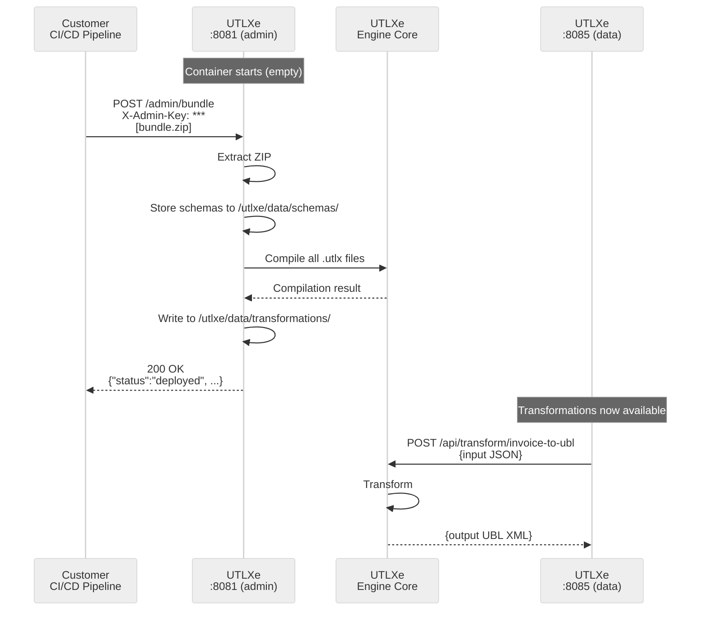
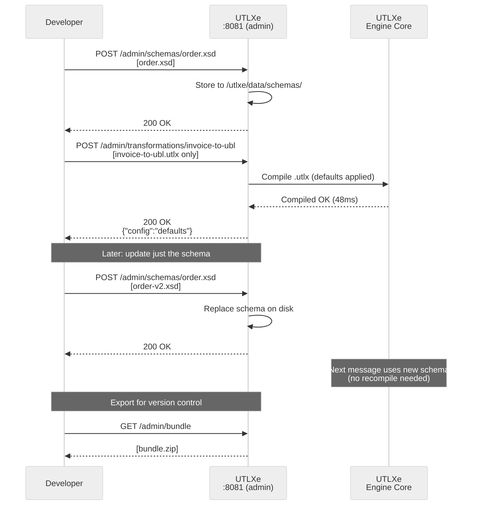

# EF03: Bundle Management API

**Status:** Design  
**Priority:** High (required for Azure Marketplace offering)  
**Created:** May 2026

---

## Summary

The Azure Marketplace delivers UTLXe as a pre-built container. Customers should not need to build custom Docker images or set up Azure Files to deploy their transformations. EF03 adds a REST management API on the health/admin port (8081) that allows customers to upload, list, update, and remove transformations, schemas, and full bundles via HTTP.

The API supports two workflows: **batch** (upload a complete ZIP bundle) and **API-first** (build up the bundle incrementally via individual REST calls). Both produce the same result — compiled transformations ready to process messages on the data plane.

## Problem

When a customer deploys UTLXe from the Azure Marketplace, they get a running container with zero transformations. Currently there is no supported way to deploy transformations without:

- Building a custom Docker image (defeats the purpose of a managed offering)
- Mounting an Azure File Share (operational burden, requires infrastructure setup)
- Writing custom entrypoint scripts to download from Blob Storage

The engine already supports dynamic loading internally — `stdio-proto` has `LoadTransformation` messages, and the HTTP mode help text says "Transforms loaded dynamically via REST endpoints." But the HTTP management surface does not exist yet.

## Architecture Decision: Single Bundle per Container

**Decision:** One bundle per container, many transformations per bundle.

| Need | Solution |
|------|----------|
| Multiple transformations | One bundle, multiple entries in `transformations/` |
| Update one transformation | `POST /admin/transformations/{name}` |
| Separate scaling or SLA | Separate Container App instances, each with their own bundle |
| Logical grouping | Naming convention: `inbound-invoice`, `outbound-invoice` |

**Why not multiple bundles?**

A bundle is a deployment unit — a directory of transformations that belong together. The question is whether a customer needs multiple deployment units in one container.

If transformations need different scaling, different configs, or different SLAs, they belong in **separate containers**. That is what containers are for. Putting multiple bundles in one container means conflict resolution (what if two bundles define `invoice-to-ubl`?), merge semantics (replace or append?), and partial failure handling (one bundle fails to compile — do the others stay?). This complexity solves no problem that isn't already handled by either "multiple transformations in one bundle" or "multiple containers."

The single-bundle model keeps the mental model simple: upload replaces everything. The per-transformation endpoints (`POST /admin/transformations/{name}`) handle incremental updates without the overhead of multi-bundle management.

## Architecture Decision: Schemas as Shared Resources

**Decision:** Schemas are top-level resources, not embedded in transformation directories.

A schema like `order.xsd` may be referenced by multiple transformations (`invoice-to-ubl`, `validate-order`, `enrich-order`). Embedding schemas inside each transformation directory creates copies that must stay in sync — a maintenance hazard.

Instead, schemas live in a shared `schemas/` directory and are uploaded independently:

```
/utlxe/data/
  schemas/
    order.xsd              ← single source of truth
    invoice.json
  transformations/
    invoice-to-ubl/
      invoice-to-ubl.utlx  (header: input json {schema: "order.xsd"})
    validate-order/
      validate-order.utlx  (header: input json {schema: "order.xsd"})
```

Updating a schema does **not** recompile transformations — schemas are resolved at validation time, not compile time. This means a schema update takes effect immediately for the next message without any downtime.

## Architecture Decision: .utlx Alone is Enough

**Decision:** A transformation can be deployed with just a `.utlx` file. The `transform.yaml` config is optional.

When no `transform.yaml` is provided, sensible defaults apply:

```yaml
# Implicit defaults
strategy: COMPILED
inputFormat: auto        # detect from .utlx header or message content
outputFormat: auto
```

This lowers the barrier to entry — the simplest possible deployment is one file, one command:

```bash
curl -X POST -H "X-Admin-Key: $KEY" \
  -F "source=@invoice-to-ubl.utlx" \
  http://admin:8081/admin/transformations/invoice-to-ubl
```

The customer can add or update the config later via `POST /admin/transformations/{name}/config` without recompiling the transformation source.

---

## Design

### Management API (port 8081)

The management API runs on the existing health/admin port, separate from the data plane (8085). This allows network isolation — the Container App exposes only 8085 via ingress, while 8081 stays internal to the VNet.

#### Bundle endpoints (batch workflow)

| Method | Path | Description |
|--------|------|-------------|
| `POST` | `/admin/bundle` | Upload a `.zip` bundle (replaces everything) |
| `GET` | `/admin/bundle` | Export current state as downloadable `.zip` |
| `DELETE` | `/admin/bundle` | Remove all transformations and schemas (returns to empty state) |
| `POST` | `/admin/bundle/validate` | Upload and validate without deploying (dry run) |

#### Transformation endpoints (incremental workflow)

| Method | Path | Description |
|--------|------|-------------|
| `GET` | `/admin/transformations` | List all deployed transformations |
| `GET` | `/admin/transformations/{name}` | Get transformation details (config, compile status, metrics, source) |
| `POST` | `/admin/transformations/{name}` | Deploy or update a transformation (`.utlx` required, config optional) |
| `POST` | `/admin/transformations/{name}/config` | Update config only (no recompile) |
| `DELETE` | `/admin/transformations/{name}` | Remove a single transformation |

#### Schema endpoints (shared resources)

| Method | Path | Description |
|--------|------|-------------|
| `GET` | `/admin/schemas` | List all uploaded schemas |
| `GET` | `/admin/schemas/{filename}` | Download a schema file |
| `POST` | `/admin/schemas/{filename}` | Upload or replace a schema file |
| `DELETE` | `/admin/schemas/{filename}` | Remove a schema |

### Two deployment workflows

#### Batch workflow: ZIP upload

For CI/CD pipelines that build the complete bundle in a build step and deploy it in one call.

```bash
# Deploy everything at once
curl -X POST -H "X-Admin-Key: $KEY" \
  -F "file=@bundle.zip" \
  http://admin:8081/admin/bundle
```

#### API-first workflow: incremental build

For interactive development, scripting, or pipelines that manage resources individually.

```bash
# Step 1: Upload shared schemas
curl -X POST -H "X-Admin-Key: $KEY" \
  -F "file=@order.xsd" \
  http://admin:8081/admin/schemas/order.xsd

curl -X POST -H "X-Admin-Key: $KEY" \
  -F "file=@invoice.json" \
  http://admin:8081/admin/schemas/invoice.json

# Step 2: Deploy transformations (just the .utlx — config is optional)
curl -X POST -H "X-Admin-Key: $KEY" \
  -F "source=@invoice-to-ubl.utlx" \
  http://admin:8081/admin/transformations/invoice-to-ubl

curl -X POST -H "X-Admin-Key: $KEY" \
  -F "source=@validate-order.utlx" \
  -F "config=@transform.yaml" \
  http://admin:8081/admin/transformations/validate-order

# Step 3: Export the assembled bundle for version control
curl -H "X-Admin-Key: $KEY" \
  http://admin:8081/admin/bundle -o bundle-backup.zip
```

Both workflows produce the same result. The customer can start with API-first, then switch to batch when they have a CI/CD pipeline. Or mix: deploy a bundle, then update individual transformations or schemas.

### Bundle ZIP format

The upload ZIP follows the existing `BundleLoader` directory convention, extended with a `schemas/` directory:

```
bundle.zip
  schemas/                          (optional — shared schema files)
    order.xsd
    invoice.json
  transformations/
    invoice-to-ubl/
      invoice-to-ubl.utlx          (required)
      transform.yaml               (optional — defaults apply)
    validate-ubl/
      validate-ubl.utlx
      transform.yaml
  engine.yaml                      (optional — engine config overrides)
```

### Single transformation upload

`POST /admin/transformations/{name}` accepts `multipart/form-data`:

- `source` — the `.utlx` file (required)
- `config` — the `transform.yaml` file (optional, defaults to COMPILED strategy)

Or a small `.zip` containing both files.

### Hot-swap

When a transformation is uploaded:

1. Parse and compile the `.utlx` source
2. If compilation fails → return 400 with error details, existing transformation unchanged
3. If compilation succeeds → atomic replace in the `TransformationRegistry`
4. In-flight messages on the old version drain naturally (they hold a reference to the old compiled transformation)
5. New messages use the new version immediately

Full bundle upload (`POST /admin/bundle`) follows the same pattern but replaces all transformations atomically.

### Response format

```json
// POST /admin/bundle — success
{
  "status": "deployed",
  "transformations": [
    {"name": "invoice-to-ubl", "strategy": "COMPILED", "status": "ready"},
    {"name": "validate-ubl", "strategy": "COMPILED", "status": "ready"}
  ],
  "schemas": ["order.xsd", "invoice.json"],
  "compiled_in_ms": 342
}

// POST /admin/bundle — compilation error
{
  "status": "rejected",
  "errors": [
    {"transformation": "invoice-to-ubl", "line": 14, "message": "Unknown function: concatX"}
  ]
}

// POST /admin/transformations/{name} — success (single .utlx, no config)
{
  "status": "deployed",
  "name": "invoice-to-ubl",
  "strategy": "COMPILED",
  "config": "defaults",
  "compiled_in_ms": 48
}

// GET /admin/transformations
{
  "transformations": [
    {
      "name": "invoice-to-ubl",
      "strategy": "COMPILED",
      "status": "ready",
      "config": "explicit",
      "deployed_at": "2026-05-05T14:30:00Z",
      "messages_processed": 12345,
      "avg_transform_ms": 2.3
    },
    {
      "name": "validate-order",
      "strategy": "COMPILED",
      "status": "ready",
      "config": "defaults",
      "deployed_at": "2026-05-05T14:31:00Z",
      "messages_processed": 12340,
      "avg_transform_ms": 1.1
    }
  ]
}

// GET /admin/schemas
{
  "schemas": [
    {"filename": "order.xsd", "size_bytes": 4820, "uploaded_at": "2026-05-05T14:29:00Z"},
    {"filename": "invoice.json", "size_bytes": 2340, "uploaded_at": "2026-05-05T14:29:05Z"}
  ]
}

// GET /admin/bundle (export)
// Returns: application/zip with the complete bundle
```

## Authentication

The management API is protected by an API key passed as an environment variable:

```yaml
UTLXE_ADMIN_KEY=my-secret-key-here
```

Requests must include the header:
```
X-Admin-Key: my-secret-key-here
```

If `UTLXE_ADMIN_KEY` is not set, the management API returns 403 on all endpoints (locked by default). This prevents accidental exposure.

The health endpoints (`/health`, `/metrics`) remain unauthenticated — they are read-only and needed by Kubernetes probes and Prometheus.

## Persistence

Uploaded transformations and schemas are written to a local directory (`/utlxe/data/`). Three persistence tiers depending on the customer's deployment:

```
/utlxe/data/
  schemas/              ← shared schema files
  transformations/      ← transformation directories
    {name}/
      {name}.utlx
      transform.yaml    (if provided)
```

| Tier | Persistence | Configuration |
|------|------------|---------------|
| **Ephemeral** | Lost on container restart | Default — no volume mount. Fine for dev/test or CI/CD re-deploy patterns. |
| **Volume-backed** | Survives restarts | Azure Files mounted at `/utlxe/data/`. Bicep template offers this as an option. |
| **CI/CD re-deploy** | External system of record | Customer's pipeline calls `POST /admin/bundle` after each container start. Readiness probe waits until bundle is loaded. |

### Startup behavior

On startup, UTLXe checks `/utlxe/data/`:
- If the directory contains transformations and/or schemas (from a previous upload + volume mount) → load them automatically
- If empty → start with zero transformations, wait for API upload
- If `--bundle` flag is also provided → load from `--bundle` path first, then accept API uploads as overrides

### Readiness probe

The existing `/health` endpoint should distinguish between "running but no transformations" and "running with transformations loaded":

```json
// No transformations loaded yet
{"status": "UP", "transformations": 0, "ready": false}

// Transformations loaded and compiled
{"status": "UP", "transformations": 3, "ready": true}
```

Kubernetes readiness probe can check for `ready: true` to avoid routing traffic before transformations are deployed. The liveness probe checks only `status: UP`.

## Azure Marketplace integration

### createUiDefinition.json

Add an optional "Persistent storage" toggle:

```
☐ Enable persistent transformation storage
  When enabled, uploaded transformations survive container restarts.
  Creates an Azure Files share mounted to the container.
```

### Bicep template changes

When persistent storage is enabled:
- Create an Azure Storage Account + File Share
- Mount the File Share at `/utlxe/data/` in the Container App
- Set `UTLXE_ADMIN_KEY` from a generated secret (stored in the Storage Account or passed via Container App secrets)

When disabled:
- No storage account created
- Customer uses CI/CD re-deploy pattern or ephemeral mode

## Sequence diagrams

### Batch workflow (ZIP bundle upload)



### API-first workflow (incremental build)



## Implementation notes

### Where it lives

The management API is a new `AdminEndpoint` alongside `HealthEndpoint` in `modules/engine`. It reuses the existing Javalin HTTP server on port 8081.

### Files to modify

| File | Change |
|------|--------|
| New: `modules/engine/.../admin/AdminEndpoint.kt` | All `/admin/*` routes |
| `modules/engine/.../registry/TransformationRegistry.kt` | Add `replaceAll()` and `remove()` for hot-swap |
| `modules/engine/.../bundle/BundleLoader.kt` | Add `loadFromZip(inputStream)` alongside existing `load(path)` |
| `modules/engine/.../config/EngineConfig.kt` | Add `adminKey`, `dataDir` config fields |
| `modules/engine/.../UtlxEngine.kt` | Wire admin endpoint, startup scan of data dir |
| `modules/engine/.../health/HealthEndpoint.kt` | Add `ready` field to health response |
| `deploy/docker/Dockerfile.engine` | Add `VOLUME /utlxe/data` and `UTLXE_ADMIN_KEY` env |

### What already exists

- `BundleLoader` — loads transformations from a directory (reuse for ZIP extraction target)
- `TransformationRegistry` — holds compiled transformations (needs atomic replace)
- `HealthEndpoint` — Javalin HTTP server on 8081 (add `AdminEndpoint` alongside)
- Hot compilation — engine already compiles `.utlx` at startup (reuse for dynamic uploads)

## Effort estimate

| Task | Effort |
|------|--------|
| AdminEndpoint: transformation endpoints (upload, list, delete) | 2 days |
| AdminEndpoint: schema endpoints (upload, list, delete) | 1 day |
| AdminEndpoint: bundle endpoints (ZIP upload, export, validate) | 1 day |
| ZIP bundle parsing and extraction | 0.5 day |
| Hot-swap in TransformationRegistry (atomic replace) | 1 day |
| Admin key authentication middleware | 0.5 day |
| Startup scan of `/utlxe/data/` directory | 0.5 day |
| Readiness probe enhancement | 0.5 day |
| Bicep template: optional Azure Files mount | 0.5 day |
| Tests | 1.5 days |
| **Total** | **~9 days** |

## Customer workflows (end to end)

### Simplest possible start (one file, one command)

```bash
curl -X POST -H "X-Admin-Key: $KEY" \
  -F "source=@my-transform.utlx" \
  http://admin:8081/admin/transformations/my-transform
# Done. Transformation is live on :8085.
```

### Production CI/CD pipeline

```bash
# Build step assembles bundle.zip
# Deploy step uploads it
curl -X POST -H "X-Admin-Key: $KEY" \
  -F "file=@bundle.zip" \
  http://admin:8081/admin/bundle
# All transformations + schemas replaced atomically.
```

### Interactive development

```bash
# Upload schemas
curl -X POST -H "X-Admin-Key: $KEY" -F "file=@order.xsd" .../admin/schemas/order.xsd

# Deploy transformations one by one
curl -X POST -H "X-Admin-Key: $KEY" -F "source=@invoice.utlx" .../admin/transformations/invoice
curl -X POST -H "X-Admin-Key: $KEY" -F "source=@validate.utlx" .../admin/transformations/validate

# Update just the schema (no recompile, immediate effect)
curl -X POST -H "X-Admin-Key: $KEY" -F "file=@order-v2.xsd" .../admin/schemas/order.xsd

# Export what you built for version control
curl -H "X-Admin-Key: $KEY" .../admin/bundle -o my-bundle.zip
```

---

*Feature EF03. May 2026. Design document.*
*Key insight: the engine already supports dynamic loading internally — EF03 is the REST surface that exposes it to Azure Marketplace customers.*
