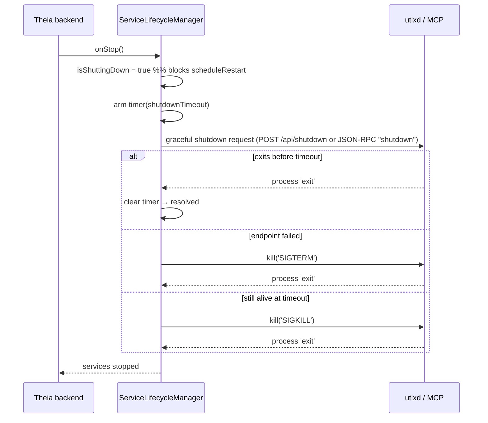
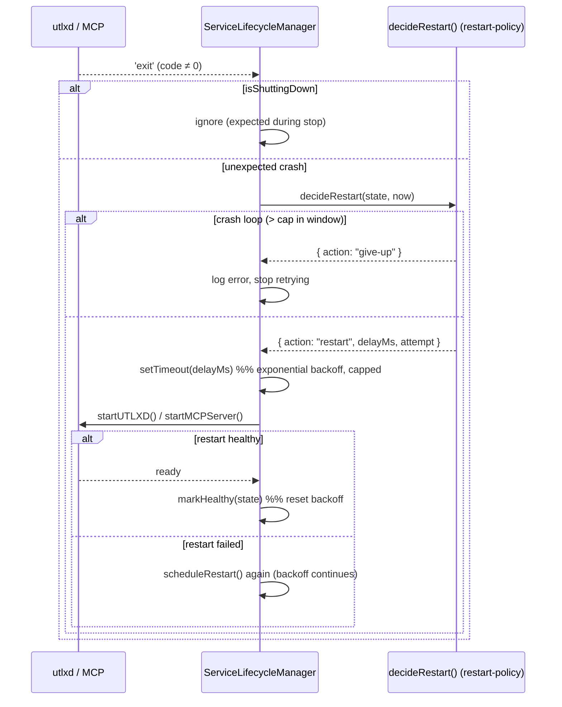
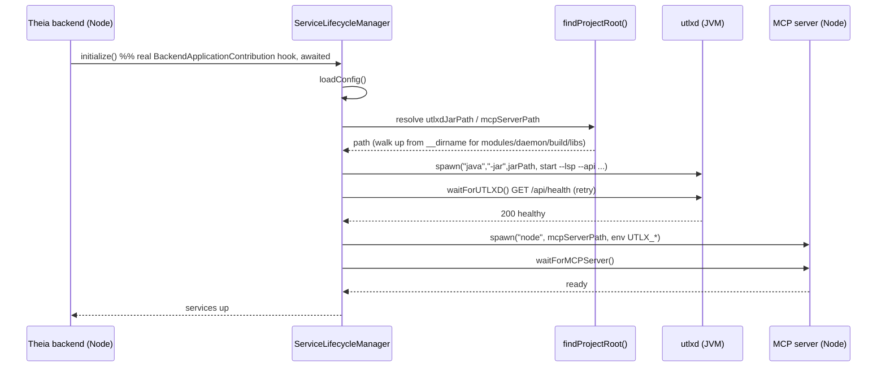

# IF06: IDE — Service Lifecycle, Supervision & Die-With-Parent Watchdog

**Status:** Implemented (May 2026) — both directions done; TS supervision has no unit-test harness yet
**Priority:** High
**Created:** May 2026
**Depends on:** existing service-lifecycle-manager (Theia backend); `utlxd`, MCP server
**Effort:** Medium (2-3 weeks)

> **Implemented — die-with-parent watchdog (child-watches-parent):**
> - `utlxd`: `ParentWatchdog.kt` (ProcessHandle PID poll; testable `checkOnce`/`isParentAlive`
>   split from the thread/`exitProcess` plumbing) + `StartCommand --parent-pid` (opt-in).
>   Unit-tested in `ParentWatchdogTest.kt` (4 tests, green).
> - MCP server: `UTLX_PARENT_PID` poll via `process.kill(pid, 0)` in `mcp-server/src/index.ts`.
> - Spawn sites pass the parent PID: `service-lifecycle-manager.ts`, `auto-start-services.ts`,
>   `utlx-daemon-client.ts` (utlxd `--parent-pid`; MCP `UTLX_PARENT_PID`).
> - Verified: child self-exits ~one poll after parent death; no parent-pid ⇒ no watchdog.
>
> **Implemented — supervision (parent-watches-child)** in `service-lifecycle-manager.ts`
> (the active `BackendApplicationContribution`; `auto-start-services.ts` is disabled):
> - `scheduleRestart()`: exponential backoff (1s→30s cap), wired from both child `exit`
>   handlers (replaces the old `// TODO: Implement restart logic`).
> - Crash-loop cap: give up after >5 restarts in a 60s rolling window, with a clear error.
> - Backoff resets once a service is healthy again.
> - `gracefulKill()`: SIGTERM, then SIGKILL after `shutdownTimeout`; `onStop()` awaits both.
> - Idempotent daemon reuse: `startUTLXD`/`startMCPServer` skip if the port is already healthy.
>
> **Note:** the extension has no JS test runner, so the TS supervision logic is covered by
> manual/integration verification only (the Kotlin watchdog has JUnit coverage). Standing up
> jest for the extension is tracked separately, not in IF06.

---

## Summary

The IDE spawns and supervises two backing services — `utlxd` (the language/transform
daemon) and the UTLX MCP server (AI assist) — as children of the Theia backend.
Today supervision is incomplete: restart logic is a TODO, and a hard crash of the
parent (Theia/Electron) leaves **orphaned** child processes holding their ports.
IF06 hardens this: robust Node-side supervision plus a **die-with-parent watchdog**
inside each child so children never outlive the IDE.

This is the "Process Lifecycle" and "Process Watchdog" design in
`theia-extension-design-with-design-time.md`.

## Problem

- `service-lifecycle-manager.ts` starts `utlxd` and the MCP server but has a TODO
  where restart-on-crash should be — a crashed daemon stays down.
- Node's exit handlers only cover *graceful* shutdown. If the Theia/Electron parent
  is `kill -9`'d or crashes, the OS does not reap the children → orphaned `utlxd` /
  MCP processes keep `7779/7777/7780` bound → the next launch hits `EADDRINUSE` and
  may silently keep talking to a stale process. This has recurred repeatedly in dev.

A Java service wrapper (Tanuki / YAJSW / jsvc) is explicitly **not** the answer:
those make a JVM an *independent* OS service that survives reboots — the opposite of
"die with the IDE" — and add a second supervisor competing with Node.

## Goals

- **Restart-with-backoff** for both children: on unexpected exit, respawn with
  exponential backoff, a max-retry cap, and crash-loop detection (stop after N
  failures in a window, surface an error to the user).
- **Graceful shutdown** on backend stop: SIGTERM, then SIGKILL after a timeout.
- **Idempotent daemon start**: reuse a healthy `utlxd` (don't restart the heavy
  JVM on every rebuild); recycle only the cheap MCP server.
- **Die-with-parent watchdog** inside each child: when the parent dies (any way),
  the child exits on its own.
- **Port pre-clean** on start: free a stale port (and matching process) before
  spawning, as a belt-and-suspenders backstop.

## Non-Goals

- An OS-level service wrapper or daemonization — rejected by design.
- Changing what the services do; this is purely lifecycle/supervision.
- The native-`utlxd` question — orthogonal (the watchdog is required regardless;
  see IF07 / design doc).

## Design

**Two complementary directions.**

1. **Parent-watches-child (supervision)** — in `service-lifecycle-manager.ts`:
   the existing `.on('exit')` hooks gain restart-with-backoff + crash-loop cap;
   `waitForUTLXD()` already gates readiness; shutdown sends SIGTERM then SIGKILL
   after a timeout.

2. **Child-watches-parent (watchdog)** — the robust orphan fix, independent of how
   the parent dies:
   - At spawn, the parent passes its PID and/or an inherited pipe FD to the child.
   - The child runs a small watchdog: if the pipe closes (EOF) or the parent PID
     disappears, it `exit()`s immediately.
   - Portable: Linux has `PR_SET_PDEATHSIG`; macOS has no equivalent, so the
     pipe/PID-watch is the cross-platform mechanism (~30 lines in `utlxd`, a few
     lines in the MCP server, a few on the Node side).

**Runtime/packaging agnostic.** The watchdog is about *process topology*, not JVM
vs. native or Electron vs. web. A native `utlxd` spawned by Node is still an
orphan-able child, so this work stands regardless of any future GraalVM decision.

### Graceful shutdown flow

`onStop()` (Theia backend stopping) sets `isShuttingDown = true` — which suppresses
restart-on-exit — then stops each service: try the service's own shutdown endpoint
first, fall back to SIGTERM, and SIGKILL if it has not exited within
`shutdownTimeout`. (Shown for one service; MCP uses its JSON-RPC `shutdown`, utlxd
uses `POST /api/shutdown`.)



### Restart-with-backoff flow

On an *unexpected* child exit (non-zero, and not during shutdown), the `exit`
handler calls `scheduleRestart()`. The pure policy (`decideRestart`, see
`restart-policy.ts`) returns either a backoff delay or a give-up verdict
(crash-loop cap). On success the backoff is reset via `markHealthy()`; a failed
restart re-enters the loop.



## Why Theia-Managed Startup Currently Fails (analysis)

Theia auto-start (`ServiceLifecycleManager` spawning `utlxd` + MCP on backend boot)
was **deliberately disabled** because it failed repeatedly. It is **not flaky** —
there are three concrete, reproducible causes, all verified against the code and
the runtime layout. The dev workflow therefore uses the script (`rebuild-and-start-mcp.sh`,
Step 8.5) which starts the services itself and launches Theia with
`AUTO_START_SERVICES=false`. Document this so nobody re-enables it blind again.

### Intended flow (what the code tries to do)



### Why it breaks in practice

1. **Jar/MCP path resolution fails under the copy deployment.**
   The browser-app does `rm -rf node_modules/utlx-theia-extension` + `yarn install
   --check-files`, so the extension runs as a **real copy** at
   `browser-app/node_modules/utlx-theia-extension/lib/node/services/` — **not** a
   workspace symlink. `findProjectRoot()` walks **up** from `__dirname` looking for
   `modules/daemon/build/libs`; from inside `node_modules` that directory is never
   on the path, so the jar path resolves to a non-existent location and
   `startUTLXD()` throws *"UTLXD jar not found"*. (The jar IS built — this is a
   path bug, not a build bug.) `mcpServerPath` resolves the same way → same failure.

2. **`java` is not guaranteed on PATH.** `spawn('java', …)` passes no explicit
   `JAVA_HOME`/PATH. A shell-launched process inherits the user's PATH (java
   present — which is why the script works); a GUI/Electron-launched backend often
   has a **minimal PATH without java** → `ENOENT`.

3. **Failures are double-swallowed, so it looks like "the IDE started fine".**
   Theia wraps `initialize()` in a try/catch that only logs *"Could not initialize
   contribution"*; `ServiceLifecycleManager.initialize()` *also* catches and logs
   *"Continuing without managed services"* without rethrowing. Net effect: the IDE
   boots, AI Assist silently doesn't work, and there is no surfaced error to chase
   — exactly the "fiddle for an hour, then turn it off" experience.

### Why this is NOT a Java service wrapper problem

A wrapper (Tanuki/YAJSW/jsvc) solves **OS-level service supervision** (run-as-
service, auto-restart, reboot survival). None of the three causes above are
supervision issues — they are *"the child was never spawned correctly"* (wrong
path, missing `java`), which happens **before** any supervision concern, and
*"errors were hidden"*. A wrapper would still need a correct jar path and a JRE to
launch, so it fixes none of this. The valuable instinct behind VS Code Java
plugins using wrappers is **bundling a JRE + robust launch**, which this project
addresses via IF07 (jlink JRE + absolute resource paths), not a wrapper.

### What an actual fix requires (for IF07 / when re-enabling)

- **Do not derive paths by walking up from `__dirname`.** Resolve `utlxdJarPath` /
  `mcpServerPath` from an explicit source: the injected env vars
  (`UTLXD_JAR_PATH`, `MCP_SERVER_PATH`) the script already sets, or — in the
  packaged app — absolute paths under the Electron app resources (asarUnpacked).
- **Spawn `java` by an explicit, resolved binary** (bundled `jlink` JRE in IF07,
  or a `JAVA_HOME`-derived path), never bare `'java'` relying on PATH.
- **Surface failures** instead of swallowing them — at minimum a visible
  notification / health indicator, so a misconfigured start is obvious.

Until those are done, keep `AUTO_START_SERVICES=false` and let the script own
startup.

## Implementation Notes

- Node side (`service-lifecycle-manager.ts`): backoff/retry state machine; pass
  `process.pid` (and/or a pipe) into the child's spawn `env`/`stdio`; SIGTERM→SIGKILL
  shutdown; port pre-clean using the existing kill helpers.
- `utlxd` (Kotlin): a daemon watchdog thread — poll the parent PID / read the pipe;
  on parent death, `exit()`. Wire into the existing `start`/`stop` lifecycle.
- MCP server (Node child): same watchdog via `process.on` of the inherited pipe /
  PID poll.
- Config: env-driven (`UTLX_PARENT_PID`, retry/backoff knobs) consistent with the
  existing `UTLXD_*` / `UTLX_MCP_*` variables.

## Acceptance Criteria

- Killing the Theia/Electron backend with `kill -9` results in `utlxd` and the MCP
  server exiting on their own within a short bound (no orphaned port holders).
- A child that crashes is restarted with backoff; a crash loop stops after the cap
  and surfaces a clear error.
- Backend graceful stop terminates both children (SIGTERM, then SIGKILL on timeout).
- A healthy pre-existing `utlxd` is reused, not restarted, across IDE rebuilds.
- No `EADDRINUSE` on a normal restart cycle.

## Testing

### Implemented unit tests + how to run them

**Kotlin — die-with-parent watchdog** (`ParentWatchdogTest.kt`, JUnit5, 4 tests):

```bash
# from the repo root
./gradlew :modules:daemon:test --tests 'org.apache.utlx.daemon.ParentWatchdogTest'
# or run the whole daemon suite
./gradlew :modules:daemon:test
```

**TypeScript — restart-supervision policy** (`restart-policy.test.ts`, jest, 5 tests).
jest + ts-jest are already installed (hoisted) at the workspace root, so no install
is needed. Run from the extension package dir:

```bash
cd theia-extension/utlx-theia-extension
# jest is hoisted to the workspace root node_modules:
../../node_modules/.bin/jest --config jest.config.js
# or target one file:
../../node_modules/.bin/jest --config jest.config.js src/node/services/restart-policy.test.ts
```

Notes:
- The jest config (`jest.config.js`) is scoped to `src/node` (node env). Test files
  match `**/*.test.ts` and run from `src` — they are **excluded from the `tsc` build**
  (`tsconfig.json`), so nothing test-related is compiled into `lib/` or shipped.
- Tests run only when jest/gradle is invoked — never at compile or at IDE/daemon startup.
- There is intentionally no `test` script in the extension `package.json` yet: its
  `prepare`/`clean`/`build` lifecycle conflicts with a plain `npm test` in this yarn
  workspace. Invoke jest via the root binary as above (or wire a workspace-level
  `yarn test` later).

### Further (manual / integration) verification

- Integration: spawn → `kill -9` the parent → assert children exit (ports freed).
  (Verified manually: MCP self-exits ~one poll after a dead parent PID.)
- Integration: kill a child → assert restart-with-backoff; force a crash loop →
  assert cap + error surfaced.
- Cross-platform: verify the pipe/PID watchdog on macOS and Linux (and Windows for
  the Electron path).

## Related

- Design: `theia-extension-design-with-design-time.md` §"Process Lifecycle" and
  §"Process Watchdog: Die-With-Parent"
- IF07 (Electron app & installers — where die-with-parent matters most)

## Effort Estimate

Medium (2-3 weeks): Node supervision/backoff + shutdown (~1 wk), `utlxd` + MCP
watchdog threads (~1 wk), cross-platform tests (~0.5 wk).
