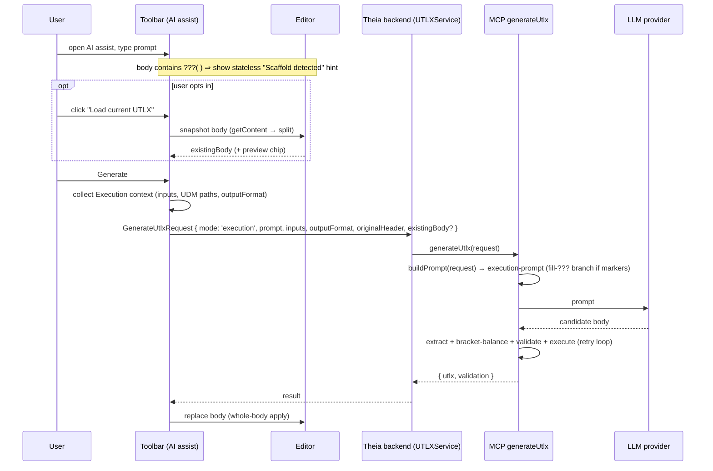

# IF08: IDE — Mode-Aware AI Assist with Current-UTLX Awareness

**Status:** Proposed
**Priority:** High
**Created:** June 2026
**Depends on:** existing AI assist (toolbar → `UTLXService.generateUtlxFromPrompt` → MCP `generateUtlx`); `ClaudeCodeProvider`/`OllamaProvider`; scaffold generator; IF04/IF05 (bundle/config context, future)
**Effort:** Medium (2-3 weeks)

> **Design decisions captured here (not yet implemented):**
> - AI assist becomes **mode-aware**. `GenerateUtlxRequest` gains a `mode` field;
>   the two IDE modes (Execution, Message Contract) get **fully separated**
>   prompt builders and context collectors — no shared `if (mode === …)` soup.
> - AI assist gains **current-UTLX awareness**, but **opt-in and user-controlled**:
>   a **"Load current UTLX"** button snapshots the editor body into the request.
>   The body is **never sent automatically** (an example/scrap transformation must
>   not silently bias the model).
> - Scaffold awareness is **stateless**: detected from the body's self-describing
>   `???(type)` markers at request time, not from a stored semaphore (no drift).
> - **v1 = Execution mode, whole-body** load + replace-all apply. Selection-scoped
>   assist (capture a selection, splice the answer back) and a Message-Contract
>   collector/prompt are **v2** (stubbed with a clear "not yet").

---

## Summary

The IDE's AI assist (toolbar → backend JSON-RPC → MCP `generateUtlx` → LLM) today
generates a transformation from the inputs and the output format alone. It has
**no awareness of what is already in the editor** and **no awareness of which IDE
mode** the user is in. Both are real gaps:

- A user who **scaffolds** the output (Scaffold Output fills the body with a typed
  skeleton) or builds part of a mapping with the **function builder** then asks AI
  to "finish it" — but the AI never sees that work.
- The same generation path is used in **Execution** and **Message Contract** mode,
  even though those modes feed the model fundamentally different context and expect
  different validation.

IF08 makes AI assist **mode-aware** with **separated** per-mode prompt construction,
and gives it **current-UTLX awareness under explicit user control** (a Load button,
plus a stateless scaffold hint). The human always decides whether existing content
influences the model.

## Problem

**No current-UTLX awareness.** The toolbar builds the request from `inputs`,
`outputFormat`, and `originalHeader` only (`utlx-toolbar-widget.tsx`); it splits the
editor into `{ header, body }` but **sends only the header** (`originalHeader`). The
body — scaffolded skeleton, function-builder partial, or hand-written work — is
discarded. So:

- Scaffolding produces a typed skeleton (`???(type)` placeholders, see
  `scaffold-generator.ts`), then AI assist regenerates from scratch, ignoring it.
- "I built half of this, finish it" is impossible to express.

But naively **always** sending the body is wrong too: an *example* or *scrap*
transformation left in the editor would silently bias the model. Inclusion must be
intentional.

**No mode-awareness.** `GenerateUtlxRequest` (`common/protocol.ts`) carries no
`mode`. The toolbar knows `currentMode` (`UTLXMode.EXECUTION` /
`MESSAGE_CONTRACT`) but never forwards it, and the MCP prompt builder
(`utlx-generation-prompt.ts`) has no mode branch. AI assist is therefore implicitly
**Execution-only**. Message Contract mode — which works from schemas/USDL rather
than instance data — has no dedicated path, and bolting `if (mode)` conditionals
onto the existing Execution prompt would entangle two genuinely different jobs.

## Goals

- Add `mode` to `GenerateUtlxRequest`; route generation through a **mode dispatcher**.
- **Separate, not intertwined:** an Execution prompt builder + context collector and
  a Message Contract prompt builder + context collector live in distinct modules;
  shared *atoms* (language reference, format guidance) are imported and composed
  independently per mode.
- A **"Load current UTLX"** button in the AI assist UI that snapshots the editor
  body into the request, with a removable preview chip. Inclusion is opt-in.
- **Stateless scaffold detection:** if the loaded body contains `???(` markers, the
  prompt instructs the model to **fill the placeholders** (preserve structure)
  rather than regenerate.
- Keep the existing validate→execute retry loop (Execution) as shared plumbing.

## Non-Goals

- **Selection-scoped assist** (capture a highlighted fragment, splice the answer
  back into that range) — deferred to v2. v1 is whole-body, replace-all.
- A **persistent "scaffold done" semaphore** or `bodyIntent` state machine —
  explicitly rejected in favor of the stateless marker check + the user's Load
  click (avoids drift; see Design).
- A **Message Contract generation prompt** with real content — v1 stubs the
  collector/prompt with a clear "not yet" so the mode boundary exists in code
  without claiming capability we haven't built.
- The function-builder "partial work" nudge (needs real state) — the Load button
  serves that case manually in v1.

## Design

### Mode boundary: why the two modes diverge

The modes are not one task plus a flag — they differ in inputs, goal, and validation:

| | **Execution mode** | **Message Contract mode** |
|---|---|---|
| Context to the model | instance data + UDM paths, output format, (opt-in) current body | input/output **schemas / USDL** (Tier-2), contracts |
| Goal | map real data shapes → output instance | structural / contract-level mapping |
| Validation | compile **+ execute** against instance data | compile **+ schema conformance** (design-time) |
| Scaffold source | output instance/schema structure | schema/contract structure |

Every prompt paragraph would otherwise sprout `if (mode === …)`. Separation keeps
each builder readable and independently testable.

### Separation architecture (both sides of the wire)

- **MCP/backend.** A thin `buildPrompt(request)` dispatcher switches on
  `request.mode` and delegates to **distinct modules**:
  `prompts/execution-prompt.ts` (what `utlx-generation-prompt.ts` becomes) and a new
  `prompts/message-contract-prompt.ts`. They may import shared atoms
  (`utlx-language-reference.md`, `buildOutputFormatGuidance`, `usdl-context.ts`) but
  compose them independently — **no shared conditional bodies**.
- **Frontend (toolbar).** A mode-keyed **context collector**: Execution pulls
  instance data / UDM paths (today's behavior); Message Contract pulls
  schemas / USDL. Same dispatcher shape.
- **Shared plumbing only at the edges:** transport to MCP, the
  validate→(execute|conform) retry loop, code extraction / bracket-balance. The
  *prompt text and context* are per-mode; the *mechanics* are common.

### Current-UTLX awareness — opt-in and user-controlled

A **"Load current UTLX"** button in the AI assist box **snapshots the editor body
at click time** and attaches it to the request as `existingBody`, shown as a small
**removable preview chip**. Snapshot-at-click is deliberate: it sidesteps any stale
state (you see exactly what will be sent, and can remove it), and it unifies the
scaffold, function-builder-partial, and hand-written cases into one explicit
gesture. Scrap/example content never leaks, because the body is included **only when
the user asks**.

Apply-back in v1 is **replace-all** (matches today's behavior): the model returns a
full body and we replace the editor body. This is predictable and trivially
reversible (one undo).

### Scaffold detection is stateless

The scaffold generator emits typed placeholders `???(type)` for every unfilled field
(`scaffold-generator.ts`), e.g.:

```
{
  orderId: ???(string),
  total: ???(number),        // (required)
  lines: [ { sku: ???(string), qty: ???(number) } ]
}
```

`???(...)` is not valid UTLX — it is an unambiguous "fill me in" marker that
**survives reloads and file open** and **self-invalidates** as placeholders get
filled. So scaffold-awareness needs **no stored semaphore**: the prompt builder
checks `existingBody.includes('???(')` at request time and, if present, switches to
a **fill-the-placeholders** instruction (preserve the field structure; replace each
`???(type)` with a real mapping expression from the inputs). A persistent flag was
rejected precisely because it would drift (e.g. user deletes the scaffold and types
scrap while the flag stays set).

A **stateless scaffold hint** in the AI box (also derived from `???(` at render time)
nudges discoverability — *"Scaffold detected — load it?"* — by **pre-arming** the
Load button. It never auto-sends; the click stays with the user.

### Flow (Execution mode, v1)



## Implementation Notes

- **Protocol:** add `mode: 'execution' | 'message-contract'` and optional
  `existingBody?: string` to `GenerateUtlxRequest` (`common/protocol.ts`). Toolbar
  fills `mode` from `currentMode` and `existingBody` only when the chip is present.
- **MCP dispatch:** introduce `buildPrompt(request)` switching on `mode`; move the
  current builder into `prompts/execution-prompt.ts`; add a stubbed
  `prompts/message-contract-prompt.ts` that returns a clear "Message Contract AI
  assist is not yet implemented" until v2.
- **Fill-`???` branch:** in the Execution builder, when `existingBody?.includes('???(')`,
  emit the placeholder-fill instruction and pass the body verbatim; otherwise the
  body (if present) is "continue/refine this".
- **Toolbar UI:** Load button + removable preview chip + stateless scaffold hint
  (both derived from current editor content; no new widget state machine).
- **No semaphore:** do **not** add persistent scaffold/`bodyIntent` state.

## Acceptance Criteria

- `GenerateUtlxRequest` carries `mode`; the toolbar sends `EXECUTION` today and the
  MCP routes via the dispatcher (Message Contract path returns the stub).
- Without clicking Load, the body is **never** sent (verified: scrap in the editor
  does not change generation).
- Clicking Load attaches the current body, shows a removable chip, and the result
  replaces the body.
- A scaffolded body (`???(type)`) loaded into the prompt yields a **filled** result
  that preserves the scaffold's field structure.
- Execution and Message Contract prompt builders live in separate modules with no
  shared mode-conditional bodies.

## Testing

- **Unit (MCP):** `buildPrompt` dispatch (execution vs stub); the fill-`???` branch
  fires only when markers are present; body omitted when `existingBody` is absent.
- **Unit (frontend):** request builder includes `mode` always and `existingBody`
  only when the chip is set; scaffold hint derives purely from current content.
- **Manual/integration:** scaffold → Load → Generate fills placeholders; scrap left
  in editor without Load does not influence output; mode indicator matches the
  `mode` sent.

## Related

- AI assist provider work: `ClaudeCodeProvider` / `OllamaProvider`, `LLMGateway`
- MCP generation: `mcp-server/src/tools/generateUtlx.ts`,
  `prompts/utlx-generation-prompt.ts`, `llm/usdl-context.ts`
- Scaffold: `browser/utils/scaffold-generator.ts`,
  `utlx-frontend-contribution.ts` (`handleScaffoldOutput`)
- Modes: `common/protocol.ts` (`UTLXMode`), `docs/architecture/ide-modes-specification.md`
- IF04 (transform/config editor), IF05 (bundle operations) — future context sources

## Effort Estimate

Medium (2-3 weeks): protocol `mode`/`existingBody` + dispatcher + module split
(~0.5 wk), Execution prompt fill-`???` branch + retry-loop wiring (~0.5 wk), toolbar
Load button + chip + stateless hint (~1 wk), tests + manual verification (~0.5 wk).
v2 (selection-scoped assist; real Message Contract collector/prompt) is tracked
separately.
