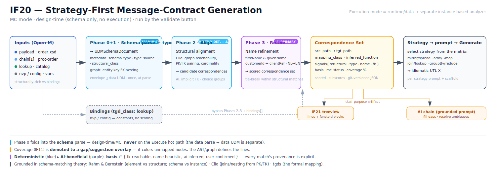
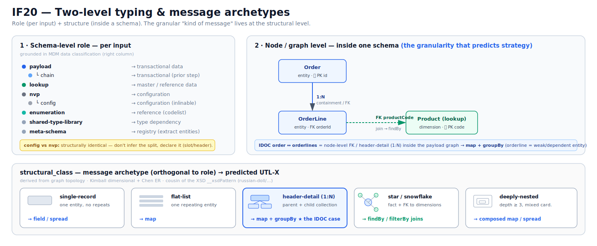

# IF20: IDE — strategy-first Message Contract generation (analyze inputs → choose a mapping strategy → strategy-specific prompt)

**Status:** Proposed (design). Not implemented. **Formalized (Jun 2026)** — the placeholder
driver/lookup/enrichment roles are now grounded in **schema matching & mapping / data-exchange theory**
(Rahm & Bernstein, Clio, tgds): a four-phase, schema-graph pipeline with a Phase-0 schema-type gate and a
scored, persisted **correspondence set**. `utils/strategy.ts` is a name-heuristic **v0 stand-in** for this.
**Priority:** High — the current single fixed MC prompt produces verbose, one-by-one mappings,
doesn't use UTL-X's expressive constructs (`...` spread, joins, `map`/`groupBy`), and treats all
inputs as equals (ignores lookup/reference tables). A strategy-first pipeline fixes all three and
makes generation faster *and* more idiomatic.
**Created:** June 2026
**Component:** mcp-server prompt pipeline (`prompt-dispatcher.ts`, `message-contract-prompt.ts`) +
IDE analysis (`utils/coverage.ts`, input/output panels). Front-end + mcp-server. No daemon/CLI/engine.
**Depends on:** IF11 (deterministic coverage + LLM gap refinement), IF10 (per-input UDM/abstract),
the scaffold generator (`utils/scaffold-generator.ts`), the mode dispatcher.
**Related:** IB05 (output **data** vs **schema** format — must be fixed first/with this); IF21 (the
treeview is the human-facing surface for this analysis).

> **Scope note (Jun 2026):** MC mode is the priority (Open-M's core). The MC analysis is
> **schema-based**; Execution mode needs its **own, instance-based** analysis (it has real values:
> cardinality, value-overlap, observed keys) — they are **separate analyzers, not shared** (Rahm &
> Bernstein's schema-only vs instance-based axis). Execution is out of scope here / deferred (its
> prompting works to a degree and is not being touched).

## Diagrams

- **Pipeline / flow** — [`IF20-pipeline.svg`](./IF20-pipeline.svg): inputs → schema parse+type → align →
  refine → correspondence set → strategy → generate, with the bindings branch, the deterministic↔AI split,
  and the dual-purpose artifact (IF21 + AI chain).
- **Typing model** — [`IF20-typing.svg`](./IF20-typing.svg): two-level typing (schema-level role +
  node/graph-level FK/header-detail) and the `structural_class` message archetypes.





---

## Motivation

MC-mode generation today is **one fixed prompt** (`message-contract-prompt.ts`): "fill every output
field from a source." Three problems:

1. **It enumerates fields one-by-one.** Even with a coverage-aware scaffold, the structure *bakes in*
   per-leaf copying — so the model writes 200 assignments instead of `...$driver` + a few overrides.
   The scaffold is right for *synthesis* shapes and wrong for *mirror* shapes.
2. **It ignores the expressive language.** Spread, pipelines, `map`/`groupBy`/`reduce`, joins —
   the nice parts of UTL-X — are rarely produced because the prompt frames the task as field filling.
3. **It treats all inputs as equals.** With multiple inputs, the 2nd/3rd is often a **lookup table**
   (joined by key), not a co-equal source. A flat "source each field" framing misses the join shape.

The deterministic **coverage** (IF11) is fast and is the field-level map — but the *best structural
shape* of the mapping depends on the problem, and no single prompt/scaffold encodes every shape.

## Core idea

Add a **planning layer** before generation. Instead of `mode → prompt`, do:

```
mode → ANALYZE (schema typing → graph → structural alignment → name refinement) → STRATEGY → strategy-specific prompt(s) → generate
```

A first pass **classifies the problem and picks a strategy**; generation then uses the prompt (and
scaffold style) that fits that strategy, so it reaches for the right constructs. **Coverage grounds
the field-level sourcing within whichever strategy** — strategy decides the *shape*, coverage decides
the *sources*.

## Core design thesis: the schema graph is the substrate

`strategy.ts` operates on element **names as surface syntax**. Names carry no structural or relational
semantics, producing noise exactly at the junctions that matter most — FK-anchored joins, flattened
repeating groups, polymorphic subtypes. A credible strategy requires the **schema graph as its
substrate**. Three axes, grounded in Rahm & Bernstein (2001):

1. **Schema graph + keys/FKs (Clio-style associations).** Schema mapping is graph reachability under
   integrity constraints. PK elements define identity anchors; FK relationships define navigable
   association edges; cardinality signatures characterize repeating groups and optional subtrees.
   Candidate correspondences are derived from **graph reachability**, scored by type compatibility,
   cardinality match, FK pairing, and depth similarity — **not** from names.
2. **Element-level vs structure-level split** — two distinct coverage layers:

   | Level | Question answered | Signal source |
   |---|---|---|
   | Element-level | Can this source element map to this target element? | name similarity, type compatibility, value domain |
   | Structure-level | Can this source subtree satisfy this target subtree? | cardinality, nesting depth, FK reachability, graph isomorphism |

   `strategy.ts` operates *only* at the element level. Structure-level analysis requires the schema
   graph to precede it — which is why IF20 is **strategy-first**.
3. **MC (schema) vs Execution (instance) as distinct analyses.** MC asks "is this mapping structurally
   possible? what coverage gaps exist?"; Execution asks "given a concrete input, what does the transform
   actually produce?" A mapping can be schema-complete but instance-incomplete, or instance-adequate but
   schema-unsound. Conflating them (as name heuristics do) produces false confidence.

**Key design constraint:** graph construction operates on the **UTL-X Universal Data Model (UDM)**
layer, *not* on raw format-specific ASTs (XSD, JSON Schema, Avro). The matchers apply to **UDM schema
graphs** — otherwise we'd maintain four diverging per-format strategy implementations.

## The four-phase strategy pipeline

A schema-typing phase (**Phase 0**) precedes everything: the type of each input determines whether and
how it enters the pipeline at all.

0. **Schema typing** — classify every input schema by role and structural class *before* any matching.
   (See [Phase 0](#phase-0-schema-type-classification).)
1. **Graph construction** — parse structurally-rich inputs (`payload`, `chain`, `lookup`) into typed UDM
   schema graphs. Annotate nodes (PK, FK, required, optional, repeating, choice) and edges (containment,
   reference, sequence). Merge `include`-composed fragments; register `import`-composed dependencies as
   shared-type libraries.
2. **Structural alignment** — derive candidate correspondences from graph reachability (Clio-style).
   Score by structural compatibility; produce a ranked correspondence set with confidence scores.
3. **Name refinement** — apply name similarity as a tie-breaker *within* structurally compatible
   candidates only. Name heuristics never elevate a structurally incompatible candidate.

`nvp`, `config`, and `enumeration` inputs bypass Phases 1–3 entirely and are registered directly as
**bindings** or constraint annotations.

### Node typology (within a schema — supports Phase 1 annotation)

Type each schema **node** by its structural role — derived from the schema graph + keys/constraints, not
from the format or name guesses (XML attributes / CSV columns are surface):

- **entity / collection** — a (repeating) structure; cardinality = array vs object.
- **key** — an identifying field of an entity.
- **reference (foreign key)** — a field whose value identifies a node in *another* input ⇒ a **join edge**.
- **containment** — nesting (parent → child).
- **value / attribute** — a leaf scalar.

This **replaces** the placeholder driver/lookup/enrichment roles: a "lookup table" is just an entity the
driver **references by foreign key**; the driver is the entity the output's top-level collection iterates.
Roles fall out of the **schema graph + FK edges** — deterministic, far stronger than name heuristics.

> **Interim (current `strategy.ts` v0):** driver / lookup / enrichment via a usage-count + keyish-name
> heuristic over the coverage matrix — a pragmatic placeholder, superseded by the typology above.

---

## Phase 0: Schema Type Classification

Before the pipeline runs, every input schema gets a **schema type**. The type governs which phases apply
and how the schema participates in the correspondence set. (Payload schemas may be XSD, JSON Schema, TSCH
(Frictionless Table Schema), or OSCH (EDMX/OData) — classification operates on the **UDM** representation,
not the source format.)

### Type taxonomy

```
schema_type
├── payload              primary message contract; rich structure, FK/PK, nesting
│   └── chain            payload from a prior pipeline step; same structural class, temporal role
├── lookup               reference/enrichment data; structurally rich but role is join/enrich, not primary
├── nvp                  name-value pairs; flat, homogeneous; drives variable bindings in the mapping
│   └── config           NVP subtype; deployment/environment constants; candidate for compile-time inlining
├── enumeration          closed value set / codelist; drives filter/validation logic, not field binding
├── shared-type-library  import dependency; no standalone role; provides types to other schemas
└── meta-schema          schema registry (EDMX, schema-of-schemas); requires entity extraction before use
```

### Pipeline participation by type

| Schema type | Phase 0 | Phase 1 | Phase 2 | Phase 3 | Registered as |
|---|---|---|---|---|---|
| `payload` | ✅ classify | ✅ graph | ✅ align | ✅ refine | correspondence |
| `chain` | ✅ classify | ✅ graph | ✅ align | ✅ refine | correspondence (`tgd_class: enrichment`) |
| `lookup` | ✅ classify | ✅ graph | ✅ align | ✅ refine | correspondence (`tgd_class: lookup`) |
| `nvp` | ✅ classify | ❌ | ❌ | ❌ | binding |
| `config` | ✅ classify | ❌ | ❌ | ❌ | binding (compile-time candidate) |
| `enumeration` | ✅ classify | ❌ | ❌ | ❌ | constraint annotation |
| `shared-type-library` | ✅ classify | ✅ merge into parent graph | ❌ standalone | ❌ | type dependency |
| `meta-schema` | ✅ classify → extract entities | ✅ graph per entity | ✅ align | ✅ refine | correspondence per entity |

### Classification tests (ordered; first to fire wins)

**Test 0 — Format-level meta-schema detection** *(before structural analysis)*
- Root is `edmx:Edmx` → `meta-schema` (extract `EntityType` nodes, then re-classify each)
- XSD with no top-level `xs:element`, only `xs:complexType` → `shared-type-library`
- JSON Schema with only `$defs`/`definitions`, no top-level `properties` → `shared-type-library`

**Test 1 — Include vs import composition**
- Same `targetNamespace` as referencing root (XSD `xs:include`, JSON Schema same-document `$ref`) → merge into root graph; not standalone
- Different `targetNamespace` (XSD `xs:import`, JSON Schema external URI `$ref`) → `shared-type-library`

**Test 2 — Flat test** *(NVP / config / enumeration candidate)* — all must hold:
- Max nesting depth ≤ 2 · no FK/PK annotations · no repeating groups (`maxOccurs > 1`/arrays) · all leaves scalar primitives

If flat, discriminate: homogeneous string→string pairs → `nvp`; scalar but mixed types → `config`;
no value side, keys are the values of interest (codelist) → `enumeration`.

**Test 3 — Structural richness** *(payload / lookup candidate)* — any of:
- Nesting depth ≥ 3, OR ≥ 1 repeating group (`maxOccurs > 1` / array), OR ≥ 1 FK/PK-like constraint (`xs:key`/`xs:keyref`, `$ref` chain, FK annotation) → discriminate further:

**Test 4 — Chain detection** — passes Test 3 AND schema fingerprint matches a known prior target in the pipeline → `chain`.

**Test 5 — Lookup detection** — passes Test 3 AND no FK reachable *to* the target schema AND self-contained reference structure (one PK + descriptor fields, depth ≤ 3, no outbound FKs beyond internal cross-refs) → `lookup`.

**Test 6 — Default** — passes Test 3, not chain, not lookup → `payload`.

### Ambiguous cases
- **Multi-root XSD suites** (peer files, no entry point) cannot be classified without an anchor. The
  `%utlx` header declaration (`input orders xsd`) **is** the disambiguator: the named input is the root;
  everything reachable is classified relative to it. Without a declaration, the type engine **errors**
  rather than guesses.
- **Chain identity** needs a fingerprint registry of prior step outputs. On first run it's empty → all
  inputs default to `payload`; the registry fills as the pipeline runs and MC analyses persist.

### Type annotation in the correspondence set

```json
{
  "inputs": {
    "primary": { "schema": "schemas/sales-order.json", "format": "json-schema", "schema_type": "payload" },
    "chain":  [ { "schema": "schemas/processed-order.xsd", "format": "xsd", "schema_type": "chain", "chain_index": 1 } ],
    "lookup": [ { "schema": "schemas/product-catalog.json", "format": "json-schema", "schema_type": "lookup" } ],
    "bindings": {
      "global_config": { "schema": "schemas/global-config.nvp", "schema_type": "config" },
      "shared_vars":   { "schema": "schemas/shared-vars.nvp",  "schema_type": "nvp" },
      "pipeline_vars": { "schema": "schemas/pipeline-vars.nvp","schema_type": "nvp" }
    }
  }
}
```

### Where the tag lives — a schema-document envelope, not the data UDM (resolved, code-grounded)

Schema-type is carried by a **new design-time `UDMSchemaDocument` envelope**, *not* by the runtime data
UDM. Grounded in the code (`modules/core/.../udm/udm_core.kt`):

- Core `UDM` is the **runtime data/instance model** (`Scalar | Array | Object | DateTime | Date | …`) — it
  represents *values*, not schemas. Schema-type (`payload`/`lookup`/…) is an **input role** decided at
  design time; it is meaningless on instance data. So the tag belongs on the **schema representation**, in
  an envelope — the delta's "envelope around the graph, not a node in the graph," with the one correction
  that the graph is the **schema** graph, distinct from the data UDM:

```
UDMSchemaDocument            ← NEW (design-time); not the data UDM
  ├── metadata: UDMSchemaMeta   (schema_type, type_source, role, lookup_key, chain_index, fixed)
  └── graph: <UDM-based schema graph>   ← greenfield; no UDMSchema/SchemaGraph in core today
```

Phase 0 typing thus folds into the **schema-parse step**: parsing an input **schema** yields a *typed*
`UDMSchemaDocument`, and Phases 1–3 receive already-typed inputs (the four-phase pipeline collapses to
*parse+type → align → refine*). Type resolution runs inside the schema parser with the priority cascade
**platform slot > inline `x-utlx` tag > `%utlx` header > Phase-0 inference > error**, recorded as
`type_source`.

> **This is the *schema* parse, not the data parse — it never touches the Execute hot path.** There are two
> distinct parses: the **data parse** (runtime/Execution) turns an input *instance* into the **data UDM**
> per message; the **schema parse** (design-time/MC) turns an input *schema* into a `UDMSchemaDocument` when
> a schema is loaded/changed. Phase 0 folds into the latter only. Execute never parses schemas or runs
> typing, so this adds **zero** Execute-path cost. (Keep `classifySchemaType()` a separate, testable
> function the schema parser *calls* — fold the *artifact and timing* into the parse, not the classifier code.)

**Backward compatibility: none broken.** The envelope is additive and design-time — it does **not** touch
the runtime data UDM type, format parsers/serializers, the engine, the `.udm` UDM-Language format and its
roundtrip tests, the conformance suite, or the `utlxe` proto/SDKs. Because the UDM-based schema graph is
**greenfield** (schemas today parse to *data*-UDM or to IDE field-trees), it is *defined with* the envelope
from day one — nothing to migrate.

**Do NOT overload the data UDM.** `UDM.Object` has `attributes` + a `metadata: Map<String,String>` map, so
one *could* inject `schema_type` there — but that map is a **reserved, `__`-prefixed format-fidelity
channel** (XML namespace context; the detected XSD design pattern `__xsdPattern` = russian-doll /
salami-slice / venetian-blind / …), and the **UDM-Language serializer writes it to `.udm`** for roundtrip.
So it's wrong on three counts: per-instance/per-node granularity, a reserved *fidelity* channel (not a
design-time analysis store), and persisted to `.udm` (overloading risks roundtrip tests). (Its
`// Internal metadata (not serialized)` comment at `udm_core.kt:102` is inaccurate and should be fixed.)
Version the envelope with the schema-document / correspondence-set artifact, **decoupled** from the `.udm`
format version.

> **Note on "design-time":** here it means **MC mode** — schema-based, *no data execution*. The
> `UDMSchemaDocument` envelope is an MC/design-time artifact; the runtime data UDM is Execution mode's
> output. (Consistent with the MC = schema / Execution = instance separation above.)

### Taxonomy refinement & the structural archetype axis

Typing happens at **two levels**, and most of the granular signal lives at the second:

1. **Schema-level type** (`payload`/`lookup`/`nvp`/…) — the input's **role** in the mapping (above).
2. **Node/graph-level type** (Phase 1) — **entity / key / reference(FK) / containment / value** on the
   nodes and edges *inside* a schema. **This is where the real granularity is.** An SAP **IDOC**'s
   *orders with id ↔ orderlines with id* is a **node-level FK / header-detail (1:N) relationship inside the
   `payload` graph** — not a new top-level type. It's exactly this relationship that predicts the mapping
   shape: header + lines with a 1:N containment/FK ⇒ `map`/`groupBy`. (In ER terms, an orderline is a
   **weak/dependent entity** under an identifying relationship — the canonical transactional-message shape.)

Two refinements follow:

**(a) `config` vs `nvp` — don't *infer* the split.** Structurally they're near-identical (flat key→scalar);
the real difference is **role/lifecycle** (`config` = deploy-time constants, inlinable; `nvp` = runtime
variables), which shape can't reveal reliably. So **infer a single `bindings` kind** and refine to
`config`/`nvp` **only by declaration** (slot/header) — which the priority cascade already favors. The thin
"homogeneous-strings vs mixed-scalars" test (Test 2) is a weak seam; lean on declaration there.

**(b) Add a `structural_class` axis — orthogonal to `schema_type`, derived from the graph topology.** This
names the "kind of message" feeling and is *predictive of strategy*:

| `structural_class` | Graph signature | Predicts |
|---|---|---|
| `single-record` | one entity, no repeating groups | direct/spread |
| `flat-list` | one repeating entity, no nesting | `map` |
| `header-detail` (1:N) | parent entity + child collection via containment/FK (the IDOC case) | `map` + `groupBy` |
| `star` / `snowflake` | a fact entity with FK edges to `lookup` dimensions | `findBy`/`filterBy` joins |
| `deeply-nested` | depth ≥ 3 containment, mixed cardinalities | composed `map`/spread |

`structural_class` lives on the `UDMSchemaDocument` envelope alongside `schema_type`. The XSD design
patterns already in the codebase (`__xsdPattern`: russian-doll / salami-slice / …) are the *serialization*
cousin of this; `structural_class` is the *relational/shape* cousin and the one that drives function
inference.

> **Showing it (Validate / IDE):** surface `schema_type` + `type_source` (and, where useful,
> `structural_class`) as a **per-input chip** (`$order ▸ payload · header-detail (header)`), **distinct
> from** the green format/UDM *validity* indicator — green answers "is it valid?", the chip answers "what
> role/shape is it?". This is the "Classify inputs" stage of the Validate panel.

---

## The mapping matrix → the correspondence set

Generalize the IF11 coverage report (1 input → output) to an **inputs × output-leaves matrix**: per
output leaf, which input/source (or derivation, or gap) feeds it. The matrix reveals **input roles** (a
column used only as a key ⇒ lookup; a column feeding most leaves ⇒ driver), drives **strategy selection**,
and grounds **field-level sourcing**. Formalized, the matrix **is** a scored, persisted correspondence set.

### Persistence: a JSON correspondence set (recommended)

Persisted alongside the UTL-X script, versioned in git. (Alternatives — OAEI Alignment Format / COMA
internal XML / raw tgd-GLAV notation — are academic or tool-internal; JSON is the pragmatic de-facto.)

- **Git-diffable** — score changes between schema versions are visible.
- **Per-signal subscores** alongside the composite — critical for explainability and tuning.
- **`basis`** distinguishes machine-generated from human-validated.
- No external toolchain dependency.

> **Key principle: always store subscores, not just the composite.** A flat `0.87` is opaque.
> `{ structural: 0.91, type: 0.95, name: 0.61 }` shows *why* a match scored high and which signal to
> distrust if the mapping is wrong.

```json
{
  "meta": { "utlx_version": "1.2", "generated": "2026-06-13T10:00:00Z",
            "source_schema": "schemas/sales-order.json", "target_schema": "schemas/invoice.xsd",
            "strategy": "clio-structural-v1", "status": "draft" },
  "correspondences": [
    { "id": "c001", "src_path": "SalesOrder.customerId", "tgt_path": "Invoice.clientRef", "relation": "eq",
      "composite_score": 0.87,
      "signals": { "structural": 0.91, "type_compat": 0.95, "name_similarity": 0.61, "fk_reachable": true },
      "basis": "fk-reachable", "phase": "structural-alignment",
      "notes": "Both are FK references to the Customer/Client entity; type string, cardinality 1:1" },
    { "id": "c003", "src_path": "SalesOrder.orderDate", "tgt_path": "Invoice.issueDate", "relation": "eq",
      "composite_score": 0.94,
      "signals": { "structural": 0.88, "type_compat": 1.0, "name_similarity": 0.72, "fk_reachable": false },
      "basis": "user-confirmed", "phase": "name-refinement",
      "confirmed_by": "mgrauwen", "confirmed_at": "2026-06-13T11:23:00Z" }
  ],
  "coverage": {
    "source_elements": 14, "target_elements": 12, "matched": 10, "coverage_pct": 83.3,
    "unmatched_target": [
      { "path": "Invoice.vatNumber", "required": true, "gap_type": "no-source-candidate",
        "notes": "No structural or name match in source; must be a literal or derived" }
    ]
  }
}
```

### Field reference

| Field | Purpose |
|---|---|
| `src_path` / `tgt_path` | dot-notation UDM paths; `[*]` denotes a repeating group |
| `relation` | `eq` (equivalence), `lt`/`gt` (subset), `approx` |
| `composite_score` | weighted combination of signals; `0.0–1.0` |
| `signals.structural` | structure-level score (cardinality, depth, graph reachability) |
| `signals.type_compat` | type compatibility score |
| `signals.name_similarity` | linguistic similarity (normalized edit distance / synonym match) |
| `signals.fk_reachable` | boolean: derived from a FK path in the schema graph? |
| `basis` | `fk-reachable` \| `name-heuristic` \| `ai-inferred` \| `user-confirmed` |
| `phase` | which pipeline phase produced this correspondence |
| `coverage.unmatched_target` | target elements with no source candidate — the MC gap report |

---

## Output (target) field analysis — the dual of input typing

IF20 types **inputs** (Phase 0) and aligns **source→target** — but the **output contract deserves a
symmetric pass**: classify each *target* field by **how it must be produced**, much of it inferable from
the output schema *alone* (name + type + constraints + structural context), with the source only deciding
copy-vs-gap. This is the target-driven half that *feeds* `mapping_class`/`inferred_function` (below).

| Output-field kind | Signal (mostly from the output schema) | Needs source? | UTL-X | mc_status |
|---|---|---|---|---|
| **copy / direct** | scalar, a type-compatible source exists | 1 source | field ref | complete |
| **calculated / derived** | composite/formatted; name like `fullName`, `displayDate` | source(s) + computation | `concat` / format / arithmetic | derivation-gap |
| **aggregate** | numeric over a sibling repeating group (`total`, `count`, `avg`) | a source collection | `sumBy` / `reduce` / `countBy` | derivation-gap |
| **lookup-required** | descriptive field + a code/id sibling + a `lookup` input present | source + join | `findBy` / `filterBy` | complete / gap |
| **constant / literal** | required, no candidate, fixed/enum | none (or config binding) | literal / binding | complete via binding |
| **generated / system** | `id` / `uuid` / `timestamp` / `correlationId` names | none / pipeline var | `uuid()` / `now()` / binding | complete via generator |
| **conditional** | boolean / `status` / flag from a condition | source(s) + predicate | `if` / `match` | derivation-gap |
| **default / optional** | optional with a default | none | omit / default | complete |
| **unmapped** | required, no plausible source or derivation | — | — | gap (human) |

**When it runs:** at contract-load, **before alignment** — it needs no inputs, and it proactively flags
*"this field needs an aggregate / a lookup / a computation"* up front. Then:

```
mapping_class  =  output-field-kind  ×  source availability (from alignment)
```

So `mapping_class`/`mc_status` is the *synthesis* of this target classification and the source→target
correspondences. The existing **`derivation-gap`** is just one cell of this fuller table — generalizing it
makes the MC report a structural draft of the mapping, not a coverage %. Most signals are schema-local
(name + type + constraint + sibling cardinality); a small **AI assist** covers semantic names
(`netDue` ⇒ aggregate? `clientRef` ⇒ lookup?) — flagged `basis: ai-inferred`.

> **IF21 tie-in:** this *types* the output pane. Each output node's coverage color gains a **reason** —
> not just direct/derivable/gap but **why** (calculated · lookup · aggregate · generated · constant) —
> which is exactly the content of IF21's functoid blocks. Output analysis is what makes those blocks
> meaningful before any source line is drawn.

## Function inference belongs inside MC — not a separate layer

### The false-coverage problem

An MC analysis that reports `SalesOrder.lines[*].price → Invoice.orderTotal : MATCHED` is **wrong** — it's
a *derivation gap dressed as a match*. The target requires `sum(map(lines, l => l.qty * l.price))`. Without
surfacing this, the report gives false confidence and an inflated coverage %. Likewise
`SalesOrder.lines[*] → Invoice.lineItems[*] : MATCHED` is incomplete without knowing it implies `map()`
(and `orderBy() + map()` if the target is sorted) — still a **schema-level** observation, so it belongs in MC.

### The reframing

Function inference is **not** a hidden layer between MC and Execution — it is the **completion of Layer 1
(MC)**. A correspondence without a `mapping_class` and `inferred_function` is an *incomplete MC result*:

```json
{ "id": "c005", "src_path": "SalesOrder.lines[*].price", "tgt_path": "Invoice.orderTotal",
  "composite_score": 0.81, "mapping_class": "derivation-gap", "inferred_function": null,
  "requires": "aggregation — sum over repeating group", "mc_status": "incomplete", "basis": "structural-analysis" }

{ "id": "c006", "src_path": "SalesOrder.lines[*]", "tgt_path": "Invoice.lineItems[*]",
  "composite_score": 0.94, "mapping_class": "array-transform", "inferred_function": "map",
  "mc_status": "complete", "basis": "fk-reachable" }

{ "id": "c007", "src_input": "productCatalog", "src_path": "Product.description",
  "tgt_path": "Invoice.lineItems[*].productName", "composite_score": 0.89,
  "mapping_class": "lookup-join", "inferred_function": "findBy", "inferred_key": "productCode",
  "mc_status": "complete", "basis": "fk-reachable" }
```

`mapping_class` / `inferred_function` are **Phase-1/2 output** — deterministic from the schema graph where
possible, AI-proposed for derivation gaps. They turn the MC report from a coverage % into a **first draft
of the mapping structure**.

### Revised two-layer model (drop the three-layer model)

```
Layer 1 — MC (schema-level, enriched)
  ├── schema graph + tgd correspondences      [structural skeleton]
  ├── mapping_class per correspondence          [deterministic from graph]
  ├── inferred_function per correspondence       [deterministic where possible]
  ├── derivation gaps flagged explicitly         [AI-proposed computation]
  └── mc_status: complete | derivation-gap | ambiguous | unmatched

Layer 2 — Execution (instance-level)
  └── validates Layer 1's function proposals against real data;
      catches instance-incomplete cases Layer 1 cannot see
```

**Efficiency argument:** folding function inference into MC makes the report **easier** to consume, not
harder — the developer corrects/refines a structural draft instead of re-deriving every function class by
hand. That is the efficiency gain IF20 is really after. (IF21's treeview functoid blocks render exactly
this `mapping_class`/`inferred_function` data.)

### Extended `mapping_class` vocabulary

| `mapping_class` | Inferred from | UTL-X function(s) | MC status |
|---|---|---|---|
| `direct` | 1:1 scalar, type-compatible | field reference | complete |
| `array-transform` | 1:N → 1:N containment | `map` / `mapBy` | complete |
| `lookup-join` | FK edge to a `lookup` schema | `findBy` / `filterBy` | complete |
| `spread-merge` | N inputs → 1 target object | `...spread` | complete |
| `grouped-transform` | N:M junction entity | `groupBy` + `mapBy` | complete |
| `sorted-transform` | 1:N → ordered 1:N | `orderBy` + `map` | complete |
| `derivation-gap` | 1:N scalar → 1:1 scalar (numeric) | `sumBy` / `reduce` / arithmetic | incomplete — AI |
| `unmatched` | no source candidate | — | incomplete — human |
| `ambiguous` | multiple candidates, low discrimination | — | incomplete — review |

This vocabulary **is** the per-correspondence refinement of the strategy catalog's shapes below.

## Strategy catalog (each carries its own prompt + scaffold style)

| Strategy | When | Generation shape | Scaffold/seed style | `mapping_class` |
|---|---|---|---|---|
| **mirror / pass-through** | output ≈ driver | `...$driver` + overrides | spread seed (NOT per-leaf) | `spread-merge` |
| **restructure** | same data, new shape | explicit object construction | coverage-aware field scaffold | `direct` (many) |
| **array transform** | driver is a collection | `map(driver, x => …)` | element scaffold | `array-transform` |
| **join / lookup** | driver + reference table(s) | index the lookup, look up per row | join skeleton (index + lookup) | `lookup-join` |
| **aggregate / group** | many → few | `groupBy` / `reduce` | group skeleton | `grouped-transform` / `derivation-gap` |

The **scaffold style is per-strategy** — that resolves the "spread vs one-by-one" tension: mirror seeds
with `...`, synthesis with field holes, join with index+lookup. Real mappings **compose** these (e.g. `map`
the driver, spread its fields, look up the reference per row, default the gaps).

## UTL-X functions, tgds, and the limits of schema-matching theory

A **tgd** (tuple-generating dependency) says `∀x. S(x) → ∃y. T(f(x), y)`: for every source tuple matching
a pattern, a target tuple must exist, where `f(x)` is a **projection/renaming** — *no computation,
aggregation, or derivation* (an explicit scope decision in Fagin et al.). tgds model **structural
reshaping/navigation**, not **value transformation**:

| Function class | Examples | tgd-expressible? |
|---|---|---|
| Structural navigation | field ref, `pick()`, `omit()` | ✅ projection |
| Spread / merge | `...spread` | ✅ GAV tgd, multiple source relations |
| Filter | `filter()` | ⚠️ selection predicate in source pattern only |
| Array transform | `map()`, `mapBy()` | ✅ tgd over sequence |
| Keyed lookup | `findBy()`, `filterBy()` | ⚠️ FK lookup — Clio join, not standard tgd |
| First-match | `find()`, `findIndex()` | ⚠️ selection + cardinality + ordering — beyond tgd |
| Grouping | `groupBy()` | ❌ no tgd equivalent |
| Aggregation | `sumBy()`, `countBy()`, `reduce()` | ❌ strictly beyond tgd |
| Derived field | `orderTotal = sum(qty * price)` | ❌ computation — beyond tgd |
| Structural construction | `zip()`, `unzip()`, `flatten()` | ❌ structural invention — beyond tgd |
| Sorting | `orderBy()` | ❌ ordering — outside relational tgd semantics |

tgds cover the structural skeleton; the `xxxBy` family, aggregation, and derivation go beyond it (hence
`derivation-gap`). **Schema-type → function-class correlation** (largely deterministic from the graph):

| Schema graph signal | Inferred UTL-X function class |
|---|---|
| `lookup` type + FK edge to payload | `findBy` / `filterBy` |
| 1:N containment → 1:N containment | `map` / `mapBy` |
| N:M junction entity | `groupBy` + `mapBy` |
| 1:N containment → 1:1 scalar | `reduce` / `sumBy` / `countBy` — **derivation gap** |
| Multiple source inputs → one target object | `spread` |
| 1:N → ordered 1:N | `orderBy` + `map` |
| Source field absent, target required + numeric | **derivation gap** — computation required |
| Source field absent, target required, no numeric | **unmatched** — flag for AI / human |

---

## N-input schemas: the Open-M complication

The matcher literature implicitly assumes a **1:1 source/target pair**. Data-exchange theory is more
nuanced: a mapping is `M = (S, T, Σ)` where `S` is *already a set of relations* — nothing prevents `S` from
being a **union of inputs**; the tgds still span source→target. So the theory doesn't break — but Open-M's
N inputs fall into structurally distinct roles that are **not symmetric**:

| Input | Role | Theory analogue |
|---|---|---|
| `payload` | primary data; full FK/PK semantics | standard source schema |
| `payload-1 … payload-N` | prior step outcomes; chained results | source schema with temporal/pipeline ordering |
| Global config / shared / pipeline vars | name-value pairs, always present (6 fixed in Open-M) | constants / environment — **not a schema** |

NVP inputs carry no structure to align (no FKs, no hierarchy) — they're data-exchange **constants** / XSLT
`<xsl:param>`. Running Clio-style matching over them is meaningless. Hence a **three-way tgd
classification**:

- **Primary tgds** — `S_payload → T`: core structural mapping, full Clio treatment.
- **Enrichment tgds** — `S_payload_N → T`: augment/override fields from prior steps; same structural class,
  with temporal provenance (`payload-1` is what was already produced, not fresh source).
- **Lookup bindings** — `S_config/shared/pipeline → T`: constants injected as literals; **no scoring, no
  alignment** — represented as `bindings`, not correspondences.

The correspondence set reflects this at the top level (`src_input` + `tgd_class`), with NVP inputs in a
separate `bindings[]` array (`src_key`, no score fields, `tgd_class: lookup`):

```json
{
  "inputs": { "primary": "schemas/payload.json", "chain": ["schemas/payload-1.json"],
              "bindings": { "global_config": "schemas/global-config.nvp", "pipeline_vars": "schemas/pipeline-vars.nvp" } },
  "correspondences": [
    { "id": "c001", "src_input": "primary",  "src_path": "SalesOrder.customerId", "tgt_path": "Invoice.clientRef",
      "composite_score": 0.87, "basis": "fk-reachable", "tgd_class": "primary" },
    { "id": "c002", "src_input": "chain[0]", "src_path": "ProcessedOrder.approvalStatus", "tgt_path": "Invoice.status",
      "composite_score": 0.83, "basis": "fk-reachable", "tgd_class": "enrichment",
      "notes": "Sourced from previous pipeline step; augments primary payload mapping" }
  ],
  "bindings": [
    { "id": "b001", "src_input": "global_config", "src_key": "region", "tgt_path": "Invoice.billingRegion",
      "basis": "explicit-reference", "tgd_class": "lookup" },
    { "id": "b002", "src_input": "pipeline_vars", "src_key": "correlationId", "tgt_path": "Invoice.traceId",
      "basis": "explicit-reference", "tgd_class": "lookup" }
  ]
}
```

| Field | Purpose |
|---|---|
| `inputs.primary` | the payload schema — full structural alignment |
| `inputs.chain` | ordered prior-step schemas; index 0 = payload-1 |
| `inputs.bindings` | named NVP inputs; bypass the scoring pipeline |
| `correspondences[].src_input` | which input the correspondence derives from |
| `correspondences[].tgd_class` | `primary` \| `enrichment` \| `lookup` |
| `bindings[]` | injected constants; `src_key` is the NVP key, no score fields |

---

## AI vs deterministic: a hybrid pipeline

**Deterministic** = computable from schema structure alone, no ambiguity, same input → same output.
**AI-beneficial** = requires semantic interpretation / world knowledge (the canonical case: `firstName` vs
`name-given-at-birth` — no string distance or synonym dict bridges it; a human/LLM does instantly).

| Phase | Deterministic | AI-beneficial | Primary reason |
|---|---|---|---|
| 0 — Schema typing | ✅ mostly | ⚠️ chain-detection edge | schema fingerprint evolution |
| 1 — Graph construction | ✅ fully | ❌ | pure parsing; formal grammar |
| 2 — Structural alignment | ✅ mostly | ⚠️ implicit FKs, choice groups, cardinality intent | unannotated relational intent |
| 3 — Name refinement | ⚠️ normalization only | ✅ primary | semantic bridging, world knowledge |
| Binding registration | ⚠️ partial | ✅ beneficial | same as Phase 3 |

- **Phase 0** — the six tests are structural observations (depth, FK annotations, root element, namespace);
  the one exception is **chain detection** when schemas evolve between runs (semantic similarity after
  structural divergence is an AI judgment).
- **Phase 1** — pure parsing/annotation of *formally declared* constructs; **no AI**. (Implicit FKs like a
  bare `customerId` belong to Phase 2.)
- **Phase 2** — reachability/type/cardinality/FK pairing are deterministic; AI adds value for **implicit FK
  inference**, **choice-group resolution** (`xs:choice`/`oneOf` — which branch?), and **cardinality
  reconciliation** (source 1:N → target 1:1 — flatten? aggregate? error?).
- **Phase 3** — the **primary AI phase**: `firstName`↔`givenName`, `customerId`↔`clientRef`,
  `amt`↔`totalAmount`, `GLD_CD`↔`goldCode`, Dutch↔English. String distance handles normalization only.

Keep deterministic and AI phases **cleanly separated** — AI is a *targeted enrichment pass* at specific
points, not a general overlay:

```
Phase 0  ──►  deterministic gate
                └─ [AI assist: chain/payload boundary only]
Phase 1  ──►  fully deterministic  →  annotated UDM schema graph
Phase 2  ──►  deterministic core → candidate set
                └─ [AI enrichment: implicit FKs, choice groups, cardinality intent]
Phase 3  ──►  AI primary → name-bridged set
                └─ deterministic post-process: score normalization, dedup
Bindings ──►  [AI assist: NVP key → target field matching]
```

Every AI output feeds the scored set with `basis: "ai-inferred"` (alongside `fk-reachable`,
`name-heuristic`, `user-confirmed`), preserving explainability and keeping human review **targeted at
AI-inferred correspondences** — the highest-value use of reviewer time.

## Dispatcher change

`prompt-dispatcher.ts` gains a strategy dimension within MC mode:
```
buildPrompt('message-contract', context):
   strategy = analyzeStrategy(context.inputs, context.outputSchema, context.coverage)
   return STRATEGY_PROMPTS[strategy](context)   // each independent, like the mode builders
```
- **Analysis is deterministic-first** (Phases 0–2 + the matrix) with an **optional small AI call** only to
  confirm/disambiguate (Phase-3 / implicit-FK / chain edges) — far cheaper/faster than today's single big
  agentic generate (the source of the "extreme time").
- **Self-correct** (validate against UTLXD) stays a safety net, not the primary mechanism.

## Theoretical foundations

IF20 invents no new theory — it applies decades of **schema matching & mapping / data exchange** to UTL-X's
MC problem (and must apply the matchers to **UDM schema graphs**, not per-format ASTs).

- **Rahm & Bernstein, "A survey of approaches to automatic schema matching"** (VLDB Journal, 2001) — the
  definitive taxonomy: element-level vs **structure-level**, **schema-only vs instance-based**, linguistic
  vs **constraint-based**. Justifies IF20's two-phase coverage split, the MC/Execution separation, and
  elevating constraint-based signals (PK/FK/cardinality/type) above linguistic ones.
- **Clio** — Miller/Haas/Hernández, "Schema Mapping as Query Discovery" (VLDB 2000); Popa et al.,
  "Translating Web Data" (VLDB 2002); Fagin et al., "Clio: Schema Mapping Creation and Data Exchange"
  (ICDT 2009); Haas et al., "Clio Grows Up" (SIGMOD 2005). The foundational generator: **joins & nesting
  are derived from keys & foreign keys** (schema *associations*), not field-by-field — the "2nd input is a
  lookup" intuition, formalized: a FK-reachable path ⇒ a join/lookup in the generated UTL-X.
- **Data Exchange (tgds)** — Fagin, Kolaitis, Miller, Popa, "Data Exchange: Semantics and Query Answering"
  (PODS 2003 / TCS 2005): a mapping is a set of **source-to-target tgds**. Treating it explicitly as a tgd
  set enables correctness reasoning (completeness, soundness, chase-based evaluation).
- **Matchers** — **Cupid** (Madhavan/Bernstein/Rahm, VLDB 2001 — structure-aware, propagates similarity up
  & down the tree); **COMA/COMA++** (Do & Rahm, VLDB 2002 — composite, configurable multi-signal weights:
  the model for IF20's subscore scoring); **Similarity Flooding** (Melnik/Garcia-Molina/Rahm, ICDE 2002 —
  graph propagation, applicable to UDM graph alignment).
- **Best single entry point** — Bellahsene, Bonifati, Rahm (eds.), *"Schema Matching and Mapping"*,
  Springer 2011 — surveys all of the above; the reference for anyone implementing IF20's strategy layer.

**Data classification & message archetypes** (grounds the `schema_type` + `structural_class` taxonomy):

- **Master Data Management / data classification** — the enterprise taxonomy *is* IF20's: **master** ·
  **transactional** · **reference** · **metadata** · **configuration** data. Maps ~1:1 — `lookup` ≈
  master/reference, `payload`/`chain` ≈ transactional, `enumeration` ≈ reference (codelist), `config`/`nvp`
  ≈ configuration. (DAMA-DMBOK; Loshin, *Master Data Management*; Dreibelbis et al., *Enterprise MDM*.)
  Strongest validation that the role taxonomy is well-grounded — and that `config`/`nvp` are both just
  "configuration."
- **Dimensional modeling** — Kimball, *The Data Warehouse Toolkit*: **fact vs dimension**,
  **star/snowflake**. `lookup` = dimension, `payload`-with-lines = fact. The literature for the
  `structural_class` (star/snowflake/header-detail) axis.
- **Entity-Relationship modeling** — Chen, *"The Entity-Relationship Model"* (1976): entities, cardinality,
  **weak entities / identifying relationships** — exactly the order↔orderline (header-detail) case.
- **Enterprise Integration Patterns** — Hohpe & Woolf: **message types** (Document / Command / Event) and
  the **Canonical Data Model** — message-kind classification for integration.
- **EDI / IDOC structure** — EDIFACT / X12 / SAP IDOC segment hierarchies (control / header / detail /
  status) — the formal header-detail message archetype.

**Output / target-field derivation** (grounds the [Output (target) field analysis](#output-target-field-analysis--the-dual-of-input-typing) — "how is each output value produced?"):

- **Data provenance / lineage (how-provenance)** — the formal study of *how* an output value is computed:
  Green, Karvounarakis & Tannen, *"Provenance Semirings"* (PODS 2007); Cui, Widom & Wiener, *"Tracing the
  Lineage of View Data"* (ACM TODS 2000); Cui & Widom, *"Lineage Tracing for General DW Transformations"*
  (VLDBJ 2003) — which **classify transformations** (dispatcher / aggregator / black-box) by output↔input
  relationship; Buneman, Khanna & Tan, *"Why and Where"* (ICDT 2001).
- **ETL transformation taxonomies** (the most directly on-point) — Kimball & Caserta, *The Data Warehouse
  ETL Toolkit*: target columns as direct / **derived-computed** / **surrogate-key (generated)** /
  **lookup-decode** / default. Tool **functoid/component catalogs** are de-facto target-derivation
  taxonomies: Altova MapForce (constant, autonumber, lookup, aggregate, math, string), BizTalk functoids
  (Cumulative/aggregate, Database/lookup, Mathematical, Logical, String, Date/Time), SSIS (Derived Column,
  Lookup, Aggregate).
- **Data-exchange value invention** — where a target value is *not* a source projection: **Skolem
  functions / labeled nulls** (Fagin/Kolaitis/Miller/Popa; Popa et al., *Translating Web Data*). The formal
  line between *copy* and *must-derive* — i.e. why calculated/aggregate/generated fields sit beyond tgds.
- **Program synthesis / PBE** — synthesizing the derivation expression once a field is typed `calculated`:
  Gulwani, *"Automating String Processing… from Input-Output Examples"* (FlashFill, POPL 2011).

## Phasing

1. **Phase 0 typing + Phase 1 graph** (deterministic) — classify each input; build annotated UDM schema
   graphs. Returns the typed input set + graphs. Useful standalone.
2. **Phase 2 structural alignment** — Clio-style reachability → ranked correspondence set with subscores;
   `mapping_class` + `inferred_function` where deterministic.
3. **Phase 3 name refinement + targeted AI** — name bridging; AI enrichment for implicit FKs / choice /
   cardinality / NVP bindings; `basis: ai-inferred`.
4. **Strategy prompt catalog + per-strategy scaffolds** — split the monolithic MC prompt into per-strategy
   builders; wire the dispatcher to select by analyzer output (spread seed / field scaffold / join skeleton).
5. **Persist the correspondence set** (git-versioned JSON, subscores) — and surface it in IF21's treeview.

(The original v0 `strategy.ts` role heuristic is the bootstrap for Phases 0–2 until the graph pipeline lands.)

## Prerequisite

**IB05** — the MC request must send the output **data** format (not the contract **schema** format), or
every strategy still risks emitting a schema. Land IB05 (toolbar `schemaToDataFormat`) first/with this.

## Conclusion

`strategy.ts` is valid scaffolding but sits at the **wrong architectural level** (element names as surface
syntax). IF20's thesis — derive strategy from the **schema graph**, split element-level from structure-level
coverage, keep MC and Execution distinct, and **fold function inference into MC** — gives a theoretically
grounded, format-agnostic foundation. The theory is mature, peer-reviewed, and directly applicable; IF20 is
the engineering problem of mapping it onto UTL-X's **UDM** layer. Open-M extends it cleanly: `S` becomes a
typed **union** of inputs, but only structurally-rich schemas (`payload`/`chain`/`lookup`) enter the
matching pipeline; NVP inputs are **bindings** (`tgd_class: lookup`). **Phase 0 schema typing** is the
deterministic, format-agnostic gate that makes all of it tractable, and the hybrid pipeline keeps Phase 1
fully deterministic (the stable foundation) while reserving AI for the semantic bridging (Phase 3) and the
few ambiguous structural calls — with `basis` making every correspondence's provenance explicit.

## Code pointers

- `mcp-server/src/llm/prompts/prompt-dispatcher.ts` — add the strategy layer.
- `mcp-server/src/llm/prompts/message-contract-prompt.ts` — split into per-strategy builders.
- `theia-extension/.../browser/utils/coverage.ts` — extend the report to the multi-input matrix +
  role/relationship signals + `mapping_class`/`inferred_function` (`analyzeStrategy`); emit the
  correspondence set.
- `theia-extension/.../browser/utils/strategy.ts` — v0 role heuristic; superseded by the graph pipeline.
- `theia-extension/.../browser/utils/scaffold-generator.ts` — per-strategy seed/scaffold styles.
- `theia-extension/.../browser/toolbar/utlx-toolbar-widget.tsx` — `snapshotCoverage`/`buildMCContractContext`
  already assemble inputs+coverage; feed the analyzer here.

## Related

- **IF11** — coverage (the per-node status + seed); IF20 enriches it with `mapping_class`/`inferred_function`.
- **IF21** — the treeview is the human-facing surface for this analysis (functoid blocks render `mapping_class`).
- **IB05** — output **data** vs **schema** format (so generated mappings produce data, not a schema).
