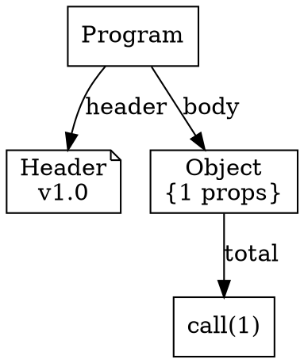

# UTL-X AST Visualization with Graphviz DOT

## Overview

UTL-X provides built-in capabilities to visualize the Abstract Syntax Tree (AST) of any transformation as a Graphviz DOT graph. This allows you to see the structure of your transformations as an interactive visual diagram, making it easier to understand, debug, and document complex transformation logic.

## Table of Contents

- [Quick Start](#quick-start)
- [What is AST Visualization?](#what-is-ast-visualization)
- [How It Works](#how-it-works)
- [Node Types and Colors](#node-types-and-colors)
- [Usage Examples](#usage-examples)
- [Layout Options](#layout-options)
- [Output Formats](#output-formats)
- [CLI Reference](#cli-reference)
- [Use Cases](#use-cases)
- [Advanced Topics](#advanced-topics)

## Quick Start

```bash
# Generate DOT file from transformation
utlx design graph transform.utlx -o ast.dot

# Generate SVG directly (requires Graphviz installed)
utlx design graph transform.utlx -f svg -o ast.svg

# View DOT output on stdout
utlx design graph transform.utlx
```

If you have Graphviz installed, render DOT to image formats:

```bash
dot -Tsvg ast.dot -o ast.svg
dot -Tpng ast.dot -o ast.png
dot -Tpdf ast.dot -o ast.pdf
```

## What is AST Visualization?

An **Abstract Syntax Tree (AST)** is a tree representation of the syntactic structure of source code. Each node in the tree represents a construct in the code (e.g., an expression, operator, function call).

UTL-X's AST visualization converts this tree structure into a **Graphviz DOT** graph, which can then be rendered as:
- **SVG** - Scalable vector graphics (web-friendly)
- **PNG** - Raster images (presentations, docs)
- **PDF** - Print-ready documents
- **DOT** - Text format (version control, editing)

### Benefits

- **Understanding**: See complex transformations visually
- **Debugging**: Identify logic errors by examining structure
- **Documentation**: Auto-generate diagrams for docs
- **Teaching**: Explain UTL-X syntax and semantics
- **Code Review**: Visual overview of changes
- **Refactoring**: Plan restructuring with visual aid

## How It Works

### 1. Parse Transformation

UTL-X parses your transformation file into an AST:

```utlx
%utlx 1.0
input json
output json
---
{
  total: $input.items
    map ((item) => $item.price)
    reduce ((a, b) => $a + $b)
}
```

### 2. Generate DOT Graph

The AST is traversed and converted to Graphviz DOT format:



### 3. Render to Visual Format

Graphviz processes the DOT file to create visual output:

```
┌─────────────┐
│   Program   │
└──────┬──────┘
       │
   ┌───┴────┬──────────┐
   │        │          │
┌──┴───┐ ┌──┴───┐  ┌───┴────┐
│Header│ │Object│  │Function│
└──────┘ └──────┘  └────────┘
```

## Node Types and Colors

The visualizer uses different shapes and colors to distinguish node types:

### Core Nodes

| Node Type | Shape | Color | Description |
|-----------|-------|-------|-------------|
| **Program** | Box | Light Blue | Root node containing header and body |
| **Header** | Note | Light Yellow | Version and format specifications |
| **Object Literal** | Rounded Box | Light Green | Object construction `{ key: value }` |
| **Array Literal** | Box | Pale Green | Array construction `[elem1, elem2]` |

### Expression Nodes

| Node Type | Shape | Color | Description |
|-----------|-------|-------|-------------|
| **Binary Operator** | Circle | Orange | `+`, `-`, `*`, `/`, `%`, `==`, etc. |
| **Unary Operator** | Circle | Orange | `-`, `!` |
| **Member Access** | Diamond | Light Pink | `.property`, `@attribute`, `^metadata` |
| **Index Access** | Diamond | Light Pink | `[index]` |
| **Safe Navigation** | Diamond | Light Pink | `?.property` |

### Literals

| Node Type | Shape | Color | Description |
|-----------|-------|-------|-------------|
| **String** | Oval | Wheat | `"hello"` |
| **Number** | Oval | Wheat | `42`, `3.14` |
| **Boolean** | Oval | Wheat | `true`, `false` |
| **Null** | Oval | Wheat | `null` |
| **Identifier** | Ellipse | Light Cyan | Variable/function names |

### Control Flow

| Node Type | Shape | Color | Description |
|-----------|-------|-------|-------------|
| **If-Else** | Diamond | Khaki | Conditional expressions |
| **Ternary** | Diamond | Khaki | `condition ? then : else` |
| **Match** | Hexagon | Gold | Pattern matching |
| **Try-Catch** | Hexagon | Light Coral | Error handling |

### Functions and Lambdas

| Node Type | Shape | Color | Description |
|-----------|-------|-------|-------------|
| **Function Call** | Rounded Box | Plum | `func(arg1, arg2)` |
| **Lambda** | Rounded Box | Thistle | `(x) => x + 1` |
| **Pipe** | Parallelogram | Sky Blue | `\|>` operator |

### Special Nodes

| Node Type | Shape | Color | Description |
|-----------|-------|-------|-------------|
| **Let Binding** | Dashed Box | Lavender | `let x = value` |
| **Spread** | Box | Light Gray | `...spread` |
| **Block** | Rounded Box | Light Gray | Multiple expressions |

## Usage Examples

### Example 1: Simple Arithmetic

**Transformation:**
```utlx
%utlx 1.0
input json
output json
---
{
  sum: $input.a + $input.b,
  product: $input.a * $input.b
}
```

**Generate visualization:**
```bash
utlx design graph arithmetic.utlx -o arithmetic.dot
dot -Tsvg arithmetic.dot -o arithmetic.svg
```

**Result:** Visual graph showing object construction with two binary operations (`+` and `*`), each accessing `.a` and `.b` properties.

### Example 2: Array Transformation

**Transformation:**
```utlx
%utlx 1.0
input json
output json
---
{
  names: $input.users
    map ((user) => $user.name)
    filter ((name) => $name != null)
}
```

**Generate with left-to-right layout:**
```bash
utlx design graph users.utlx -l LR -o users.dot
```

**Result:** Horizontal graph showing data flow from input through map and filter operations.

### Example 3: Complex Nested Logic

**Transformation:**
```utlx
%utlx 1.0
input json
output json
---
let: validItems = $input.items
  filter ((item) => $item.price > 0)

let: total = $validItems
  map ((item) => $item.price)
  reduce ((a, b) => $a + $b, 0)

output: {
  items: $validItems,
  count: $validItems.length,
  total: $total,
  average: $total / $validItems.length
}
```

**Generate visualization:**
```bash
utlx design graph complex.utlx -f svg -o complex.svg -v
```

**Result:** Multi-level graph showing:
- Two let bindings with lambda functions
- Object construction with multiple properties
- Arithmetic operations for average calculation

## Layout Options

Graphviz supports four layout directions:

### Top-to-Bottom (TB) - Default

```bash
utlx design graph transform.utlx -l TB -o ast.dot
```

Best for:
- Deep transformations with many nested levels
- Traditional tree visualization
- Printing (portrait orientation)

```
    Program
       │
    Header
       │
    Object
    ┌──┴──┐
  prop1  prop2
```

### Left-to-Right (LR)

```bash
utlx design graph transform.utlx -l LR -o ast.dot
```

Best for:
- Data flow visualization
- Pipeline-style transformations
- Wide screens
- Presentations (landscape)

```
Program → Header → Object → prop1
                          └→ prop2
```

### Bottom-to-Top (BT)

```bash
utlx design graph transform.utlx -l BT -o ast.dot
```

Best for:
- Bottom-up analysis
- Dependency visualization
- Reverse flow diagrams

### Right-to-Left (RL)

```bash
utlx design graph transform.utlx -l RL -o ast.dot
```

Best for:
- RTL language documentation
- Alternative data flow representation

## Output Formats

### DOT Format

Text-based graph description language. Human-readable and version-control friendly.

```bash
utlx design graph transform.utlx -o ast.dot
```

**Advantages:**
- ✅ Plain text (git-friendly)
- ✅ Can be manually edited
- ✅ Small file size
- ✅ Universal format

**Use when:**
- Committing to version control
- Manual graph editing needed
- No graphviz installed

### SVG Format

Scalable vector graphics. Ideal for web and documentation.

```bash
utlx design graph transform.utlx -f svg -o ast.svg
```

**Advantages:**
- ✅ Scales without quality loss
- ✅ Interactive (clickable, searchable)
- ✅ Web-friendly
- ✅ Small file size

**Use when:**
- Embedding in web pages
- Documentation sites
- Need zoom capability

### PNG Format

Raster image format. Good for presentations and sharing.

```bash
utlx design graph transform.utlx -f png -o ast.png
```

**Advantages:**
- ✅ Universal support
- ✅ Easy to share
- ✅ Works in any tool

**Disadvantages:**
- ❌ Quality loss when scaled
- ❌ Larger file size

**Use when:**
- Presentations (PowerPoint, Keynote)
- Email attachments
- Screenshots

### PDF Format

Print-ready document format.

```bash
utlx design graph transform.utlx -f pdf -o ast.pdf
```

**Advantages:**
- ✅ Print-ready
- ✅ Vector (scalable)
- ✅ Professional appearance
- ✅ Embeddable in documents

**Use when:**
- Technical documentation
- Academic papers
- Printed materials

## CLI Reference

### Command Syntax

```bash
utlx design graph [options] <transform-file>
```

### Options

| Option | Short | Description | Default |
|--------|-------|-------------|---------|
| `--transform FILE` | `-t` | Transformation file to visualize | (required) |
| `--output FILE` | `-o` | Output file path | stdout |
| `--layout LAYOUT` | `-l` | Graph layout: TB, LR, BT, RL | TB |
| `--format FORMAT` | `-f` | Output format: dot, svg, png, pdf | dot |
| `--verbose` | `-v` | Enable verbose output | false |
| `--help` | `-h` | Show help message | - |

### Examples

```bash
# Basic usage
utlx design graph transform.utlx

# Save to file
utlx design graph transform.utlx -o ast.dot

# Generate SVG
utlx design graph transform.utlx -f svg -o ast.svg

# Left-to-right layout
utlx design graph transform.utlx -l LR -o flow.dot

# Verbose mode
utlx design graph transform.utlx -v -o ast.dot

# Combined options
utlx design graph transform.utlx -l LR -f svg -o flow.svg -v
```

### Manual Rendering

If Graphviz is installed separately:

```bash
# Generate DOT file first
utlx design graph transform.utlx -o ast.dot

# Render manually
dot -Tsvg ast.dot -o ast.svg
dot -Tpng ast.dot -o ast.png -Gdpi=300
dot -Tpdf ast.dot -o ast.pdf

# Advanced rendering options
dot -Tsvg ast.dot -o ast.svg \
  -Gbgcolor=white \
  -Nfontname=Helvetica \
  -Efontname=Courier
```

## Use Cases

### 1. Debugging Complex Transformations

**Problem:** Transformation produces unexpected results.

**Solution:** Generate AST visualization to see:
- Order of operations
- Data flow path
- Where expressions are evaluated

```bash
utlx design graph buggy-transform.utlx -l LR -o debug.svg
```

Look for:
- Incorrect operator precedence
- Missing or extra parentheses
- Wrong property access order

### 2. Code Review

**Problem:** Reviewing complex transformation changes.

**Solution:** Generate AST before and after changes:

```bash
git show HEAD~1:transform.utlx > old.utlx
utlx design graph old.utlx -o old.svg
utlx design graph transform.utlx -o new.svg
# Compare visually
```

### 3. Documentation

**Problem:** Need diagrams for technical documentation.

**Solution:** Auto-generate AST diagrams:

```bash
# Generate for all transformations
for file in transformations/*.utlx; do
  name=$(basename "$file" .utlx)
  utlx design graph "$file" -f svg -o "docs/diagrams/$name.svg"
done
```

Embed in markdown:

```markdown
## Order Processing Transformation


The transformation processes orders through three stages...
```

### 4. Teaching and Training

**Problem:** Teaching UTL-X syntax to new developers.

**Solution:** Show side-by-side code and visualization:

```bash
# Create teaching examples
utlx design graph examples/basic-operators.utlx -o basics.svg
utlx design graph examples/functions.utlx -o functions.svg
utlx design graph examples/pipelines.utlx -o pipelines.svg
```

### 5. Performance Analysis

**Problem:** Transformation is slow, need to identify bottlenecks.

**Solution:** Visualize to identify:
- Deeply nested operations
- Repeated computations
- Inefficient data flow

```bash
utlx design graph slow-transform.utlx -l LR -o performance.svg
```

Look for:
- Long chains of operations (consider intermediate variables)
- Repeated sub-expressions (extract to `let` bindings)
- Complex nested structures (simplify or split)

### 6. Migration and Refactoring

**Problem:** Migrating from XSLT/DataWeave to UTL-X.

**Solution:** Compare old and new structures visually:

```bash
# After migration
utlx design graph migrated.utlx -o new-structure.svg

# Verify structure matches requirements
```

## Advanced Topics

### Customizing Node Appearance

The visualizer uses sensible defaults, but you can customize the generated DOT file:


### Integration with CI/CD

Generate AST diagrams automatically on commit:

```yaml
# .github/workflows/docs.yml
name: Generate Documentation
on: [push]
jobs:
  diagrams:
    runs-on: ubuntu-latest
    steps:
      - uses: actions/checkout@v2
      - name: Install Graphviz
        run: sudo apt-get install graphviz
      - name: Generate AST diagrams
        run: |
          for file in transformations/*.utlx; do
            name=$(basename "$file" .utlx)
            utlx design graph "$file" -f svg -o "docs/ast/$name.svg"
          done
      - name: Commit diagrams
        run: |
          git add docs/ast/*.svg
          git commit -m "Update AST diagrams"
          git push
```

### Diff Visualization

Compare two transformation versions:

```bash
#!/bin/bash
# compare-transforms.sh

OLD=$1
NEW=$2

utlx design graph "$OLD" -o /tmp/old.dot
utlx design graph "$NEW" -o /tmp/new.dot

# Use diff to see structural changes
diff -u /tmp/old.dot /tmp/new.dot

# Or generate side-by-side SVGs
utlx design graph "$OLD" -f svg -o old.svg
utlx design graph "$NEW" -f svg -o new.svg
```

### Programmatic Access

Use the visualizer API in Kotlin code:

```kotlin
import org.apache.utlx.analysis.visualization.GraphvizASTVisualizer
import org.apache.utlx.analysis.visualization.VisualizationOptions
import org.apache.utlx.core.parser.Parser
import org.apache.utlx.core.lexer.Lexer

fun visualizeTransformation(utlxCode: String): String {
    // Parse transformation
    val lexer = Lexer(utlxCode)
    val tokens = lexer.tokenize()
    val parser = Parser(tokens)
    val parseResult = parser.parse()

    val program = when (parseResult) {
        is ParseResult.Success -> parseResult.program
        is ParseResult.Failure -> throw Exception("Parse failed")
    }

    // Generate DOT graph
    val visualizer = GraphvizASTVisualizer()
    val options = VisualizationOptions(
        layout = "LR",
        fontName = "Arial",
        fontSize = 12
    )

    return visualizer.visualize(program, options)
}
```

## Installation and Setup

### Install Graphviz

**macOS:**
```bash
brew install graphviz
```

**Ubuntu/Debian:**
```bash
sudo apt-get install graphviz
```

**Windows (Chocolatey):**
```bash
choco install graphviz
```

**Windows (Manual):**
Download from https://graphviz.org/download/

### Verify Installation

```bash
dot -V
# Expected output: dot - graphviz version X.X.X
```

### UTL-X Setup

No additional setup required! The AST visualization feature is built into UTL-X CLI.

```bash
# Verify feature is available
utlx design graph --help
```

## Troubleshooting

### Issue: "dot command not found"

**Cause:** Graphviz not installed or not in PATH.

**Solution:**
1. Install Graphviz (see Installation section)
2. Add to PATH if needed
3. Or use DOT format and render manually later

```bash
# Generate DOT file (doesn't need Graphviz)
utlx design graph transform.utlx -o ast.dot

# Render later when Graphviz available
dot -Tsvg ast.dot -o ast.svg
```

### Issue: "Graph is too large/unreadable"

**Cause:** Complex transformation with many nodes.

**Solution:**
1. Use larger image size:
   ```bash
   dot -Tpng ast.dot -o ast.png -Gdpi=300
   ```

2. Use PDF format for better scaling:
   ```bash
   utlx design graph transform.utlx -f pdf -o ast.pdf
   ```

3. Split transformation into smaller parts
4. Focus on specific sections

### Issue: "Edges are crossing/tangled"

**Cause:** Complex graph structure.

**Solution:**
1. Try different layout:
   ```bash
   utlx design graph transform.utlx -l LR -o ast.dot
   ```

2. Use specialized layout engines:
   ```bash
   neato -Tsvg ast.dot -o ast.svg  # Force-directed
   fdp -Tsvg ast.dot -o ast.svg    # Another force-directed
   circo -Tsvg ast.dot -o ast.svg  # Circular layout
   ```

## Best Practices

### 1. Use Meaningful Names

Good names make visualizations more readable:

```utlx
// ❌ Bad: Generic names
let: x = $input.items map ((i) => i.p)

// ✅ Good: Descriptive names
let: prices = $input.items map ((item) => $item.price)
```

### 2. Break Complex Transformations

Instead of one huge expression:

```utlx
// ❌ Hard to visualize
output: {
  result: $input.data
    filter ((x) => x.status == "active")
    map ((x) => {value: x.price * 1.1})
    reduce ((a, b) => {value: $a.value + $b.value}, {value: 0})
}

// ✅ Easier to visualize
let: activeItems = $input.data
  filter ((item) => $item.status == "active")

let: pricesWithTax = $activeItems
  map ((item) => {value: $item.price * 1.1})

let: total = $pricesWithTax
  reduce ((a, b) => {value: $a.value + $b.value}, {value: 0})

output: { result: $total }
```

### 3. Document Complex Logic

Add comments near complex parts before generating visualization:

```utlx
// Complex price calculation with tiered discounts
let: finalPrice = if ($order.total > 1000) {
  $order.total * 0.9  // 10% discount
} else if ($order.total > 500) {
  $order.total * 0.95  // 5% discount
} else {
  $order.total
}
```

### 4. Version Control AST Diagrams

Track both code and visualizations:

```
transformations/
  order-processing.utlx
docs/
  ast/
    order-processing.svg
    order-processing.dot
```

This helps reviewers see structural changes over time.

## Related Documentation

- [UTL-X Language Reference](../language/reference.md)
- [Design-Time Analysis](../architecture/design-time-schema-analysis.md)
- [CLI Commands](../cli/commands.md)
- [AST Nodes Reference](../language/ast-nodes.md)

## References

- [Graphviz Documentation](https://graphviz.org/documentation/)
- [DOT Language Specification](https://graphviz.org/doc/info/lang.html)
- [Node Shapes](https://graphviz.org/doc/info/shapes.html)
- [Color Names](https://graphviz.org/doc/info/colors.html)

---

**Last Updated:** 2025-11-01
**UTL-X Version:** 1.0.0-SNAPSHOT
